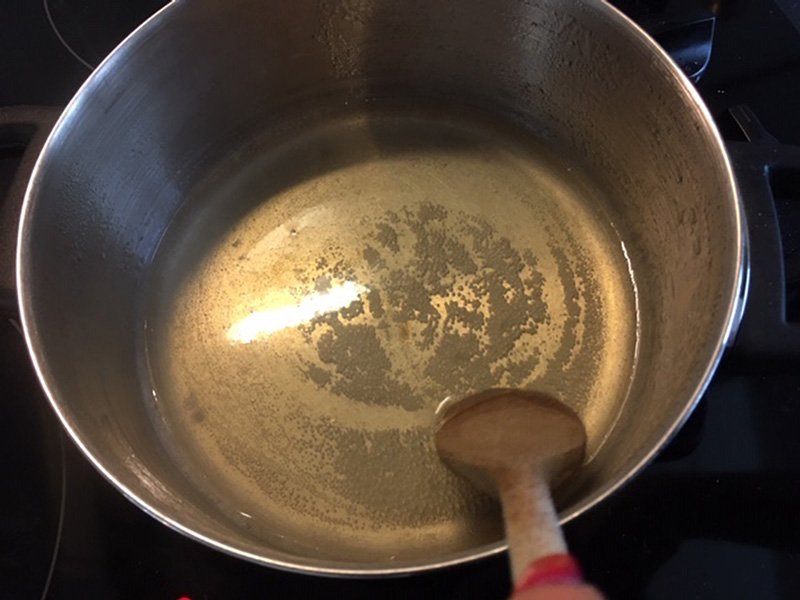
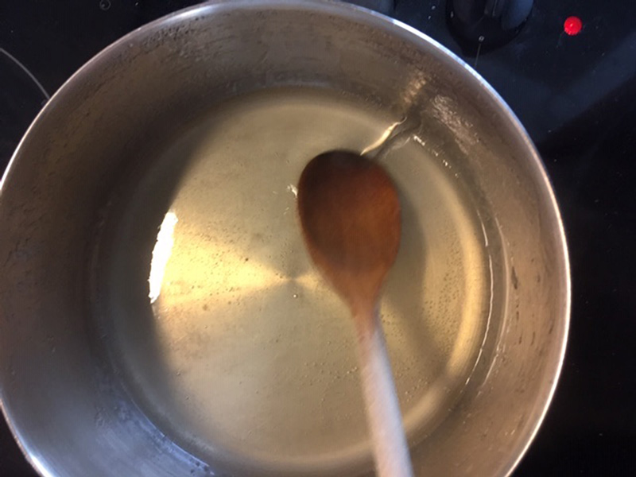
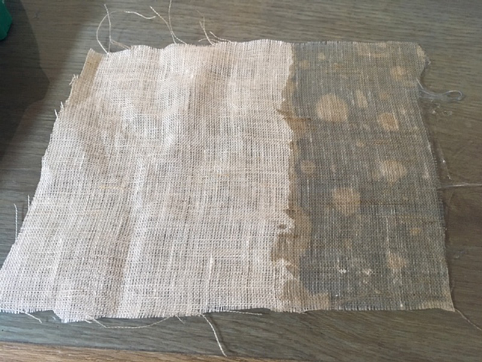
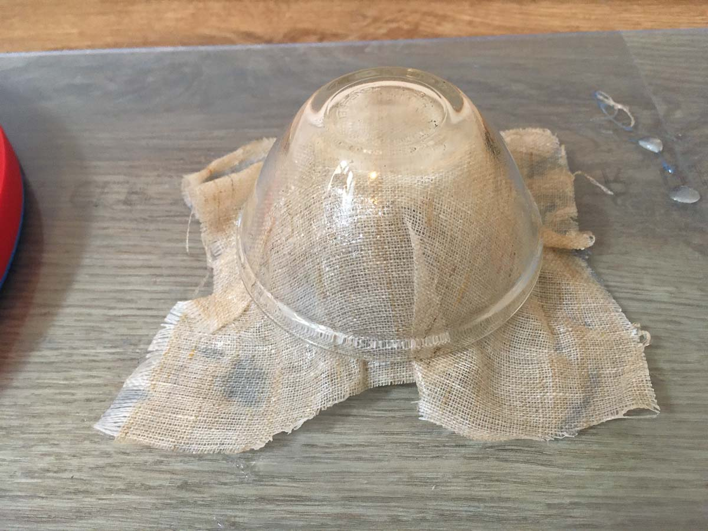
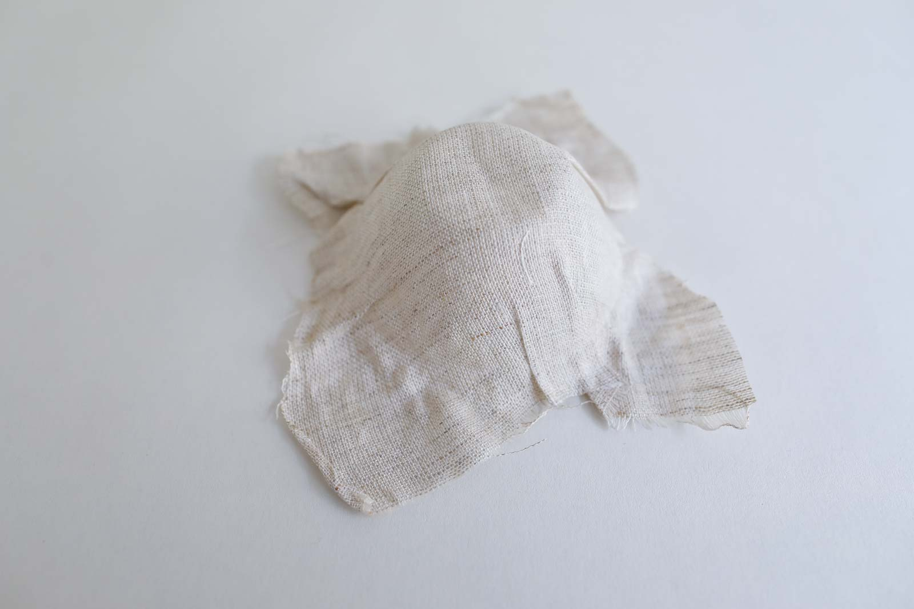

# AGAR COMPOSITE

<iframe width="560" height="315" src="https://www.youtube.com/embed/rLxWe9VTEqc" frameborder="0" allow="accelerometer; autoplay; encrypted-media; gyroscope; picture-in-picture" allowfullscreen></iframe>

##GENERAL INFORMATION

A light composite of textile and agar foil. The composite feels less flexible and less rubbery than the agar foil. It makes a crackling sound like paper. 

**Physical form**

Solids 

Color without additives: color of the textile used

**Fabrication time**

Preparation time: 1 Hour

Processing time: 7 days

Need attention: N/A, let dry in place with lots of airflow

Final form achieved after: 10 days

**Estimated cost (consumables)**

0,50 Euros, for a yield of approx. 200 ml (enough to make a small composite and a sheet, or larger or multiple composites)

##RECIPE

###Ingredients

* **Agar - 5 g** polymer (makes it hard)
* **Glycerine - 15 g** plasticizer (makes it flexible)
* **Water - 250 ml/g** solvent, to dissolve and heat the agar
* **A piece of textile** large enough to fit over the mold
* **A mold** for example a bowl, or other 2.5D or 3D surface

###Tools

1. **Spoon**
1. **Scale**
1. **Bowls** to weigh ingredients
1. **Cooker** (ideally temperature controlled)
1. **Thermometer (optional)** if you don't have a temperature controlled cooker
1. **Small molds - 2x** such as two glass bowls of about 8 cm diameter (or equivalent) that slide into one another. 

###Yield 

Before processing/drying/curing: approx. 200 ml this is enough to make a small 15x15cm composite and the agar foil found in this [recipe](../recipes/agarfoil.md)

###Method

1. **Preparation**
	- Weigh your ingredients
	- Prepare the casting surface and find a place where you can leave it for a while, ideally near an open window where there's air flow.

1. **Mixing and dissolving the ingredients**
	- bring the water to the boil
	- optional: substitute part of the water with natural dye if you wish to use color
	- add the glycerine
	- add the agar
	- bring the mixture to the boil while stirring gently, to dissolve the agar.

1. **Cooking the ingredients**

	- when the agar is dissolved completely, lower the temperature to 60-80 degrees (make sure it doesn't bubble), and let it simmer and evaporate water for 40 mins while stirring slowly and continuously.
	- the agar should have the consistency of a light syrup, you should be able to leave a "trace" with you trace your spoon across the pot.  
	- If your mixture is thicker it will spread slowly resulting in a thicker foil, if it's more liquid, it will spread wider, resulting in a thinner foil. 
	
1. **Casting and molding**

	-  Dip the textile(s) into the hot liquid
	-  Take it out and position on the mold, press it down with the second bowl. 
	-  After an hour, take off the second bowl and let the composite airdry on top of the mold
	
###Drying/curing/growth process

Allow the foil to dry for a week for best results (or 3 days minimum). 

- Mold diameter: 			8 cm 
- Shrinkage thickness       0-10 %
- Shrinkage width/length    0-10 %

**Shrinkage and deformation control**

When used in a composite with textile fibres, the foil shrinks a lot less. The fibers prevent the shrinking. 

**Curing agents and release agents**

None

**Minimum wait time before releasing from mold**

3 days

**Post-processing**

N/A

**Further research needed on drying/curing/growth?**

Not sure

###Process pictures

*Waiting for the agar to dissolve, consistency of syrup, Loes Bogers, 2020*

*it's done when you can leave a trace with the spoon, consistency of syrup, Loes Bogers, 2020*

*You can really soak up the cotton by dipping it into the pan, Loes Bogers, 2020*

*The composite inside the "two-piece" mold of the two glass bowls, Loes Bogers, 2020*

###Variations

- Substitute part of the water with a (neutral to alkaline) dye. The PH of the cooked agar mixture is about PH 9-10. Making the mixture very acidic changes the structure of the polysaccharide, resulting in a weaker more brittle bioplastic.
- Try or design different molds to create big spatial structures and objects
- Use different fibres as enforcement. Other *natural* fibres may be continuous/discontinuous ([long fibres like yarns](https://class.textile-academy.org/2020/loes.bogers/files/recipes/alginatenet/), strings or hair. Or they can be short fibres that are chopped like wood chips, [egg shells](https://class.textile-academy.org/2020/loes.bogers/files/recipes/biolino/), leather leftovers), particles or even braided and woven fibres like the cotton used here. Collagen, cellulose, silks, and chitin are the types found in nature. 
- Use a different matrix: biomaterials like beeswax or animal glue for example are thermoformable matrices (the ones you can form with the help of heat). And setting matrixes like bio epoxies, white glue (made of flour), alginate, gelatin and starch-based plastics, mycelium and kombucha.   
- Textiles can be used as scaffold in many other ways too: by growing mineral crystals on it, in concrete form work, leather moulding (cuir bouilli), and in combination with lasercut wood patterns.

##ORIGINS AND REFERENCES

**Cultural origins of this recipe**

See also the recipe for [agar foil](https://class.textile-academy.org/2020/loes.bogers/files/recipes/agarfoil/).

**On composites:** a composite can be any combination of two or more dissimilar materials which together make for a material with different properties, but without merging into one new compound (they continue to be discernable). Very familiar examples is paper mache (paper and glue modelled for example around a balloon). It is one of the earliest human technologies. Early on composites were created by adding straw to mud bricks for building, or the Egyptian practice of soaking cloth tape in resin used for mummification of the dead. The technical temrs for the materials used in a composite are *constituent materials* with three type: the matrix, preform and the enforcement. The matrix is a pattern that distributes the load (e.g. bioresin), the preform are yarns, net wovens, whereas other reinforcement (such as fibres) contribute to the mechanical properties of the materials. 

All composites (even simple ones) are engineered materials. One of the great benefits is that it can result in large but strong and lightweight spatial objects (e.g. carbon fibre enforced plastic) with relatively few resources. It also gives more options to create varying degrees of stiffness and strength. The use of textile composites in the construction industry is less common than traditional building materials, but its popularity is growing. 

**On open-source bioplastics:** open-source documenting of how to make bioplastics with simple tools and locally available materials can be attributed to Miriam Ribul and her publication on *Material Activism* from 2014. Promoting collaborative production of alternatives for petroleum-based plastic, she demonstrated 20(!) known processes for material production using only 4 simple recipes. Juliette Pépin's visual research book on bioplastics (also from 2014), goes in depth into the sensory and visual aspects of simple recipes with many variations. Although bioplastics production is certainly a craft that is dispersed across many locations and times, leaving traces of many similar recipes behind, this type of cataloguing and sharing work is certainly indebted to these two pioneers.

**Needs further research?**   Not sure

###Key sources

**Information from these other recipes was used to create this recipe:**

This is an adaptation of **Flexible bio-foil** by Cecilia Raspanti, TextileLab, Waag Amsterdam for Fabricademy 2019-2020, Class pages, [link](https://drive.google.com/file/d/1Lm147nvWkxxmPf5Oh2wU5a8eonpqHCVc/view). A longer cooking time is recommended to create a thicker foil. 

###Copyright information 

Raspanti's recipe above is published under an Creative Commons Attribution Non-Commercial licence.

##ETHICS & SUSTAINABILITY

Sustainability concerns are largely determined by the choice of constituent materials in a composite. An issue with most composites however, is that the process of recycling is complicated when constituent materials cannot be separated after use. For example salvaging the carbon fibre used in sports sailing equipment requires quite a lot of (toxic) chemicals and dissolves the other constituent material in the sail. The big thing to consider with composites is how might be be recycled and/or reabsorbed in nature without wasting resources. 

"Green" composites would be made of biopolymers (e.g. agar-based bioplastic) and natural fibres (e.g. cotton, hemp, corn cobs, wood dust) as reinforcement), making the composite fully degradable if not compostable. 

**Sustainability tags**

- Renewable ingredients: yes
- Vegan: yes
- Made of by-products or waste: no
- Biocompostable final product:  yes
- Re-use: the plain agar recipe without additional additives can be melted by reheating it (add a splash of water if necessary), reusing a composite depends on the materials used. This composite can be formed and reformed over and over.

Needs further research?:  Not sure

Should not be recycled as part of PET-plastics waste: this causes contamination of the waste stream. Compost bioplastics in a warm environment with sufficient airflow.

##PROPERTIES

- **Strength**: medium
- **Hardness**: resilient
- **Transparency**: opaque
- **Glossiness**: matte
- **Weight**: light
- **Structure**: variable
- **Texture**: medium
- **Temperature**: medium
- **Shape memory**: high
- **Odor**: none
- **Stickiness**: low
- **Weather resistance:** needs further research
- **Acoustic properties:** needs further research
- **Anti-bacterial:** needs further research
- **Non-allergenic:** nneeds further research
- **Electrical properties:** needs further research
- **Heat resistance:** medium
- **Water resistance:** water resistant
- **Chemical resistance:** needs further research
- **Scratch resistance:** high
- **Surface friction:** medium
- **PH modifiers:** none 

##ABOUT

**Maker of this sample**

- Name: Loes Bogers
- Affiliation: Fabricademy student at Waag Textile Lab Amsterdam
- Location:  Amsterdam, the Netherlands
- Date: 16-03-2020 – 24-03-2020

**Environmental conditions**

- Humidity:  40-50%
- Outside temp:  5-11 degrees Celcius
- Room temp:  18 – 22 degrees Celcius
- PH tap water:  7-8

**Recipe validation**

Has recipe been validated? 

Yes, by Cecilia Raspanti, TextileLab, Waag Amsterdam, 9 March 2020

**Images of the final sample**

*Agar composite, Loes Bogers, 2020*

##REFERENCES

- **Agar biofoil** by Cecilia Raspanti, Textile Lab, Waag Amsterdam for Fabricademy 2019-2020, Class pages, [link](https://drive.google.com/file/d/1Lm147nvWkxxmPf5Oh2wU5a8eonpqHCVc/view). 
- **Textile as Scaffold** by Anastasia Pistofidou for Fabricademy, 30 October 2018: [link](https://class.textile-academy.org/classes/week088/)
- **Textile Composite Materials** by Ashok Hakoo for Textile School, 14 April 2019: [link](https://www.textileschool.com/4474/textile-composite-materials/)
- **Textile Composites** by Waqas Paracha via Slideshare, 5 April 2010: [link](https://www.slideshare.net/wakasyounus/textile-composites)
- **What is Biocomposite?** by Ashish Kumar Dua, for Textile Learner, July 2013: [link](https://textilelearner.blogspot.com/2013/07/what-is-biocomposite-fibers-used-in.html)
- **Recipes for Material Activism** by Miriam Ribul, 2014, via issuu [link](https://issuu.com/miriamribul/docs/miriam_ribul_recipes_for_material_a)
- **Research Book Bioplastics** by Juliette Pepin, 2014, via issuu [link](https://issuu.com/juliettepepin/docs/bookletbioplastic)