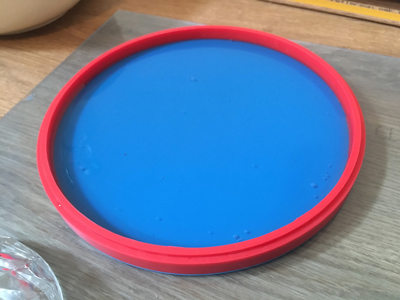
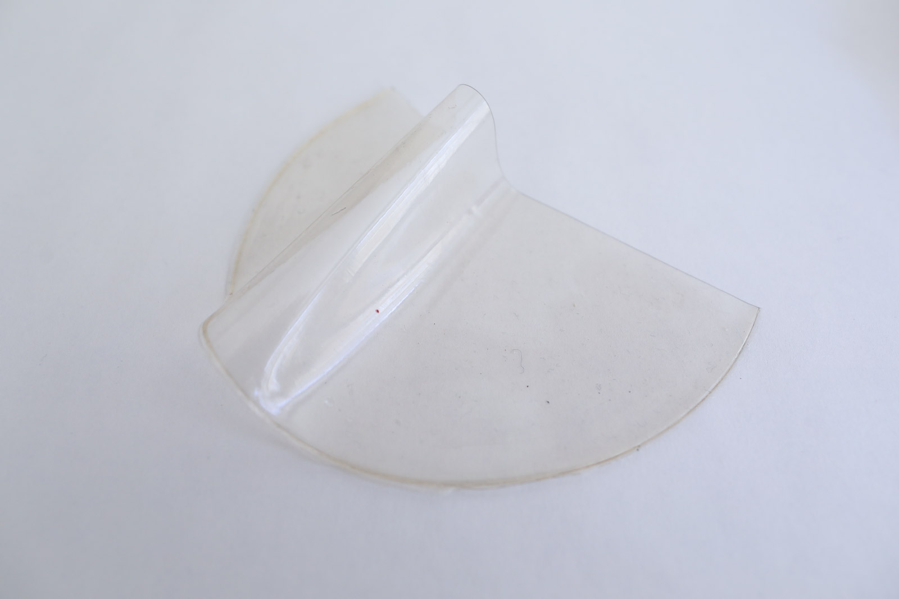
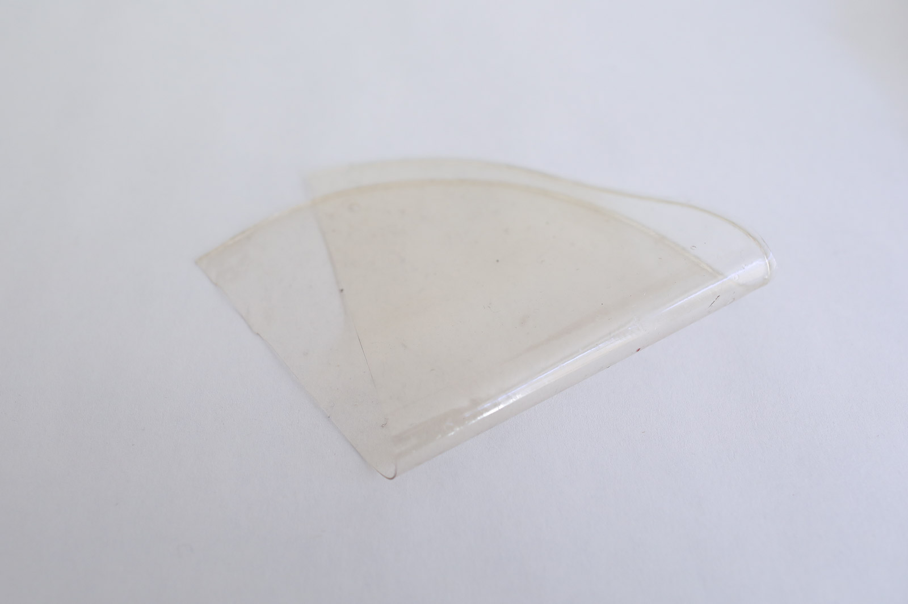
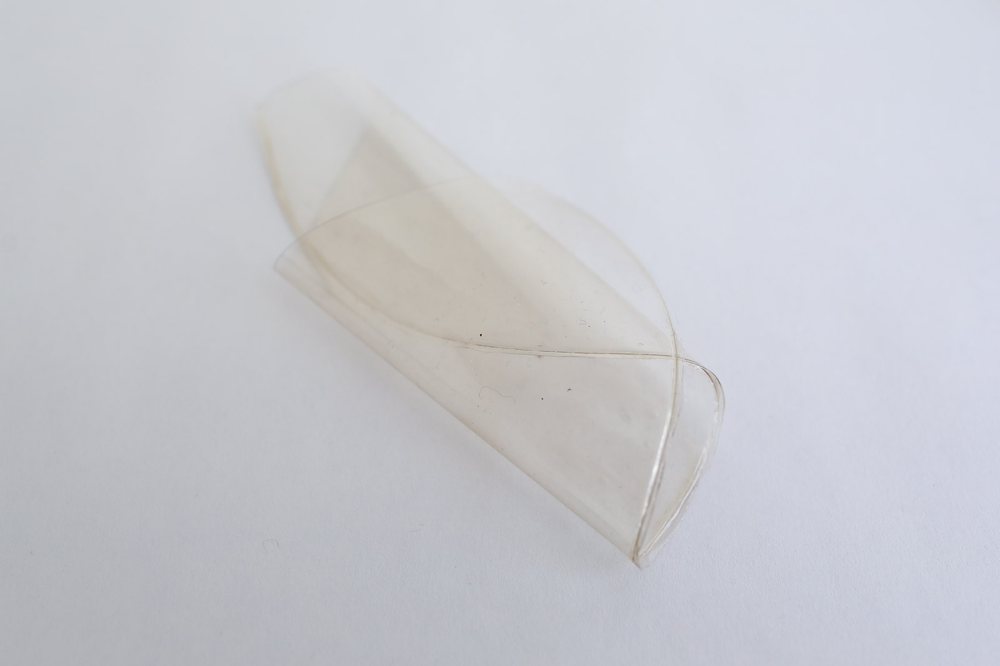

# AGAR FOIL

<iframe width="560" height="315" src="https://www.youtube.com/embed/0T2z2sMUh3Y" frameborder="0" allow="accelerometer; autoplay; encrypted-media; gyroscope; picture-in-picture" allowfullscreen></iframe>

##GENERAL INFORMATION

A vegan flexible, transparent foil that can resist water and moderate heat (up to 85 degrees C) quite well without transforming. This foil feels rubbery and flexible, and can remain a little sticky (more than e.g. the alginate and gelatine-based foil). It's not as sticky as cling film or cellophane, it's more comparable to a transparent PVC foil for example.

**Physical form**

Surfaces 

Color without additives: transparent, slightly yellow/beige when folded

**Fabrication time**

Preparation time: 1 Hour

Processing time: 7 days

Need attention: N/A, let dry in place with lots of airflow

Final form achieved after: 10 days

**Estimated cost (consumables)**

0,50 Euros, for a yield of approx. 200 ml

##RECIPE

###Ingredients

* **Agar - 5 g** 
	* Polymer (makes it hard)
* **Glycerine - 15 g**
	* Plasticizer
* **Water - 250 ml/g** 
	* Solvent, to dissolve and heat the agar

###Tools

1. **Spoon**
1. **Scale**
1. **Bowls** to weigh ingredients
1. **Cooker** (ideally temperature controlled)
1. **Thermometer (optional)** if you don't have a temperature controlled cooker
1. **Mold** of about 20 cm diameter (or equivalent). Optional: you can also cast on a surface like an acrylic sheet but your sheet will be thinner

###Yield 

Before processing/drying/curing: approx. 200 ml

###Method

1. **Preparation**

	- Weigh your ingredients
	- Prepare the casting surface and find a place where you can leave it for a while, ideally near an open window where there's air flow.

1. **Mixing and dissolving the ingredients**
	- bring the water to the boil
	- optional: substitute part of the water with natural dye if you wish to use color
	- add the glycerine
	- add the agar
	- bring the mixture to the boil while stirring gently, to dissolve the agar.

1. **Cooking the ingredients**

	- when the agar is dissolve completely, lower the temperature to 60-80 degrees (make sure it doesn't bubble), and let it simmer and evaporate water for 40 mins while stirring slowly and continuously.
	- the agar should have the consistency of a light syrup, you should be able to leave a "trace" with you trace your spoon across the pot.  
	- If your mixture is thicker it will spread slowly resulting in a thicker foil, if it's more liquid, it will spread wider, resulting in a thinner foil. 
	
1. **Casting**

	-  Cast onto the surface
	-  Pour from the middle and hold still, let the liquid distribute itself, it cures quickly if it is thick. 

	
###Drying/curing/growth process

Allow the foil to dry for a week for best results (or 3 days minimum). If you don't peel it off the surface it will shrink much less in width/length.

- Mold depth: 				1.5-2.5 mm
- Shrinkage thickness       40-60 %
- Shrinkage width/length    5-10% %

**Shrinkage and deformation control**

Agar foil shrinks quite a lot, especially in thickness. The amount depends on the amount of water that has been evaporated/cooking time.  

**Curing agents and release agents**

None

**Minimum wait time before releasing from mold**

3 days

**Post-processing**

None, store dry and flat.

**Further research needed on drying/curing/growth?**

Not sure

###Process pictures
*Dissolving the agar, Loes Bogers, 2020*

*Making a trace with the spoon, consistency of syrup, Loes Bogers, 2020*

*Filling up a mould with detachable botton, 2-3 mm filled, Loes Bogers, 2020*

###Variations

- Substitute part of the water with a (neutral to alkaline) dye. The PH of the cooked agar mixture is about PH 9-10. Making the mixture very acidic changes the structure of the polysaccharide, resulting in a weaker more brittle bioplastic.
- Add less glycerine for a more rigid, stiff foil 
- Add fillers (debris, coffee waste) or fibres to make a composite, see also the [agar composite recipe](./agarcomposite.md)). 

##ORIGINS AND REFERENCES

**Cultural origins of this recipe**

Legends say that agar was discovered in Japan in 1658 by Mino Tarōzaemon (美濃 太郎左衞門), an innkeeper in current Fushimi-ku, Kyoto. The story goes that he noticed that discarded seaweed soup he'd made had gelled after a winter night's freezing. 

The word "agar" comes from *agar-agar*, the Malay name for red algae (Gigartina, Gracilaria) from which the jelly is produced. Agar is a common gelling agent, originally primarily in Asian cuisines, before traveling to other kitchens in the world. It is used to create jellies, jams and desserts, but also more generally as a binder, and clarifying agent in beer brewing. It is a stronger than gelatine.  

In the late 19th century, its properties were found to be useful in microbiology and it became a popular medium for growing microbes because it has a higher melting point than gelatine media. 

Agar-based bioplastics are promising candidates for food packaging and have been used as packaging for dried goods and can be heat sealed (rather than glue sealed). Margarita Talep's packaging designs are a beautiful example. 

**On open-source bioplastics:** open-source documenting of how to make bioplastics with simple tools and locally available materials can be attributed to Miriam Ribul and her publication on *Material Activism* from 2014. Promoting collaborative production of alternatives for petroleum-based plastic, she demonstrated 20(!) known processes for material production using only 4 simple recipes. Juliette Pépin's visual research book on bioplastics (also from 2014), goes in depth into the sensory and visual aspects of simple recipes with many variations. Although bioplastics production is certainly a craft that is dispersed across many locations and times, leaving traces of many similar recipes behind, this type of cataloguing and sharing work is certainly indebted to these two pioneers.

**Needs further research?** Yes, on the history of uses of agar as a biopolymer and the people developing the processes for it.

###Key Sources

This is an adaptation of **Flexible bio-foil** by Cecilia Raspanti, Textile Lab, Waag Amsterdam for Fabricademy 2019-2020, Class pages, [link](https://drive.google.com/file/d/1Lm147nvWkxxmPf5Oh2wU5a8eonpqHCVc/view). A longer cooking time is recommended to create a thicker foil. 

###Copyright information

The recipe by Raspanti above was published under an Creative Commons Attribution Non-Commercial licence.

##ETHICS & SUSTAINABILITY

In cooking, agar is known as the vegan and halal alternative to animal-based gelatine as it is obtained by boiling red algae into a gel. Although it is hailed as a renewable and vegan option to make bioplastics - you also need less grams of agar to create a solid compared to gelatine - its popularity as a medium in microbiology has already led to shortages and over-utilized seaweed populations in the past. It may be renewable, but it's not infinite.

**Sustainability tags**

- Renewable ingredients: yes
- Vegan: yes
- Made of by-products or waste: no
- Biocompostable final product:  yes, in 2-4 months
- Re-use: yes, the agar can be melted by reheating it (with a little water if necessary)

Needs further research?:  Not sure

Should not be recycled as part of PET-plastics waste: this causes contamination of the waste stream. Compost bioplastics in a warm environment with sufficient airflow.

##PROPERTIES

- **Strength**: medium
- **Hardness**: flexible
- **Transparency**: transparent
- **Glossiness**: glossy
- **Weight**: medium
- **Structure**: closed
- **Texture**: smooth
- **Temperature**: cool
- **Shape memory**: low
- **Odor**: none
- **Stickiness**: high
- **Weather resistance:** needs further research
- **Acoustic properties:** needs further research
- **Anti-bacterial:** needs further research
- **Non-allergenic:** nneeds further research
- **Electrical properties:** needs further research
- **Heat resistance:** medium
- **Water resistance:** water resistant
- **Chemical resistance:** needs further research
- **Scratch resistance:** poor
- **Surface friction:** braking
- **PH modifiers:** none 

##ABOUT

**Maker of this sample**

- Name: Loes Bogers
- Affiliation: Fabricademy student at Waag Textile Lab Amsterdam
- Location:  Amsterdam, the Netherlands
- Date: 16-03-2020 – 24-03-2020

**Environmental conditions**

- Humidity:  40-50%
- Outside temp:  5-11 degrees Celcius
- Room temp:  18 – 22 degrees Celcius
- PH tap water:  7-8

**Recipe validation**

Has recipe been validated? 

Yes, by Cecilia Raspanti, Textile Lab, Waag Amsterdam, 9 March 2020

**Images of the final sample**

*Agar foil, Loes Bogers, 2020*

*Agar foil, Loes Bogers, 2020*

*Agar foil, Loes Bogers, 2020*

##REFERENCES

- **Lab Staple Agar hit by Seaweed Shortage** by Ewen Callaway, in Nature, 528, 8 December 2015: [link](https://www.nature.com/news/lab-staple-agar-hit-by-seaweed-shortage-1.18970)
- **Agar** on Wikipedia: [link](https://en.wikipedia.org/wiki/Agar)
- **Agar biofoil** by Cecilia Raspanti, Textile Lab, Waag Amsterdam for Fabricademy 2019-2020, Class pages, [link](https://drive.google.com/file/d/1Lm147nvWkxxmPf5Oh2wU5a8eonpqHCVc/view). 
- **Margarita Talep Algae Bioplastic Packaging Design** by Natashah Hitti for Dezeen, 18 January 2019: [link](https://www.dezeen.com/2019/01/18/margarita-talep-algae-bioplastic-packaging-design/)
- **Desintegra.me** by Margarita Talep, 2017: [link](https://margaritatalep.com/Desintegra-me-desarrollo)
- **Recipes for Material Activism** by Miriam Ribul, 2014, via issuu [link](https://issuu.com/miriamribul/docs/miriam_ribul_recipes_for_material_a)
- **Research Book Bioplastics** by Juliette Pepin, 2014, via issuu [link](https://issuu.com/juliettepepin/docs/bookletbioplastic)
