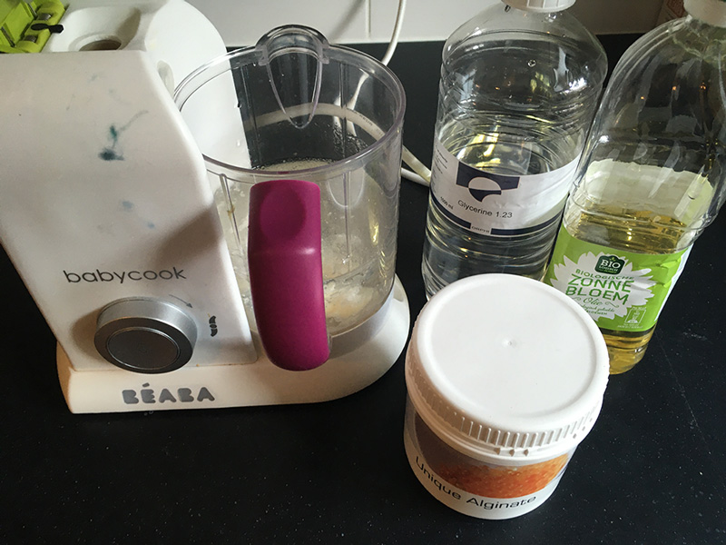
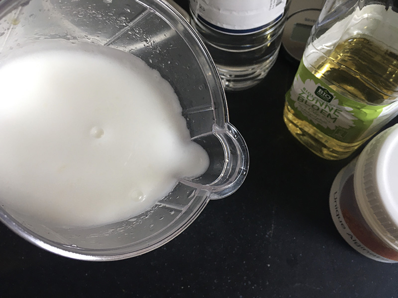
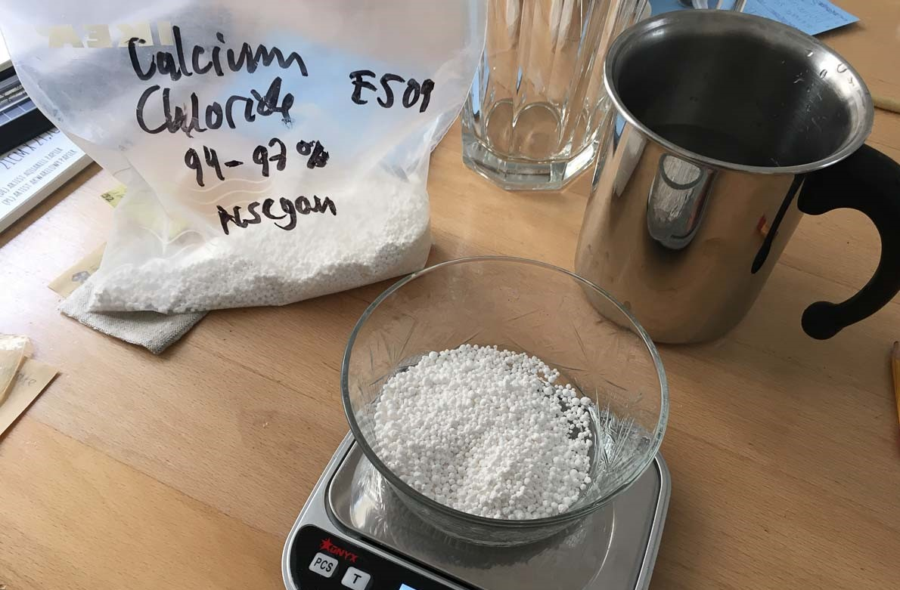
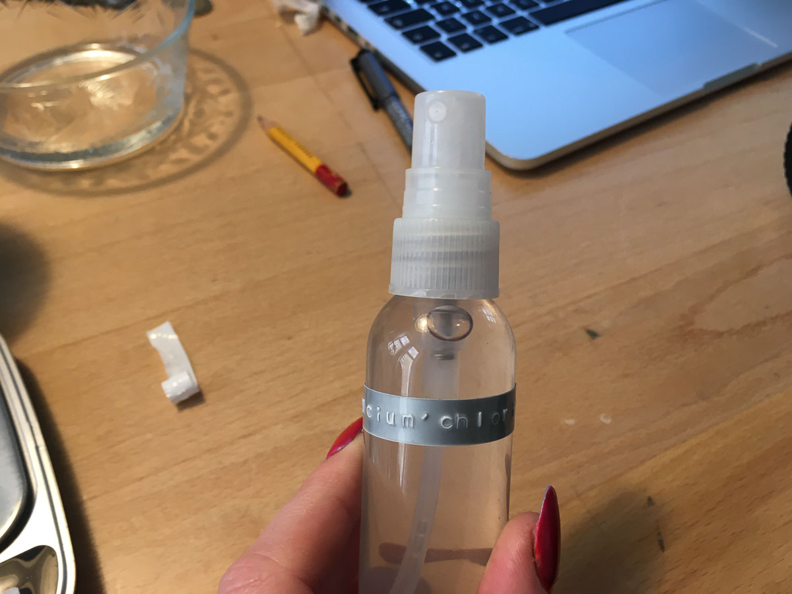
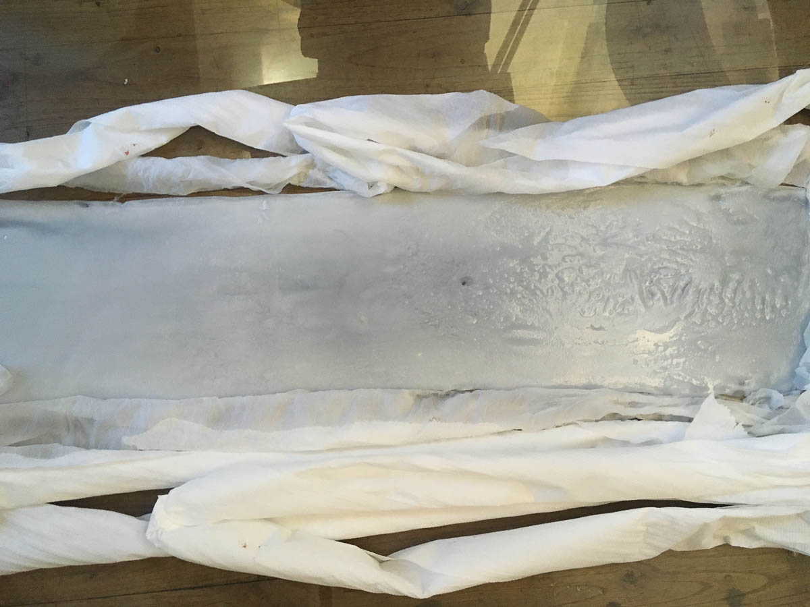
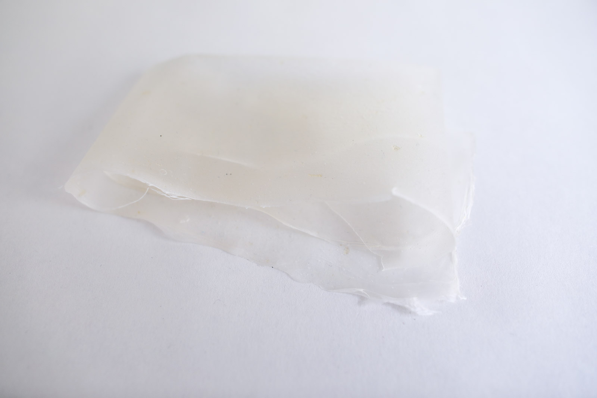
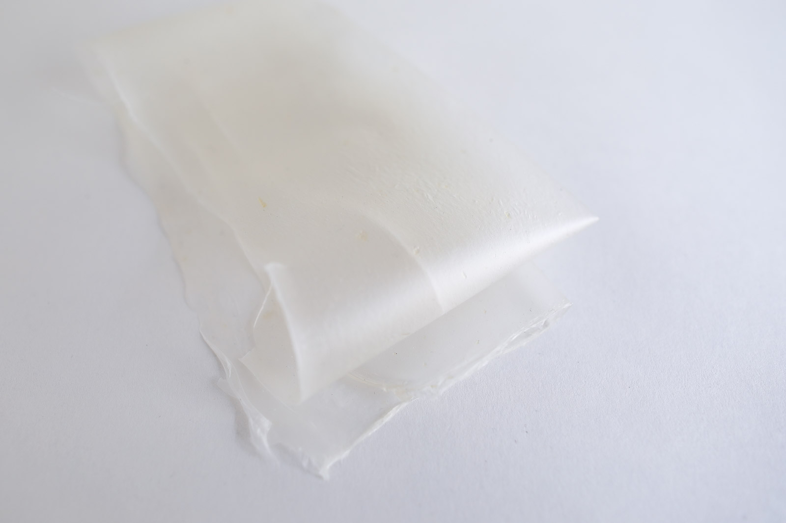
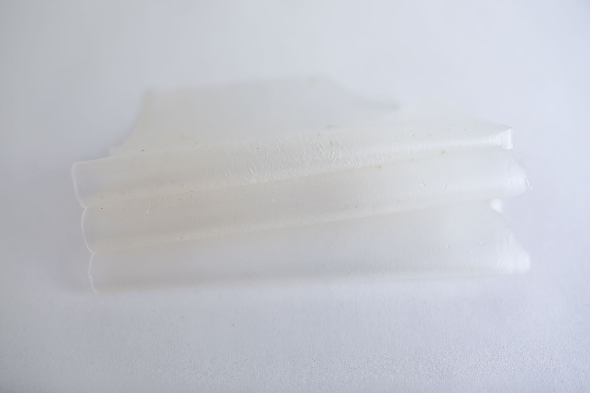
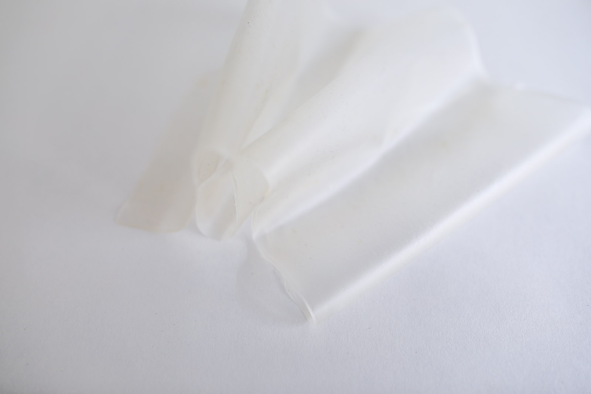

# ALGINATE FOIL

<iframe width="560" height="315" src="https://www.youtube.com/embed/vKj-X4PUmIw" frameborder="0" allow="accelerometer; autoplay; encrypted-media; gyroscope; picture-in-picture" allowfullscreen></iframe>

##GENERAL INFORMATION

An alginate based, heat-resistant and waterproof semi-transparent, matte foil. The foil has a feel that can be compared with a window foil (to blind windows but let the light through). It's matte but very translucent. It doesn't crackle or jump back like a lot of other foils.

**Physical form**

Surface

Color without additives: semi-transparent, white when layered

**Fabrication time**

Preparation time: 1 hour (plus resting overnight)

Processing time: 5-7 days

Need attention: daily, to check if sheet needs to be taped down to stay in place on the mold

Final form achieved after: 7 days

**Estimated cost (consumables)** 

1,12 Euros for a yield for a sheet of alginate plastic (about a 50 cm x 12 cm sheet, 2 mm thick)

##RECIPE

###Ingredients

* **Sodium alginate powder - 12 gr**
	* the polymeer (so it becomes a solid)
* **Glycerine - 20 gr**
	* the plasticizer that bonds with the alginate (makes it flexible). 
* **Water - 400 ml/gr**
	* to dissolve and mix the polymeer and plasticizer
	* optional: use a (diluted) natural dye instead for a colored plastic
* **Sunflower oil - 10 gr**
	* filler to reduce shrinkage
* **Calcium chloride solution 10% (10 gr to 100 gr water)**
    * is the curing agent: calcium chloride attracts moisture very strongly: spraying it onto the alginate plastic starts the curing process. 

###Tools

1. **Scale**
1. **Spoon** 
1. **Blender** 
2. **Glass jar with lid**
3. **Spray bottle** (150 ml contents, for the calcium chloride solution)
2. **Acrylic sheet** smooth surface to cast the foil onto. A smooth surface will create a smooth matte foil.
3. **A strip of acrylic or squeeguee** to push the alginate mixture into place and form an even and flat rectangle
3. **Painting tape** to tape down if edges of the sheet start to come off of the surface
4. **Kitchen paper** to soak up the water that will be released from the alginate mixture

###Yield

Before processing/drying/curing: approx. 200 ml of alginate plastic that can be stored for two weeks and used for any alginate application

Approx. 100 ml of calcium chloride 10% solution that can be used for any alginate recipe

###Method

1. **Preparation**
	- Weigh your ingredients for the alginate plastic (alginate, glycerine, water, sunflower oil). Optional: use a diluted natural dye instead of water in the same amount for a colored plastic.
	- Put the oil, alginate and glycerine in a blender and add a dash of the water. Blend into a thick and homogenous paste. Then add the rest of the water and blend again (this is to avoid lumps).
	- Leave the mixture overnight to allow the bubbles to come to the surface and pop.
	- Make the calcium chloride solution by dissolving 10 gr in 100 gr hot water. Put it in a spray bottle.

1. **Casting**
	- Prepare some space on an acrylic or glass surface 
	- Pour the alginate onto the acrylic sheet and use the squeeguee or acrylic strip to mold the liquid into a rectangular shape of about 3mm high
	- Spray the sheet with the calcium chloride solution (use quite a lot)
	- Let it sit for a few minutes, then spray again if you see the liquid is starting to ooze out from the sides. The film that is created in the curing process can break from the weight of the liquid bubble. By respraying you can close these until the sheet is cured enough and stable to dry further. 
	- The alginate can release quite a lot of water at this stage, so it's wise to place some kitchen paper around it to absorb excess water.

###Drying/curing/growth process

- Mold depth:  				N/A
- Shrinkage thickness:      40-60 %
- Shrinkage width/length:   10-20 %

**Shrinkage and deformation control**

Keep an eye on the sheet every few hours, especially on the first day. The thinner edges of the sheet might curl up when drying and pull of parts of the sheet. When it comes off it will start to warp. Taping it down onto the acrylic helps to keep it in place an dry in shape.
Let it dry up to seven days to get to the final form. When it no longer feels cool to the touch it is dry enough to take off. If you want to trim the edges do it while the foil is still a bit softer for a clean cut. 

**Curing agents and release agents**

Calcium chloride 10% as curing agent 

**Minimum wait time before releasing from mold**

3 days but ideally a week

**Post-processing**

trim the edges with scissors or a scalper and ruler if you wish

**Further research needed on drying/curing/growth?**

Not sure

###Process pictures

*Preparing the alginate the day before, Loes Bogers, 2020*

*The mixture is ready, Loes Bogers, 2020*

*Preparing a 10% calcium chloride solution with hot water, Loes Bogers, 2020*

*The calcium chloride solution in a spray bottle, Loes Bogers, 2020*

*alginate casted onto acrylic sheet, first few minutes of curing, Loes Bogers, 2020*

###Variations

- Replace the water with a (diluted) **natural colorant** such as a vegetable dye or water-based ink (e.g. hibiscus, beetroot, madder) 
- Add **less glycerine** for a less flexible foil
- Take out the sunflower oil and use 30% less alginate to cast thinner foils
- You can also use this recipe to make composites such as the one described in the [alginate net recipe](https://class.textile-academy.org/2020/loes.bogers/files/recipes/alginatenet/)

##ORIGINS & REFERENCES

###Cultural origins of this recipe

Sodium alginate (E401) is used a lot in molecular gastronomy, for (reverse) spherification that was patented by  William J. S. Peschardt in the 1940s and popularized in the molecular cuisine popularized by Adrian Ferra from restaurant El Bulli. It takes no heat but gels when in contact with calcium and acidic media (e.g. calcium chloride and calcium lactate). More commonly, it is used as additive: as stabilizer, thickener, emulsifier and hydration agent in all kinds of processed foods, but cosmetics and pharmaceuticals and even (as thickener) in screen printing).

Alginate plastics are also used a lot in molding and casting of dental technology industry. And it is used to waterproof and fireproof fabrics.  

**On open-source bioplastics:** open-source documenting of how to make bioplastics with simple tools and locally available materials can be attributed to Miriam Ribul and her publication on *Material Activism* from 2014. Promoting collaborative production of alternatives for petroleum-based plastic, she demonstrated 20(!) known processes for material production using only 4 simple recipes. Juliette Pépin's visual research book on bioplastics (also from 2014), goes in depth into the sensory and visual aspects of simple recipes with many variations. Although bioplastics production is certainly a craft that is dispersed across many locations and times, leaving traces of many similar recipes behind, this type of cataloguing and sharing work is certainly indebted to these two pioneers.

**Needs further research?**   Yes, on the uses of alginate as a design material and the people who have developed the processes and techniques for it. 

###Key sources

The alginate recipe is a modified version of: **Flexible Bio-plastic Alginate Recipe** by Cecilia Raspanti (TextileLab, Waag), Fabricademy Class "Biofabricating Materials", 2019, [link](https://class.textile-academy.org/classes/week05A/).

###Copyright information

Raspanti's recipe above was published under an Creative Commons Attribution Non-Commercial licence.

##ETHICS & SUSTAINABILITY

Brown algae are not farmed everywhere in the world and might have to travel significant distances. 

**Sustainability tags**

- Renewable ingredients: yes
- Vegan: yes
- Made of by-products or waste:  no
- Biocompostable final product:  yes
- Reuse: no

Needs further research?:  not sure

Algae have some benefits compared to conventional farming of biomaterials: they don’t need agricultural land, therefore there is no competition for food or farmland. They have higher yields per hectare and are extremely efficient with water, and algae may grow on nutrients from residual streams, like waste water and CO2.    

Should not be recycled as part of PET-plastics waste: this causes contamination of the waste stream. Compost bioplastics in a warm environment with sufficient airflow.

##PROPERTIES

- **Strength**: medium
- **Hardness**: flexible
- **Transparency**: translucent
- **Glossiness**: matt
- **Weight**: light
- **Structure**: closed
- **Texture**: medium
- **Temperature**: medium
- **Shape memory**: medium
- **Odor**: none
- **Stickiness**: low
- **Weather resistance:** needs further research 
- **Acoustic properties:** needs further research
- **Anti-bacterial:** needs further research
- **Non-allergenic:**needs further research
- **Electrical properties:** needs further research
- **Heat resistance:** high, up to 150 degrees celcius
- **Water resistance:** waterproof (for PH neutral and acidic water, not for alkaline water)
- **Chemical resistance:** needs further research
- **Scratch resistance:** high
- **Surface friction:** medium
- **Color modifiers:** none 

##ABOUT

**Maker(s) of this sample**

- Name: Loes Bogers
- Affiliation: Fabricademy student at Waag Textile Lab Amsterdam
- Location:  Amsterdam, the Netherlands
- Date: 25-02-2020 – 02-03-2020

**Environmental conditions**

- Humidity:  40-50%
- Outside temp:  5-11 degrees Celcius
- Room temp:  18 – 22 degrees Celcius
- PH tap water:  7-8

**Recipe validation**

By Cecilia Raspanti, TextileLab, Waag Amsterdam, 9 March 2020

**Images of the final sample**

*Alginate foil, Loes Bogers, 2020*

*Alginate foil, Loes Bogers, 2020*

*Alginate foil, Loes Bogers, 2020*

*Alginate foil, Loes Bogers, 2020*

*Alginate foil, Loes Bogers, 2020*

*Alginate foil, Loes Bogers, 2020*

##REFERENCES

- **Flexible Bio-plastic Alginate Recipe** by Cecilia Raspanti (TextileLab, Waag), Fabricademy Class "Biofabricating Materials", 2019, [link](https://class.textile-academy.org/classes/week05A/).
- **Alginate Recipe** by Catherine Euale, Fabricademy 2018-19 [link](https://class.textile-academy.org/2019/catherine.euale/projects/P7algae/)
- **The Science Of Spherification: Theoreticians examine the atomic details of an avant-garde culinary technique"**, by Bethany Halford, Chemical and Engineering News, Volume 92 Issue 42, pp. 35-36, October 2014: [link](https://cen.acs.org/articles/92/i42/Science-Spherification.html)
- **Alginic Acid** on Wikipedia: [link](https://en.wikipedia.org/wiki/Alginic_acid)
- **Development of bio-plastic from production technologies from microalgae** by AlgaePARC for Wageningen University & Research, 2012-2016: [link](https://www.wur.nl/en/show/Development-of-bioplastic-production-technologies-from-microalgae.htm)
- **Recipes for Material Activism** by Miriam Ribul, 2014, via issuu [link](https://issuu.com/miriamribul/docs/miriam_ribul_recipes_for_material_a)
- **Research Book Bioplastics** by Juliette Pepin, 2014, via issuu [link](https://issuu.com/juliettepepin/docs/bookletbioplastic)

