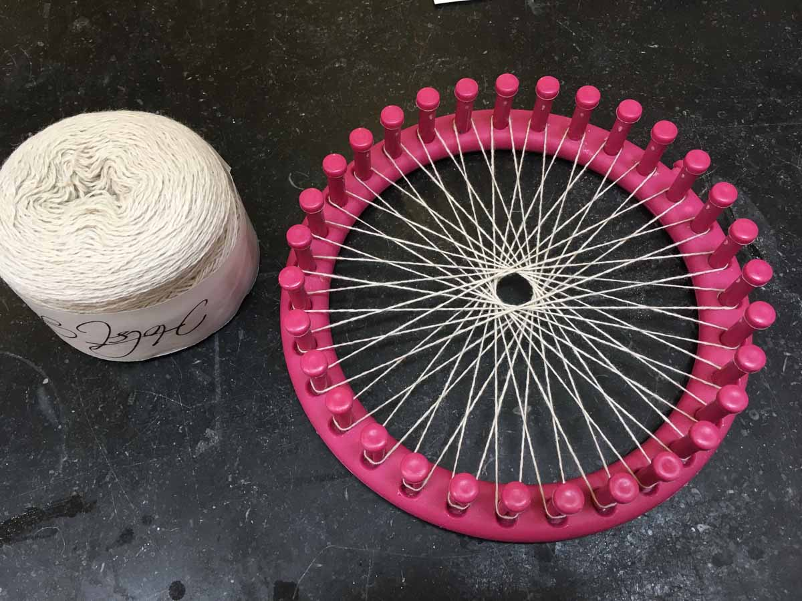
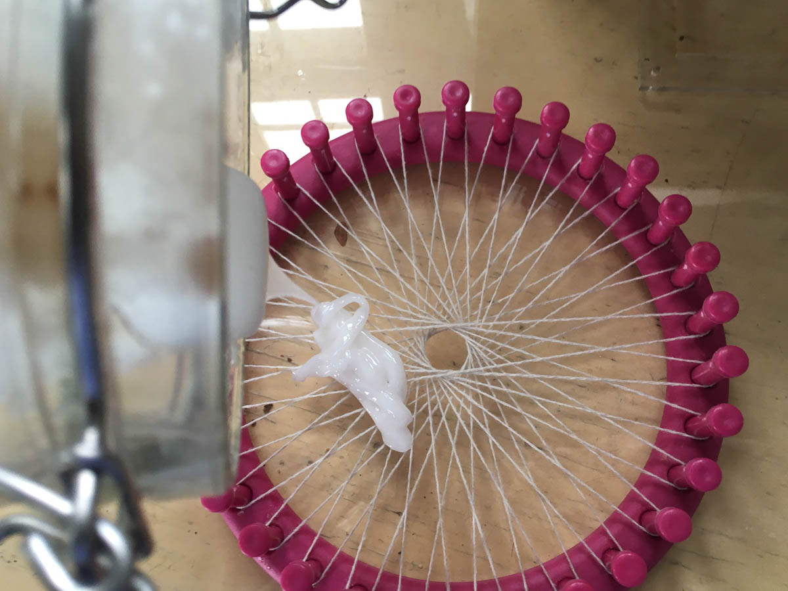
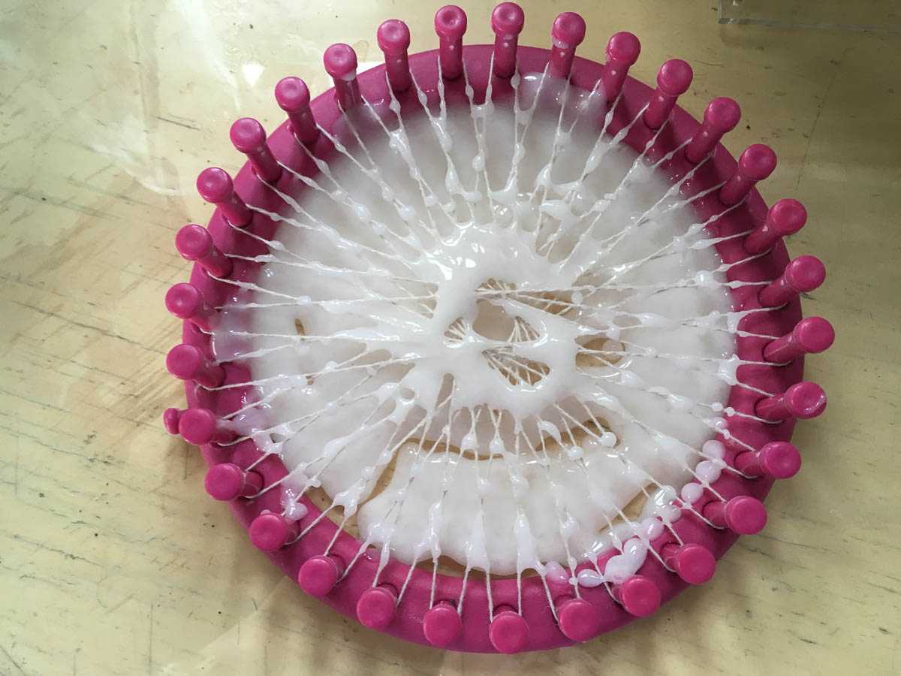
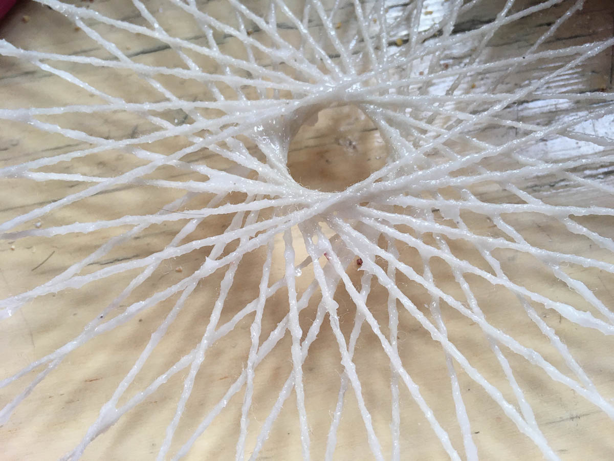
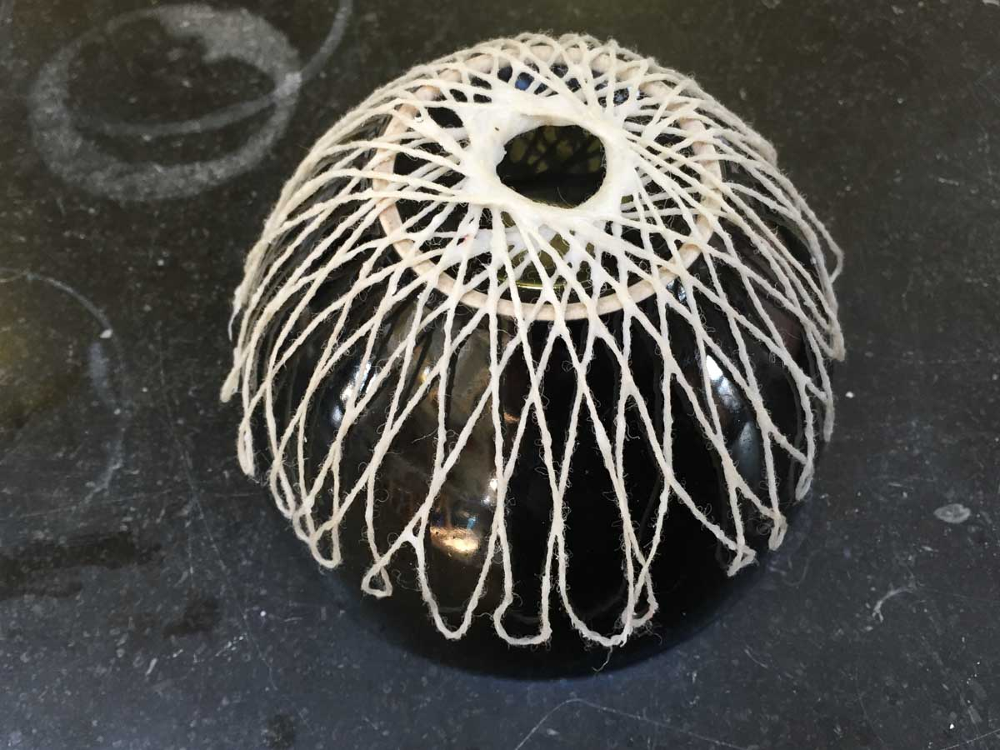
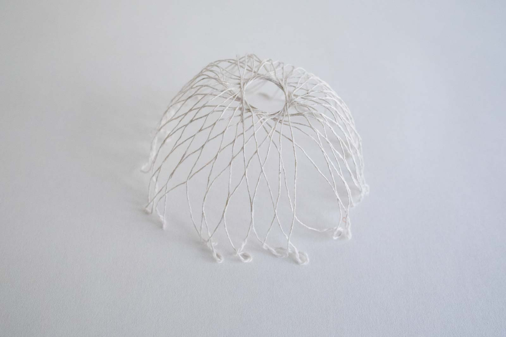
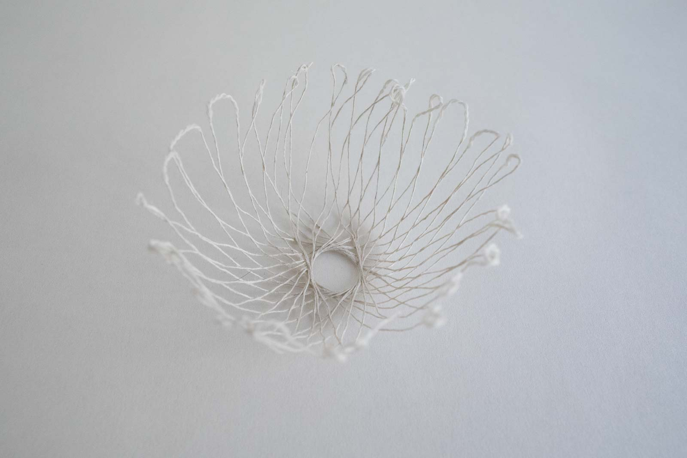

# ALGINATE NET

<iframe width="560" height="315" src="https://www.youtube.com/embed/iQ-Ax3saWJI" frameborder="0" allow="accelerometer; autoplay; encrypted-media; gyroscope; picture-in-picture" allowfullscreen></iframe>

##GENERAL INFORMATION

a cotton/wool and alginate-based composite with open structure, molded onto a half dome shape. The net is light and springy and feels a little like a thin hemp rope. It jumps right back into shape after squeezing it.

**Physical form**

Solids

Color without additives: color of the yarn used

**Fabrication time**

Preparation time: 1 hour (plus resting overnight)

Processing time: 5-7 days

Need attention: None, just leave it to dry on the mold

Final form achieved after: 7 days

**Estimated cost (consumables)**

0,57 Euros for a yield of approx 200 ml alginate plastic (you can make a few nets with that)

##RECIPE

##Ingredients

* **Sodium alginate powder - 6 gr**
	* the polymeer (so it becomes a solid)
* **Glycerine - 10 gr**
	* the plasticizer that bonds with the alginate (makes it flexible). 
* **Water - 200 ml/gr**
	* to dissolve and mix the polymeer and plasticizer
	* optional: use a (diluted) natural dye instead for a colored plastic
* **Sunflower oil - 5 gr**
	* filler to reduce shrinkage
* **Yarn - cotton/wool mix, 2 metres** 
    * to create the net
* **Calcium chloride solution 10% (10 gr to 100 gr water)**
    * is the curing agent: calcium chloride attracts moisture very strongly: spraying it onto the alginate plastic starts the curing process. 

##Tools

1. **Scale**
1. **Spoon** 
1. **Blender** 
2. **Glass jar with lid**
3. **Spray bottle** (150 ml contents, for the calcium chloride solution)
1. **Circular loom OR: nails and a wooden board** to design the net
1. **Moulds** for shaping the net, e.g. two identical bowls that fit inside one another
2. **Acrylic sheet** to catch the excess alginate mixture (can be scooped up and reused before curing)

##Yield

Approx. 200 ml of alginate plastic that can be stored for two weeks and used in many different recipes

Approx. 100 ml of calcium chloride 10% solution that can be used for any alginate recipe

##Method

1. **Preparation**
	- Weigh your ingredients for the alginate plastic (alginate, glycerine, water, sunflower oil). Optional: use a diluted natural dye instead of water in the same amount for a colored plastic.
	- Put the oil, alginate and glycerine in a blender and add a dash of the water. Blend into a thick and homogenous paste. Then add the rest of the water and blend again (this is to avoid lumps).
	- Leave the mixture overnight to allow the bubbles to come to the surface and pop.
	- Make the calcium chloride solution by dissolving 10 gr in 100 gr hot water. Put it in a spray bottle.
 
1. **Loom preparation**
	- The next day: create a net on your loom (or hammer some nails into a wooden board and use that to create a net shape). It's not important that this is a properly woven structure. 
	- Push down the yarn at all the crossings, so the threads touch each other

1. **Casting**
	- Place the loom on an acrylic sheet before casting to catch excess alginate mixture
	- Distribute the alginate mixture over the net, making sure it touches all the threads and crossings
	- Wipe off excess blobs, the alginate should be distributed evenly
	- Spray the net with the calcium chloride solution from all sides to start the curing process
	- After a few minutes, when it no longer feels liquid but is becoming slightly solid, take the net off the loom. The alginate will shrink a lot, if you leave it on it could get stuck.
	- Rinse the calcium chloride off the net by submerging it in tap water
	- Transfer the net onto the mold (a bowl in this case), and place the threads how you want them
	- Let it cure until totally dry

###Drying/curing/growth process

- Mold depth:  				N/A
- Shrinkage thickness:      20-30 %
- Shrinkage width/length:   20-30 %

**Shrinkage and deformation control**

Letting it dry up to seven days to get to the final form. When it no longer feels cool to the touch it is dry enough to take off. It can help to place a second bowl over the net to keep it in place even better.

**Curing agents and release agents**

Calcium chloride 10% as curing agent 

**Minimum wait time before releasing from mold**

3 days

**Post-processing**

N/A

**Further research needed on drying/curing/growth?**

Not sure

###Process pictures

*Preparing the alginate the day before, Loes Bogers, 2020*

*The mixture is ready, Loes Bogers, 2020*

*Making a net-like structure on a loom (does not have to be "proper" weaving), Loes Bogers, 2020*

*Preparing a 10% calcium chloride solution with hot water, Loes Bogers, 2020*

*The calcium chloride solution in a spray bottle, Loes Bogers, 2020*

*Pouring the alginate mixture onto net, Loes Bogers, 2020*

*You can pour a lot and scoop up the excess to use again later, Loes Bogers, 2020*

*Alginate evenly distributed along the yarn lines, Loes Bogers, 2020*

*Letting the alginate net cure and dry on top of a half-dome shape, Loes Bogers, 2020*

###Variations

- Add a **natural colorant** such as a vegetable dye or water-based ink (e.g. hibiscus, beetroot, madder)
- Add **more glycerine** for a more flexible composite
- You can make endless variations with the net design, and also with the mould design you cure the net on.

##ORIGINS & REFERENCES

**Cultural origins of this recipe**

**About the material:** Sodium alginate (E401) is used a lot in molecular gastronomy, for (reverse) spherification that was patented by  William J. S. Peschardt in the 1940s and popularized in the molecular cuisine popularized by Adrian Ferra from restaurant El Bulli. It takes no heat but gels when in contact with calcium and acidic media (e.g. calcium chloride and calcium lactate). More commonly, it is used as additive: as stabilizer, thickener, emulsifier and hydration agent in all kinds of processed foods, but cosmetics and pharmaceuticals and even (as thickener) in screen printing).

Alginate plastics are also used a lot in molding and casting of dental technology industry. And it is used to waterproof and fireproof fabrics.  

**About the technique:** this is a socalled *composite.* A composite can be any combination of two or more dissimilar materials which together make for a material with different properties, but without merging into one new compound (they continue to be discernable). Very familiar examples is paper mache (paper and glue modelled for example around a balloon). It is one of the earliest human technologies. Early on composites were created by adding straw to mud bricks for building, or the Egyptian practice of soaking cloth tape in resin used for mummification of the dead. The technical temrs for the materials used in a composite are *constituent materials* with three type: the matrix, preform and the enforcement. The matrix is a pattern that distributes the load (e.g. bioresin), the preform are yarns, net wovens, whereas other reinforcement (such as fibres) contribute to the mechanical properties of the materials. 

All composites (even simple ones) are engineered materials. One of the great benefits is that it can result in large but strong and lightweight spatial objects (e.g. carbon fibre enforced plastic) with relatively few resources. It also gives more options to create varying degrees of stiffness and strength. The use of textile composites in the construction industry is less common than traditional building materials, but its popularity is growing. 

**On open-source bioplastics:** open-source documenting of how to make bioplastics with simple tools and locally available materials can be attributed to Miriam Ribul and her publication on *Material Activism* from 2014. Promoting collaborative production of alternatives for petroleum-based plastic, she demonstrated 20(!) known processes for material production using only 4 simple recipes. Juliette Pépin's visual research book on bioplastics (also from 2014), goes in depth into the sensory and visual aspects of simple recipes with many variations. Although bioplastics production is certainly a craft that is dispersed across many locations and times, leaving traces of many similar recipes behind, this type of cataloguing and sharing work is certainly indebted to these two pioneers.

**Needs further research?**   Not sure

###Key sources

The alginate recipe is a modified version of: **Flexible Bio-plastic Alginate Recipe** by Cecilia Raspanti (TextileLab, Waag), Fabricademy Class "Biofabricating Materials", 2019, [link](https://class.textile-academy.org/classes/week05A/).

**Alginate Bioplastic** by Catherine Euale, Fabricademy 2018-19, [link](https://class.textile-academy.org/2019/catherine.euale/projects/P7algae/)

The technique of alginate net casting is a variation on the experiments documented by **Carolina Delgado** (2020) in her Fabricademy [project page:](https://class.textile-academy.org/2020/carolina.delgado/projects/final-project/#netting)

###Copyright information

All recipes above have been published under an Creative Commons Attribution Non-Commercial licence.

##ETHICS & SUSTAINABILITY

Brown algae are not farmed everywhere in the world and might have to travel significant distances. 

Algae have some benefits compared to conventional farming of biomaterials: they don’t need agricultural land, therefore there is no competition for food or farmland. They have higher yields per hectare and are extremely efficient with water, and algae may grow on nutrients from residual streams, like waste water and CO2.    

Further research is required regarding the exact production processes of sodium alginate. More research is needed on the use of sustainable additives to reduce shrinkage and deformation, and decreasing the curing time. 

**Sustainability tags**

- Renewable ingredients: yes
- Vegan: yes
- Made of by-products or waste:  no
- Biocompostable final product:  yes
- Reuse: no

Needs further research?:  not sure

Should not be recycled as part of PET-plastics waste: this causes contamination of the waste stream. Compost bioplastics in a warm environment with sufficient airflow.

##PROPERTIES

- **Strength**: medium
- **Hardness**: flexible
- **Transparency**: translucent
- **Glossiness**: matt
- **Weight**: light
- **Structure**: open
- **Texture**: rough/medium/smooth/variable
- **Temperature**: medium
- **Shape memory**: high
- **Odor**: none
- **Stickiness**: low
- **Weather resistance:** medium
- **Acoustic properties:** needs further research
- **Anti-bacterial:** needs further research
- **Non-allergenic:**needs further research
- **Electrical properties:** needs further research
- **Heat resistance:** high, up to 150 degrees celcius
- **Water resistance:** waterproof (for PH neutral and acidic water, not for alkaline water)
- **Chemical resistance:** needs further research
- **Scratch resistance:** high
- **Surface friction:** medium
- **Color modifiers:** none 

##ABOUT

**Maker(s) of this sample**

- Name: Loes Bogers
- Affiliation: Fabricademy student at Waag Textile Lab Amsterdam
- Location:  Rotterdam, the Netherlands
- Date: 26-02-2020 – 03-03-2020

**Environmental conditions**

- Humidity:  40-50%
- Outside temp:  5-11 degrees Celcius
- Room temp:  18 – 22 degrees Celcius
- PH tap water:  7-8

**Recipe validation**

Has recipe been validated? Yes, by Carolina Delgado, Fabricademy Student Textile Lab, Waag Amsterdam, 26 March 2020

**Images of the final sample**

*Alginate net, Loes Bogers, 2020*

*Alginate net, Loes Bogers, 2020*

##REFERENCES

- **Flexible Bio-plastic Alginate Recipe** by Cecilia Raspanti (TextileLab, Waag), Fabricademy Class "Biofabricating Materials", 2019, [link](https://class.textile-academy.org/classes/week05A/).
- **The Science Of Spherification: Theoreticians examine the atomic details of an avant-garde culinary technique"**, by Bethany Halford, Chemical and Engineering News, Volume 92 Issue 42, pp. 35-36, October 2014: https://cen.acs.org/articles/92/i42/Science-Spherification.html 
- **Nature-Based System for Food Packaging** by Caroline Delgado, Fabricademy final project, 2020: https://class.textile-academy.org/2020/carolina.delgado/projects/final-project/#netting
- **Textile as Scaffold** by Anastasia Pistofidou for Fabricademy, 30 October 2018: [link](https://class.textile-academy.org/classes/week088/)
- **Textile Composite Materials** by Ashok Hakoo for Textile School, 14 April 2019: [link](https://www.textileschool.com/4474/textile-composite-materials/)
- **Textile Composites** by Waqas Paracha via Slideshare, 5 April 2010: [link](https://www.slideshare.net/wakasyounus/textile-composites)
- **What is Biocomposite?** by Ashish Kumar Dua, for Textile Learner, July 2013: [link](https://textilelearner.blogspot.com/2013/07/what-is-biocomposite-fibers-used-in.html)
- **Alginic Acid** on Wikipeda: [link](https://en.wikipedia.org/wiki/Alginic_acid)
- **Development of bio-plastic from production technologies from microalgae** by AlgaePARC for Wageningen University & Research, 2012-2016: [link](https://www.wur.nl/en/show/Development-of-bioplastic-production-technologies-from-microalgae.htm)
- **Alginate Bioplastic** by Catherine Euale, Fabricademy 2018-19, [link](https://class.textile-academy.org/2019/catherine.euale/projects/P7algae/)
- **Recipes for Material Activism** by Miriam Ribul, 2014, via issuu [link](https://issuu.com/miriamribul/docs/miriam_ribul_recipes_for_material_a)
- **Research Book Bioplastics** by Juliette Pepin, 2014, via issuu [link](https://issuu.com/juliettepepin/docs/bookletbioplastic)
