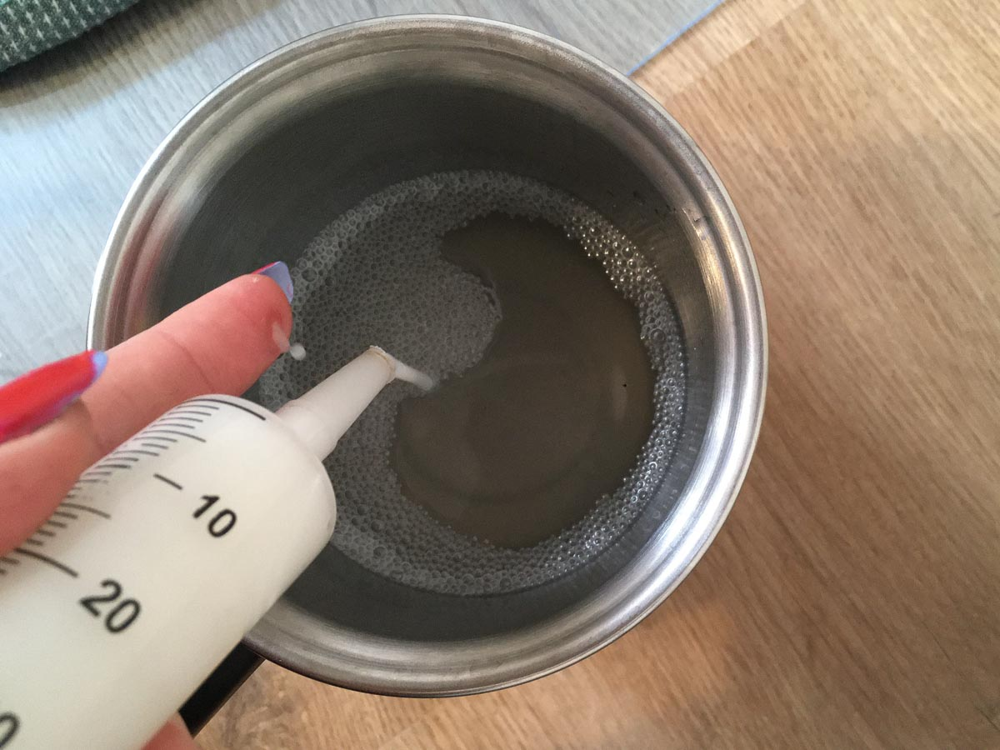
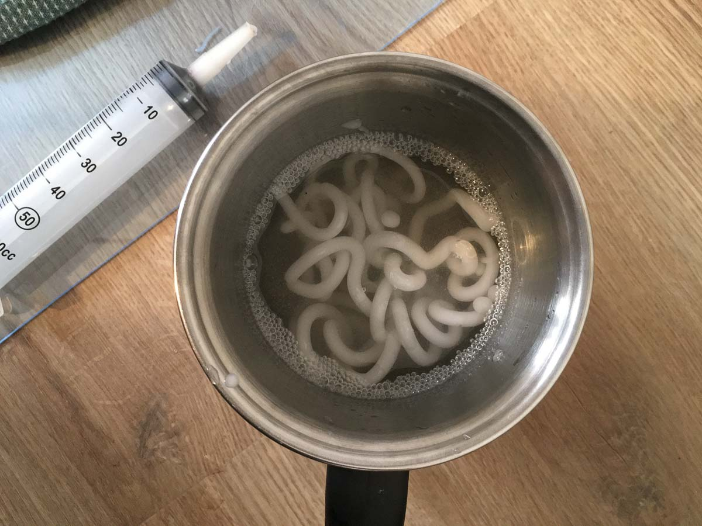
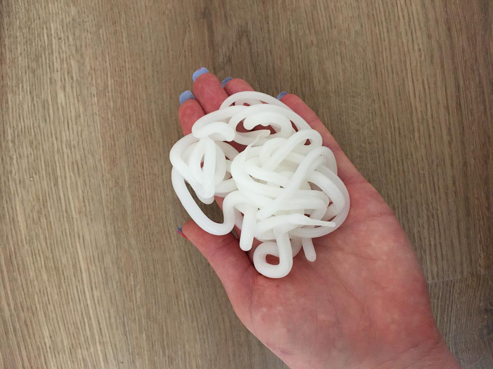
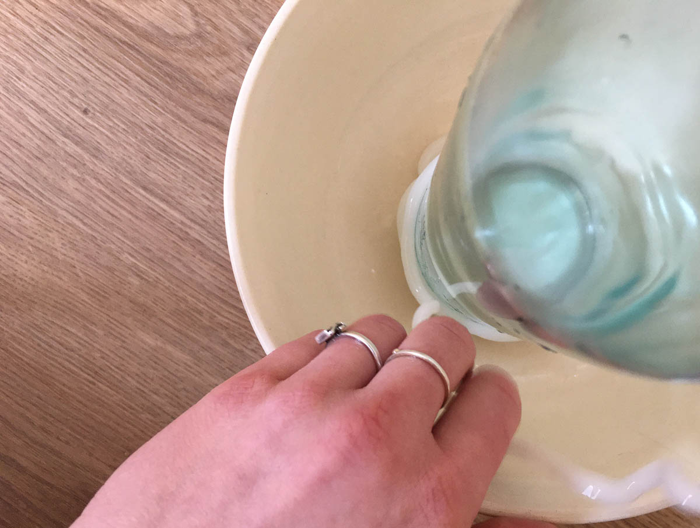
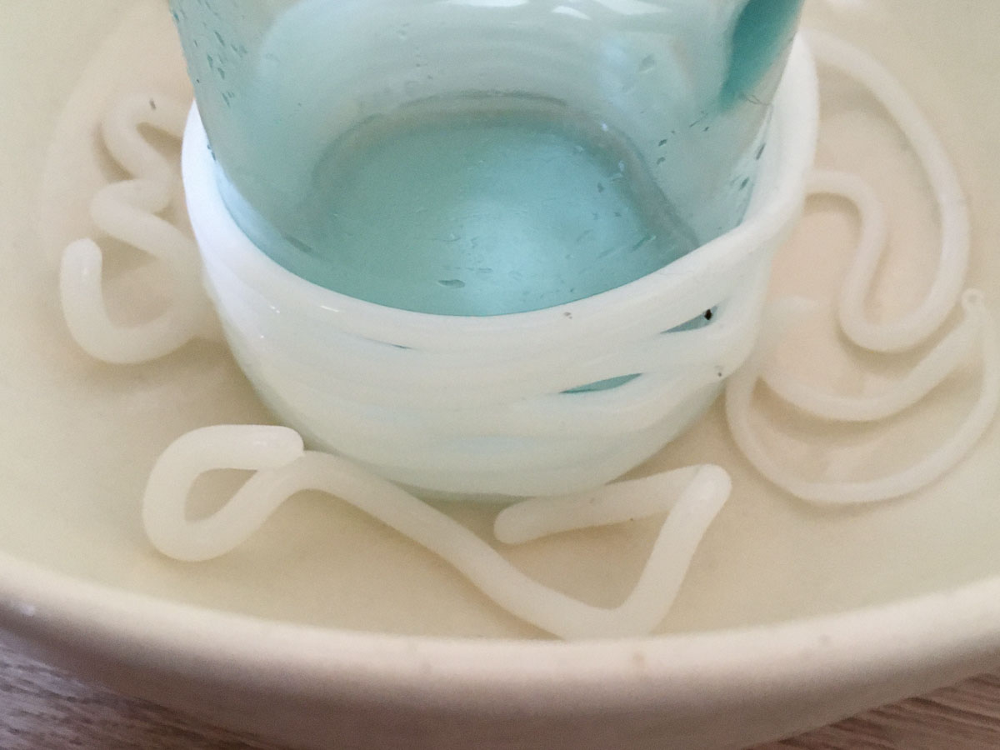
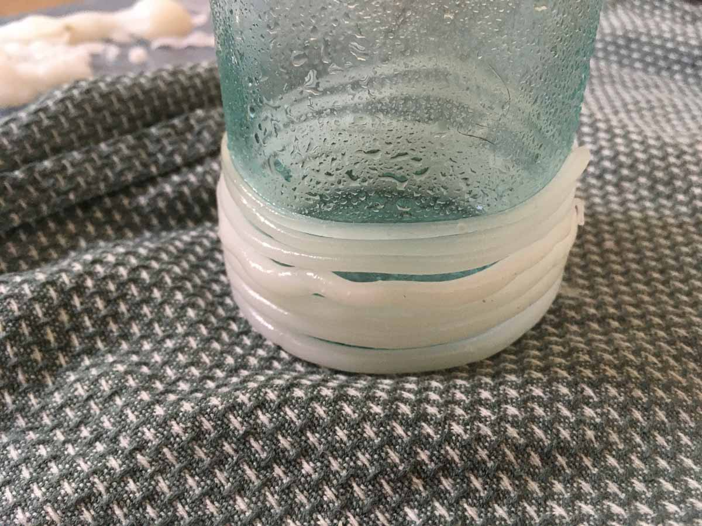
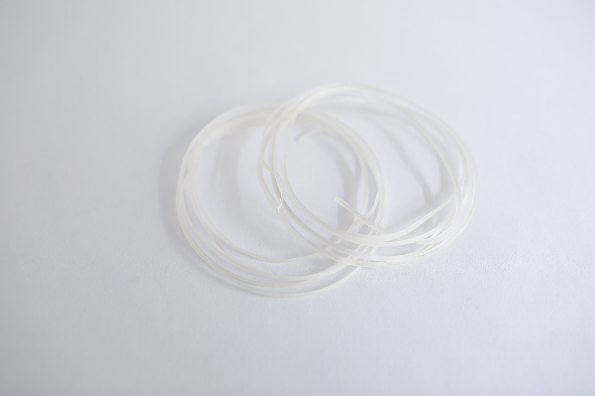

# ALGINATE STRINGS

<iframe width="560" height="315" src="https://www.youtube.com/embed/UpHpZEnu4-M" frameborder="0" allow="accelerometer; autoplay; encrypted-media; gyroscope; picture-in-picture" allowfullscreen></iframe>

##GENERAL INFORMATION

A strong, springy or flexible string (depending on diameter of extruder), alginate based. The string is strong and flexible and is somewhat comparable to thick nylon or rubber cord. It is more flexible than nylon, but stiffer than rubber. 

**Physical form**

Strings

Color without additives: matte white, translucent

**Fabrication time**

Preparation time: 1 hour (plus resting overnight)

Processing time: 5-7 days

Need attention: every few hours the first day, to spray more curing agent and rearrange the string.

Final form achieved after: 7 days

**Estimated cost (consumables)**

0,57 Euros for a yield of approx 200 ml

##RECIPE

###Ingredients

* **Sodium alginate powder - 6 gr**
	* the polymeer (so it becomes a solid)
* **Glycerine - 10 gr**
	* the plasticizer that bonds with the alginate (makes it flexible). 
* **Water - 200 ml/gr**
	* to dissolve and mix the polymeer and plasticizer
	* optional: use a (diluted) natural dye instead for a colored plastic
* **Sunflower oil - 5 gr**
	* filler to reduce shrinkage
* **Calcium chloride solution 10% - 300 ml (30 gr to 300 gr water)**
    * is the curing agent: calcium chloride attracts moisture very strongly: spraying it onto the alginate plastic starts the curing process. 

###Tools

1. **Scale**
1. **Spoon** 
1. **Blender** 
2. **optional: glass jar with lid**
	* to store the alginate leftovers
1. **A bowl or jar of min. 300 ml** 
    * for the calcium chloride bath
1. **A large glass jar** 
    * to wind the string around for curing
1. **A deep plate, bowl or container**
	* to catch the excess water coming from the string
1. **60 cc (or more) syringe** 
	* to extrude the alginate plastic into the calcium chloride bath. You can also use other improvised extruders like empty sauce bottles and whipped/cream batter extruders.
1. **Spray bottle** (100 ml or more, for the calcium chloride solution)

###Yield

Before processing/drying/curing: approx. 200 ml of alginate plastic that can be stored for two weeks and used in many different recipes

Approx. 300 ml of calcium chloride 10% solution that can be used for any alginate recipe. 

###Method

1. **Preparation**
	- Weigh your ingredients for the alginate plastic (alginate, glycerine, water, sunflower oil). Optional: use a diluted natural dye instead of water in the same amount for a colored plastic.
	- Put the oil, alginate and glycerine in a blender and add a dash of the water. Blend into a thick and homogenous paste. Then add the rest of the water and blend again (this is to avoid lumps).
	- Leave the mixture overnight to allow the bubbles to come to the surface and pop.
	- Make the calcium chloride solution by dissolving 30 gr in 300 gr hot water. Put some in a spray bottle and store the rest in a jar: this is your calcium chloride bath.

1. **Extruding**
	- prepare the work space by putting out your calcium chloride bath and spray, an empty jar to wrap the string around, a syringe and your alginate mixture.
	- fill the syringe with about 50 ml alginate plastic 
	- extrude the alginate plastic into the calcium chloride bath, try to extrude continuously and uninterupted to created an even, long string. Repeat this process to make more strings.

1. **Curing & drying**
	- leave the string in the bath for a few minutes and then rinse in some tap water. 
	- the strings will be a bit curly at this stage. Wrap them around a jar to create a spool and stretch them out a little. 
	- keep an eye on them the first day, the stretch might break the film on some points. Spray some extra calcium chloride to close the leaks.
	- Let it cure until totally dry, you can take the string off the jar if you want to stretch them out into long straight strings. 

###Drying/curing/growth process

- Syringe diameter:  		2-5 mm
- Shrinkage thickness:      30-60 %
- Shrinkage width/length:   N/A

**Shrinkage and deformation control**

Wrapping it around a jar will help elongate the string so it doesn't dry up into curls. You can take it off the jar and dry it in long threads. Let it dry up to 7 days to get to the final form. It will be flexible at first but will slowly harden.

**Curing agents and release agents**

Calcium chloride 10% solution as a curing agent. 

**Minimum wait time before releasing from mold**

3 days

**Post-processing**

N/A

**Further research needed on drying/curing/growth?**

Developing tools to extrude evenly and continuously would be useful. 

###Process pictures

*Extruding into the calcium chloride bath Loes Bogers, 2020*

*Letting the string cure for a few minutes before rinsing in water, Loes Bogers, 2020*

*Curly strings after rinsing, Loes Bogers, 2020*

*Wrapping the string around a glass jar, Loes Bogers, 2020*

*The strings drying inside a bowl (some loose bits lying around), Loes Bogers, 2020*

*The strings slowly starting to dry, Loes Bogers, 2020*

###Variations

- Add a **natural colorant** such as a vegetable dye or water-based ink (e.g. hibiscus, beetroot, madder)
- Add **more glycerine** to try achieve a more flexible string
- Varying with different mouth pieces can generate thicker or thinner strings. 
- When these strings are put in water at room temperature for an hour they start to absorb water and the will get soft again. This is to be avoided unless you want the **make the strings longer and thinner** (and more fragile). When you soak them they can be stretched and elongated by about 30%. 

##ORIGINS & REFERENCES

**Cultural origins of this recipe**

Sodium alginate (E401) is used in molecular gastronomy, for (reverse) spherification that was patented by  William J. S. Peschardt in the 1940s and popularized in the molecular cuisine popularized by Adrian Ferra from restaurant El Bulli. It takes no heat but gels when in contact with calcium and acidic media (e.g. calcium chloride and calcium lactate). More commonly, it is used as additive: as stabilizer, thickener, emulsifier and hydration agent in all kinds of processed foods, but cosmetics and pharmaceuticals and even (as thickener) in screen printing).

Alginate plastics are also used in molding and casting of dental technology industry. And it is used to waterproof and fireproof fabrics.  

**On open-source bioplastics:** open-source documenting of how to make bioplastics with simple tools and locally available materials can be attributed to Miriam Ribul and her publication on *Material Activism* from 2014. Promoting collaborative production of alternatives for petroleum-based plastic, she demonstrated 20(!) known processes for material production using only 4 simple recipes. Juliette Pépin's visual research book on bioplastics (also from 2014), goes in depth into the sensory and visual aspects of simple recipes with many variations. Although bioplastics production is certainly a craft that is dispersed across many locations and times, leaving traces of many similar recipes behind, this type of cataloguing and sharing work is certainly indebted to these two pioneers.

**Needs further research?**   Not sure

###Key Sources

The alginate recipe is a modified version of: **Flexible Bio-plastic Alginate Recipe** by Cecilia Raspanti (TextileLab, Waag), Fabricademy Class "Biofabricating Materials", 2019, [link](https://class.textile-academy.org/classes/week05A/).

**Alginate yarn**, by Catherine Euale / Anastasia Pistofidou (FabTextiles) Fabricademy 2018-19, [link](https://class.textile-academy.org/2019/catherine.euale/projects/P7algae/)

The technique of alginate string extrusion is a variation on the experiments documented by Carolina Delgado (2020) in her Fabricademy [project page:](https://class.textile-academy.org/2020/carolina.delgado/projects/final-project/#netting)

###Copyright information 

All recipes above were published under an Creative Commons Attribution Non-Commercial licence. 

##ETHICS & SUSTAINABILITY

Brown algae are not farmed everywhere in the world and might have to travel significant distances. 

**Sustainability tags**

- Renewable ingredients: yes
- Vegan: yes
- Made of by-products or waste:  no
- Biocompostable final product:  yes
- Reuse: no

Needs further research?:  not sure

Algae have some benefits compared to conventional farming of biomaterials: they don’t need agricultural land, therefore there is no competition for food or farmland. They have higher yields per hectare and are extremely efficient with water, and algae may grow on nutrients from residual streams, like waste water and CO2.    

Should not be recycled as part of PET-plastics waste: this causes contamination of the waste stream. Compost bioplastics in a warm environment with sufficient airflow.

##PROPERTIES

- **Strength**: strong
- **Hardness**: resilient
- **Transparency**: translucent
- **Glossiness**: matt
- **Weight**: light
- **Structure**: closed
- **Texture**: medium
- **Temperature**: medium
- **Shape memory**: medium
- **Odor**: none
- **Stickiness**: low
- **Weather resistance:** needs further research
- **Acoustic properties:** needs further research
- **Anti-bacterial:** needs further research
- **Non-allergenic:** needs further research
- **Electrical properties:** no
- **Heat resistance:** high (up to 150 degrees celcius)
- **Water resistance:** water resistant
- **Chemical resistance:** needs further research
- **Scratch resistance:** high
- **Surface friction:** sliding
- **PH modifiers:** sensitive to alkaline liquids 

##ABOUT

**Maker(s) of this sample**

- Name: Loes Bogers
- Affiliation: Fabricademy student at Waag Textile Lab Amsterdam
- Location:  Rotterdam, the Netherlands
- Date: 23-03-2020 – 30-03-2020

**Environmental conditions**

- Humidity:  40-50%
- Outside temp:  5-11 degrees Celcius
- Room temp:  18 – 22 degrees Celcius
- PH tap water:  7-8

**Recipe validation**

Has recipe been validated? Yes, by Carolina Delgado, Fabricademy student at TextileLab, Waag Amsterdam, 30 March 2020

**Images of the final sample**

*Alginate string, Loes Bogers, 2020*

##REFERENCES

- **Flexible Bio-plastic Alginate Recipe** by Cecilia Raspanti (TextileLab, Waag), Fabricademy Class "Biofabricating Materials", 2019, [link](https://class.textile-academy.org/classes/week05A/).
- **Alginate yarn**, by Catherine Euale / Anastasia Pistofidou (FabTextiles) Fabricademy 2018-19, [link](https://class.textile-academy.org/2019/catherine.euale/projects/P7algae/)
- **The Science Of Spherification: Theoreticians examine the atomic details of an avant-garde culinary technique"**, by Bethany Halford, Chemical and Engineering News, Volume 92 Issue 42, pp. 35-36, October 2014: https://cen.acs.org/articles/92/i42/Science-Spherification.html 
- **Nature-Based System for Food Packaging** by Caroline Delgado, Fabricademy final project, 2020: https://class.textile-academy.org/2020/carolina.delgado/projects/final-project/#netting
- **Alginic Acid** on Wikipeda: [link](https://en.wikipedia.org/wiki/Alginic_acid)
- **Development of bio-plastic from production technologies from microalgae** by AlgaePARC for Wageningen University & Research, 2012-2016: [link](https://www.wur.nl/en/show/Development-of-bioplastic-production-technologies-from-microalgae.htm)
- **Recipes for Material Activism** by Miriam Ribul, 2014, via issuu [link](https://issuu.com/miriamribul/docs/miriam_ribul_recipes_for_material_a)
- **Research Book Bioplastics** by Juliette Pepin, 2014, via issuu [link](https://issuu.com/juliettepepin/docs/bookletbioplastic)

