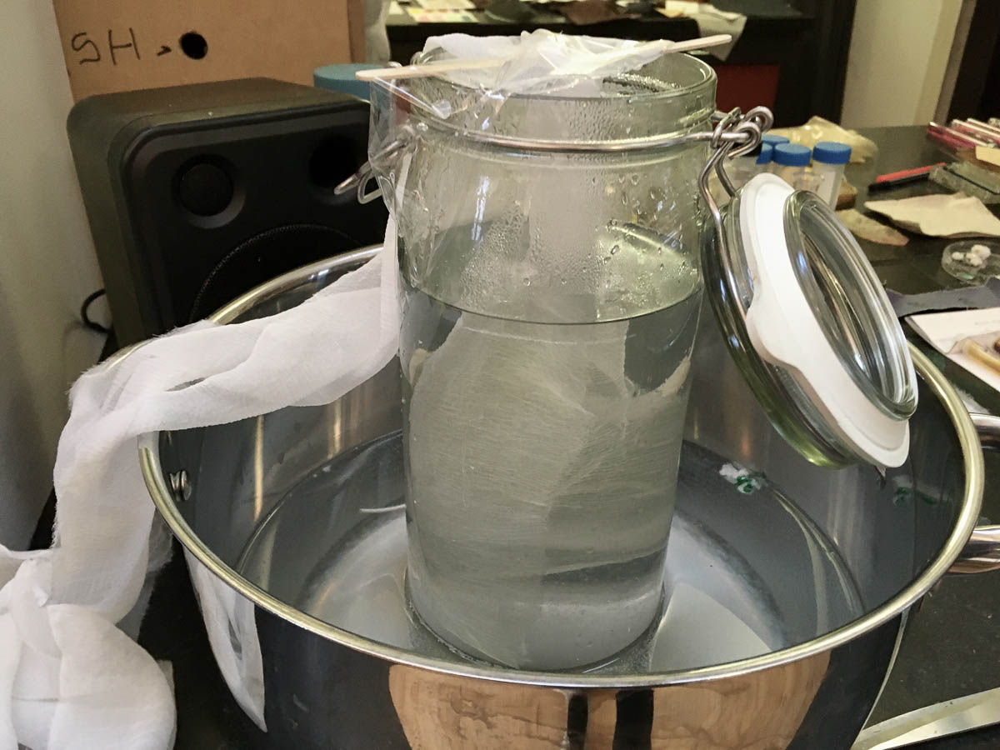
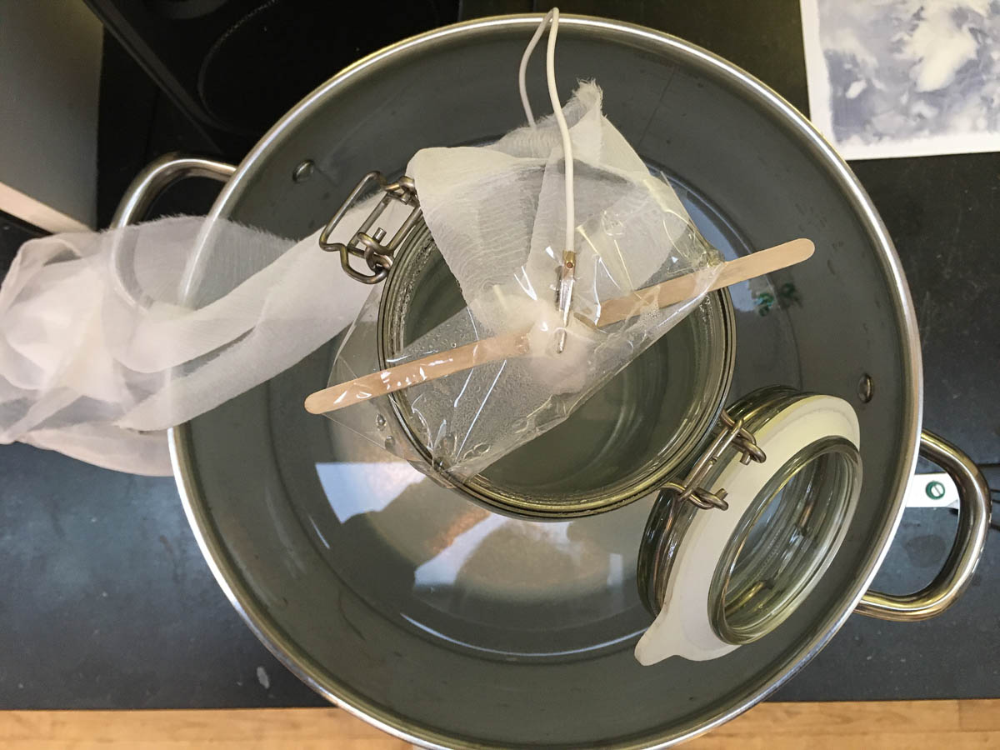
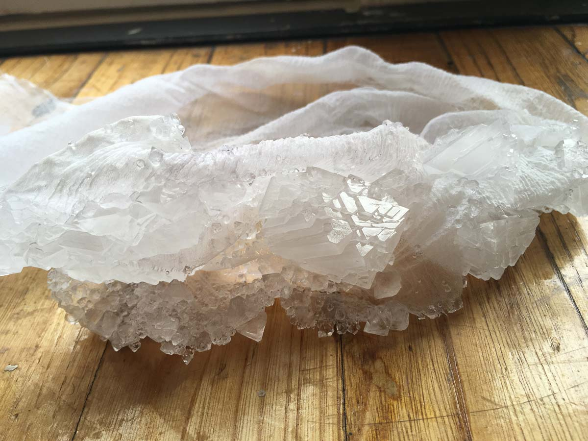
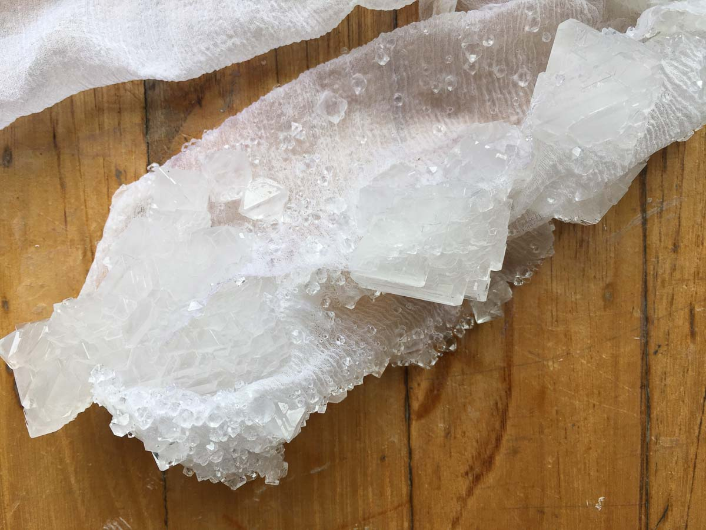
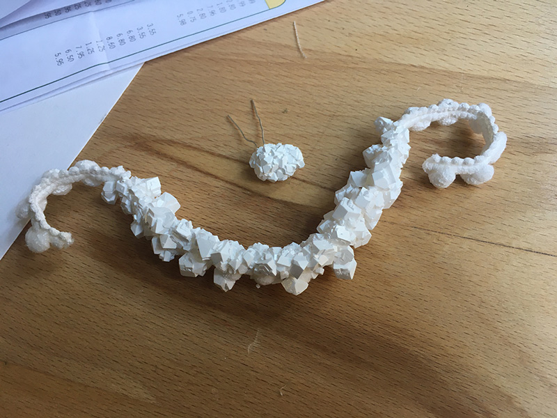
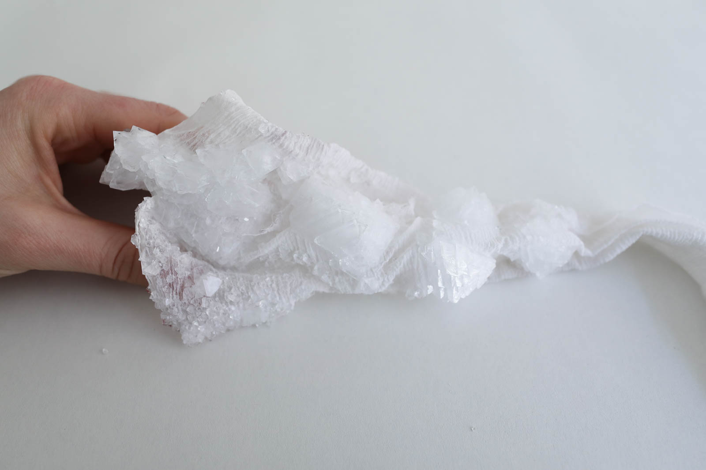
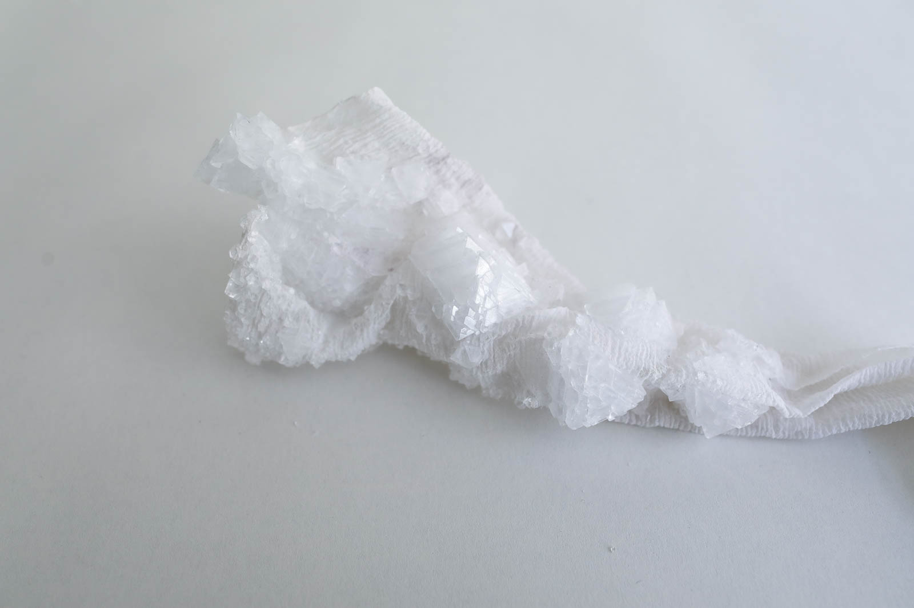
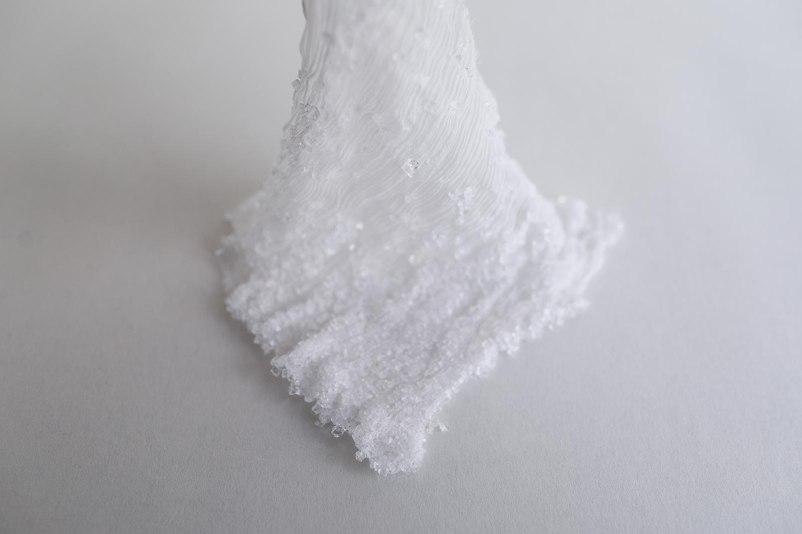
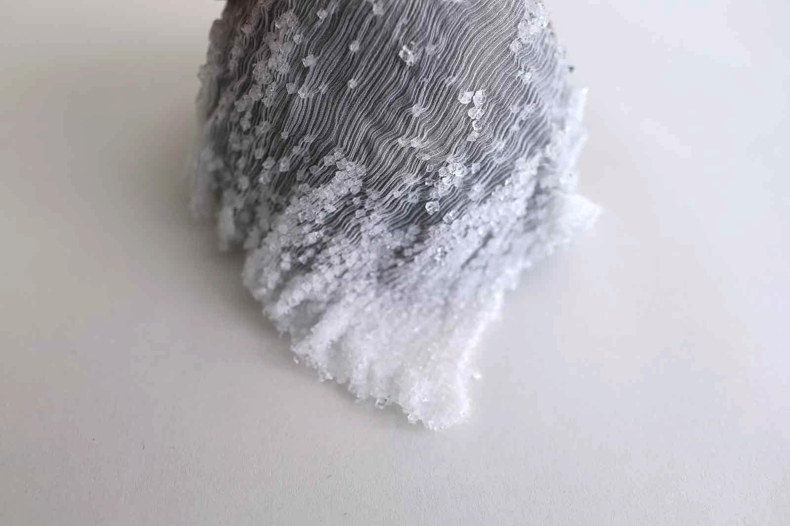
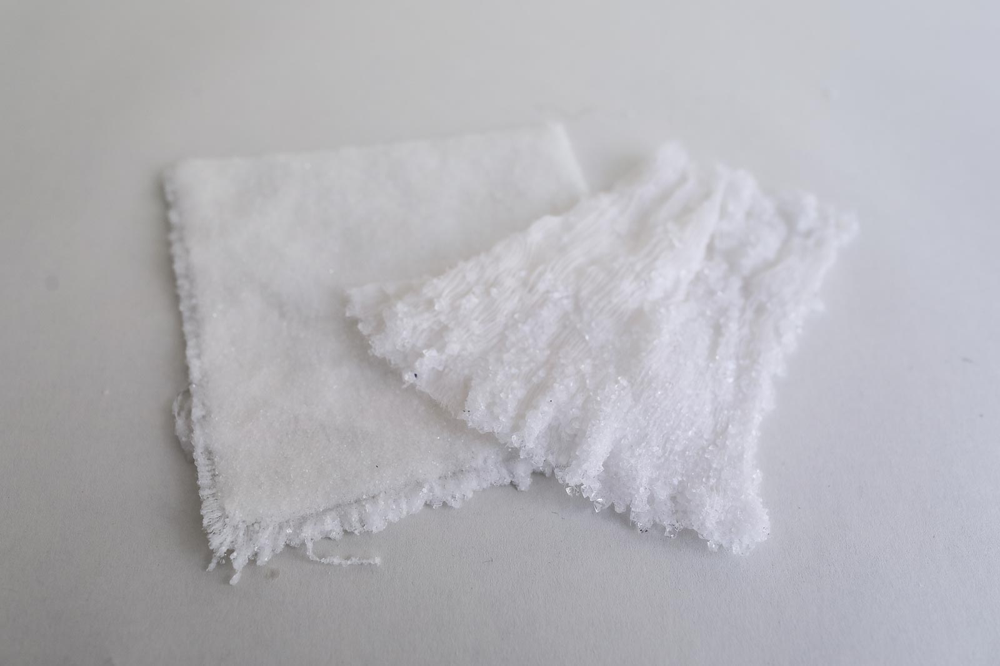

# ALUM CRYSTALS ON SILK

<iframe width="560" height="315" src="https://www.youtube.com/embed/HLB0nJns3U8" frameborder="0" allow="accelerometer; autoplay; encrypted-media; gyroscope; picture-in-picture" allowfullscreen></iframe>

##GENERAL INFORMATION

Alum crystals - that have triangular facets - grown on a silk substrate. The technique used here is called *precipitation from a solution*. Alum crystals are clear and faceted with great definition so they are often compared to diamonds. However these can get so big that it is not really credible that they are diamonds, but they play with light in similar ways.

**Physical form**

Surface treatment

Color without additives: transparent and translucent white. (Turns opaque after baking in the oven for 10 minutes at 100 degrees Celcius.)

**Fabrication time**

Preparation time: 1 Hour

Processing time: 1 day or overnight

Need attention: None. Leave in a warm place, don't move or touch it.

Final form achieved after: 1 day

**Estimated cost (consumables)**

2,00 Euros for a 400 ml saturated solution

##RECIPE

###Ingredients

* **Alum powder - 125 g** (potassium aluminium sulfate or potash alum), plus some more just in case
	* we will try to reorganize these molecules into crystals. 
* **Water - 400 ml/gr**
	* To dissolve the alum powder and reorganize into a crystal 
* **Water - 1000 ml/g**
	* to create a bain marie
* **Silk - a 10x10cm swatch**
	* As a substrate for the alum crystals to attach to

###Tools

1. **Cooker or kettle** 
1. **A piece of silk**
1. **A smooth glass jar or bowl** big enough to fit your piece of silk without touching the sides or having to fold or crease it. Make sure this it totally clean.
1. **A wide heat-resistant bowl or oven pan** this is the bain marie: the glass jar should fit inside this bowl and have some space for hot water
1. **Spoon** 
1. **A stick or chopsticks** that are long enough to stay put on top of the glass jar. 
1. **Clips** to fasten the silk to the stick

###Yield

About 80-100% of the alum powder will attach itself the silk in the form of larger crystals.

###Method

1. **Preparation**

	- Weigh the alum
	- Prepare the silk by attaching it to the wooden stick with clips. When you hang it inside the glass jar it should not touch the bottom or the walls of the jar
	- Boil the water 
	- Put the glass jar inside the wide oven dish/pan. Pour as much boiling water as possible into the bigger pot, without making the glass jar float. This is the bain marie that will keep your crystal solution warm and help it cool down very very slowly (resulting in bigger crystals). 
	- Put this in a (warm) place where you can leave it for 8-16 hours without anyone moving or touching it.

1. **Dissolving the alum**
	- Measure 400 ml and put it in the glass jar (which is already inside the bain marie to keep it warm). 
	- Spoon by spoon, add the alum while stirring. When no more alum dissolves and just sinks to the bottom, your solution is *saturated*. If there are grains on the bottom, pour off the liquid and clean the jar before continuing. You don't want anything on the bottom of the jar. 
	- Now suspend your silk into the jar, again making sure it doesn't touch any sides or the bottom, and not folded in on itself. 

1. **Let the crystals form**

	- 	Now leave the crystal to grow. The less you touch it, the easier it is for the molecules to find each other on the silk and form big beautiful crystals. 
	-  If you have the patience, give it 16 hours. But pretty decent-sized crystals will have formed as soon as 6-8 hours later.
	-  Rinse them under cold tap water and let them dry. 

###Drying/curing/growth process

- Mold depth:  				 N/A
- Shrinkage thickness:      N/A
- Shrinkage width/length:   N/A

**Shrinkage and deformation control**

N/A

**Curing agents and release agents**

None. 

**Minimum wait time before releasing**

6 hours

**Post-processing**

Store the crystals in a dry place. They will re-dissolve immediately when the are submerged in hot water, starts to dissolve after an hour in water at room temperature, and is completely dissolved after being in water at room temperature for 4 hours. 

Don't throw away left-over liquid or unused crystals, they can be redissolved a next time. 

**Further research needed on drying/curing/growth?**

More research on colorants could be done. Black soot ink results in black crystals, purple crystals can be achieved by adding some chromium alum powder (or: potassium chromium sulfate dodecahydrate) to the solution. 

###Process pictures

*Silk inside the bain marie, Loes Bogers, 2020*

*Improvised suspension system, Loes Bogers, 2020*

*2-3 cm crystals on silk, Loes Bogers, 2020*

*2-3 cm crystals on silk, Loes Bogers, 2020*

*Alum crystal on an LED (top) turned opaque white after 10 mins in the oven at 100 degrees celcius. On the bottom: a borax crystal [(recipe here)](https://class.textile-academy.org/2020/loes.bogers/files/recipes/boraxcrystals/), Loes Bogers, 2020*

###Variations

- Add a **colorant** such as black soot ink (other natural dyes are still experimental!)
- Turn your crystals opaque white by putting them in the oven for 10 minutes at 100 degrees celcius. 
- Use different textiles (e.g. velvet attracts many small crystals)
- Lay your silk flat in a bowl to cover the entire surface with smaller crystals
- Let the crystals grow without the bain marie to see what happens
- Glue a piece of silk on an LED with hot glue to grow a crystal that you can use in electronics projecs instead of plastic casings (see video below).
- The same technique can be used with epsom salt, sugar and [borax](https://class.textile-academy.org/2020/loes.bogers/files/recipes/boraxcrystals/). 
- Adding conductive paint to the solution creates crystals that can be used as capacitive sensors.

##ORIGINS & REFERENCES

**Cultural origins of this recipe**

Potassium alum was known to the Ancient Egyptians as early as 1500 B.C and was described in the age old writings of Pliny and Dioscorides under many different names: alumen, salsugoterrae, stupteria and other substances with vaguely similar properties and uses like: misy, sory, chalcanthum, atramentum sutorium, iron sulfate or "green vitriol". The word "alum" is still used for many different kinds of alum compounds and are often used interchangeably but they are not all the same. Potassium alum is mentioned in the Ayurveda with the name phitkari or saurashtri.[citation needed] It is used in traditional Chinese medicine with the name mingfan (明矾). 

Potassium alum was used extensively in the wool industry from Classical antiquity, during the Middle Ages, and well into 19th century as a mordant or dye fixative. The textile dyeing industry in Bruge, and many other locations in Italy, and later in England, required alum to stabilize the dyes onto the fabric (make the dyes "fast") and also to brighten the colors. As an ingredient it was of utmost economic importance during the Renaissance.
	
**Needs further research?**  Yes

###Key Sources

This is a variation on: **Alum Crystals** in "Textile as Scaffold" by Anastasia Pistofidou for Fabricademy 30 October 2019. Lecture notes: [link](https://class.textile-academy.org/classes/week088/)

Which in turn refers to: **Growing Gems Crystal Project** by Home Science Tools Learning Center: [link](https://learning-center.homesciencetools.com/article/growing-gems-crystal-project/)

###Copyright information

Pistofidou's recipe is published under a Creative Commons Attibution Non-Commercial licence. It is unclear if the original recipe is copyrighted, further research required. 

##ETHICS & SUSTAINABILITY

Saying anything about the ethics and sustainability mineral crystals is relative. What do you compare it to? It is *currently* not known to be tied to practices of exploitation (when compared to, for example, the blood diamonds people fight horrific wars over. 

Potassium alum historically was mainly extracted from alunite, but is now produced industrially by adding potassium sulfate to a concentrated solution of aluminium sulfate. Aluminium sulfate can be obtained from clays, bauxite, cryolite, and alum schists (found in Germany, Belgium, Scotland, Czech Republic).  

Mineral deposits that alum can be harvested from are relatively abundant - again, compared to say, diamonds - but are still a finite resource that involves mining practices with all its historical problematics around stealing land from indigenous peoples, as well as worker's safety and depletion of the earth's resources (which is likely to be downplayed in factsheets from the mines themselves).  

Unlike diamonds, borax and alum crystals can be regrown into different constellations infinitely allowing for multiple designs that can be executed reusing the same compound. They are not precious in the way diamonds and are, but pretty brilliant in their own right. 

**Sustainability tags**

- Renewable ingredients: no
- Vegan: yes
- Made of by-products or waste:  no
- Biocompostable final product:  no
- Reuse: yes, dissolve and regrow in hot water

Needs further research?:  yes, local producers seem reluctant to share sourcing information about these products. It is unclear where it comes from, whether it is natural or synthetic and what kind of mining practices are involved. 

##PROPERTIES

- **Strength**: medium
- **Hardness**: rigid
- **Transparency**: transparent/variable (turns opaque after 10 mins at 100 degrees celcius)
- **Glossiness**: glossy/satin
- **Weight**: heavy
- **Structure**: closed/variable
- **Texture**: rough
- **Temperature**: cool
- **Shape memory**: high
- **Odor**: none
- **Stickiness**: low
- **Weather resistance:** poor
- **Acoustic properties:** needs further research
- **Anti-bacterial:** needs further research
- **Non-allergenic:** needs further research
- **Electrical properties:** needs further research
- **Heat resistance:** low/needs further research
- **Water resistance:** low
- **Chemical resistance:** needs further research
- **Scratch resistance:** high
- **Surface friction:** sliding
- **PH modifiers:** none 

##ABOUT

**Maker(s) of this sample**

- Name: Loes Bogers
- Affiliation: Fabricademy student at Waag Textile Lab Amsterdam
- Location:  Amsterdam, the Netherlands
- Date: 27-02-2020 – 27-02-2020

**Environmental conditions**

- Humidity:  40-50%
- Outside temp:  5-11 degrees Celcius
- Room temp:  18 – 22 degrees Celcius
- PH tap water:  7-8

**Recipe validation**

Has recipe been validated? Yes, by Cecilia Raspanti, TextileLab, Waag Amsterdam, 9 March 2020

**Images of the final sample**

*Large crystals grown on silk, Loes Bogers, 2020*

*Large crystals grown on silk, Loes Bogers, 2020*

*Smaller crystals grown on silk (lay it flat in a wide glass bowl), Loes Bogers, 2020*

*Smaller crystals grown on silk on top of a black bowl, Loes Bogers, 2020*

*Alum crystals on silk (right), and on velvet (left), Loes Bogers, 2020*

<iframe width="560" height="315" src="https://www.youtube.com/embed/oRGE_kX80AU" frameborder="0" allow="accelerometer; autoplay; encrypted-media; gyroscope; picture-in-picture" allowfullscreen></iframe>

##REFERENCES

- **Textile as Scaffold** by Anastasia Pistofidou for Fabricademy 30 October 2019. Lecture notes: [link](https://class.textile-academy.org/classes/week088/)
- **Dark diamond mining** by EJTech, 25 February 2020: [link](https://wikifactory.com/@ejtech/dark-diamond-mining)
- **Growing Gems Crystal Project** by Home Science Tools Learning Center: [link](https://learning-center.homesciencetools.com/article/growing-gems-crystal-project/)
- **Grow your own simulated diamonds with a big alum crystal**, by Anne Marie Helmenstein for ThoughtCo, 13 February 2018: [link](https://www.thoughtco.com/growing-a-big-alum-crystal-602197)
- **Potassium alum**, on Wikipedia, n.d. [link](https://en.wikipedia.org/wiki/Potassium_alum#Natural_occurrence)
- **Aluminium Compounds, inorganic** by Otto Helmboldt, e.a. in Ullmann's Encyclopedia of Industrial Chemistry, 15 April 2007: [link](https://doi.org/10.1002/14356007.a01_527.pub2)
- **A History of the International Dyestuff Industry A History Of The International Dyestuff Industry** by Peter J T Morris and Anthony Travis, 01 January 1992: [link](https://www.researchgate.net/publication/265280328_A_History_of_the_International_Dyestuff_Industry_A_History_Of_The_International_Dyestuff_Industry)
- **What is Alum?** by Anne Marie Helmenstine for ThoughtCo, 11 July 2019: [link](https://www.thoughtco.com/what-is-alum-608508)
- **Kinetics of nucleation in solutions**, by Jaroslav Nývlt, Journal of Crystal Growth, Volumes 3–4, 1968: [link](https://www.sciencedirect.com/science/article/pii/0022024868901796)
- **Brunsteiner et al., Toward a Molecular Understanding of Crystal Agglomeration**, Crystal Growth & Design, 2005, 5 (1), pp 3–16: [link](https://pubs.acs.org/doi/abs/10.1021/cg049837m?src=recsys)
- **Crystal Growth Kinetics**, Material Science and Engineering, Volume 65, Issue 1, July 1984: [link](https://www.sciencedirect.com/science/article/abs/pii/0025541684901940)
- **Crystallization and Precipitation: Optimize Crystal Size, Yield, and Purity with Crystallization Equipment** by AuthoChem Applications, n.d.:[link](https://www.mt.com/us/en/home/applications/L1_AutoChem_Applications/L2_Crystallization.html)
- **Crystallization**, Wikipedia, n.d. [link](https://en.wikipedia.org/wiki/Crystallization)