# BACTERIAL DYE (SERRATIA MARCESCENS)

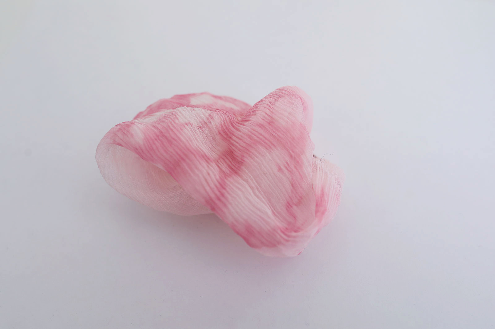*Silk dyed with Serratia Marcenscens bacteria, Loes Bogers, 2020*

##GENERAL INFORMATION

An (anti-bacterial) pink bacterial dye grown on LB broth and pure silk. This dye produces bright pink organic patterns on silk that can be guided slightly by creating folding patterns. It is more colorfast than most natural dyes, and can dye synthetic fibres as well (nylon, acrylic. As a bonus: serratia marcescens has antibacterial properties.

***SAFETY NOTE:*** 

This is a biolab level 1 activity, if and when the right bacteria strains are sourced (see also the ingredient entry for [Serratia Marcenscens](). That means it poses no serious threat to humans. If you have a serious health condition or immune disease, DO NOT follow this recipe. Don't ingest it and protect wounds and open skin when working with bacteria. 

- No food and drink in the workspace
- Wear a lab coat and gloves
- Tie up your hair
- Don't touch your mouth, eyes or face while in the lab
- Dispose of materials safely
- Wash your hands afterwards and disinfect with alcohol-based hand sanitizer

Once you start working with the bacteria themselves: 

- Close doors and windows to stop airflow. 
- Don't talk, don't move. All airflow moves bacteria around and into your plates, contaminating the serratia marcenscens.
- Clean up your dishes and through away the water used. 

It is very important to work in a sterile way during these processes. When we speak about contaminating the scene, not only might your experiment fail, you also risk growing all sorts of bacteria that you don't want to grow. Be serious about being sterile. 

**Physical form**

Pastes, gels & liquids

Color without additives: red/orange or pink in acidic environment.

**Fabrication time**

Preparation time: 4 hours

Processing time: 3 days

Need attention: not during incubation

Final form achieved after: 3 days

**Estimated cost (consumables)**

17,50 Euros, for a yield of approx. 6 silk scarfs and bacteria that can last infinitely if kept alive. The cost of purchasing the bacteria is about 60 euros but is not included in the cost estimated here because it will approach nihil if used infinitely. 85% of the price mentioned here is for the pure silk chiffon. 

##RECIPE

###Ingredients

- **Crunchy Peanut butter** to boost bacterial growth
- **LB broth - 10g**, (on 500 ml + 3/4 tsp of peanutbutter) this is a slightly acidic liquid medium, results in brighter pinks.  Standard ratio of 20g/L. This is the growth medium to dye the silk. 
- **Water - 500 ml** (sterilized water if tap water quality is not the best)
- **Denatured alcohol 96% - 150 ml or so**
- **Serratia Marcenscens bacteria** inoculated on Nutrient Agar jelly, ready to use. Make sure it is a type for **level 1 biolabs**
- **Pure silk chiffon - 6 pieces** approx. 30cm x 30cm
- **Thread and needle** to stitch the silk bundle together
- **Disposable gloves**
- **Parafilm** to seal the petridishes airtight
- **Sticky labels and a pen**
- **An incubator** or improvised cabinet that can keep a steady temperature of 26-30 degrees Celcius

###Tools

- **A precision scale**
- **Petri dishes, small - 12 x** to inoculate the bacteria, can be plastic (but disposable) or glass (sterilize beforehand!)
- **A heat-proof glass bottle - 500 ml** with screw cap, should fit inside the pressure cooker
- **A pressure cooker pan**
- **Autoclave tape**, has diagonal lines that turn dark once your jars are sterilized
- **Glass petri dishes large - 2 pieces** 200 mm diameter, they should fit inside the pressure cooker. Alternatively: a disposable autoclave bag 
- **Gas burner** a bunsen burner or stable campingaz
- **A lighter**
- **Permanent marker (thin)**
- **An inoculation loop**
- **Kitchen paper**

###Yield

Approx. 6 silk swatches of 30 x 30 cm and bacteria to last many infinitely if the strain is kept alive. 

###Method

#### 1. **Upon arrival of the bacteria**

- Follow the instructions as provided by the vendor. Make sure you purchase a **level 1 type of Serratia Marcenscens**, triple check this to avoid biohazards. 
- Inoculate the bacteria as instructed to use immediately, or store in the freezer on a [66% glycerine stock solution](https://www.addgene.org/protocols/create-glycerol-stock/) to protect and store it. This link also provides the info to revive it. 

#### 2. **Preparation (growth medium & silk)**

- First we prepare the growth media the bacteria needs, it's like its food. Here we use LB broth because it is liquid. We can suspend our silk in this liquid which is easier than working with jelly. 

- **Prepare the silk**
	- Rinse and dry the silk 
	- Cut the silk and scrunch it up into a pattern or scrunch it up.
	- Secure it with some thread
	- Put the silk in an autoclave bag or inside a large glass petri dish. 
	- Stick autoclave tape on top. 

- **Prepare the growth medium**
	- Weigh the ingredients for the LB broth with the precision scale. 
	- Put it all in a 500 ml heat-proof glass bottle, add 3/4 teaspoon of peanut butter and shake the liquid to mix. Unscrew the cap again so it sits loosely on top.
	- Label the growth medium 
	- Put some autoclave tape on top. The diagonal lines turn brown if it's been sterilized properly

- **Sterilizing the silk and the growth medium**

	If you have enough space you can sterilize everything at once. You can even already put the silk and the LB broth together inside a large glass petri dish if you plan to finish all the broth at once .

	- Put water in the pressure cooker, place the bottle and the petri dish/bag with silk inside. As guideline: put less water in the pressure cooker than you have in the bottle.
	- Make sure the lid of the glass bottle isn't closed tight, just loosely sitting on top. Otherwise the bottle can explode.
	- Close and lock the lid of the pressure cooker, make sure it is properly secured
	- Turn on the heat. Once the indicator shows that the pan is under pressure (in most cases: a pin that pops out, check the manual), set a timer for 20 minutes. This is the time it takes to sterilize the material.
	- When the time is up, leave the pan to cool. DO NOT OPEN IT WHILE HOT! When you are ready to open, release the steam, screw the glass jar closed and take it out.  
	- Do not open any of the bags or glass jars. Keep them sterile.
	- If you don't use up all the broth, make sure it's labeled and store in the fridge. Re-sterilize for the next use. 

#### 3. **Plating**

Plating is the scientist word for distributing the food onto the plates (or petri dishes), it basically means preparing petri dishes with food in a sterile way, before you add the bacteria you want to grow (see inoculating).  

- Use new petri dishes and tape the bag closed if you don't finish a bag. You can use these only once. During the plating: don't talk, don't move! Airflow spreads bacteria and will contaminate your scene.  
- Make an empty table and douse the area around the gas burner with denatured alcohol 96%. Keep this area wet with ethanol throughout the process. This will create a *sterile bubble* when the flame is on. Keep all your movements and lids, tools, dishing inside this bubble at all times. Work quickly, don't open the petri dishes more than strictly necessary. 

	1. Collect your petri dish(es) so they're close to you
	1. Put the food bottles within reach, they're hot! Use a glove. 
	1. Get comfortable and light the gas burner
	1. Keep the rim of the bottle in the flame for a second to sterilize the area you will pour with.
	1. Lift the lid of the petri dish (open it as little as possible and work quickly), pour in some liquid to cover the bottom. 
	1. Close the petri dish and move on to the other ones. 
	s1. Keep the area doused with ethanol, but remember to *point the tip of the bottle away from the flame at all times!*

#### 4. **Inoculating the bacteria (dyeing)**

Add the bacteria. Again, working in a sterile manner. For this step we assume you've grown some Serratia Marcenscens on a jellified growth material like Nutrient Agar.  

Doors and windows closed, no talking or moving please:

1. Keep the *inoculation loop* in the flame until it turns red to sterilize it. 
1. *Cool* the inoculation loop by dipping it into a bit of jelly where no bacteria is growing. 
1. Scrape a bit of bacteria from the jelly (without breaking the jelly surface), move it to the dish with LB broth and your silk, and spread onto your fabric and into the liquid food around it. 
1. Try not to break the jelly but really scratch the surface only!
1. Close the dish. Again: everything inside the sterile bubble!
1. When you're done, label all the plates with: 
	* name of the bacteria (SM for Serratia Marcenscens)
	* name of the growth media (NA, for nutrient agar)
	* date
	* your name
1. Seal the plates with *parafilm* by stretching it all around until it overlaps by holding one end with one thumb and pulling the rest around, letting go of the paper bit by bit. 
1. Let the incubate for 3 days at 26-30 degrees Celcius.

#### 5. **Terminating the dyeing process (sterilization)**

Kill the bacteria by sterilizing it using the same process with the pressure cooker
- Add some new autoclave tape on top of the dish
- Put some water into the pressure cooker
- Put the petridish (or bag) inside the pressure cooker, and seal and secure it
- When the indicator indicates the pot is pressurized, let it steam for 20 minutes. 
- Let it cool completely before opening (release steam first)
- Unwrap and admire the silk bundles
- Throw away the liquids (they are not harmful now an can go in the sink or toilet). 
- Wash the dishes, clean up the workspace.

###Process pictures

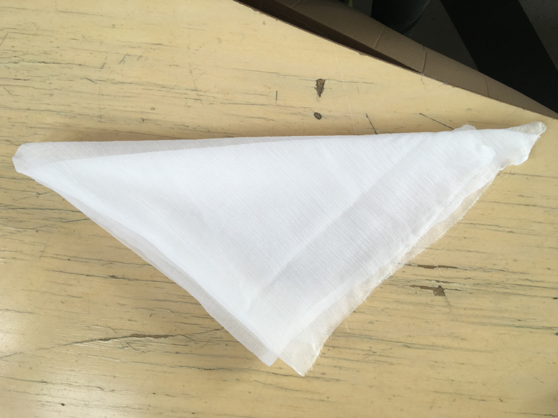*Finding a way to fold the silk, Loes Bogers, 2019*

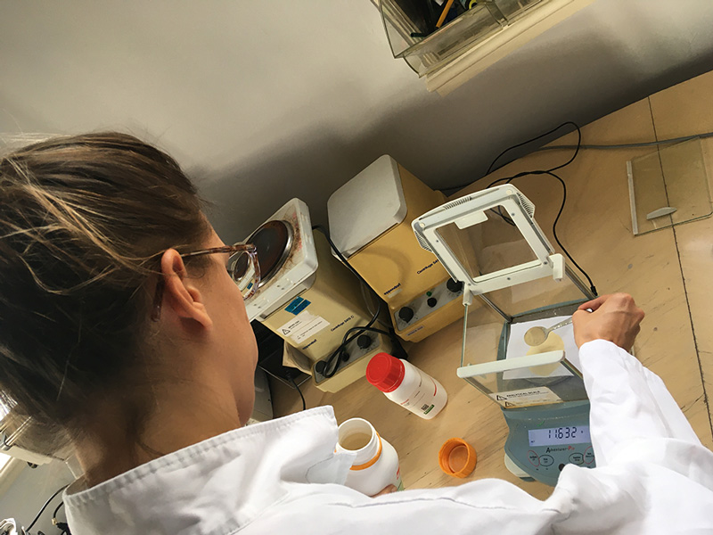*Measuring ingredients using the precision scale, Loes Bogers, 2019*

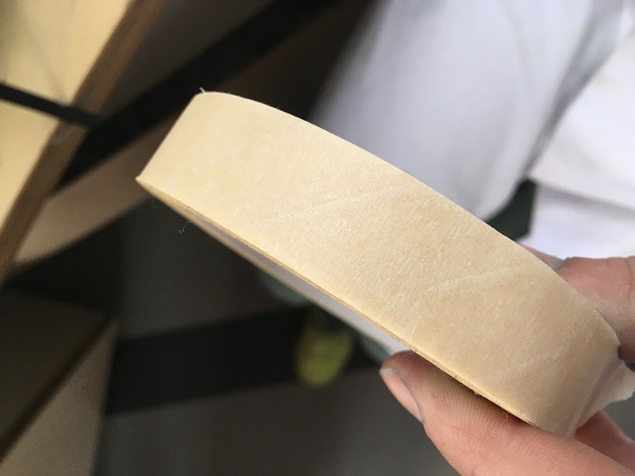*Unused autoclave tape to indicate if sterilization is complete, Loes Bogers, 2019*

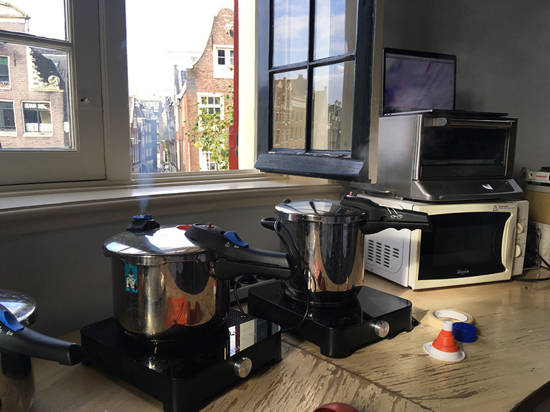*Pressure cookers steaming, Loes Bogers, 2019*

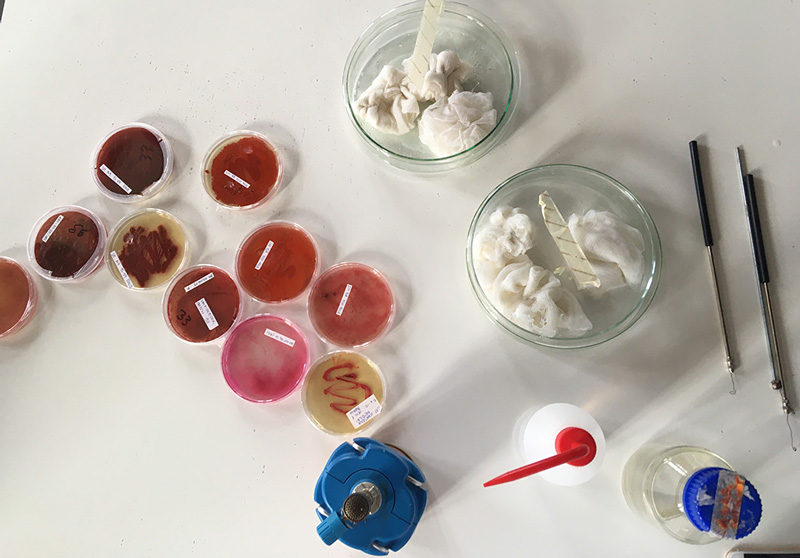*Sterilized silks ready to be inoculated (note the brown marks on the autoclave tape), Loes Bogers, 2019*

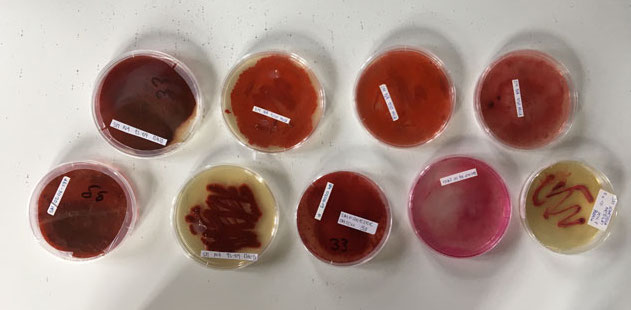*Serratia marcenscens at the Biolab Waag, Amsterdam, Loes Bogers, 2019*

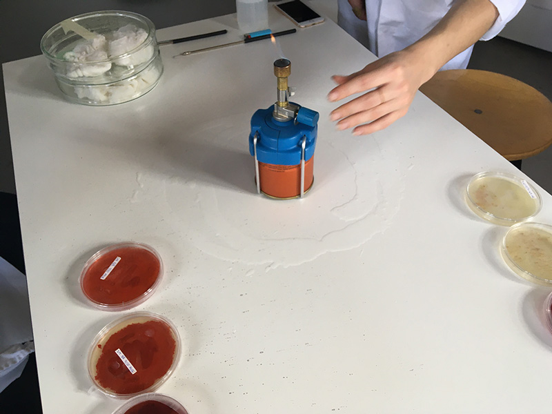*Creating a sterile bubble for inoculation, Loes Bogers, 2019*

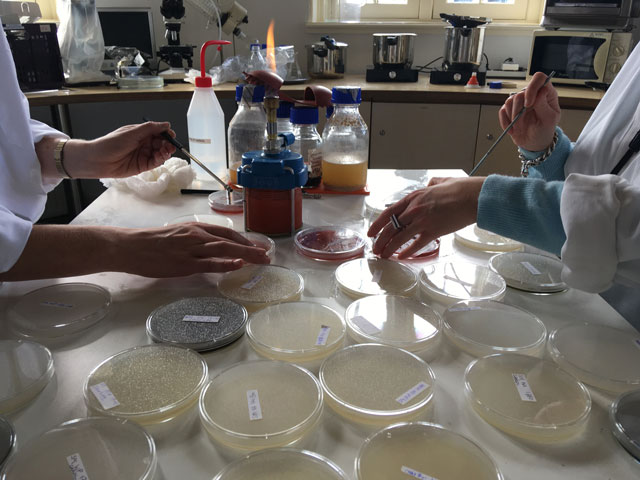*Inoculating: putting the bacteria onto their new food plates inside a sterile bubble, Loes Bogers, 2019*

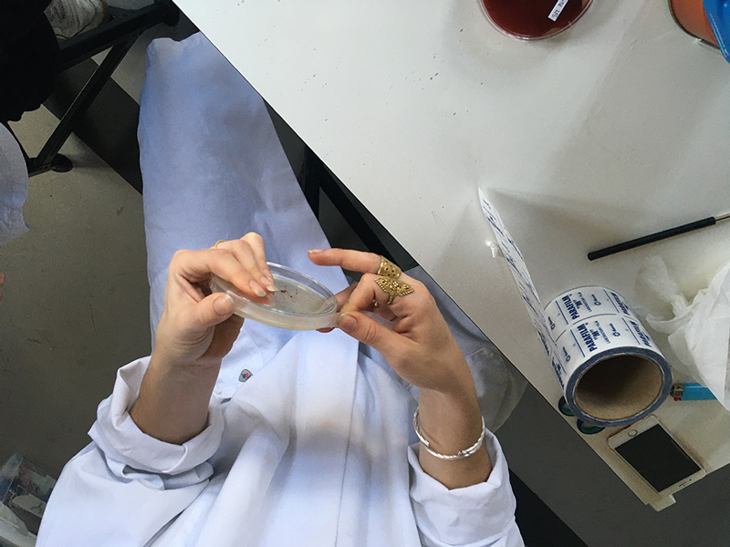*Sealing a petri dish with parafilm, Loes Bogers, 2019*

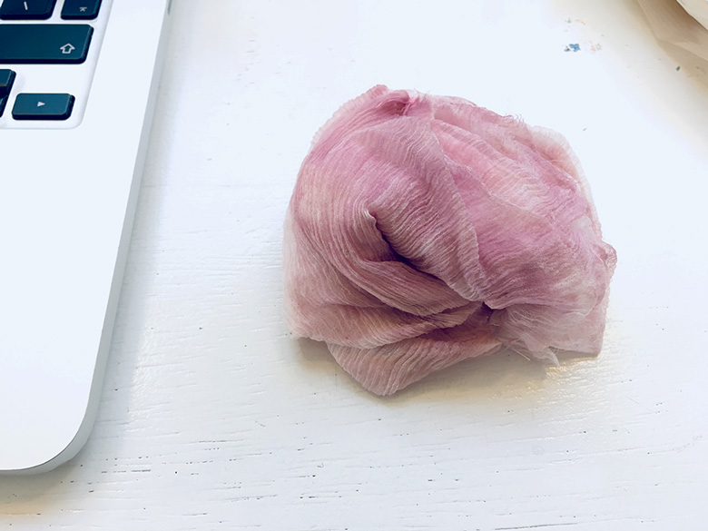 *Unpacking the silk bundles after 3 days of incubating, Loes Bogers, 2019*

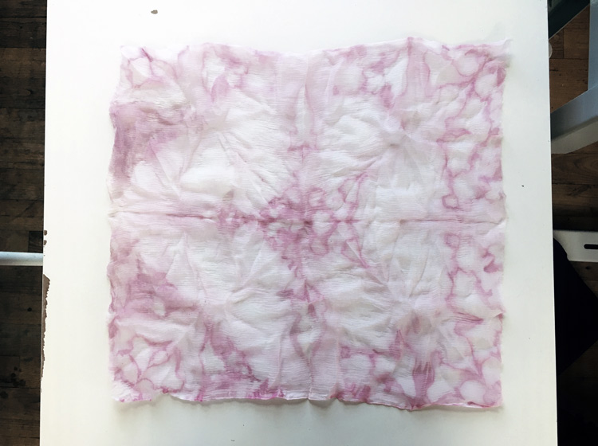 *Some symmetry due to the folding, Loes Bogers, 2019*

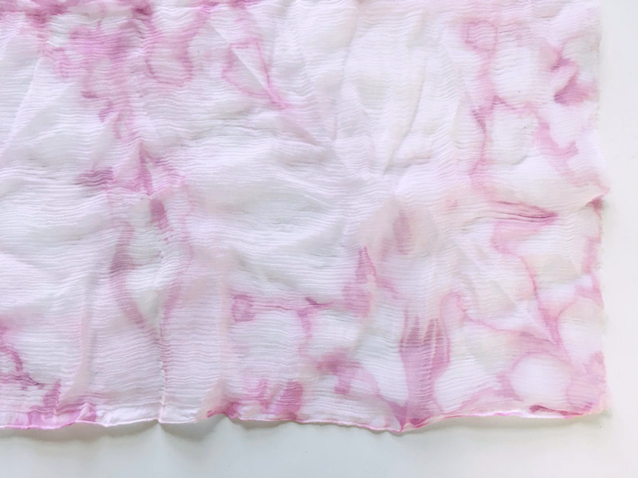 *Detail of the bacteria pattern, Loes Bogers, 2019*

###Variations on this recipe

- instead of letting the bacteria grow directly on the silk, grow it in a petri dish and extract its pigment using alcohol as a solvent. In addition you will need test tubes and glass lab tubes. See [Bea Sandini's Fabricademy documentation](https://class.textile-academy.org/2020/beatriz.sandini/assignments/week04/#8-harvesting-the-bacteria-color-aka-killing-your-babies)
- Laura Luchtman en Ilfa Siebenhaar developed technique using audiofrequencies to create an evenly dyed textile. See also: [link](https://livingcolour.eu/experiments/)
- A very simple but elegant way of cooking growth media is by using agar, dextrose and the corn starch that is released when boiling pototoes. This method was documented by the Centre for Genomic Gastronomy as part of their Rare Endophytes Collectors Club [link](http://www.endophyte.club/how-to/2-make-agar-plates). This is not tested but worth a try!
- If growing pigments has tickled your interest it is also worth looking into fungal dyes. 

##ORIGINS & REFERENCES

**Cultural origins of this recipe**

Before synthetic dyes were invented, people dyed fibres with dyes and inks from natural resources like plants, flowers, seeds, barks, insects, blood, clay and other (in)organic material. Dyes that can be achieved with synthetic dye are convenient and can provide very strong colors on protein (animal-based), cellulose (plant-based) as well as synthetic fibres (which natural dyes cannot). 

As more awareness has been raised to acknowledge the heavy pollution not to mention health hazards for workers caused by both the textile dyeing and leather tanning industries, microbiologists and designers alike look for renewable alternatives. Going back to natural dyeing is deemed unrealistic: it might compete too heavily with food production (if we stick to the same scale of textile dyeing), plants might not be available throughout the year and its stability and solubility is less than synthetic dyes. In addition: large scale plant use may lead to loss of valuable species. and processes are far from industry friendly. Could bacterial dyes be a step in a new direction? Microbiology opens a window.

**Needs further research?**   Not sure

###Key Sources

 **Bioshades**, by Cecilia Raspanti et.al., for Textile and Clothing Business Labs (TCBL.EU) and Textile Lab Waag, 2016-2019, [link](https://bioshades.bio)
 
###Copyright information 
 
The Bioshades recipe above was published under a [Creative Commons Attribution Share-Alike licence](https://creativecommons.org/licenses/by-sa/3.0/).

##ETHICS & SUSTAINABILITY

Serratia Marcescens has been associated with some forms of biological warfare. Setting up a small lab can still get expensive and unaccessible for some but does not need to be complex and will become cheaper with scale. 

**Sustainability tags**

- Renewable ingredients: yes
- Vegan: yes
- Made of by-products or waste:  no
- Biocompostable final product: yes, (rip silk to shreds for home composting for more points of contact).
- Re-use: the inoculated bacteria strain can be used and grown again and again endlessly if it is kept alive or stored in the freezer on a glycerine stock. The pigment may be continually harvested to store as an ink or dye. 

Needs further research?:  not sure

##PROPERTIES

- **Color fastness:** high
- **Light fastness:** high
- **Washability:** needs further research
- **Color modifiers:** alkaline/acidic
- **Odor**: none
- **Antibacterial**: yes
- **Suitable fibres**: animal-based, plant-based, synthetic

##ABOUT

**Maker(s) of this sample**

- Name: Loes Bogers
- Affiliation: Fabricademy student at Waag Textile Lab Amsterdam
- Location:  Amsterdam, the Netherlands
- Date: 20-10-2019 - 23-10-2019

**Environmental conditions**

- Humidity:  40-50%
- Outside temp:  5-11 degrees Celcius
- Room temp:  18 – 22 degrees Celcius
- PH tap water:  7-8

**Environmental conditions**

Has recipe been validated? Yes, by Cecilia Raspanti, TextileLab, Waag Amsterdam, 9 March 2020

**Images of the final sample**

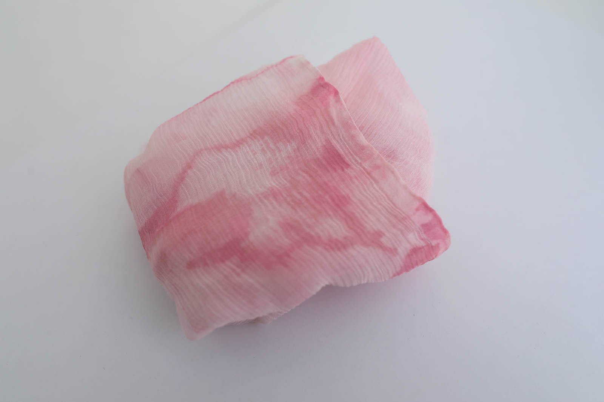*Silk dyed with serratia marcescens, Loes Bogers, 2020*

*Silk dyed with serratia marcescens, Loes Bogers, 2020*

##REFERENCES

- **Bacterial Dyes - Biochromes** by Cecilia Raspanti for Fabricademy 2019-2020, Class slides [link](https://drive.google.com/file/d/1Ar8j0cJntsFiBxdnrhqTA_9lgDDzB1Wg/view?usp=sharing)
- **Bioshades**, by Cecilia Raspanti et.al., for Textile and Clothing Business Labs (TCBL.EU) and Textile Lab Amsterdam Waag, 2016-2019, [link](https://bioshades.bio)
- **Biochromes assignment page** by Beatriz Sandini for Fabricademy 2019,2020: [link](https://class.textile-academy.org/2020/beatriz.sandini/assignments/week04/#8-harvesting-the-bacteria-color-aka-killing-your-babies)
- **In 1950, the US Released a Bioweapon in San Fransisco**, by Helen Thompson for Smithsonian Mag, 6 July 2015: [link](https://www.smithsonianmag.com/smart-news/1950-us-released-bioweapon-san-francisco-180955819/)
- **Cymatics Research - Living Colour**, by Laura Luchtman & Ilfa Siebenhaar, [link](https://livingcolour.eu/experiments/)
- **Fungal and Bacterial Pigments: Secondary Metabolites with Wide Applications** by Manik Prabhu Narsing Rao, Min Xiao and Wen-Jun Li, in Frontiers in Microbiology, Vol. 8, 22 June 2017: [link](https://www.ncbi.nlm.nih.gov/pmc/articles/PMC5479939/)
- **How to Make Agar Plates**, Rare Endophytes Collectors Club by Center for Genomic Gastronomy, 2017: [link](http://www.endophyte.club/how-to/2-make-agar-plates)
- **Colourful Side of Bacteriology: The Pigmented Bacteria**
by Vijay Kothari, Chinmayi Joshi and Pooja Patel in Advancement in Genetic Engineering 5:1, 1 February 2016: [link](https://www.omicsonline.org/open-access/colourful-side-of-bacteriology-the-pigmented-bacteria-2469-9837-1000i104.php?aid=70360)
- **Creating Bacterial Glycerol Stocks for Long-term Storage of Plasmids** by AddGene: [link](https://www.addgene.org/protocols/create-glycerol-stock/)

