# CLAY FROM BANANA PEELS

<iframe width="560" height="315" src="https://www.youtube.com/embed/96nT6wQYAoI" frameborder="0" allow="accelerometer; autoplay; encrypted-media; gyroscope; picture-in-picture" allowfullscreen></iframe>

##GENERAL INFORMATION

A fibrous, clay-like material made from banana peels. Although technically this might be considered a polymeer, the look and feel of this material is clay like and has a rough surface: like a clay with fibres added to it. It smells very strong during cooking, much less after drying. It smells and feels a little similar to rubber, maybe slightly earthier. 

**Physical form**

Surfaces 

Color without additives: dark brown

**Fabrication time**

Preparation time: 3 hours

Processing time: 1 week

Need attention: every day to alternate pressing and drying

Final form achieved after: 1 week

**Estimated cost (consumables)**

0,10 Euros, for a yield of one slab of approx. 10 x 10cm, 2 mm thick.

##RECIPE

###Ingredients

* **banana peels - 7 pcs** stems chopped off, you can dry them while collectinga batch. Once boiled they get sticky. The starch is the polymer, the fibres give strength to the material. 
* **white vinegar - 50 ml**
* **1 tbsp soda ash** (sodium carbonate Na2CO3), to rinse and break down the banana peel
* **white vinegar (part two) - 30 ml**
* **glycerine - 15 gr** plasticizer (to make it more flexible)

###Tools

1. **Oven**
1. **A blender**
1. **A knife**
1. **A pot**
1. **A strainer**
1. **A cheescloth or a clean towel**
1. **A stack of books for pressing**
1. **A flat surface**
1. Optional: baking paper and a rolling pin
1. Optional: moulds

###Yield

Approx. 75 grams (when wet)

###Method

1. **Preparing the banana peels**
	- Cut off the stems, they're hard to puree as finely as the peel
	- Cut the peels into smaller pieces (you can also use them as a whole, this will be harder to puree but give you a rougher finish with visible fibres)
	- Boil in water with 50 ml vinegar and soda ash for about 30 minutes or until totally soft. The smell will be very strong and the banana peels will be very sticky. 

1. **Puree and rest**	
	- strain the banana peels but keep some of the liquid. 
	- puree them in a blender with a bit of of the cooking liquid
	- put the puree in a bowl of cold water, add 30 ml of vinegar and leave to soak for 2 hours. 

1. **Straining**
	- strain the puree in a strainer, puree again if it's still very rough
	- then put in a cheesecloth or towel and press the majority of the water out.
	- mix in the glycerine
	- put it on a surface and flatten it (with a rolling pin, or with your hands). 

1. **Baking the clay**
	- put the clay in the oven for 30 mins at 130 degrees Celcius

1. **Air drying the slab (min. 3 days)**
	- Keep it pressed under heavy objects (like books) for a couple hours or overnight, right after the oven time 
	- Then leave to air dry for at least 3 days, alternate drying and pressing with a stack of books every few hours
	- Trim fraying edges with scissors before the slab is completely dry and hard. 

###Drying/curing/growth process

The pressing after oven time and air drying phase of at least three days is crucial here. The slab will still be very moist after the oven time. It will be fragile when you take it out but gets a lot stronger as it air dries. 

- Mold depth (surfaces and solids) or diameter (strings):  5 mm
- Shrinkage thickness       30-50 %
- Shrinkage width/length    20-30 %

**Shrinkage and deformation control**

The slab doesn't shrink so much but it deforms a lot if you don't keep it pressed well before oven time and during the air drying phase. 

**Curing agents and release agents**

None

**Minimum wait time before releasing from mold**

3 days

**Post-processing**

Keep an eye on it (even after a week). If it continues to curl up, keep it pressed for longer. 

**Further research needed on drying/curing/growth?**

Not sure, the function of the vinegar and soda ash is not entirely clear and could be further reserached. 

###Process picures

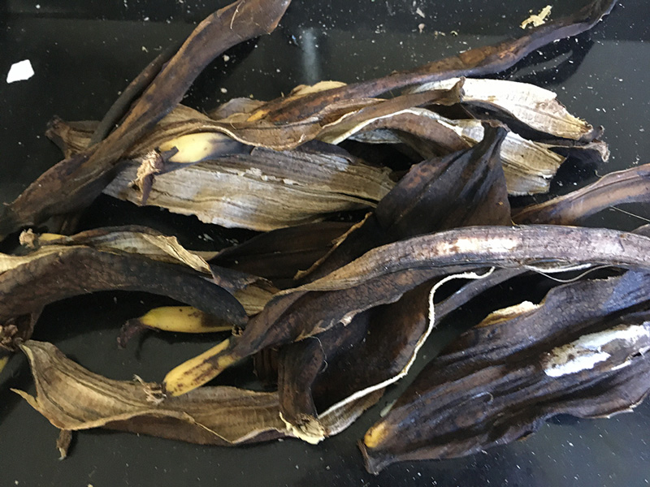*Collecting banana peels, Loes Bogers, 2020*
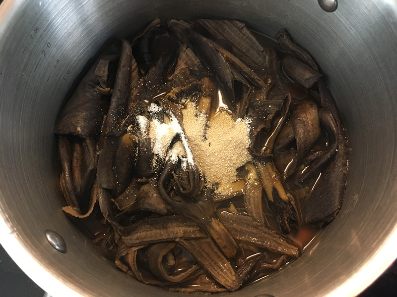*Boiling the peels with vinegar and soda ash (it's better to chop them first to help shorten the fibres), Loes Bogers, 2020*
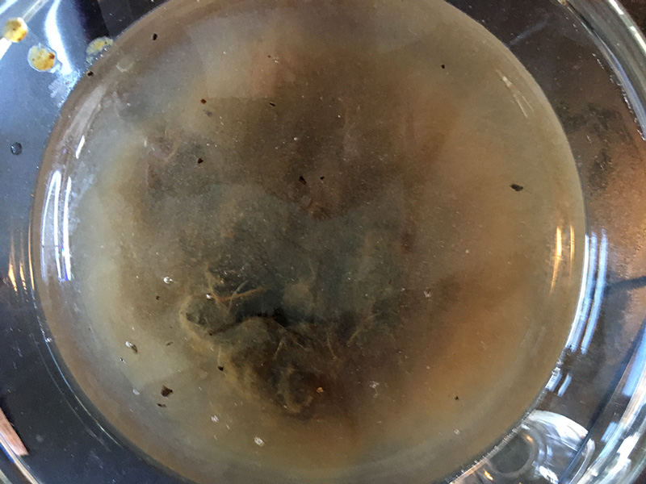*Soaking the blended peels in cold water with vinegar for 2 hours, Loes Bogers, 2020*
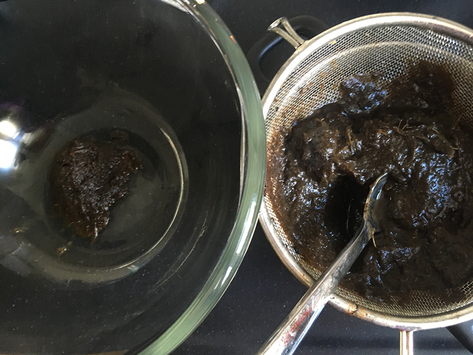*Straining, Loes Bogers, 2020*
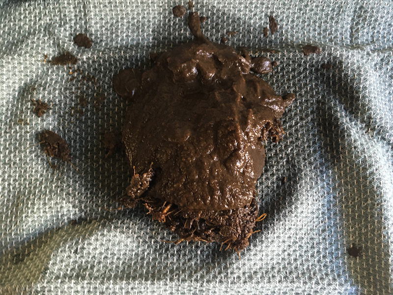*Squeezing the liquid out, Loes Bogers, 2020*
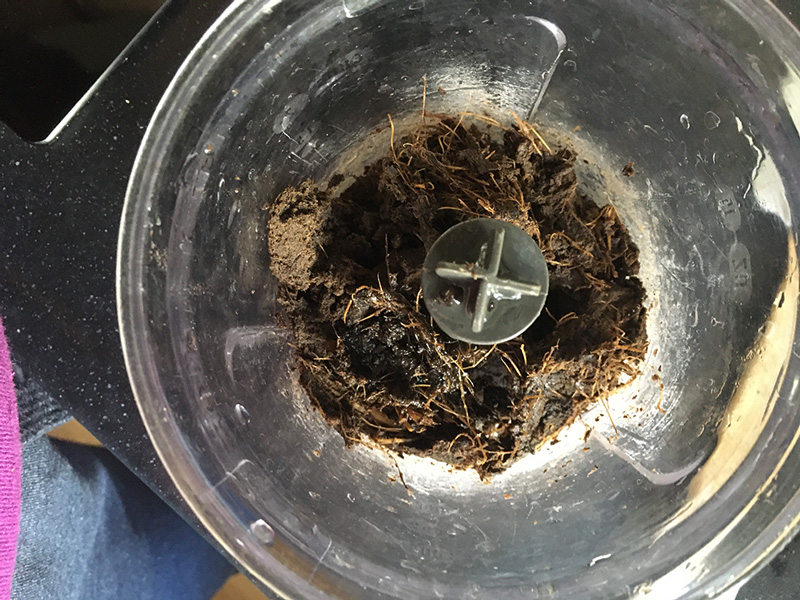*Blending again with some glycerine, Loes Bogers, 2020*
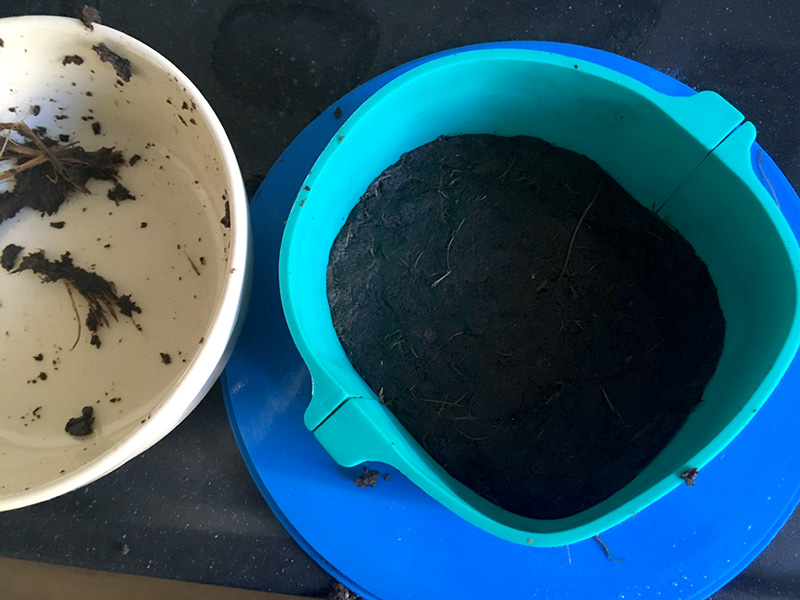*Pressing the clay into a mould for baking, Loes Bogers, 2020*
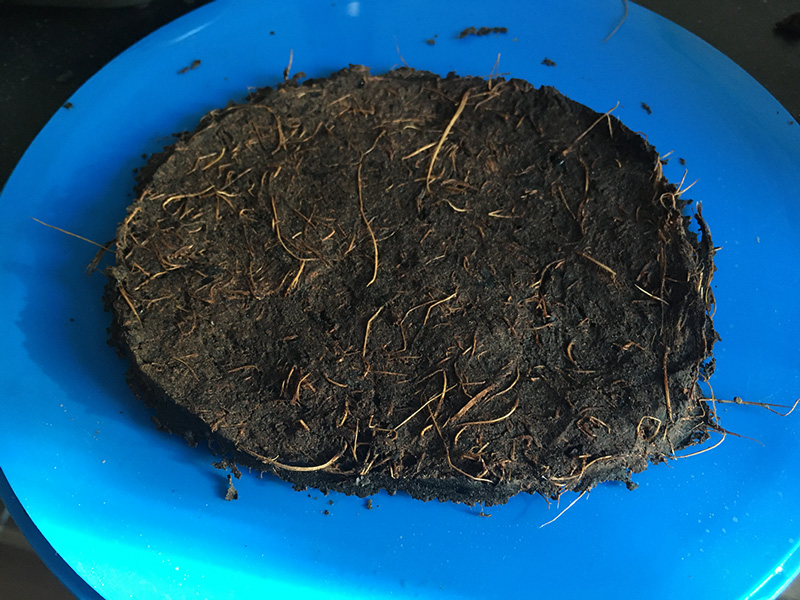*The top after pressing and baking, Loes Bogers, 2020*
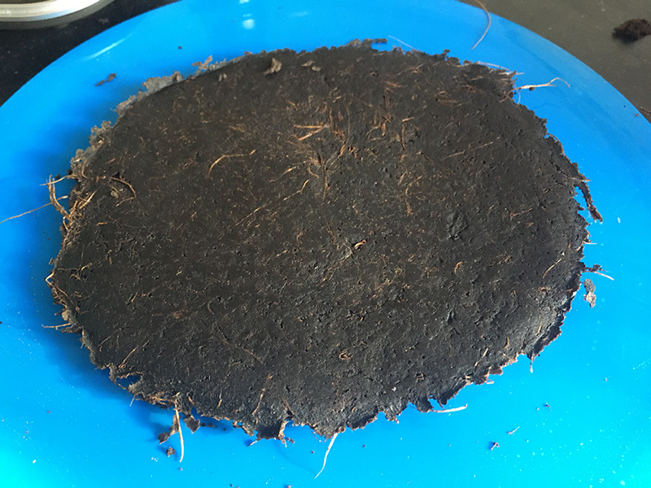*The bottom after pressing and baking, Loes Bogers, 2020*

**For reference**

This is what the clay looks like if you do chop the banana peels into pieces before boiling: much finer, no visible fibres. 

*Chopped peels boiling, Loes Bogers, 2020*

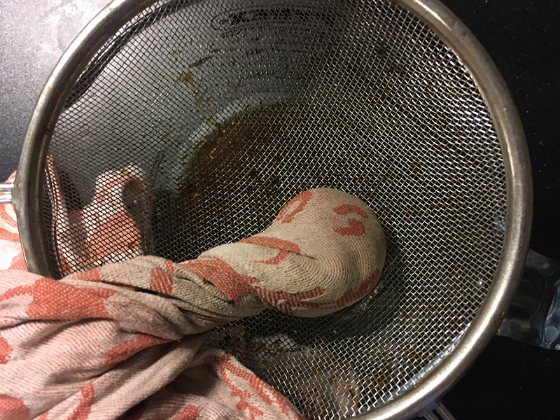*Squeezing the liquid out of the paste after soaking, Loes Bogers, 2020*

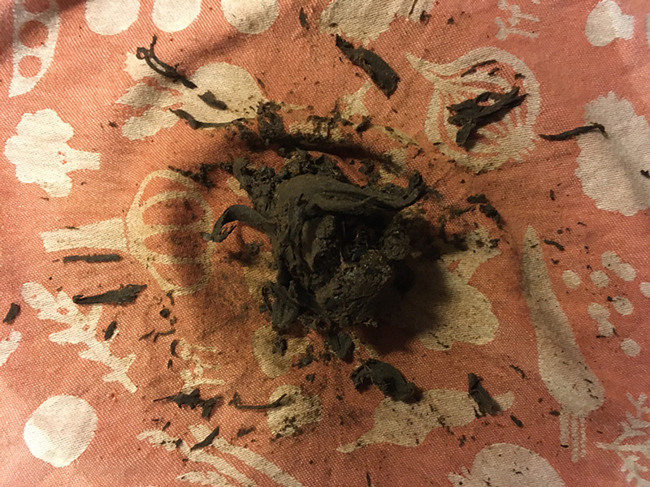*Clay where the banana peels have been chopped before boiling, Loes Bogers, 2020*

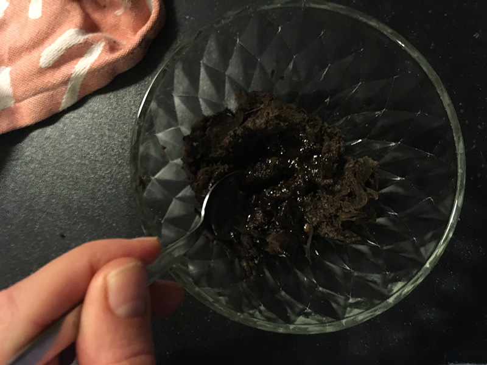*Clay where the banana peels have been chopped before boiling, Loes Bogers, 2020*

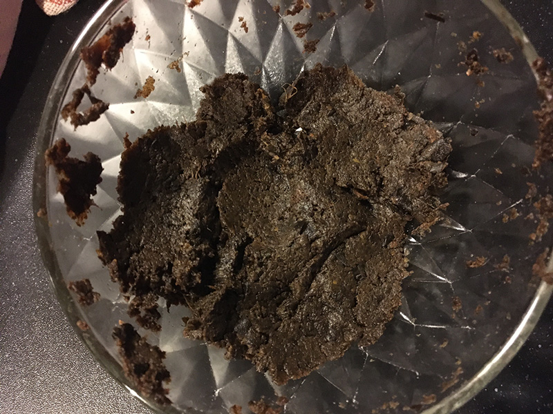*Clay where the banana peels have been chopped before boiling, Loes Bogers, 2020*

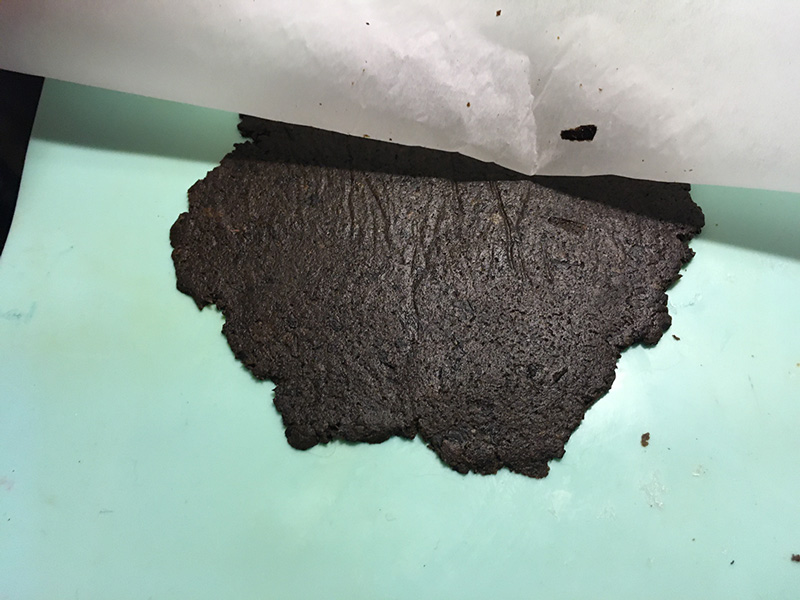*Clay where the banana peels have been chopped before boiling, Loes Bogers, 2020*

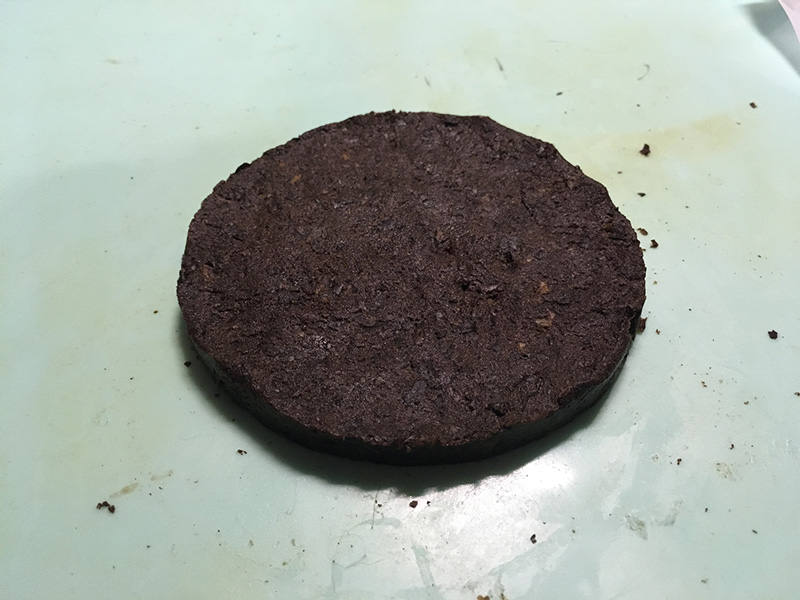*Clay where the banana peels have been chopped before boiling, Loes Bogers, 2020*

###Variations

- Use a 3D mould for to make 3D objects
- Make thicker slabs - or thinner
- Add less glycerine for more rigid slabs, more for flexibility
- Add in other biomass fillers (like egg shell powder, coffee grinds etc). 
- Add co-polymer like cornstarch, it has been suggested that adding 4% cornstarch to the total weight of banana peel starch increases the tensile strength of the material (see also Sultan and Johari's article listed below).
- Others have spread the paste thinly onto a ceramic tile (substitute with a pizza stone perhaps?) and then baked. This would require processing the fibres into a finer paste. 
- Research the use of **sorbitol** (an artificial sweetener made from potatoes or fruit) as a *plasticizer* to replace the glycerol. It is suggested to create different properties in the materials. 

##ORIGINS & REFERENCES

**Cultural origins of this recipe**

Unlike the fibres and starches in peels used here, the *fibres of banana plants* have a long history of being used to produce textiles. This banana textile crafts and industry is said to have developed first in the Phillipines, a country with a longstanding banana industry and banana textile crafts history. Especially the inner part of the banana bark is a desirable fibre that can be transformed into silk-like alternatives. The outer part of the bark results in rougher fibres and is commonly used to produce mats, ropes, or bags. India and other countries in Asia with large banana production facilities also produce banana fibres for textile. 

This recipe departs from that heritage however, in that it doesn't use the fibres taken from the plant itself, but reuses the waste of the edible fruits of the plants: the peels. The main ingredient here is a waste product from the food industry. As such it is tied to other bioplastics made from biomass and food waste that have become increasingly popular in materials engineering and e.g. industrial design in recent years, and less related to the production of banana silk. Through a process of polymerization, the starch and the fibres in the peels are softened, pureed, formed and dried. It is technically a plastic, but has aesthetic properties that resemble clay. Recipes for polymerization with banana peels have gained attention in the last few years, mostly in academia, with recipes popping up in fields of engineering, design and crafts and even construction (banana peel powder can strengthen concrete for example). Some prominent references are listed below. 

**On open-source bioplastics:** open-source documenting of how to make bioplastics with simple tools and locally available materials can be attributed to Miriam Ribul and her publication on *Material Activism* from 2014. Promoting collaborative production of alternatives for petroleum-based plastic, she demonstrated 20(!) known processes for material production using only 4 simple recipes. Juliette Pépin's visual research book on bioplastics (also from 2014), goes in depth into the sensory and visual aspects of simple recipes with many variations. Although bioplastics production is certainly a craft that is dispersed across many locations and times, leaving traces of many similar recipes behind, this type of cataloguing and sharing work is certainly indebted to these two pioneers.

**Needs further research?** Yes

The use of banana peels as a resource is less well documented than that of the fibres of banana plants. Its origins could be further researched. The process, using soda ash and vinegar and its functions could be researched further. 

###Key Sources

- **Banana Bioplastic** by Mattia Massetti (Sperim Design) on Youtube, 20 November 2018: [link](https://www.youtube.com/watch?v=ielBPntT5W8)

and to a lesser extent the articles mentioned under "references".

###Copyright information 

It is unclear what kind of copyrights apply, further research is required.

##ETHICS & SUSTAINABILITY

In order for bananas (and their peels) to arrive to say, Europe they will have inevitably travels many many miles. The fact that they can be shipped while still unripe, and continue to ripen - for consumption - allows them to be transported by sea rather than air, which is seen as an advantage. As fruit waste is huge in affluent countries, there's likely to also be a lot of banana waste (further research needed), and peels may be acquired from businesses that process bananas at a large scale. One might still wonder whether the consumption exotic fruits should be reduced. 

That said, agricultural production is not always done sustainably, and synthetic pesticides and/or harsh labour conditions can be issues anywhere in the world, whether a product is made from biomass, and/or food waste or not. The entire chain deserves our attention. 

**Sustainability tags**

- Renewable ingredients: yes
- Vegan: yes
- Made of by-products or waste:  yes
- Biocompostable final product:  yes
- Re-use: needs further research but likely can be shredded and processed again and again. 

Needs further research?:  Yes, on reusability

Should not be recycled as part of PET-plastics waste: this causes contamination of the waste stream. Compost bioplastics in a warm environment with sufficient airflow.

##PROPERTIES

- **Strength**: strong
- **Hardness**: resilient
- **Transparency**: opaque
- **Glossiness**: matt
- **Weight**: light
- **Structure**: closed
- **Texture**: rough
- **Temperature**: medium
- **Shape memory**: high
- **Odor**: strong (a bit rubbery, less strong after drying)
- **Stickiness**: low
- **Weather resistance:** needs further research
- **Acoustic properties:** absorbing
- **Anti-bacterial:** needs further research
- **Non-allergenic:** needs further research
- **Electrical properties:** needs further research
- **Heat resistance:** high
- **Water resistance:** high 
- **Chemical resistance:** needs further research
- **Scratch resistance:** high
- **Surface friction:** medium
- **Color modifiers:** none 

##ABOUT

**Maker(s) of this sample**

- Name: Loes Bogers
- Affiliation: Fabricademy student at Waag Textile Lab Amsterdam
- Location:  Amsterdam, the Netherlands
- Date: 29-03-2020 - 05-04-2020

**Environmental conditions**

- Humidity:  40-50%
- Outside temp:  11-15 degrees Celcius
- Room temp:  18-22 degrees Celcius
- PH tap water:  7-8

**Recipe validation**

Has recipe been validated? Not yet. 

**Images of the final sample**

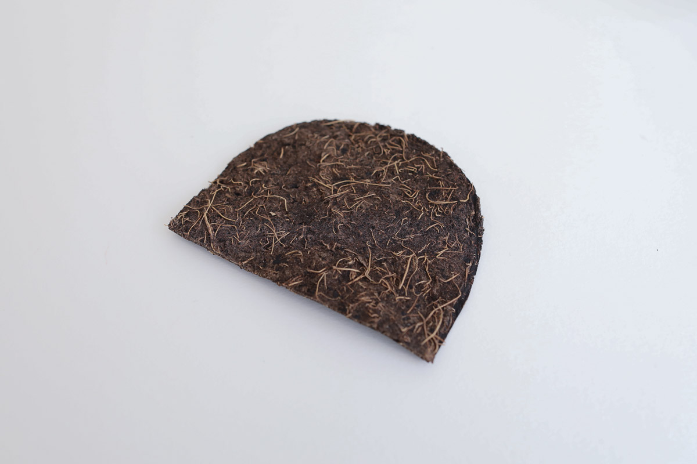*Banana peel clay (not cut before cooking), Loes Bogers, 2020*

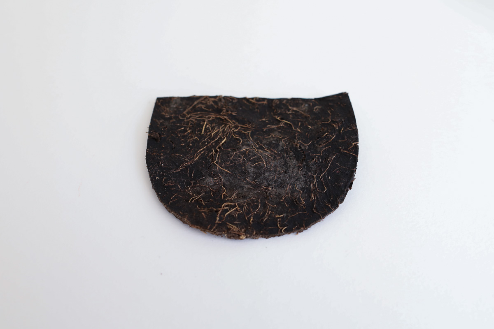*Banana peel clay (not cut before cooking), Loes Bogers, 2020*

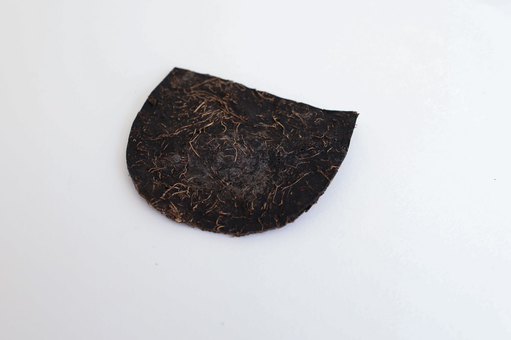*Banana peel clay (not cut before cooking), Loes Bogers, 2020*

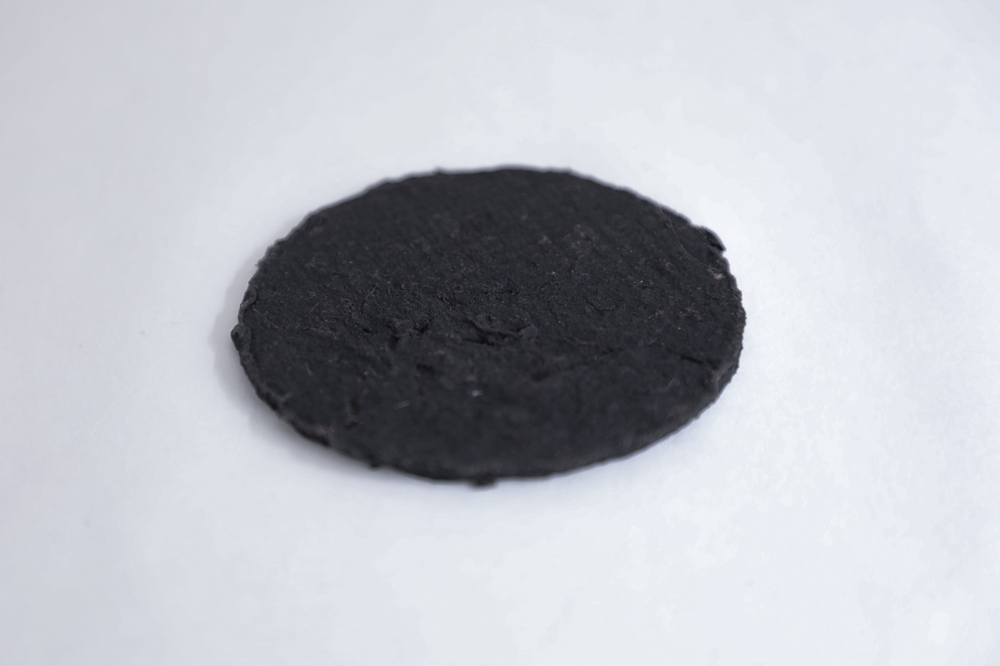*Banana peel clay (cut before cooking), much finer texture, visible no fibres, Loes Bogers, 2020*

##REFERENCES

- **Bio-plastic (Generating Plastic From Banana Peels)** by Manasi Ghamande et.al. International Conference on New Frontiers of Engineering, Management, Social Sciences and Humanities in Pune, India, 25 February 2018: [link](https://www.google.com/url?sa=t&rct=j&q=&esrc=s&source=web&cd=3&cad=rja&uact=8&ved=2ahUKEwjDy9Pv89PoAhXBwKQKHTxcDR0QFjACegQIEBAH&url=http%3A%2F%2Fdata.conferenceworld.in%2F25FebEMSSH%2F9.pdf&usg=AOvVaw2L2gr8pv0lwNsD1ghDL7_4)
- **The Development of Banana Peel/Corn starch Bioplastic film: a Preliminary Study** by Noor Fatimah Kader Sultan and Wan Lutfi Wan Johari in Bioremediation Science & Technology Research, Vol. 5, Nr 1, 2017: [link](https://www.google.com/url?sa=t&rct=j&q=&esrc=s&source=web&cd=4&cad=rja&uact=8&ved=2ahUKEwjJ7PHx89PoAhVQC-wKHcV7CIUQFjADegQIARAV&url=https%3A%2F%2Fpdfs.semanticscholar.org%2Fd946%2Fffca5aa145cbcf1b9606198a3fe02342a9d1.pdf&usg=AOvVaw2fRKlJy9B8P7SB5J6VvF94) 
- **Production of Bioplastic from Banana Peels** by M.R. Gaonkar, Prashant Palaskar and Rishikesh Navandar in: Proceedings of the IIER International Conference, Hong Kong, 27-28 December 2017: [link](http://www.worldresearchlibrary.org/up_proc/pdf/1279-15182346031-3.pdf)
- **Banana Bioplastic** by Mattia Massetti (Sperim Design) on Youtube, 20 November 2018: [link](https://www.youtube.com/watch?v=ielBPntT5W8)
- **Banana Fibre Extraction, Processing, Yarn Spinning & Weaving**, by Textile TV on Youtube, 9 August 2018: [link](https://www.youtube.com/watch?v=b-SrWSfH3lw) 
- **What is Banana Fabric? Properties, How It's Made and Where** by Boris Hodakel for Sewport, 6 April 2020: [link](https://sewport.com/fabrics-directory/banana-fabric)
- **Are Bananas the new Building Material?** by Construction Manager Magazine, 12 October 2017: [link](http://www.constructionmanagermagazine.com/insight/arup-predicts-bananas-and-potatoes-will-be-used-bu/)
- **Analysis of Properties of Concrete Using Dried Banana Peel Powder as Admixture** by Vishal Gadgihalli, Sindhu Shankar, S.C. Sharma, P. Dinakar in International Journal of Research Granthaalayah, 5(11), November 2017: pp. 351-354: [link](https://www.researchgate.net/publication/323308261_ANALYSIS_OF_PROPERTIES_OF_CONCRETE_USING_DRIED_BANANA_PEEL_POWDER_AS_ADMIXTURE)
- **Recipes for Material Activism** by Miriam Ribul, 2014, via issuu [link](https://issuu.com/miriamribul/docs/miriam_ribul_recipes_for_material_a)
- **Research Book Bioplastics** by Juliette Pepin, 2014, via issuu [link](https://issuu.com/juliettepepin/docs/bookletbioplastic)

