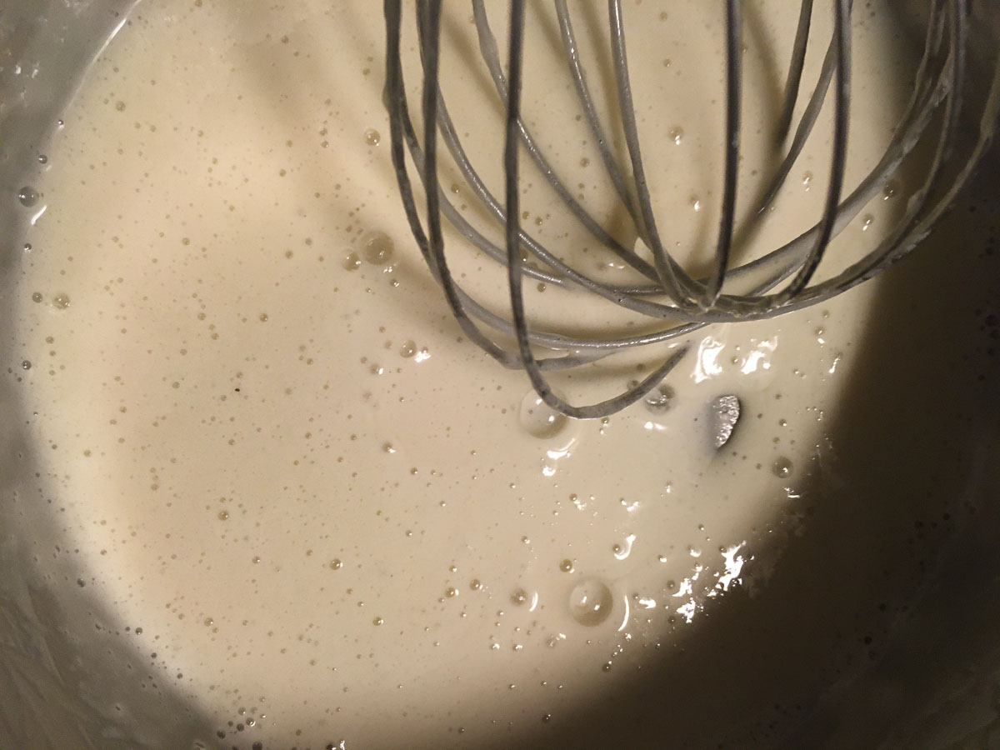
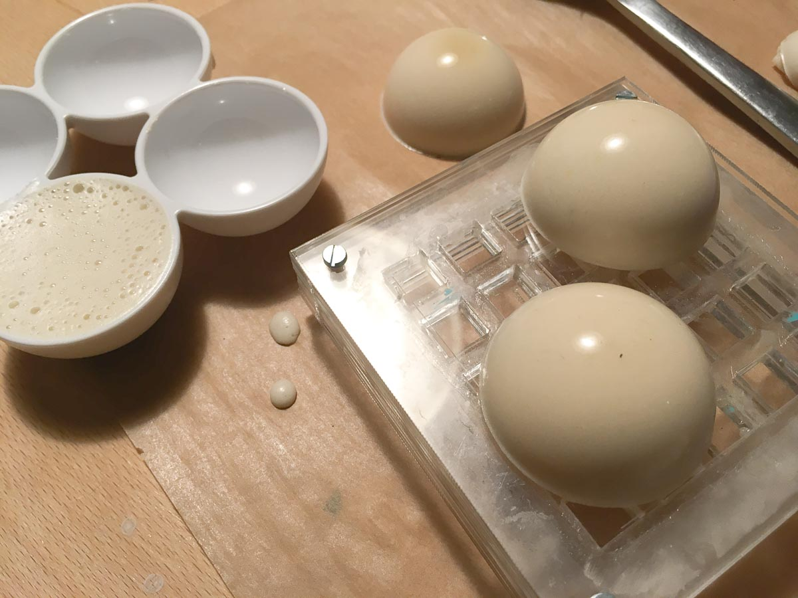
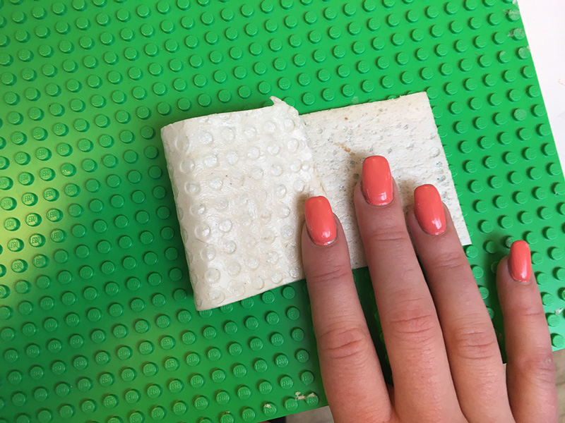
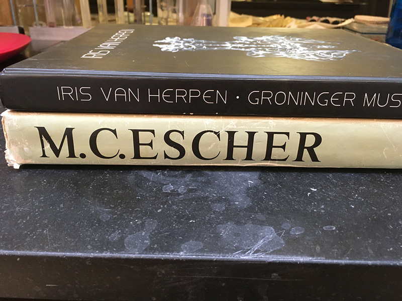
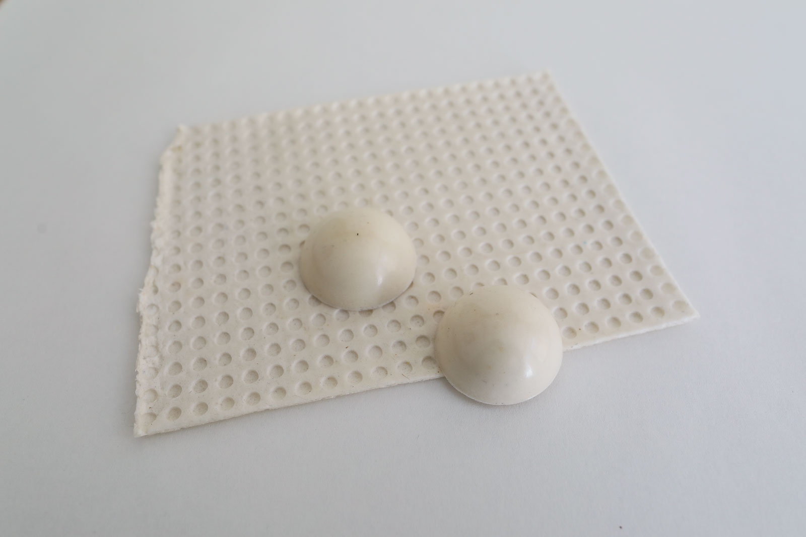
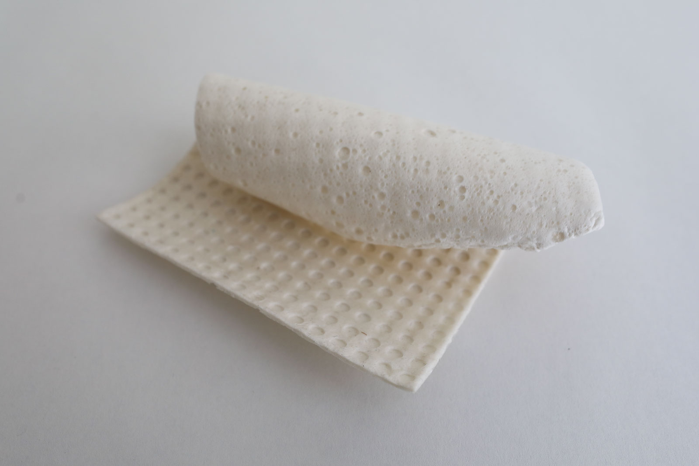
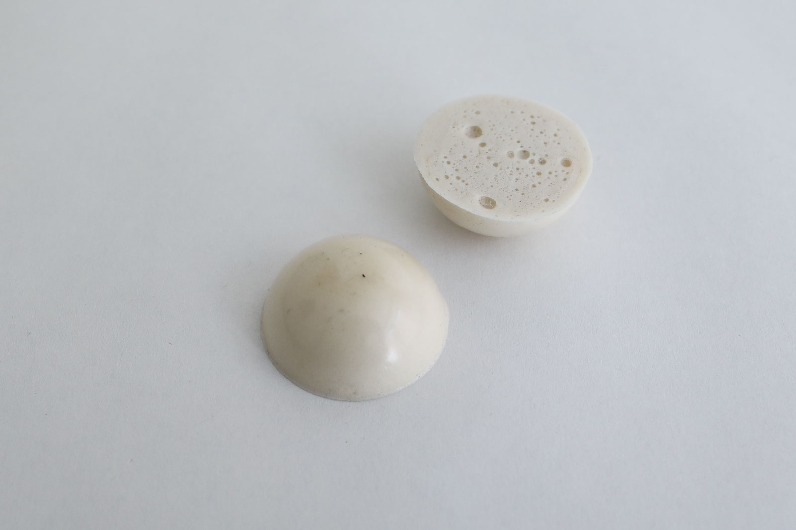
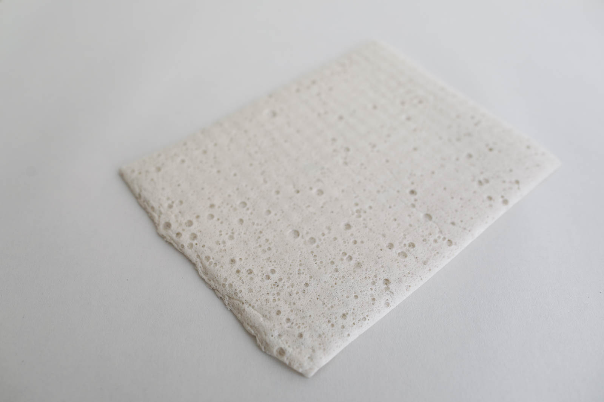

# BIOFOAM

<iframe width="560" height="315" src="https://www.youtube.com/embed/zF549LrD2Nc" frameborder="0" allow="accelerometer; autoplay; encrypted-media; gyroscope; picture-in-picture" allowfullscreen></iframe>

##GENERAL INFORMATION

A thin, textured sheet, and half domes of foamy, flexible bioplastic. Gelatine-based. The biofoam feels like the foam-like packaging materials sometimes used for shipping fragile goods or thick foamy kitchen cloth. It feels colder to the touch and is slightly stickier. The upside shows visible bubbles, but the mold-facing side feels very smooth if the mold had a smooth surface. It somewhat keeps the smell of the dishwashing liquid and smells less like wet dog than other gelatin-based bioplastics.

The foam half domes are more rigid when completely dried, but still allow for some squeezing and feel foamy.

**Physical form**

Surfaces, Solids

**Fabrication time**

Preparation time: 1 Hour

Processing time: 5 days

Need attention: after 3 days to demold, and keep pressed. After another 2 days to take them out of the press and air dry/store. 

Final form achieved after: 1 week

**Estimated cost (consumables)**

0,50 Euros for a yield of approx 150 ml

##RECIPE

###Ingredients

* **Gelatine powder - 12 gr**
	* Functions as the polymeer (makes it hard)
* **Glycerine - 12 gr**
	* Functions as plasticizer that bonds with the gelatine (makes it flexible)
* **Water - 150 ml/gr**
	* To dissolve and mix the polymeer and plasticizer
* **Dishwashing soap (organic) - 1 tsp**
	* Is the expanding agent that makes the mixture foamy

###Tools

1. **Cooker or stove** (optional: temperature controlled)
1. **Pot**
1. **Scale**
1. **Spoons** 
1. **Whisk**
1. **Lego sheet** (or other textured surface)
1. **Egg holders** (or other mold), these came with my fridge

###Yield

Approx. 150 ml

###Method

1. **Preparation**

	- Weigh your ingredients
	- Prepare the molds you wish to use

1. **Mixing and dissolving the ingredients**
	- bring the water to the boil
	- optional: add natural dye if you wish to use color
	- add the glycerine
	- add the gelatine
	- keep the temperature below 80 degrees celcius while stirring gently, until the gelatine is dissolved

1. **Cooking the ingredients, creating foam**

	- 	Simmer and slowly stir the mixture between 60-80 degrees celcius for 20 minutes or until it's thick like a syrup or honey, then add in the soap
	-  	Whisk vigorously to create foam bubbles and simmer for another 2-5 minutes until the mixture thickens
	-   Stir slowly to let the bigger bubbles pop until you have a foam with small bubbles

1. **Casting the foam**

	- 	Cast onto the lego sheet (or other textured sheet) and spread out if necessary. Cast in the center of the sheet and allow the material to spread itself, keeping the pot still for even results. Or cast into the cups.
	-  The material will shrink a lot so make the layer thicker than you want the end result to be.
	-  Let it dry for 48-72 hours at least before releasing

### Drying/curing/growth process

Peel it off the mold after 48-72 hours. The foam should not feel cold to the touch, then it's still drying. Pinch off the more fragile sides first to create some grip. Then pull it off carefully, pulling upwards.

- Mold depth:  3 mm
- Shrinkage thickness:       30-50 %
- Shrinkage width/length:    5-10 %

**Shrinkage and deformation control**

This recipe results in a somewhat flexible material so it's ok to cast onto a rigid mold, the flexibility will allow you to release it. 

The lego texture keeps the foam in place and will help reduce shrinkage on width and length.

Waiting too long to release from the mold can result in tearing. The foam gets a bit more brittle and thin as it dries. Releasing it too early might leave finger prints and presses in the foam as its still too soft.

**Curing agents and release agents**

None. 

**Minimum wait time before releasing from mold**

2 days

**Post-processing**

The sides will curl upwards upon further drying. I cut off the thinner edges (they curl more) to create an even sheet. 

You can keep the sheet pressed at intervals of a day or so between kitchen paper and a stack of books to keep it flat if it curls up. Try to air it out too to prevent mold growth.

Store flat in a dry and ventilated room.
			
**Further research needed on drying/curing/growth?**

Yes. Casting solids or smooth surface might require a different process to prevent deformation.

###Process pictures

*Mixing the ingredients at 80 degrees, Loes Bogers, 2020*

*The gelatin is dissolved and thick, ready for the soap to go in, Loes Bogers, 2020*

*Whisking the liquid vigourously to create small bubbles, Loes Bogers, 2020*

*Releasing the foam from the half-dome molds, Loes Bogers, 2020*

*The lego mold with the sheet after trimming and drying: hardly any shrinkage (width/length), Loes Bogers, 2020*

*Pressing the sheet underneath some books to keep it flat, Loes Bogers, 2020*

###Variations

- Add a **natural colorant** such as a vegetable dye or water-based ink (e.g. hibiscus, beetroot, madder)
- Add **less glycerine** for a rigid foam, add more for a flexible foam (up to 1 part glycerine, 1 part gelatine and a dash of water)
- **Stiffeners** such as fibres or natural debris may be added for more structure and reinforcement.
- **Fillers** such as almond or sunflower oil, chalk or egg shells can be added to prevent additional shrinkage.
- Soaking the foam model in water for 2 hours and then letting it dry again makes it firmer. First it expands, then it shrinks again and gets quite rigid. 

##ORIGINS & REFERENCES

**Cultural origins of this recipe**

Bioplastic production is older than petrol-based plastics. In 1500 BC, people in Egypt were already using glues based on gelatin, casein and albumin for furniture constructions. Gelatin casting as a technique has also been used in production of jelly-based foods such as aspic, jelly desserts and candy.

Plastics are man-made polymers that can be produced with petrol-based compounds but also bio-mass. The process to create them is called *polymerization*, or the chemical reaction to form polymer chains or networks. In 1862 Alexander Parkes presented Parkesine (now celluloid, an organic thermoformable material made from cellulose). In 1907, Bakelite was introduced by chemist Leo Hendrik Baekland. Bakelite is an electrical insulator and was used in electrical appliances, once formed, it could not be melted. Baekland coined the term "plastics" to describe a new category of materials. PVC (short for polyvinyl chloride was patented in 1914 (around the same time cellophane was discovered). The use of petroleum was easier and cheaper to obtain and process than raw materials like wood, glass and metal and gained in popularity after World War II. More plastics were invented and became mainstream in the 1960s thanks to its ease and low cost of production. High tech plastics continued to be developed for health care and technology since the 1970s. 

In short: not all plastics are petrol-based. Henry Ford experimented with plastics made from soya beans as early as 1941. Common plastics like celluloid and PLA - are also biobased but are not necessarliy better in terms of reducing pollution: The time and conditions they require to decompose and be reabsorbed in nature are crucial in determining how sustainable plastics are. 

**On open-source bioplastics:** open-source documenting of how to make bioplastics with simple tools and locally available materials can be attributed to Miriam Ribul and her publication on *Material Activism* from 2014. Promoting collaborative production of alternatives for petroleum-based plastic, she demonstrated 20(!) known processes for material production using only 4 simple recipes. Juliette Pépin's visual research book on bioplastics (also from 2014), goes in depth into the sensory and visual aspects of simple recipes with many variations. Although bioplastics production is certainly a craft that is dispersed across many locations and times, leaving traces of many similar recipes behind, this type of cataloguing and sharing work is certainly indebted to these two pioneers.

**Needs further research?**   Not sure

###Key Sources

- **Biofoam Recipe** by Cecilia Raspanti (TextileLab, Waag), Fabricademy Class "Biofabricating Materials", 2017-2019, [link](https://class.textile-academy.org/classes/week05A/).
- **Biofoam Recipe** by Maria Viftrup (TextileLab, Waag), biofoam sample from the material archive, 2017.
- **The Secrets of Bioplastic** by Clara Davis (Fabtextiles, IAAC, Fab Lab Barcelona), February 2017, [link](https://issuu.com/nat_arc/docs/the_secrets_of_bioplastic_).

###Copyright information 

Raspanti & Viftrup's recipes are published under an Creative Commons Attribution Non-Commercial licence.

Copyright or licence on Davis' work is unclear, further research required. 

##ETHICS & SUSTAINABILITY

Needs further research

Gelatin is an animal-based ingredient. Some might find it problematic to use resources that requires killing an animal because of religious or animal welfare beliefs. Arguments are also made that as long as there's a meat industry, it is better to use product from the entire animal, including skin and bones as to not waste anything. Some might consider gelatin to be a product that comes from a waste stream, but this is considered controversial by others. 

Using renewable ingredients is not by definition petrol-free. Imagine they have to travel long distances by plane, boat or truck: it takes fuel. Also, the effects of GMO technologies and pesticides can be harmful to the environment and it's worth using knowing the source and production standards involved. If you can afford it, buying organic ingredients is a good starting point.

**Sustainability tags**

- Renewable ingredients: yes
- Vegan: no
- Made of by-products or waste:  no
- Biocompostable final product:  yes, but only professionally (home composting of animal-based materials is not allowed in the EU)
- Re-use: melt with heat and a splash of water, and recast

Gelatine-based bioplastics can be recasted by melting them in a pot with some water. Should not be recycled as part of PET-plastics waste: this causes contamination of the waste stream. 

Needs further research?:  not sure

##PROPERTIES

- **Strength**: variable (can be quite strong, depending on thickness and curing time)
- **Hardness**: medium/variable (depends on thickness, curing time and amount of glycerine)
- **Transparency**: opaque
- **Glossiness**: satin
- **Weight**: light
- **Structure**: closed
- **Texture**: smooth
- **Temperature**: cool
- **Shape memory**: medium
- **Odor**: moderate in final product, high during production
- **Stickiness**: medium
- **Weather resistance:** poor
- **Acoustic properties:** needs further research
- **Anti-bacterial:** needs further research
- **Non-allergenic:** needs further research
- **Electrical properties:** no
- **Heat resistance:** low
- **Water resistance:** low
- **Chemical resistance:** needs further research
- **Scratch resistance:** poor
- **Surface friction:** sliding
- **Color modifiers:** none 

##ABOUT

**Maker(s) of this sample**

- Name: Loes Bogers
- Affiliation: Fabricademy student at Waag Textile Lab Amsterdam
- Location:  Amsterdam, the Netherlands
- Date: 19-02-2020 – 26-02-2020

**Environmental conditions**

- Humidity:  40-50%
- Outside temp:  5-11 degrees Celcius
- Room temp:  18 – 22 degrees Celcius
- PH tap water:  7-8

**Recipe validation**

Has recipe been validated? Yes, by Cecilia Raspanti, TextileLab, Waag Amsterdam, 9 March 2020

**Images of the final sample**

*Biofoam (gelatin-based), Loes Bogers, 2020*

*Biofoam (gelatin-based), Loes Bogers, 2020*

*Biofoam (gelatin-based), Loes Bogers, 2020*

*Biofoam (gelatin-based), Loes Bogers, 2020*

##REFERENCES

- **Biofoam Recipe** by Cecilia Raspanti (TextileLab, Waag), Fabricademy Class "Biofabricating Materials", 2017-2019, [link](https://class.textile-academy.org/classes/week05A/).
- **Biofoam Recipe** by Maria Viftrup (TextileLab, Waag), biofoam sample from the material archive, 2017.
- **The Secrets of Bioplastic** by Clara Davis (Fabtextiles, IAAC, Fab Lab Barcelona), 2017, [link](https://issuu.com/nat_arc/docs/the_secrets_of_bioplastic_).
- **Lifecycle of a Plastic Product** by American Chemistry Council, n.d. [link](https://plastics.americanchemistry.com/Lifecycle-of-a-Plastic-Product/)
- **Polymerization**, on Wikipedia, n.d.: [link](https://en.wikipedia.org/wiki/Polymerization)
- **Seaweeds can be a new source of bioplastics** by Rajendran, N, Sharanya Puppala, Sneha Raj M., Ruth Angeeleena B., and Rajam, C. in Journal of Pharmacy Research, 12 March 2012: [link](https://www.researchgate.net/publication/258495452_Seaweeds_can_be_a_new_source_for_bioplastics)
- **The Bioplastics Cookbook: A Catalogue of Bioplastics Recipes** by Margaret Dunne for Fabtextiles, 2018, [link](https://issuu.com/nat_arc/docs/bioplastic_cook_book_3)
- **Recipes for Material Activism** by Miriam Ribul, 2014, via issuu [link](https://issuu.com/miriamribul/docs/miriam_ribul_recipes_for_material_a)
- **Research Book Bioplastics** by Juliette Pepin, 2014, via issuu [link](https://issuu.com/juliettepepin/docs/bookletbioplastic)

