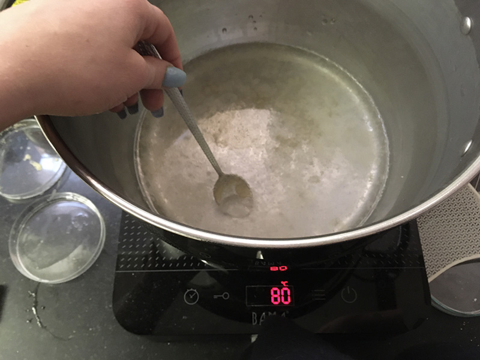
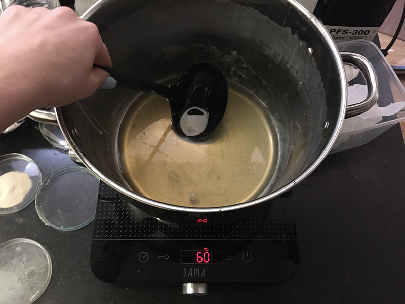
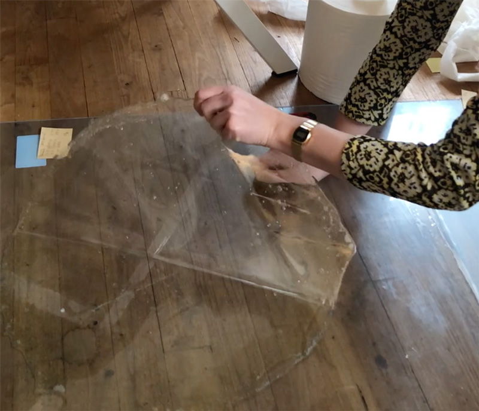
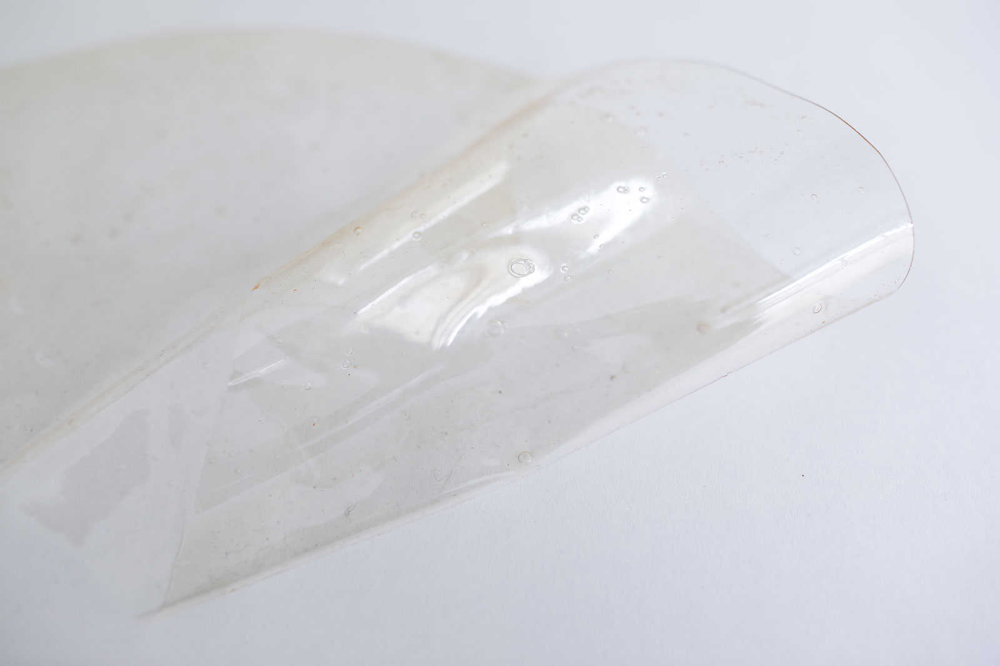
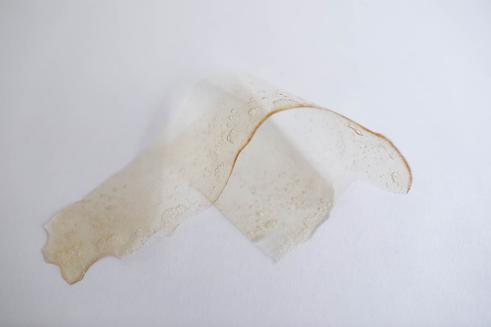
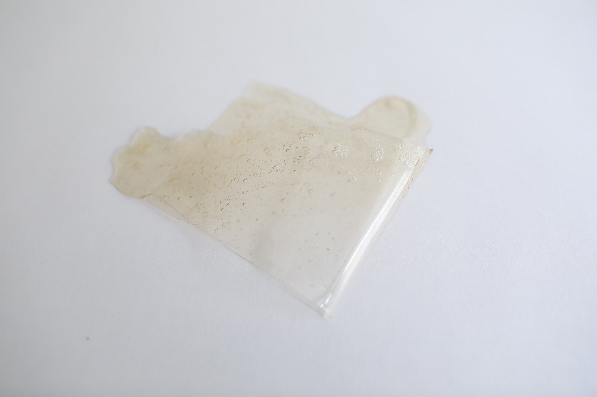

# BIOFOIL EXTRA FLEXIBLE

<iframe width="560" height="315" src="https://www.youtube.com/embed/5ayE8BSSaj8" frameborder="0" allow="accelerometer; autoplay; encrypted-media; gyroscope; picture-in-picture" allowfullscreen></iframe>

<iframe width="560" height="315" src="https://www.youtube.com/embed/olMNIg67vFQ" frameborder="0" allow="accelerometer; autoplay; encrypted-media; gyroscope; picture-in-picture" allowfullscreen></iframe>

##GENERAL INFORMATION

A transparent, glossy and very flexible sheet of gelatine-based bioplastic. Slightly sticky. This foil is thick and strong and completely transparent, a bit like the PVC table cloths some people may have on their kitchen table to protect the woord from staining (also used for PVC clothing of course). I would describe it more like a protective plastic than a packaging material for example. 

**Physical form**

Surface

Color without additives: transparent, slightly yellow where thicker 

**Fabrication time**

Preparation time: 1 Hour

Processing time: 5-7 days

Need attention: None, just leave it to dry as long as is feasible.

Final form achieved after: 1 week

**Estimated cost (consumables)**

0,78 Euros for a yield of approx 200 ml

##RECIPE

###Ingredients

* **Gelatine powder - 24 gr**
	* Functions as the polymeer (so it becomes a solid)
* **Glycerine - 18 gr**
	* Functions as plasticizer that bonds with the gelatine (makes it flexible). This recipe has a bit more glycerine to make the foil less rigid. It doesn't have the "crackling" sound as a result.
* **Water - 200 ml/gr**
	* To dissolve and mix the polymeer and plasticizer

###Tools

1. **Cooker or stove** (optional: temperature controlled)
1. **Pot**
1. **Scale**
1. **Acrylic sheet** (or silicon mat) for casting. The smooth surface results in a very shiny, transparent foil.
1. **Spoon** 

###Yield

Approx. 200 ml before drying/processng

###Method

1. **Preparation**

	- Weigh your ingredients
	- Prepare the acrylic sheet and find a place where you can leave it for a while

1. **Mixing and dissolving the ingredients**
	- bring the water to the boil
	- optional: add natural dye if you wish to use color
	- add the glycerine
	- add the gelatine
	- keep the temperature below 80 degrees celcius while stirring *very very slowly and gently* to avoid making bubbles. I prefer a simple spoon to do this, not a whisk.

1. **Cooking the ingredients**

	- 	Simmer and slowly stir the mixture between 60-80 degrees celcius for 20 minutes. I turn it lower when I get bubbles. You don't want the liquid to move, don't boil it.
	-  Longer cooking time allows more water to evaporate. You will get a thicker, more syruppy liquid that spreads slower: resulting in a thicker sheet. 
	-  Optional: if you have access to one: use a **vibrating table** or a **vacuum chamber** to allow bubbles to come to the surface and pop, so you don't have bubbles in your plastic. 

1. **Casting**

	- 	Let the liquid cool for a couple minutes until it gels a little but is still liquid, like syrup.
	-  Cast onto the acrylic sheet slowly to avoid bubbles
	-  Pour from the middle and hold still, let the liquid distribute itself
	-  Let it dry for 48-72 hours at least before releasing. If it feels cold to the touch it is still drying. Patience pays off with these sheets

###Drying/curing/growth process

Peel it off the mold after 48-72 hours (enjoy the sound it makes!)
- Mold depth:  N/A
- Shrinkage thickness:       30-50 %
- Shrinkage width/length:    5-10 %

**Shrinkage and deformation control**

Letting it dry up to a week to get to the final form. For storage: keep it flat and cover with baking paper. It gets a bit sticky and can cling onto itself when folded for longer periods of time.

**Curing agents and release agents**

None. 

**Minimum wait time before releasing from mold**

3 days (up to a week is best)

**Post-processing**

If you wish to trim or sew the sheet (cutting off frayed, thin edges), it's best to do that before it has completely dried. It's more brittle when dry so you will get a less clean cut.

Store flat, unfolded in a dry and ventilated room.

**Further research needed on drying/curing/growth?**

Yes. Casting onto textured surfaces is likely to require a different technique and/or molds that have walls to ensure even distribution.

###Process pictures

*Mixing the ingredients at 80 degrees, Loes Bogers, 2020*

*The gelatin is dissolved: stirring very very slowly, Loes Bogers, 2020*

*Releasing the sheet from the acrylic, Loes Bogers, 2020*

###Variations

- Add a **natural colorant** such as a vegetable dye or water-based ink (e.g. hibiscus, beetroot, madder)
- Add **less glycerine** for a more rigid foil
- **Stiffeners** such as fibres, yarn or natural debris may be added for more structure and reinforcement.
- **Fillers** such as almond or sunflower oil, can be added to prevent additional shrinkage but might affect stickyness.

##ORIGINS & REFERENCES

**Cultural origins of this recipe**

Bioplastic production is older than petrol-based plastics. In 1500 BC, people in Egypt were already using glues based on gelatin, casein and albumin for furniture constructions. Gelatin casting as a technique has also been used in production of jelly-based foods such as aspic, jelly desserts and candy.

Plastics are man-made polymers that can be produced with petrol-based compounds but also bio-mass. The process to create them is called *polymerization*, or the chemical reaction to form polymer chains or networks. In 1862 Alexander Parkes presented Parkesine (now celluloid, an organic thermoformable material made from cellulose). In 1907, Bakelite was introduced by chemist Leo Hendrik Baekland. Bakelite is an electrical insulator and was used in electrical appliances, once formed, it could not be melted. Baekland coined the term "plastics" to describe a new category of materials. PVC (short for polyvinyl chloride was patented in 1914 (around the same time cellophane was discovered). The use of petroleum was easier and cheaper to obtain and process than raw materials like wood, glass and metal and gained in popularity after World War II. More plastics were invented and became mainstream in the 1960s thanks to its ease and low cost of production. High tech plastics continued to be developed for health care and technology since the 1970s. 

In short: not all plastics are petrol-based. Henry Ford experimented with plastics made from soya beans as early as 1941. Common plastics like celluloid and PLA - are also biobased but are not necessarliy better in terms of reducing pollution: The time and conditions they require to decompose and be reabsorbed in nature are crucial in determining how sustainable plastics are. 

**On open-source bioplastics:** open-source documenting of how to make bioplastics with simple tools and locally available materials can be attributed to Miriam Ribul and her publication on *Material Activism* from 2014. Promoting collaborative production of alternatives for petroleum-based plastic, she demonstrated 20(!) known processes for material production using only 4 simple recipes. Juliette Pépin's visual research book on bioplastics (also from 2014), goes in depth into the sensory and visual aspects of simple recipes with many variations. Although bioplastics production is certainly a craft that is dispersed across many locations and times, leaving traces of many similar recipes behind, this type of cataloguing and sharing work is certainly indebted to these two pioneers.

**Needs further research?**   Not sure

###Key Sources

- **Biofoil (gelatin) Recipe** by Cecilia Raspanti (TextileLab, Waag), Fabricademy Class "Biofabricating Materials", 2017-2019, [link](https://class.textile-academy.org/classes/week05A/).
- **The Bioplastics Cookbook: A Catalogue of Bioplastics Recipes** by Margaret Dunne for Fabtextiles, 2018, [link](https://issuu.com/nat_arc/docs/bioplastic_cook_book_3) 
- **Biofoil (gelatine) Recipe** by Monique Grimord (TextileLab, Waag), biofoil (gelatine) and Indian ink sample from the material archive, 2016.

###Copyright information 

It is unclear if any copyright rests on the recipe by Dunne. Further research is required. The other two are licenced under a CC Attribution Non-Commercial Licence.

##ETHICS & SUSTAINABILITY

Needs further research

Gelatin is an animal-based ingredient. Some might find it problematic to use resources that requires killing an animal because of religious or animal welfare beliefs. Arguments are also made that as long as there's a meat industry, it is better to use product from the entire animal, including skin and bones. Some might consider gelatin to be a product that comes from a waste stream, but this is considered controversial by others.

Acrylic (for the mold) is a petrol based plastic but results in very shiny foils and sheets and can be reused endlessly for casting high quality bioplastic sheets.

Using renewable ingredients is not by definition petrol-free. Imagine they have to travel long distances by plane, boat or truck: it takes fuel. Also, the effects of GMO technologies and pesticides can be harmful to the environment and it's worth using knowing the source and production standards involved. If you can afford it, buying organic ingredients is a good starting point.

**Sustainability tags**

- Renewable ingredients: yes
- Vegan: no
- Made of by-products or waste:  no
- Biocompostable final product:  yes
- Reuse: yes, by melting and recasting

Needs further research?:  not sure

Gelatine-based bioplastics can be recasted by melting them in a pot with some water. Should not be recycled as part of PET-plastics waste: this causes contamination of the waste stream. Compost bioplastics in a warm environment with sufficient airflow.

##PROPERTIES

- **Strength**: strong
- **Hardness**: flexible
- **Transparency**: transparent
- **Glossiness**: glossy
- **Weight**: medium
- **Structure**: closed
- **Texture**: smooth
- **Temperature**: cool
- **Shape memory**: medium
- **Odor**: moderate in final product, high during production
- **Stickiness**: medium
- **Weather resistance:** poor/needs further research
- **Acoustic properties:** needs further research
- **Anti-bacterial:** needs further research
- **Non-allergenic:** needs further research
- **Electrical properties:** no
- **Heat resistance:** low
- **Water resistance:** low
- **Chemical resistance:** needs further research
- **Scratch resistance:** moderate
- **Surface friction:** braking
- **Color modifiers:** none 

##ABOUT

**Maker(s) of this sample**

- Name: Loes Bogers
- Affiliation: Fabricademy student at Waag Textile Lab Amsterdam
- Location:  Amsterdam, the Netherlands
- Date: 19-02-2020 – 26-02-2020

**Environmental conditions**

- Humidity:  40-50%
- Outside temp:  5-11 degrees Celcius
- Room temp:  18 – 22 degrees Celcius
- PH tap water:  7-8

**Recipe validation**

Has recipe been validated? Yes, by Cecilia Raspanti, TextileLab, Waag Amsterdam, 9 March 2020

**Images of the final sample**

*Extra flexible gelatin-based biofoil, Loes Bogers, 2020*

*Extra flexible gelatin-based biofoil, Loes Bogers, 2020*

*Extra flexible gelatin-based biofoil, Loes Bogers, 2020*

##REFERENCES

- **Biofoil (gelatin) Recipe** by Cecilia Raspanti (TextileLab, Waag), Fabricademy Class "Biofabricating Materials", 2017-2019, [link](https://class.textile-academy.org/classes/week05A/).
- **The Bioplastics Cookbook: A Catalogue of Bioplastics Recipes** by Margaret Dunne for Fabtextiles, 2018, [link](https://issuu.com/nat_arc/docs/bioplastic_cook_book_3) 
- **Biofoil (gelatine) Recipe** by Monique Grimord (TextileLab, Waag), biofoil (gelatine) and Indian ink sample from the material archive, 2016.
- **The Secrets of Bioplastic** by Clara Davis (Fabtex, IAAC, Fab Lab Barcelona), 2017, [link](https://issuu.com/nat_arc/docs/the_secrets_of_bioplastic_).
- **Lifecycle of a Plastic Product** by American Chemistry Council, n.d. [link](https://plastics.americanchemistry.com/Lifecycle-of-a-Plastic-Product/)
- **Polymerization**, on Wikipedia, n.d.: [link](https://en.wikipedia.org/wiki/Polymerization)
- **Seaweeds can be a new source of bioplastics** by Rajendran, N, Sharanya Puppala, Sneha Raj M., Ruth Angeeleena B., and Rajam, C. in Journal of Pharmacy Research, 12 March 2012: [link](https://www.researchgate.net/publication/258495452_Seaweeds_can_be_a_new_source_for_bioplastics)
- **Recipes for Material Activism** by Miriam Ribul, 2014, via issuu [link](https://issuu.com/miriamribul/docs/miriam_ribul_recipes_for_material_a)
- **Research Book Bioplastics** by Juliette Pepin, 2014, via issuu [link](https://issuu.com/juliettepepin/docs/bookletbioplastic)

