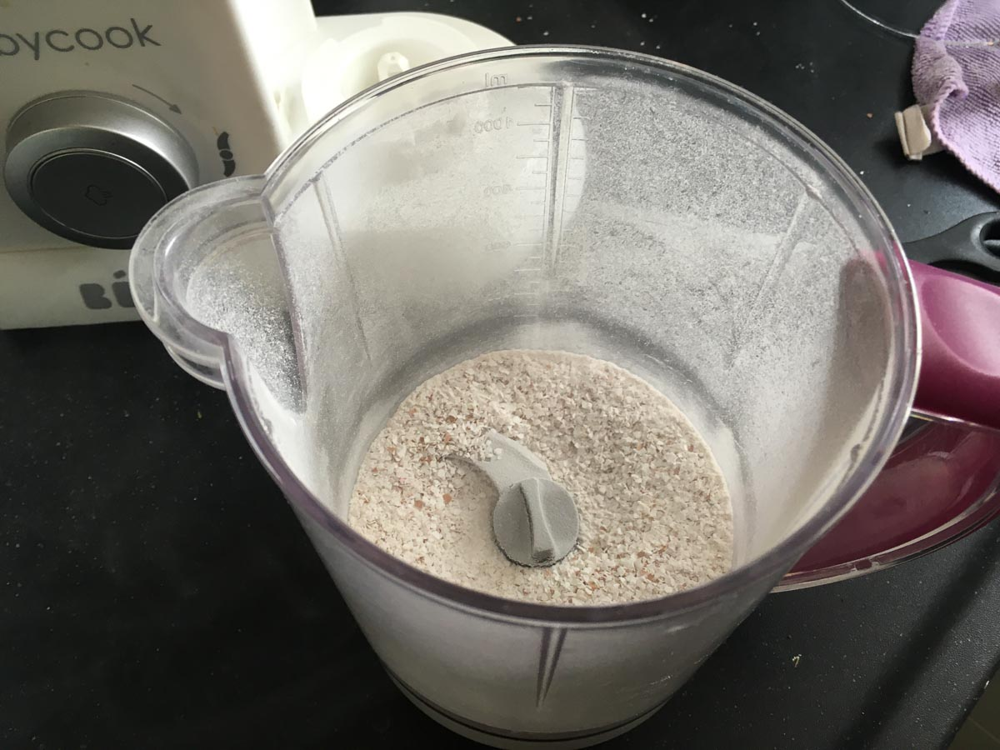
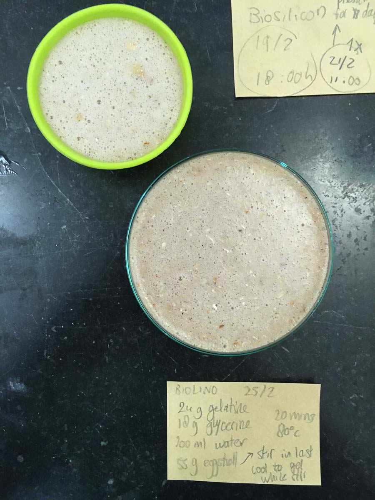
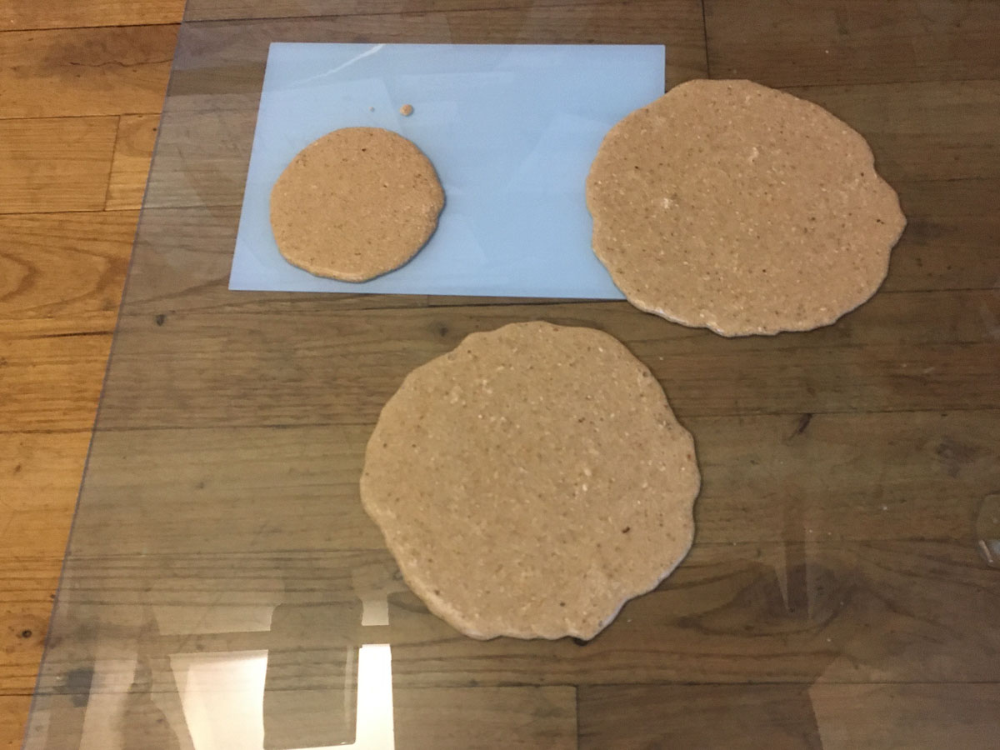
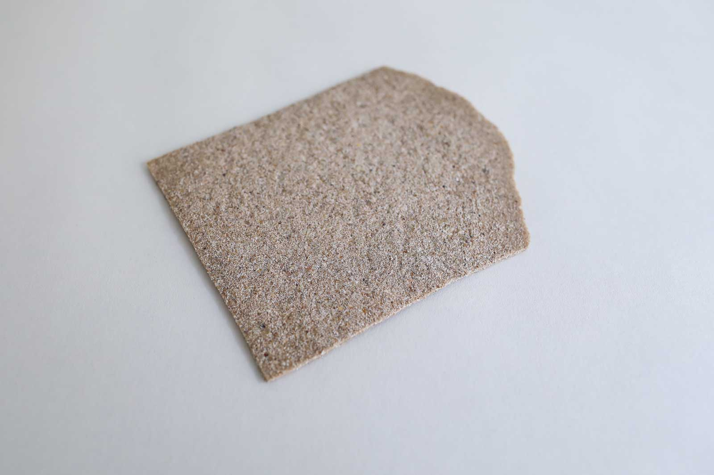
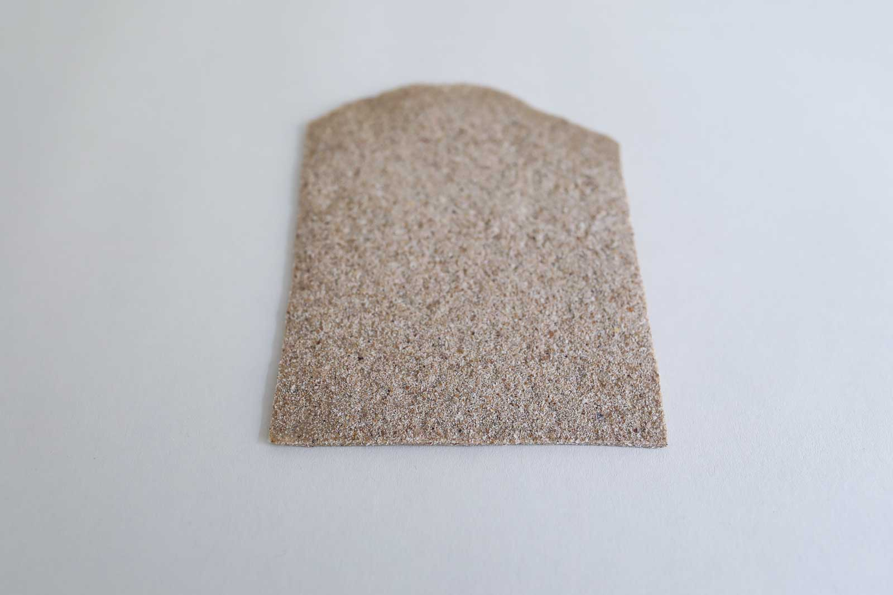

# BIOLINOLEUM

<iframe width="560" height="315" src="https://www.youtube.com/embed/cZIIQKz5wYI" frameborder="0" allow="accelerometer; autoplay; encrypted-media; gyroscope; picture-in-picture" allowfullscreen></iframe>

<iframe width="560" height="315" src="https://www.youtube.com/embed/WP-ZlP3fVT4" frameborder="0" allow="accelerometer; autoplay; encrypted-media; gyroscope; picture-in-picture" allowfullscreen></iframe>

##GENERAL INFORMATION

A tough but light, textured bioplastic. Remains some flexibility when cast as a sheet. Gelatine-based with dried and ground eggshells as filler to avoid shrinkage. This resin is dense and rather heavy, but not rock hard like synthetic epoxy or cold like glass. It keeps certain level of bounciness to it.

**Physical form**

Solids, Surfaces

Color without additives: light brown/liver color with speckles.

**Fabrication time**

Preparation time: 1 Hours (if you prepared the egg shell powder already)

Processing time: 5-10 days

Need attention: Every 8-16 hours to alternate between drying and presing.

Final form achieved after: 10 days

**Estimated cost (consumables)**

2,56 Euros for a yield of approx 300 ml before drying. 

##RECIPE

###Ingredients

* **Gelatine powder - 24 gr**
	* Functions as the polymeer (so it becomes a solid)
* **Glycerine - 18 gr**
	* Functions as plasticizer that bonds with the gelatine (makes it flexible). 
* **Water - 200 ml/gr**
	* To dissolve and mix the polymeer and plasticizer
* **Dried and ground egg shells - 55 g**
    * Used as a filler that reduces shrinkage, and simultaneously adds texture and strength. Recipe for drying and grinding egg shells is. 

###Tools

1. **Cooker or stove** (optional: temperature controlled)
1. **Pot**
1. **Scale**
1. **Moulds** (acrylic or glass surface to cast sheets on, silicon molds for solids. Molds with removable base are very useful).
1. **Spoon** 
1. **An oven** to dry the eggshells
1. **A blender** to blend the egg shells

###Yield 

Approx. 200 ml before drying. 

###Method

1. **Preparation**

	- Prepare the egg shell powder if you don't have it already: clean the egg shells and dry them at 100 degrees celcius for an hour in the oven. Grind into a fine powder with a blender. 
	- Weigh your ingredients
	- Prepare the mold and find a place where you can leave it for a while, ideally near an open window where there's air flow.

1. **Mixing and dissolving the ingredients**
	- bring the water to the boil
	- optional: add natural dye if you wish to use color
	- add the glycerine
	- add the gelatine
	- keep the temperature below 80 degrees celcius while stirring *very very slowly and gently* to avoid making bubbles. I prefer a simple spoon to do this, not a whisk.

1. **Cooking the ingredients**

	-  Simmer and slowly stir the mixture between 60-80 degrees celcius for at least 20 minutes. Turn it lower when bubbles appear: you don't want the liquid to move, don't boil it. This sample has some bubbles due to vigorous mixing.
	-  Longer cooking time allows more water to evaporate. You will get a thicker liquid to cast with, and less shrinkage of the cast object. To cast larger volumes and solids with this recipe, evaporate a lot of water, until it's very thick.
	
1. **Casting**

	-  Stir in the egg shell powder, slowly stir until the liquid gels a little. If it's very liquid the powder will sink to the bottom of the mold.
	-  Cast into the mould(s) slowly to avoid bubbles. Pour from the middle and hold still, let the liquid distribute itself.
	-  Put the mould away to dry in a cool place with lots of air flow (like near an open window). A warmer place might speed up the drying process but also allow bacteria to grow faster and can result in fungal growth.
	-  If the mould has a removable base, remove it after 4-8 hours and put the mould on its side to allow air flow from both sides. 
	-  The compound will shrink a little. Press it under a stack of heavy books for a few hours and then dry for a few hours again, alterating the two. If you can dry the cast objects on a roster while pressed that is ideal.

###Drying/curing/growth process

- Mold depth:  				3 cm (filled up until 2.5cm high), or cast on a sheet (3-5mm)
- Shrinkage thickness:      10-15 %
- Shrinkage width/length:   10-15 %

**Shrinkage and deformation control**

Letting it dry up to ten days to get to the final form. Flat sheets will remain somewhat flexible.

**Curing agents and release agents**

None. 

**Minimum wait time before releasing from mold**

4 to 8 hours 

**Post-processing**

Cut the sheet into shape or trim the edges before it is completely dry and hard.

Store in a dry and ventilated room.

**Further research needed on drying/curing/growth?**

It's worth trying to evaporate as much water as possible to reduce shrinkage even more. Adding the powder will thicken the liquid too so try to find the sweet spot where you can still pour it.

###Process pictures

*washed egg shells ready for the oven, Loes Bogers, 2020*

*freshly ground egg shell powder, Loes Bogers, 2020*

*just casted (silicon mold is the green one, the glass mold didn't release well), Loes Bogers, 2020*

*just casted on an acrylic sheet, Loes Bogers, 2020*

###Variations

- Add a **natural colorant** such as a vegetable dye or water-based ink (e.g. hibiscus, beetroot, madder)
- Add **more glycerine** for a more flexible material
- Use a different kind of filler than egg shells. Think of any dry fibre made of bio mass (e.g. dried plant leaves, dried used coffee grounds, shredded paper waste). 

##ORIGINS & REFERENCES

**Cultural origins of this recipe**

Bioplastic production is older than petrol-based plastics. In 1500 BC, people in Egypt were already using glues based on gelatin, casein and albumin for furniture constructions. Gelatin casting as a technique has also been used in production of jelly-based foods such as aspic, jelly desserts and candy.

Plastics are man-made polymers that can be produced with petrol-based compounds but also bio-mass. The process to create them is called *polymerization*, or the chemical reaction to form polymer chains or networks. In 1862 Alexander Parkes presented Parkesine (now celluloid, an organic thermoformable material made from cellulose). In 1907, Bakelite was introduced by chemist Leo Hendrik Baekland. Bakelite is an electrical insulator and was used in electrical appliances, once formed, it could not be melted. Baekland coined the term "plastics" to describe a new category of materials. PVC (short for polyvinyl chloride was patented in 1914 (around the same time cellophane was discovered). The use of petroleum was easier and cheaper to obtain and process than raw materials like wood, glass and metal and gained in popularity after World War II. More plastics were invented and became mainstream in the 1960s thanks to its ease and low cost of production. High tech plastics continued to be developed for health care and technology since the 1970s. 

In short: not all plastics are petrol-based. Henry Ford experimented with plastics made from soya beans as early as 1941. Common plastics like celluloid and PLA - are also biobased but are not necessarliy better in terms of reducing pollution: The time and conditions they require to decompose and be reabsorbed in nature are crucial in determining how sustainable plastics are. 

**On open-source bioplastics:** open-source documenting of how to make bioplastics with simple tools and locally available materials can be attributed to Miriam Ribul and her publication on *Material Activism* from 2014. Promoting collaborative production of alternatives for petroleum-based plastic, she demonstrated 20(!) known processes for material production using only 4 simple recipes. Juliette Pépin's visual research book on bioplastics (also from 2014), goes in depth into the sensory and visual aspects of simple recipes with many variations. Although bioplastics production is certainly a craft that is dispersed across many locations and times, leaving traces of many similar recipes behind, this type of cataloguing and sharing work is certainly indebted to these two pioneers.

**Needs further research?**   Not sure

###Key sources

- **Bioresin (gelatin) Recipe** by Cecilia Raspanti (TextileLab, Waag), Fabricademy Class "Biofabricating Materials", 2017-2019, [link](https://class.textile-academy.org/classes/week05A/).
- **The Bioplastics Cookbook: A Catalogue of Bioplastics Recipes** by Margaret Dunne for Fabtextiles, 2018, [link](https://issuu.com/nat_arc/docs/bioplastic_cook_book_3) 

###Copyright information 

Raspanti's recipe is published under an Creative Commons Attribution Non-Commercial licence. Copyrights on Dunnes work is unclear, more research required. 

##ETHICS & SUSTAINABILITY

Needs further research

Gelatin is an animal-based ingredient. Some might find it problematic to use resources that requires killing an animal because of religious or animal welfare beliefs. Arguments are also made that as long as there's a meat industry, it is better to use product from the entire animal, including skin and bones. Some might consider gelatin to be a product that comes from a waste stream, but this is considered controversial by others.

Acrylic (for the mold) is a petrol based plastic but results in very shiny foils and sheets and can be reused endlessly for casting high quality bioplastic sheets.

Using renewable ingredients is not by definition petrol-free. Imagine they have to travel long distances by plane, boat or truck: it takes fuel. Also, the effects of GMO technologies and pesticides can be harmful to the environment and it's worth using knowing the source and production standards involved. If you can afford it, buying organic ingredients is a good starting point.

**Sustainability tags**

- Renewable ingredients: yes
- Vegan: no
- Made of by-products or waste:  partially (only the egg shell filler)
- Biocompostable final product:  yes, but only professionally (home composting of animal-based materials is not allowed in the EU)
- Reuse: needs further research

Needs further research?:  can this be remelted and reused?

Gelatine-based bioplastics can be recasted by melting them in a pot with some water (but plastics with additives and fillers might not be reusable). Should not be recycled as part of PET-plastics waste: this causes contamination of the waste stream. 

##PROPERTIES

- **Strength**: strong
- **Hardness**: rigid
- **Transparency**: transparent
- **Glossiness**: matt
- **Weight**: heavy
- **Structure**: closed
- **Texture**: medium
- **Temperature**: medium
- **Shape memory**: high
- **Odor**: moderate in final product, high during production
- **Stickiness**: low
- **Weather resistance:** low
- **Acoustic properties:** needs further research
- **Anti-bacterial:** needs further research
- **Non-allergenic:** needs further research
- **Electrical properties:** needs further research
- **Heat resistance:** low
- **Water resistance:** water resistant
- **Chemical resistance:** needs further research
- **Scratch resistance:** moderate
- **Surface friction:** medium
- **Color modifiers:** none 

##ABOUT

**Maker(s) of this sample**

- Name: Loes Bogers
- Affiliation: Fabricademy student at Waag Textile Lab Amsterdam
- Location:  Rotterdam, the Netherlands
- Date: 06-03-2020 – 16-03-2020

**Environmental conditions**

- Humidity:  40-50%
- Outside temp:  5-11 degrees Celcius
- Room temp:  18 – 22 degrees Celcius
- PH tap water:  7-8

**Recipe validation**

Has recipe been validated? Yes, by Cecilia Raspanti, TextileLab, Waag Amsterdam, 9 March 2020

**Images of the final sample**

*Surface, Loes Bogers, 2020*

*Surface, Loes Bogers, 2020*

*Solid, Loes Bogers, 2020*

##References

- **Bioresin (gelatin) Recipe** by Cecilia Raspanti (TextileLab, Waag), Fabricademy Class "Biofabricating Materials", 2017-2019, [link](https://class.textile-academy.org/classes/week05A/).
- **The Bioplastics Cookbook: A Catalogue of Bioplastics Recipes** by Margaret Dunne for Fabtextiles, 2018, [link](https://issuu.com/nat_arc/docs/bioplastic_cook_book_3)
- **The Secrets of Bioplastic** by Clara Davis (Fabtex, IAAC, Fab Lab Barcelona), 2017, [link](https://issuu.com/nat_arc/docs/the_secrets_of_bioplastic_).
- **Lifecycle of a Plastic Product** by American Chemistry Council, n.d. [link](https://plastics.americanchemistry.com/Lifecycle-of-a-Plastic-Product/)
- **Polymerization**, on Wikipedia, n.d.: [link](https://en.wikipedia.org/wiki/Polymerization)
- **Seaweeds can be a new source of bioplastics** by Rajendran, N, Sharanya Puppala, Sneha Raj M., Ruth Angeeleena B., and Rajam, C. in Journal of Pharmacy Research, 12 March 2012: [link](https://www.researchgate.net/publication/258495452_Seaweeds_can_be_a_new_source_for_bioplastics)
- **Recipes for Material Activism** by Miriam Ribul, 2014, via issuu [link](https://issuu.com/miriamribul/docs/miriam_ribul_recipes_for_material_a)
- **Research Book Bioplastics** by Juliette Pepin, 2014, via issuu [link](https://issuu.com/juliettepepin/docs/bookletbioplastic)

