# STARCH-BASED RUBBER

<iframe width="560" height="315" src="https://www.youtube.com/embed/B1zFfDPx7t4" frameborder="0" allow="accelerometer; autoplay; encrypted-media; gyroscope; picture-in-picture" allowfullscreen></iframe>

A rubbery bioplastic based on gelatin and potato starch. This slab feels a bit like a rubber. It's strong but flexible and is less stiff then the gelatine-based biosilicone for example. It has a sour smell from the vinegar, which slowly fades but does not disappear completely.

**Physical form**

Surface

Color without additives: yellow

**Fabrication time**

Preparation time: 1 Hour

Processing time: 1-7 days

Need attention: None, just leave it to dry while pressed (e.g. on a roster) as long as is feasible with lots of airflow.

Final form achieved after:7 days

**Estimated cost (consumables)**

2,26 Euros for a yield of approx 250 ml before casting

##RECIPE

###Ingredients

* **Gelatine powder - 50 g**
	* Functions as polymeer (so it becomes a solid)
* **Potato starch - 50 g**
     * Functions as the second polymeer (so it becomes a solid)
* **Glycerine - 100 g**
	* Functions as plasticizer (makes it flexible). 
* **Water - 100 ml/gr and a dash extra**
	* To dissolve and mix the polymeer and plasticizer
	* To dissolve and mix the corn starch before adding to the other liquid
* **White vinegar - 15 g**
	* Vinegar is almost always added to starch-based biopolymers to change the molecular structure of the starch, making it stronger and more workable. It helps to disrupt the molecules further, resulting in a homogenous bioplastic.

###Tools

1. **Cooker or stove** (optional: temperature controlled)
1. **Pot**
1. **Scale**
1. **Sheet of textured plastic for casting** 
1. **Spoon** 
2. **Strip of acrylic** (or spatula for even spreading)
3. **A press or a stack of heavy books** (to keep the slab pressed while drying)

###Yield

Approx. 250 ml before casting

###Method

1. **Preparation**

	- Weigh your ingredients
	- Prepare the mold and find a place where you can leave it for a while, ideally near an open window where there's air flow.

1. **Mixing and dissolving the ingredients**
	- bring the water to the boil
	- optional: add natural dye if you wish to use color
	- add the glycerine
	- add the gelatine
	- keep the temperature below 80 degrees celcius while stirring *very very slowly and gently* to avoid making bubbles. I prefer a simple spoon to do this, not a whisk.

1. **Cooking the ingredients**

	- dissolve the starch in a separate bowl using a few tablespoons of hot water
	- when the gelatine is completely dissolved, add the starch mixture and stir for another 5-10 mins at 80 degrees
    - finish with a thick but still somewhat liquid paste  

1. **Casting**

	-  The mix is a thick paste that needs to be cast (quickly!) by smearing across a the surface of the mold with a spatula.
	-  It cures quickly at this stage, so be fast
	-  Put the mould away to dry in a cool place with lots of air flow (like near an open window). A warmer place might speed up the drying process but also allow bacteria to grow faster and can result in fungal growth.
	-  The slab will shrink relatively quickly, then take it off the mold and let it air dry
	-  Alternate drying with some periods of keeping it pressed. If you have a roster you can dry and press at the same time.

###Drying/curing/growth process

- Mold depth:  				N/A
- Shrinkage thickness:      5-10 %
- Shrinkage width/length:   5-10 %

**Shrinkage and deformation control**

Letting it dry for a week or so to get to the final form. It will be flexible at first but will slowly get more rigid. The slab needs some attention during drying as the edges that are thinner will curl up. Trim the piece before it's completely hard. Occassionally press down the slab under a stack of books for a few hours to keep it flat. 

**Curing agents and release agents**

None. 

**Minimum wait time before releasing from mold**

Ready to be released after 1-2 hours.

**Post-processing**

Trim and cut into desired shape before the slab is completely dry and hardened.

Store in a dry and ventilated room. Keep pressed until fully dry.

**Further research needed on drying/curing/growth?**

Not sure.

###Process pictures

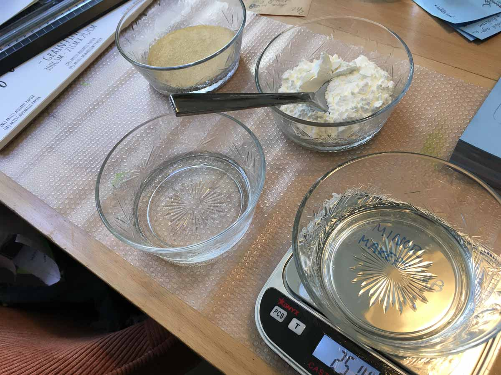*Getting everything ready, Loes Bogers, 2020*

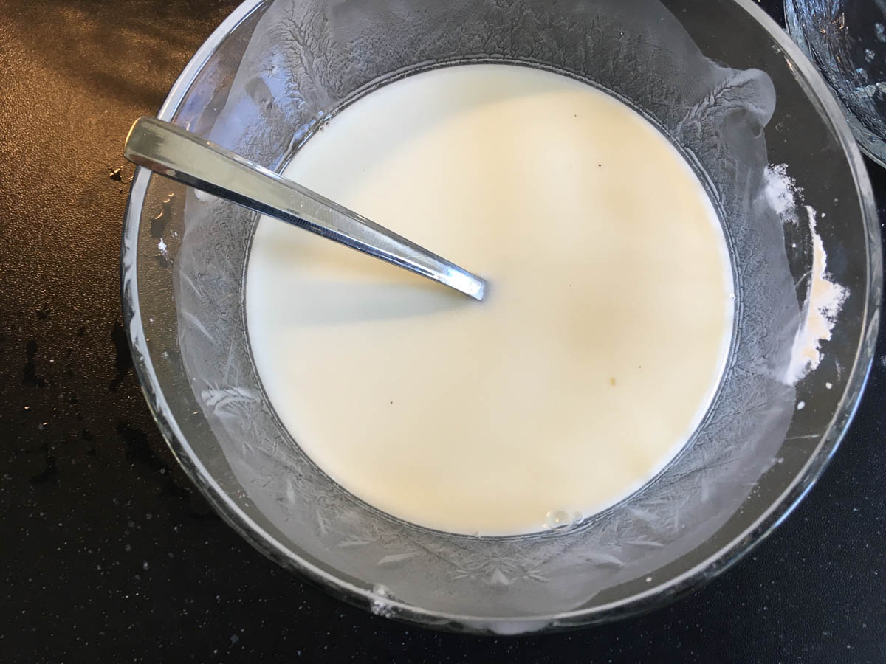*Dissolving the corn starch in some hot water, Loes Bogers, 2020*

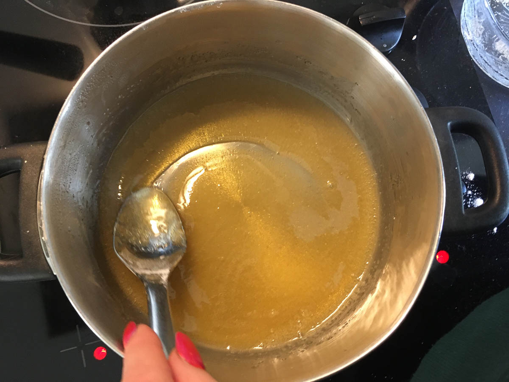*Dissolve the gelatine until thick, Loes Bogers, 2020*

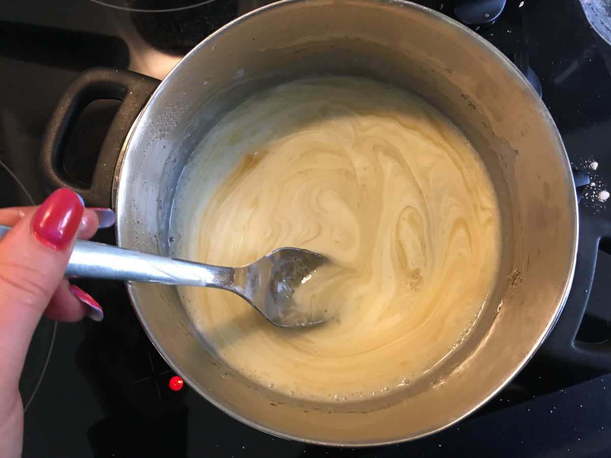*Stirring in the corn starch mixture, Loes Bogers, 2020*

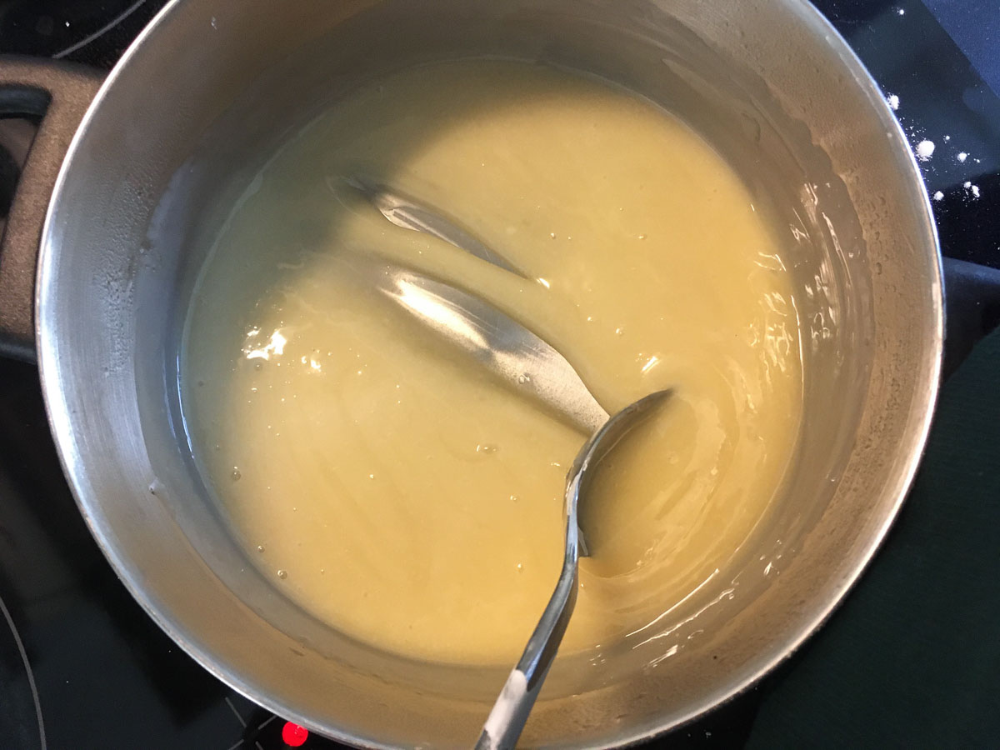*Finish with viscuous liquid, like custard, Loes Bogers, 2020*

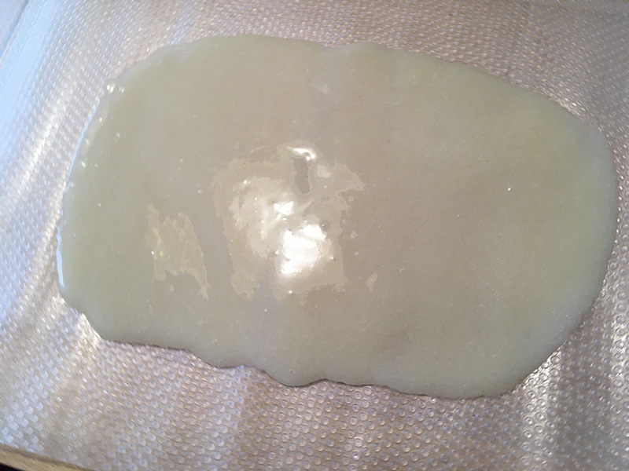*Spread the paste with a spatula, Loes Bogers, 2020*

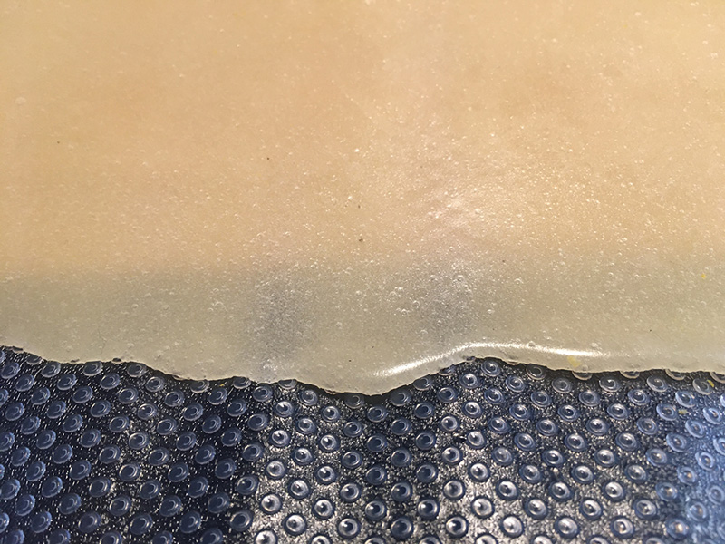*The strach-based rubber curing, Loes Bogers, 2020*

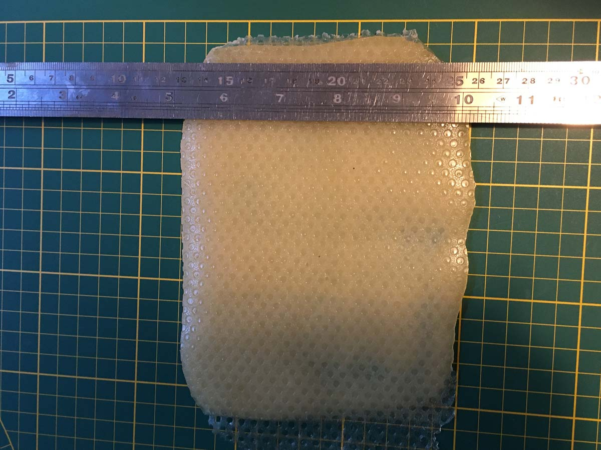*Trimming the - still flexible - slab for further curing, Loes Bogers, 2020*

###Variations

- Add a **natural colorant** such as a vegetable dye or water-based ink (e.g. hibiscus, beetroot, madder). The vinegar makes this recipe acidic so keep that in mind when using PH sensitive dyes. 
- Add a natural scent to mask the acidic smell of the vinegar. 
- Add **less glycerine** for a more rigid slab (50/50 polymers and plasticizers is considered the max)
- Reduce amount of gelatine or leave it out altogether
- **Stiffeners** such as fibres, yarn or natural debris may be added for more structure and reinforcement.
- Try creating a starch-based polymer without gelatine to make this plastic vegan. 

##ORIGINS & REFERENCES

**Cultural origins of this recipe**
Biopolymer production is older than petrol-based plastics. In 1500 BC, people in Egypt were already using glues based on gelatin, casein and albumin for furniture constructions. Gelatin casting as a technique has also been used in production of jelly-based foods such as aspic, jelly desserts and candy.

Plastics are man-made polymers that can be produced with petrol-based compounds but also bio-mass. The process to create them is called *polymerization*, or the chemical reaction to form polymer chains or networks. In 1862 Alexander Parkes presented Parkesine (now celluloid, an organic thermoformable material made from cellulose). In 1907, Bakelite was introduced by chemist Leo Hendrik Baekland. Bakelite is an electrical insulator and was used in electrical appliances, once formed, it could not be melted. Baekland coined the term "plastics" to describe a new category of materials. PVC (short for polyvinyl chloride was patented in 1914 (around the same time cellophane was discovered). The use of petroleum was easier and cheaper to obtain and process than raw materials like wood, glass and metal and gained in popularity after World War II. More plastics were invented and became mainstream in the 1960s thanks to its ease and low cost of production. High tech plastics continued to be developed for health care and technology since the 1970s. 

In short: not all plastics are petrol-based. Henry Ford experimented with plastics made from soya beans as early as 1941. Common plastics like celluloid and PLA - are also biobased but are not necessarliy better in terms of reducing pollution: The time and conditions they require to decompose and be reabsorbed in nature are crucial in determining how sustainable plastics are. 

**On open-source bioplastics:** open-source documenting of how to make bioplastics with simple tools and locally available materials can be attributed to Miriam Ribul and her publication on *Material Activism* from 2014. Promoting collaborative production of alternatives for petroleum-based plastic, she demonstrated 20(!) known processes for material production using only 4 simple recipes. Juliette Pépin's visual research book on bioplastics (also from 2014), goes in depth into the sensory and visual aspects of simple recipes with many variations. Although bioplastics production is certainly a craft that is dispersed across many locations and times, leaving traces of many similar recipes behind, this type of cataloguing and sharing work is certainly indebted to these two pioneers.

**Needs further research?**   Not sure

###Key Sources

- **Turmeric bioplastic** by Maria Viftrup for the Material Archive at TextileLab Waag (Amsterdam), 2017
- **The Bioplastics Cookbook: A Catalogue of Bioplastics Recipes** by Margaret Dunne for Fabtextiles, 2018: [link](https://issuu.com/nat_arc/docs/bioplastic_cook_book_3) 

###Copyright information 

Viftrup's recipe is licenced under CC Attribution Non-Commercial. The copyright on Dunnes work are unclear, more research needed. 

##ETHICS & SUSTAINABILITY

Needs further research

Gelatin is an animal-based ingredient. Some might find it problematic to use resources that requires killing an animal because of religious or animal welfare beliefs. Arguments are also made that as long as there's a meat industry, it is better to use product from the entire animal, including skin and bones. Some might consider gelatin to be a product that comes from a waste stream, but this is considered controversial by others.

Acrylic (for the mold) is a petrol based plastic but results in very shiny foils and sheets and can be reused endlessly for casting high quality bioplastic sheets.

Using renewable ingredients is not by definition petrol-free. Imagine they have to travel long distances by plane, boat or truck: it takes fuel. Also, the effects of GMO technologies and pesticides can be harmful to the environment and it's worth using knowing the source and production standards involved. If you can afford it, buying organic ingredients is a good starting point.

**Sustainability tags**

- Renewable ingredients: yes
- Vegan: no
- Made of by-products or waste:  no
- Biocompostable final product:  yes, but only professionally (home composting of animal-based materials - like gelatine - is not allowed in the EU)
- Reuse: further research needed

Needs further research?:  not sure

Gelatine-based bioplastics can be recasted by melting them in a pot with some water (but plastics with additives and fillers might not be reusable). Should not be recycled as part of PET-plastics waste: this causes contamination of the waste stream.

##PROPERTIES

- **Strength**: strong
- **Hardness**: resilient
- **Transparency**: translucent
- **Glossiness**: satin
- **Weight**: medium
- **Structure**: closed
- **Texture**: smooth
- **Temperature**: cool
- **Shape memory**: high
- **Odor**: strong
- **Stickiness**: medium
- **Weather resistance:** needs further research
- **Acoustic properties:** needs further research
- **Anti-bacterial:** needs further research
- **Non-allergenic:** needs further research
- **Electrical properties:** needs further research
- **Heat resistance:** low
- **Water resistance:** needs further research
- **Chemical resistance:** needs further research
- **Scratch resistance:** moderate
- **Surface friction:** medium
- **Color modifiers:** none 

##ABOUT

**Maker(s) of this sample**

- Name: Loes Bogers
- Affiliation: Fabricademy student at Waag Textile Lab Amsterdam
- Location:  Rotterdam, the Netherlands
- Date: 16-03-2020 – 22-03-2020

**Environmental conditions**

- Outside temp:  5-11 degrees Celcius
- Room temp:  18 – 22 degrees Celcius
- PH tap water:  7-8

**Recipe validation**

Has recipe been validated? Yes, by Cecilia Raspanti, TextileLab, Waag Amsterdam, 16 March 2020

**Environmental conditions**

- Humidity:  40-50%
- Outside temp:  5-11 degrees Celcius
- Room temp:  18 – 22 degrees Celcius
- PH tap water:  7-8

**Images of the final sample**

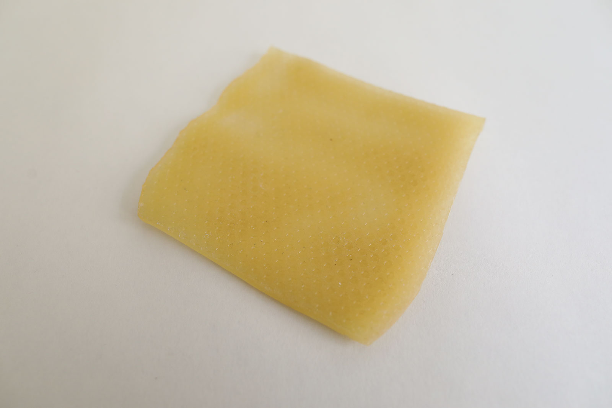*Starch-based rubber, Loes Bogers, 2020*
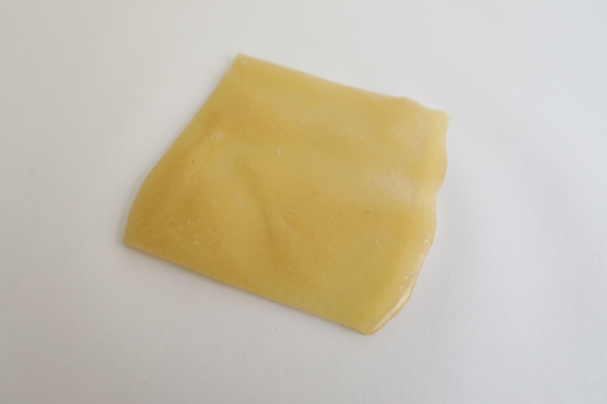*Starch-based rubber, Loes Bogers, 2020*
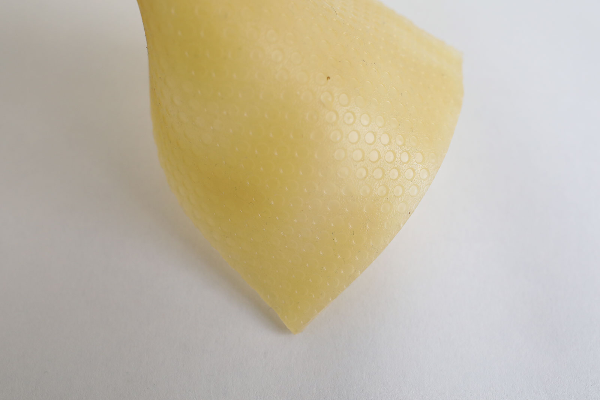*Starch-based rubber, Loes Bogers, 2020*
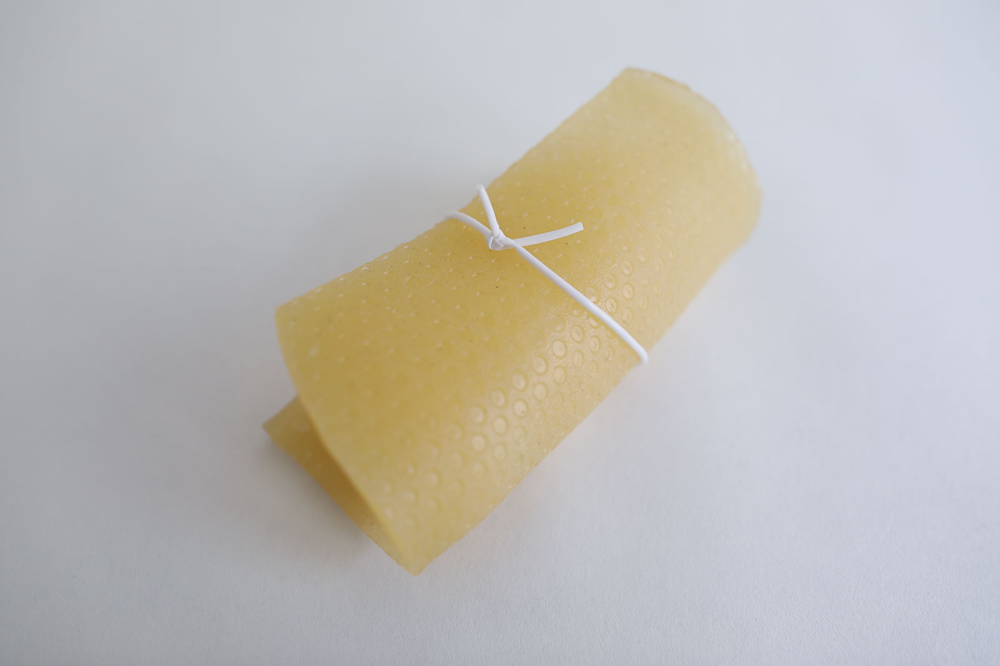*Starch-based rubber, Loes Bogers, 2020*
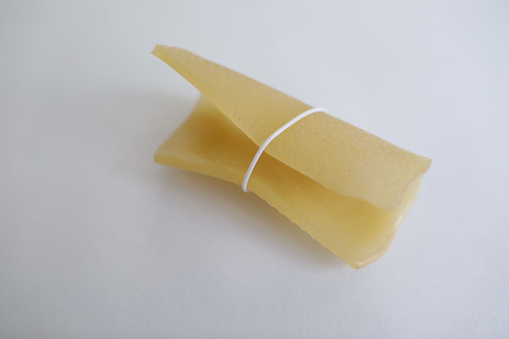*Starch-based rubber, Loes Bogers, 2020*

##REFERENCES

- **Turmeric bioplastic** by Maria Viftrup for the Material Archive at TextileLab Waag (Amsterdam), 2017
- **The Bioplastics Cookbook: A Catalogue of Bioplastics Recipes** by Margaret Dunne for Fabtextiles, 2018: [link](https://issuu.com/nat_arc/docs/bioplastic_cook_book_3) 
- **Recipes for Material Activism** by Miriam Ribul, via Issuu, 2014:[link](https://issuu.com/miriamribul/docs/miriam_ribul_recipes_for_material_a).
- **Research Book Bioplastics** by Juliette Pepin, via Issuu, 2014:[link](https://issuu.com/juliettepepin/docs/bookletbioplastic)
- **The Secrets of Bioplastic** by Clara Davis (Fabtex, IAAC, Fab Lab Barcelona), 2017, [link](https://issuu.com/nat_arc/docs/the_secrets_of_bioplastic_).
- **Make it and Break it: Bioplastics from Plant Starch with
incorporation of Engineering Practices**, by Richard Harris, Carla Ahrenstorff Gracye Theryo, Aaron Johnson, Jane Wissinger. Center for Sustainable Polymers at the University of Minnesota, 2017: [link](https://csp.umn.edu/wp-content/uploads/2017/03/Make-it-and-Break-it.pdf)
- **Lifecycle of a Plastic Product** by American Chemistry Council, n.d. [link](https://plastics.americanchemistry.com/Lifecycle-of-a-Plastic-Product/)
- **Polymerization**, on Wikipedia, n.d.: [link](https://en.wikipedia.org/wiki/Polymerization)
- **Seaweeds can be a new source of bioplastics** by Rajendran, N, Sharanya Puppala, Sneha Raj M., Ruth Angeeleena B., and Rajam, C. in Journal of Pharmacy Research, 12 March 2012: [link](https://www.researchgate.net/publication/258495452_Seaweeds_can_be_a_new_source_for_bioplastics)
- **Recipes for Material Activism** by Miriam Ribul, via Issuu, 2014:[link](https://issuu.com/miriamribul/docs/miriam_ribul_recipes_for_material_a).
- **Research Book Bioplastics** by Juliette Pepin, via Issuu, 2014:[link](https://issuu.com/juliettepepin/docs/bookletbioplastic)
- 

