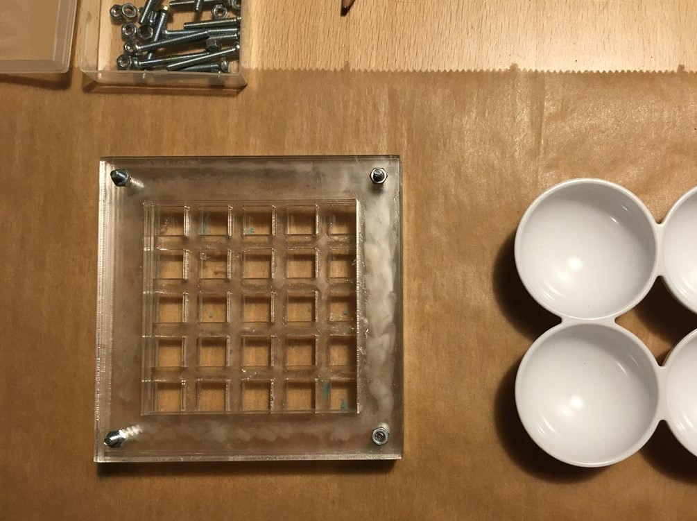
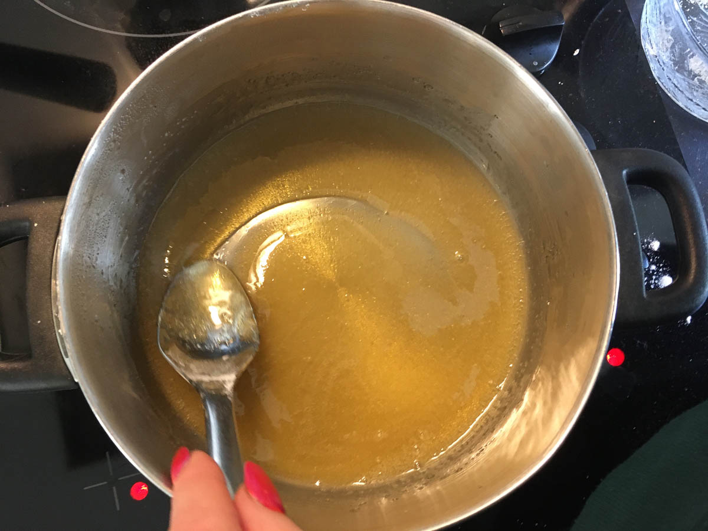
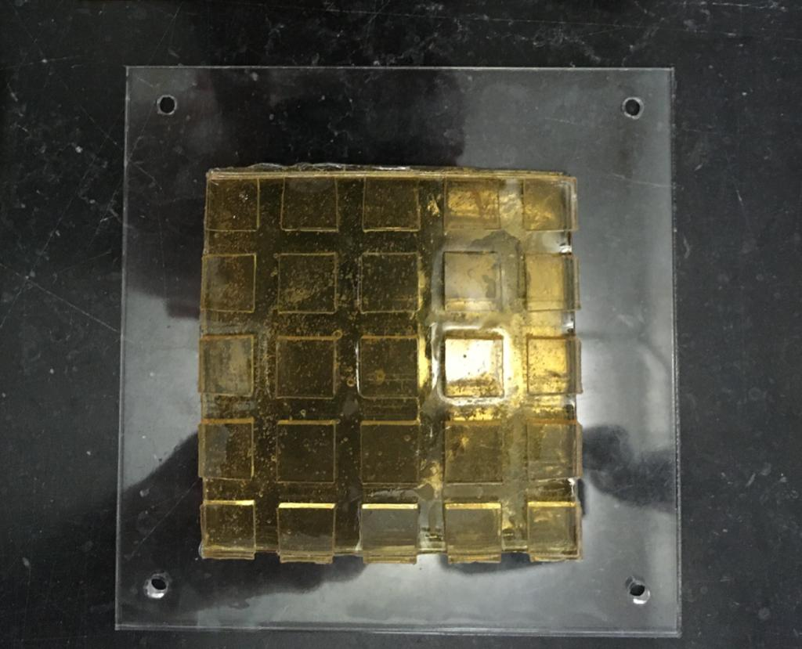
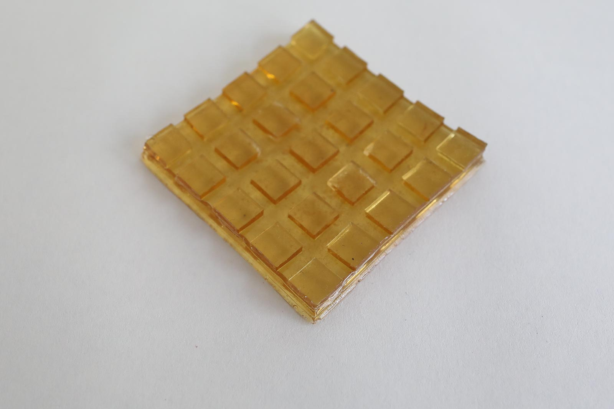
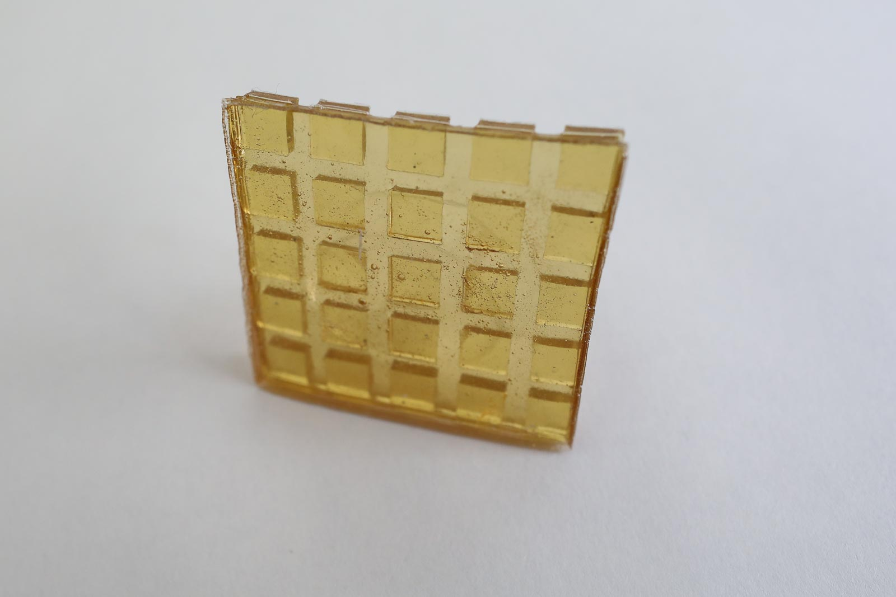
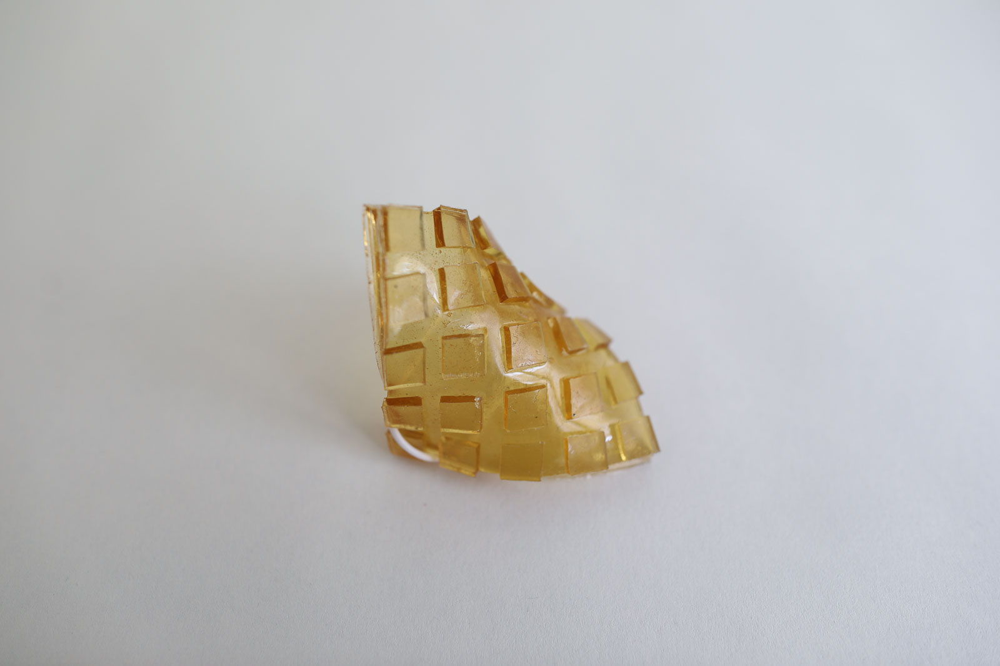
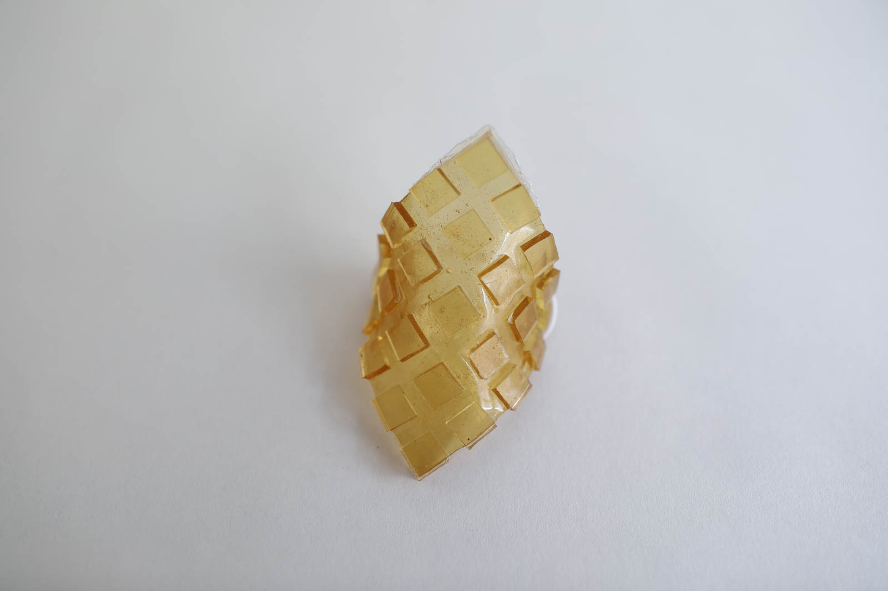

# BIOSILICONE

<iframe width="560" height="315" src="https://www.youtube.com/embed/a5gBPlJNHfk" frameborder="0" allow="accelerometer; autoplay; encrypted-media; gyroscope; picture-in-picture" allowfullscreen></iframe>

##GENERAL INFORMATION

A (naturally) yellow, flexible biosilicone, gelatin-based. This silicon is rather flexible considering it's thickness, but is quite hard when compared to silicone rubber baking trays for example that often contain softeners. Thinner sheets are more flexbile, thicker less. Starch-based rubber recipe results in more flexible slabs.

**Physical form**

Solids

Color without additives: transparent, yellow

**Fabrication time**

Preparation time: 1 Hour

Processing time: 5-10 days

Need attention: every 12 hours, alternate pressing and drying, (press overnight, let dry through the day for example, or leave to dry on a roster). Leave it to dry as long as is feasible with lots of airflow.

Final form achieved after: 10 days

**Estimated cost (consumables)**

1,68 Euros for a yield of approx 300 ml before casting

##RECIPE

###Ingredients

* **Gelatine powder - 48 gr**
	* Functions as the polymeer (so it becomes a solid)
* **Glycerine - 48 gr**
	* Functions as plasticizer that bonds with the gelatine (makes it flexible). 
* **Water - 240 ml/gr**
	* To dissolve and mix the polymeer and plasticizer

###Tools

1. **Cooker or stove** (optional: temperature controlled)
1. **Pot**
1. **Scale**
1. **Moulds** I use a modular mold from laser cut 3 mm acrylic sheets here that are held together with screws. Smooth acrylic molds result in shiny biosilicone. 
1. **Spoon** 

###Yield 

Before processing/drying/curing: approx. 250 ml (make sure to evaporate enough water during cooking time)

###Method

1. **Preparation**

	- Weigh your ingredients
	- Prepare the mold and find a place where you can leave it for a while, ideally near an open window where there's air flow.

1. **Mixing and dissolving the ingredients**
	- bring the water to the boil
	- optional: add natural dye if you wish to use color
	- add the glycerine
	- add the gelatine
	- keep the temperature below 80 degrees celcius while stirring *very very slowly and gently* to avoid making bubbles. I prefer a simple spoon to do this, not a whisk.

1. **Cooking the ingredients**

	-  Simmer and slowly stir the mixture between 60-80 degrees celcius for 20-25 minutes, until it's like a syrup. 
	-  Longer cooking time allows more water to evaporate and as a result it will shrink less during drying. Make sure it's still liquid enought to pour. 

1. **Casting**

	-  Cast into the mould slowly to avoid bubbles
	-  Pour from the middle and hold still, let the liquid distribute itself.
	-  Put the mould away to dry in a cool place with lots of air flow (like near an open window). A warmer place might speed up the drying process but also allow bacteria to grow faster and can result in fungal growth.

###Drying/curing/growth process

- Mold depth:  				3 x 3mm layers 
- Shrinkage thickness:      20-30 %
- Shrinkage width/length:   10-20 %

**Shrinkage and deformation control**

Letting it dry up to ten days to get to the final form. It will be very flexible at first but will slowly harden. Tends to curl up if it is not pressed down during drying (the design of this mold allows for airflow even when pressed). Laying it on a smooth surface helps to keep it flat, it "sucks" onto the surface.

**Curing agents and release agents**

None. 

**Minimum wait time before releasing from mold**

3 days

**Post-processing**

Trim, cut or process the slab before it is completely dry and hardened for nice clean cuts. 

Store in a dry and ventilated room.

**Further research needed on drying/curing/growth?**

Casting larger volumes without growing fungus/mold and deformation would require further experimentation.

###Process pictures

*preparing the mold, Loes Bogers, 2020*

*thick mixture, Loes Bogers, 2020*

*biosilicone slab just after mold release, Loes Bogers, 2020*

###Variations

- Add a **natural colorant** such as a vegetable dye or water-based ink (e.g. hibiscus, beetroot, madder)
- Add **less glycerine** for a rigid biosilicone
- **Stiffeners** such as fibres, yarn or natural debris may be added for more structure and reinforcement.
- **Fillers** such as almond or sunflower oil, can be added to prevent additional shrinkage but might affect stickyness.

##ORIGINS & REFERENCES

**Cultural origins of this recipe**

Bioplastic production is older than petrol-based plastics. In 1500 BC, people in Egypt were already using glues based on gelatin, casein and albumin for furniture constructions. Gelatin casting as a technique has also been used in production of jelly-based foods such as aspic, jelly desserts and candy.

Plastics are man-made polymers that can be produced with petrol-based compounds but also bio-mass. The process to create them is called *polymerization*, or the chemical reaction to form polymer chains or networks. In 1862 Alexander Parkes presented Parkesine (now celluloid, an organic thermoformable material made from cellulose). In 1907, Bakelite was introduced by chemist Leo Hendrik Baekland. Bakelite is an electrical insulator and was used in electrical appliances, once formed, it could not be melted. Baekland coined the term "plastics" to describe a new category of materials. PVC (short for polyvinyl chloride was patented in 1914 (around the same time cellophane was discovered). The use of petroleum was easier and cheaper to obtain and process than raw materials like wood, glass and metal and gained in popularity after World War II. More plastics were invented and became mainstream in the 1960s thanks to its ease and low cost of production. High tech plastics continued to be developed for health care and technology since the 1970s. 

In short: not all plastics are petrol-based. Henry Ford experimented with plastics made from soya beans as early as 1941. Common plastics like celluloid and PLA - are also biobased but are not necessarliy better in terms of reducing pollution: The time and conditions they require to decompose and be reabsorbed in nature are crucial in determining how sustainable plastics are. 

**On open-source bioplastics:** open-source documenting of how to make bioplastics with simple tools and locally available materials can be attributed to Miriam Ribul and her publication on *Material Activism* from 2014. Promoting collaborative production of alternatives for petroleum-based plastic, she demonstrated 20(!) known processes for material production using only 4 simple recipes. Juliette Pépin's visual research book on bioplastics (also from 2014), goes in depth into the sensory and visual aspects of simple recipes with many variations. Although bioplastics production is certainly a craft that is dispersed across many locations and times, leaving traces of many similar recipes behind, this type of cataloguing and sharing work is certainly indebted to these two pioneers.

**Needs further research?**   Not sure

###Key Sources

- **Biosilicone Recipe** by Cecilia Raspanti (TextileLab, Waag), Fabricademy Class "Biofabricating Materials", 2017-2019, [link](https://class.textile-academy.org/classes/week05A/).
- **Biosilicone Recipe** by Maria Viftrup (TextileLab, Waag), biosilicpne sample from the material archive, 2017.

###Copyright information 

Both recipes are publiched under a CC Attribution Non-commercial licence.

##ETHICS & SUSTAINABILITY

Needs further research

Gelatin is an animal-based ingredient. Some might find it problematic to use resources that requires killing an animal because of religious or animal welfare beliefs. Arguments are also made that as long as there's a meat industry, it is better to use product from the entire animal, including skin and bones. Some might consider gelatin to be a product that comes from a waste stream, but this is considered controversial by others.

Acrylic (for the mold) is a petrol based plastic but results in very shiny foils and sheets and can be reused endlessly for casting high quality bioplastic sheets.

Using renewable ingredients is not by definition petrol-free. Imagine they have to travel long distances by plane, boat or truck: it takes fuel. Also, the effects of GMO technologies and pesticides can be harmful to the environment and it's worth using knowing the source and production standards involved. If you can afford it, buying organic ingredients is a good starting point.

**Sustainability tags**

- Renewable ingredients: yes
- Vegan: no
- Made of by-products or waste:  no
- Biocompostable final product:  yes, but only professionally (home composting of animal-based materials is not allowed in the EU)
- Reuse: yes, by melting and recasting

Needs further research?:  not sure

Gelatine-based bioplastics can be recasted by melting them in a pot with some water (but plastics with additives and fillers might not be reusable). Should not be recycled as part of PET-plastics waste: this causes contamination of the waste stream. 

##PROPERTIES

- **Strength**: strong
- **Hardness**: flexible
- **Transparency**: transparent
- **Glossiness**: glossy
- **Weight**: medium
- **Structure**: closed
- **Texture**: smooth
- **Temperature**: medium
- **Shape memory**: high
- **Odor**: moderate in final form, strong during production
- **Stickiness**: medium
- **Weather resistance:** poor
- **Acoustic properties:** needs further research
- **Anti-bacterial:** needs further research
- **Non-allergenic:** needs further research
- **Electrical properties:** needs further research
- **Heat resistance:** low
- **Water resistance:** water resistant
- **Chemical resistance:** low
- **Scratch resistance:** high
- **Surface friction:** braking
- **Color modifiers:** none 

##ABOUT

**Maker(s) of this sample**

- Name: Loes Bogers
- Affiliation: Fabricademy student at Waag Textile Lab Amsterdam
- Location:  Rotterdam, the Netherlands
- Date: 19-02-2020 – 01-03-2020

**Environmental conditions**

- Outside temp:  5-11 degrees Celcius
- Room temp:  18 – 22 degrees Celcius
- PH tap water:  7-8

**Recipe validation**

Has recipe been validated? Yes, by Cecilia Raspanti, TextileLab, Waag Amsterdam, 9 March 2020

**Environmental conditions**

- Humidity:  40-50%
- Outside temp:  5-11 degrees Celcius
- Room temp:  18 – 22 degrees Celcius
- PH tap water:  7-8

**Images of the final sample**

*Biosilicone sample, Loes Bogers, 2020*

*Biosilicone sample, Loes Bogers, 2020*

*Biosilicone sample, Loes Bogers, 2020*

*Biosilicone sample, Loes Bogers, 2020*

##REFERENCES

- **Biosilicone Recipe** by Cecilia Raspanti (TextileLab, Waag), Fabricademy Class "Biofabricating Materials", 2017-2019, [link](https://class.textile-academy.org/classes/week05A/).
- **Biosilicone Recipe** by Maria Viftrup (TextileLab, Waag), biosilicpne sample from the material archive, 2017.
- **The Secrets of Bioplastic** by Clara Davis (Fabtex, IAAC, Fab Lab Barcelona), 2017, [link](https://issuu.com/nat_arc/docs/the_secrets_of_bioplastic_).
- **The Bioplastics Cookbook: A Catalogue of Bioplastics Recipes** by Margaret Dunne for Fabtextiles, 2018, [link](https://issuu.com/nat_arc/docs/bioplastic_cook_book_3)
- **Lifecycle of a Plastic Product** by American Chemistry Council, n.d. [link](https://plastics.americanchemistry.com/Lifecycle-of-a-Plastic-Product/)
- **Polymerization**, on Wikipedia, n.d.: [link](https://en.wikipedia.org/wiki/Polymerization)
- **Seaweeds can be a new source of bioplastics** by Rajendran, N, Sharanya Puppala, Sneha Raj M., Ruth Angeeleena B., and Rajam, C. in Journal of Pharmacy Research, 12 March 2012: [link](https://www.researchgate.net/publication/258495452_Seaweeds_can_be_a_new_source_for_bioplastics)
- **Recipes for Material Activism** by Miriam Ribul, 2014, via issuu [link](https://issuu.com/miriamribul/docs/miriam_ribul_recipes_for_material_a)
- **Research Book Bioplastics** by Juliette Pepin, 2014, via issuu [link](https://issuu.com/juliettepepin/docs/bookletbioplastic)

