# DYE OF RED CABBAGE LEFT-OVERS

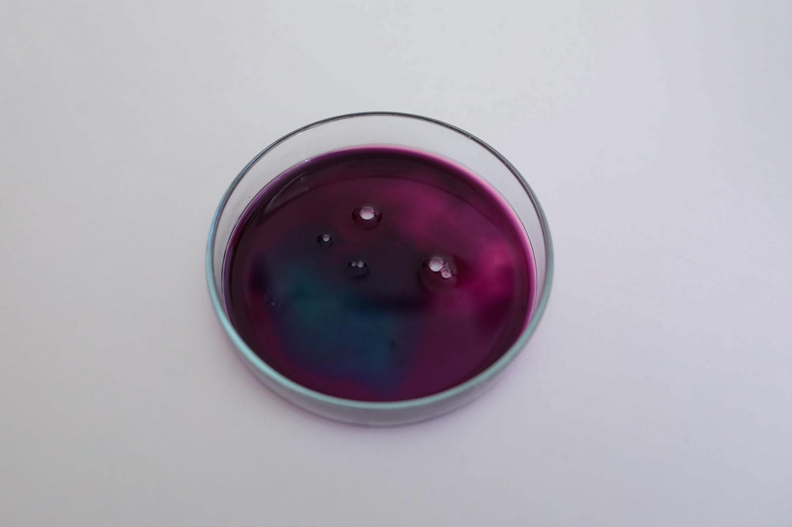*Silk dyed with cabbage and modified with PH modifiers, Loes Bogers, 2020*

##GENERAL INFORMATION

Volatile PH sensitive dye. Not very light-fast or washable, but capable of producing bright purple, pink, green and turqouise hues. 

**Physical form**

Pastes, gels & liquids

Color without additives: Purple

**Fabrication time**

Preparation time: 2 Hours

Processing time: for dying is variable (overnight for intense color on silk)

Need attention: the entire processing time (temperature and stirring)

Final form achieved after: 2 hours

**Estimated cost (consumables)**

0,01 Euros, for a yield of approx. 250 ml if made from food waste

##RECIPE

###Ingredients

* **Half a red cabbage** (also: brassica oleracea), this is the dye stuff. Try to get these as food waste
* **water -  1000 ml/g** solvent
* **salt - 5 g** for preservation (stabilizer)
* **a coffee filter** to filter the fine particles from the dye
* **PH modifiers** (see [this recipe](https://class.textile-academy.org/2020/loes.bogers/files/recipes/phmodifiers/))
* optional: a piece of silk, or aquarel paper and a brush for testing.

###Tools

1. **Cooker**, ideally with temperature control
1. **Pot**
1. **A knife** to finely chop the cabbage , or a mandoline
1. **A spoon**
1. **A cheese cloth or coffee filter**
1. **A strainer**
1. **A glass jar** to store the dye

###Yield

Approx. 250 ml

###Method

1. **Preparation**

	- Chop the cabbage until it is very small, or grate it with a mandoline

1. **Extract the pigment**

	- Put the cabbage in a large pot and cover with water
	- Bring it to the boil and let it simmer for 2 hours (make sure not all the water evaporates)
	- Strain the liquid and put it back in the pot
	- Reduce the liquid to 25% of the original volume for a very concentrated dye or ink. 

1. **Dyeing with cabbage dye**

	- Mordant the fibres with alum
	- Simmer in the dyebath for an hour, leave overnight
	- Do not rinse
	- Dry
	- Optional: modify with PH modifiers

1. **Testing and storing the ink/dye**

	- Add a teaspoon of salt while the liquid is still hot, stir to dissolve. 
	- To dye silk: let the dye cool until it's no more than 70 degrees and put in a piece or wet (mordanted) silk or other fibres. Leave overnight for an intense color. 
	- Test the ink on paper using a brush and aquarel paper. Use the PH modifiers wet-on-wet, or let the ink dry before brushing or spraying on some of the modifiers. Play and experiment!
	- To store: add a clove to the ink, label it, and store in the fridge or freeze. If it starts to grow mold or smells weird/different than cabbage smell, through it away. 

###Process pictures

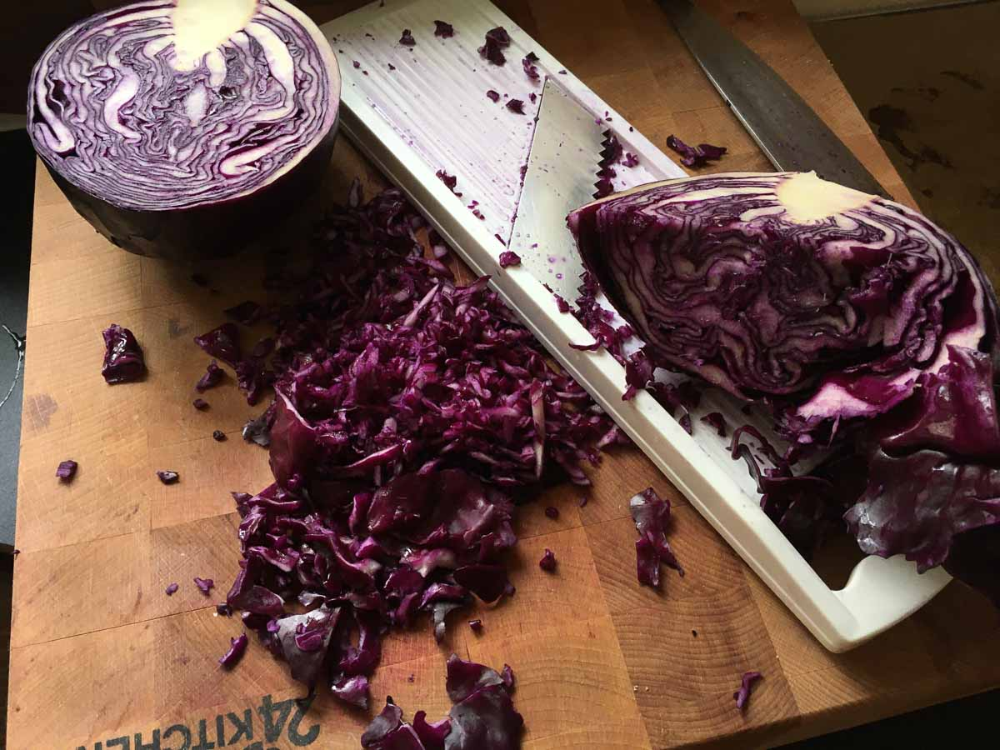*Preparing the cabbage with a mandoline, Loes Bogers, 2020*

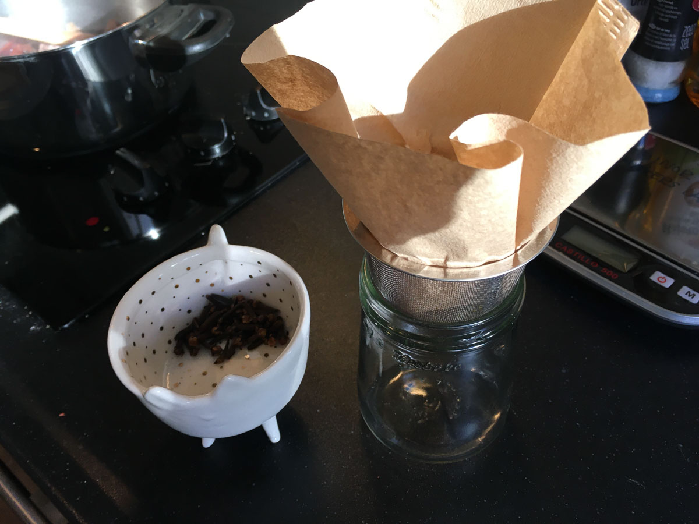*Cloves and coffee filters ready to go, Loes Bogers, 2020*

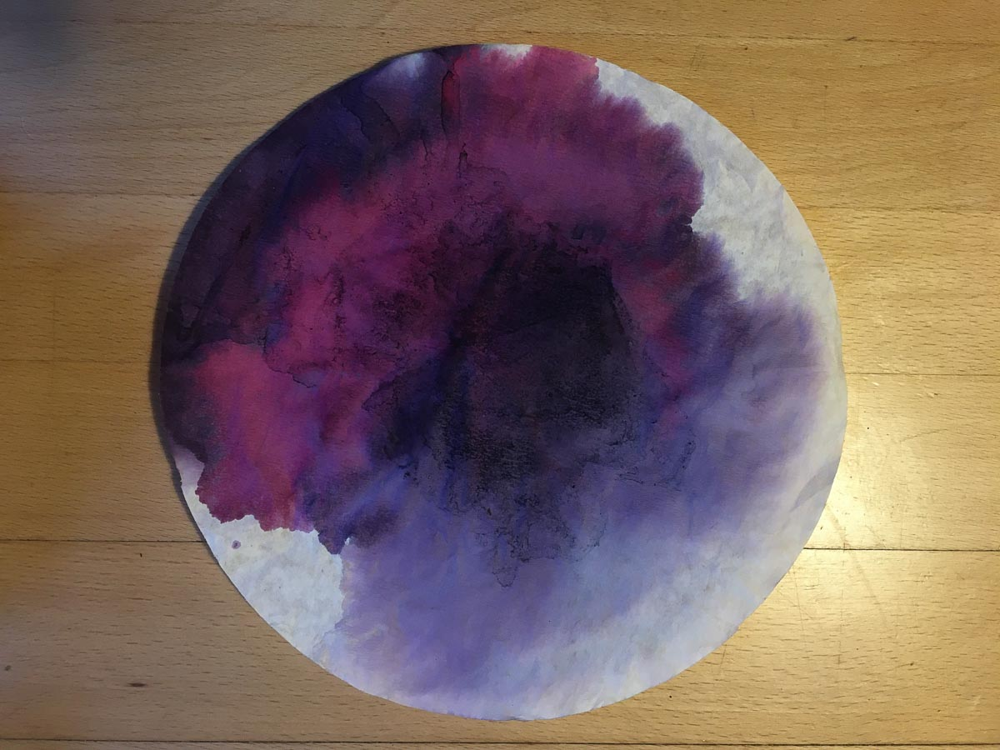*Red cabbage dye on a used coffee filter, sprayed with some acidic PH modifier (PH 2), Loes Bogers, 2020*

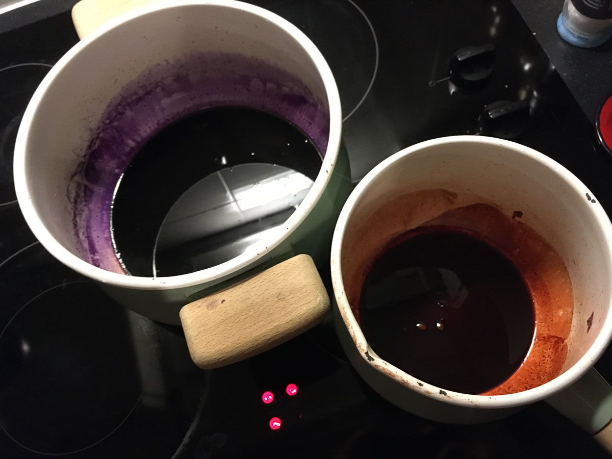*Red cabbage dye (left) and madder dye (right) ready to be used or stored, Loes Bogers, 2020*

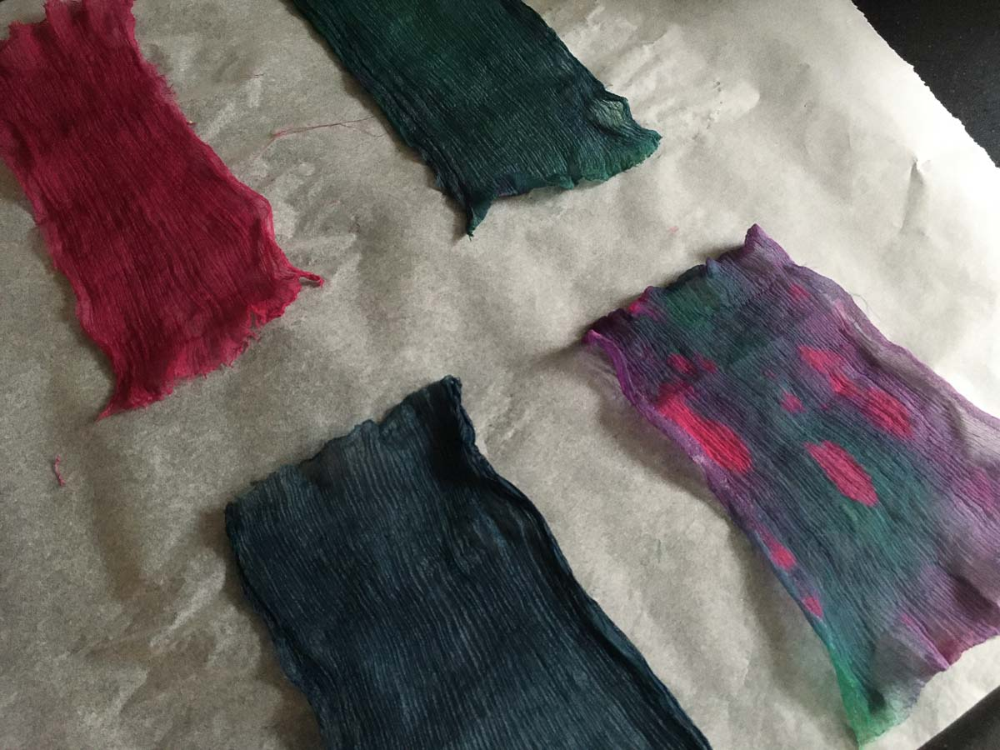*Silk dyed with red cabbage dye, drying. Modified with PH modifiers (pink = PH2, green = PH 13, blue = PH 9), Loes Bogers, 2020*

###Variations

- You add the PH modifiers to the dye, or use the modifier after drying (on dried, dyed textiles).
- Add a binder such as arabic gum to create a nicer flow if you wish to use this ink for painting and arts, not dyeing textiles.
- Instead of making a water-based ink, you can also use red cabbage to make an alcohol-based marker ink. Grate the cabbage and chop as finely as possible, cover with denatured alcohol 96% and put in a jar with a tightly fitting lid. Shake every hour for 24 hours. Strain the liquid, add a clove, label and store. The ink can be modified with PH modifiers as well but this ink fades quicker than the dye. 
- You can even use red cabbage dye to test the PH of a liquid. Dip some strips of coffee filter in the red cabbage dye. Let it dry. Then use a cotton swab to dab a bit of liquid (tap water, juice, wine, other) on the paper. If the paper becomes red/pink the PH is 2-4, purple is 5-7, blue is 8-9 and green/yellow is PH 10-12 approximately. See also [link](https://www.thoughtco.com/make-red-cabbage-ph-paper-605993)
- Make dyes for other kinds of food waste, like used coffee grounds (light browns), old coffee (deep browns), PH sensitive beetroot dye (vintage pinks and salmon tones) etc. Or research and consider dyes from dried goods like turmeric powder (bright yellow), PH sensitive hibiscus tea (purple, blues, greens and gray). Ink has even been made of cigarette butts!

##ORIGINS & REFERENCES

**Cultural origins of this recipe**

The anthocyanin in red cabbage is what makes it PH sensitive, and is why it changes color as you modify it with acidic or alkaline solutions.  

Dyeing fibres with vegetables is an ancient craft: the earliest dyed flax fibers have been found in a prehistoric cave in the Republic of Georgia and date back to 34,000 BC. Before the invention of synthetic dyes starting in the mid-19th century, all fibres and textiles were dyed using organic and inorganic materials as *dyestuff:*like clay, plants, metals, bark, funghi, flowers, insects, seeds, and fruit and vegetables (and even the blood of animals). The development of new, strongly colored synthetic dyes followed quickly, and by the 1870s commercial dyeing with natural dyestuffs was disappearing: synthetic dyes were more stable, more colorfast and in many cases could be done at lower cost than the overal costs of natural dyeing processes.  

**Natural dye revival(s)**: there have been revivals in plant dyeing as a crafts technique in the 1970s, with enthusiasts publishing books in layman's terms that became popular again today. These recipes might be natural, but may still use heavy metals as mordants. More recently, in tandem with the growing concern for pollutions caused by textile dyeing at industrial scale, which involves lots of chemicals, heavy metals that end up in drinking water, on worker's bodies and in the environment. It also requires a lot of water due to the rinsing needed to wash all the chemicals out, and to achieve colorfastness. Next to bacterial (and fungal) dyes, plant-based dyes are investigated as non-toxic, renewable alternatives to synthetic dyeing processes. Some natural dyes, like madder (for red hues) has been developed into a powder recently in such a way that it is fit for textile dyeing at an industrial scale. 

It's somewhat unconventional to use more ephemeral dyes such as this one as textile dye. It's not very lightfast and extremely chemically unstable (the PH sensitivity). But some are worth exploring by designers who are able to celebrate these dyes' vividness and ability to change, fade and surprise. It is unlikely that natural dyes will provide the color fastness and ability to dye synthetic textiles like synthetic dyes can, but perhaps what we need much more urgently is an attitude change to color in textiles and clothing?

**Needs further research?**   Not sure

###Key Sources

No recipe in particular. Boiling in water is a common way of extracting pigments from a dye stuff. 

###Copyright information 

This recipe may be considered to be part of the public domain.

##ETHICS & SUSTAINABILITY

Cabbage can be found in abundance in many countries (including the Netherlands). It is not a hugely popular vegetable but still very common. Try to get red cabbage as food waste instead of buying it fresh. Dye materials should not compete with food. 

The color purple of this dye or ink creates is quite contested. Historically, purple (and especially the socalled Tyrian purple, made of the secretions of sea snails) was considered to be the color of power, reserved for kings and queens and the like. It is also one of the colors that has historically ben rather expensive to produce as it required significant amounts of (often expensive) resources to generate intense and colorfast dyes using natural resources. Due to it's changing nature, red cabbage dye would not be considered an option worth considering for current textile dyeing practice. But perhaps its humble background and volatility make it the perfect everywoman's purple. Could it be instrumental in conveying the temporary luxury of purple textiles? Perhaps it is sufficient to be queen for a day?

**Sustainability tags**

- Renewable ingredients: yes
- Vegan: yes
- Made of by-products or waste:  (ideally) yes
- Biocompostable final product: yes, (rip silk to shreds for home composting).
- Re-use: yes, silk can be redyed. 

Needs further research?:  Yes

How often can this dye be reused? Overview of colors different PH modifiers during and after dyeing would be useful. Are there sustainable ways of making the dye more colorfast?

##PROPERTIES

- **Color fastness:** low
- **Light fastness:** low
- **Washability:** low
- **Color modifiers:** alkaline/acidic
- **Odor**: moderate (disappears after drying)
- **Suitable fibres**: animal fibre like wool or silk will take better than cellulose fibres. Not suitable for dyeing synthetic fibres. 

##ABOUT

**Maker(s) of this sample**

- Name: Loes Bogers
- Affiliation: Fabricademy student at Waag Textile Lab Amsterdam
- Location:  Amsterdam, the Netherlands
- Date: 05-03-2020 - 06-03-2020

**Environmental conditions**

- Humidity:  40-50%
- Outside temp:  5-11 degrees Celcius
- Room temp:  18 – 22 degrees Celcius
- PH tap water:  7-8

**Recipe validation**

Has recipe been validated? Yes, by Cecilia Raspanti, TextileLab, Waag Amsterdam, 9 March 2020

**Images of the final sample**

*Red cabbage dye with a splash of soda solution and a splash of vinegar, Loes Bogers, 2020*

*Red cabbage dye on silk, not modified, Loes Bogers, 2020*

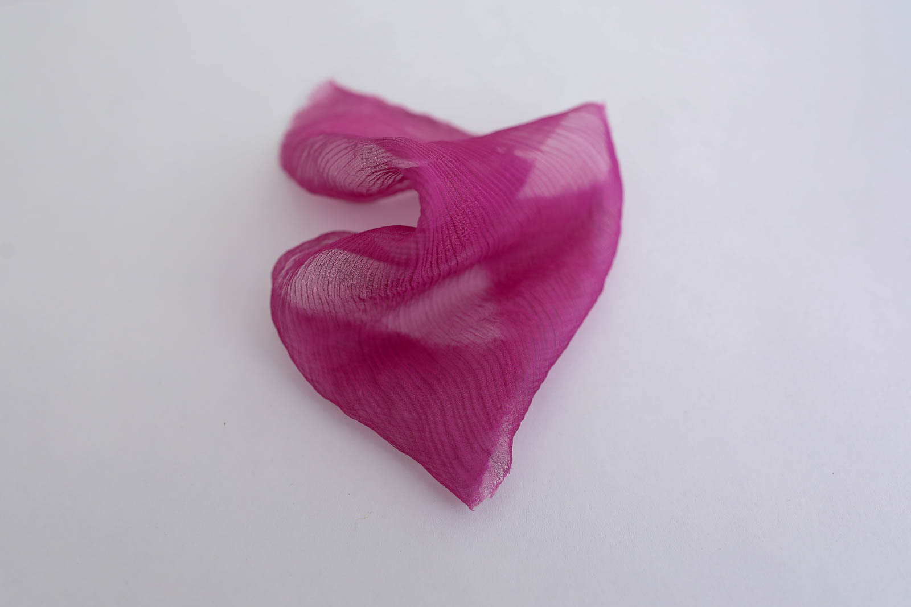*Red cabbage dye on silk, modified with vinegar (PH 2) solution, Loes Bogers, 2020*

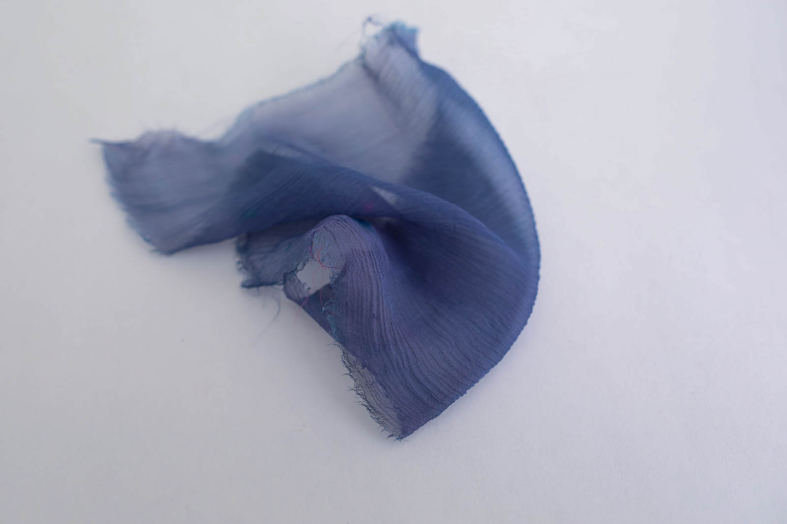*Red cabbage dye on silk, modified with soda (PH 9) solution, Loes Bogers, 2020*

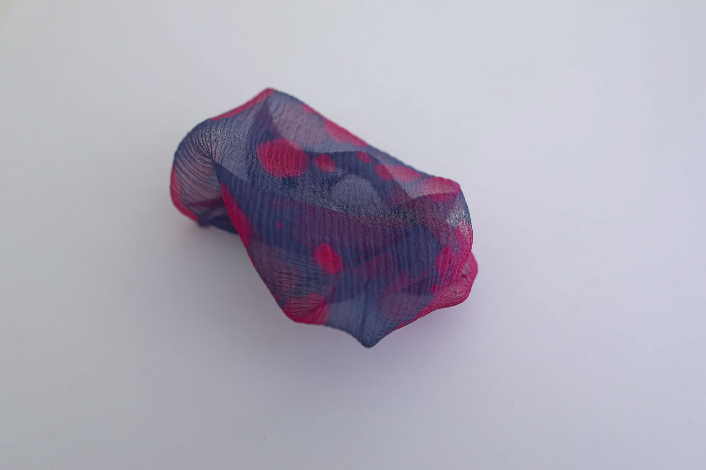*Red cabbage dye on silk, modified with soda (PH 9) and vinegar (PH 2) splashes, Loes Bogers, 2020*

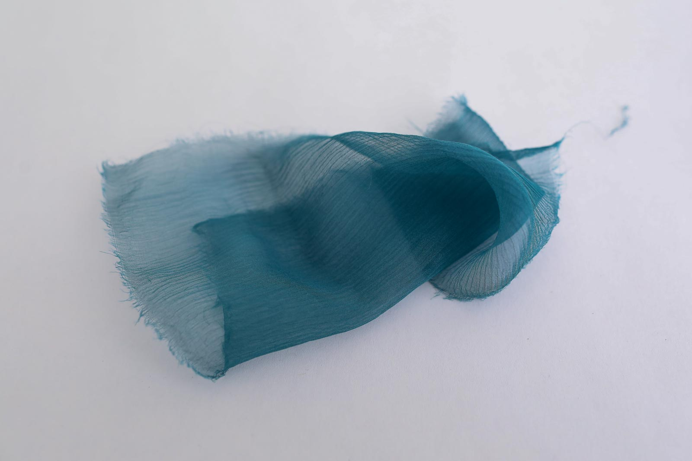*Red cabbage dye on silk, modified with soda solution (PH 13), Loes Bogers, 2020*

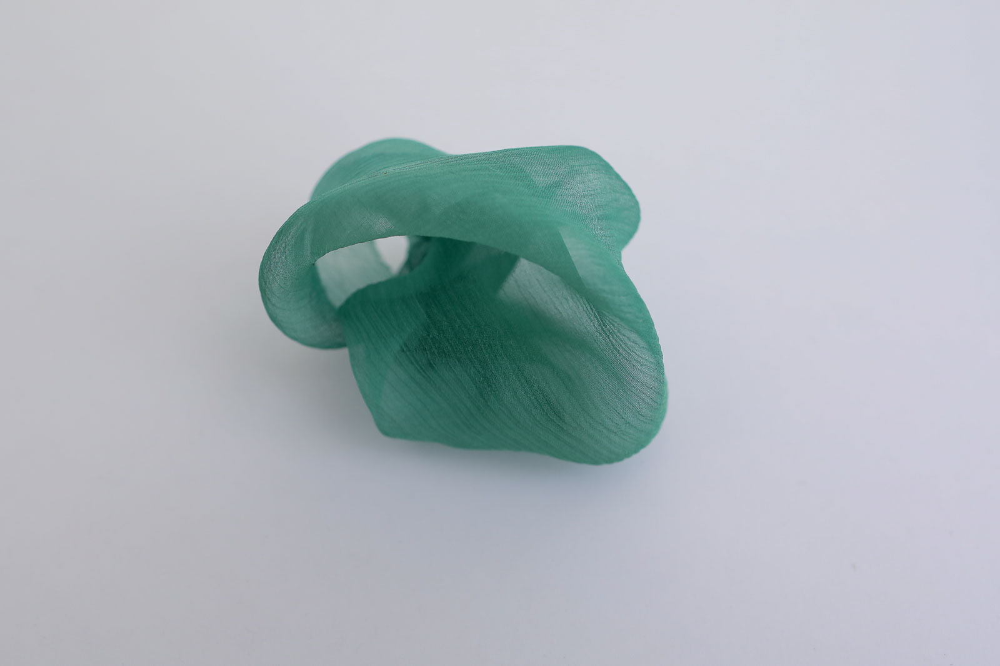*Red cabbage dye on silk, modified with soda (PH13) and then vinegar (PH 2) solution, Loes Bogers, 2020*

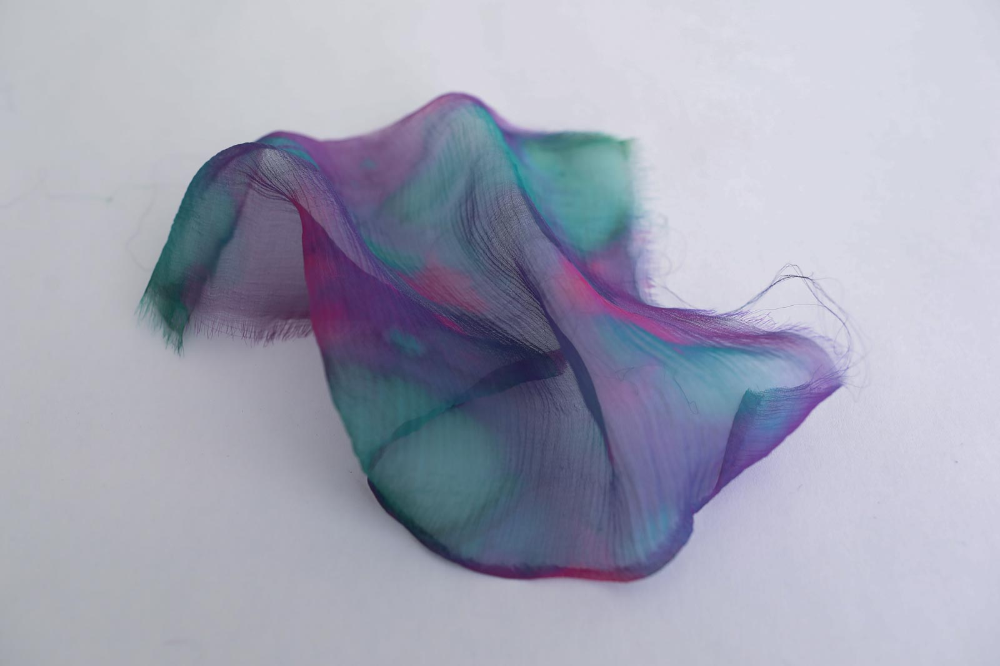*Red cabbage dye on silk, modified with soda (PH 9) and vinegar (PH 2) solution, Loes Bogers, 2020*

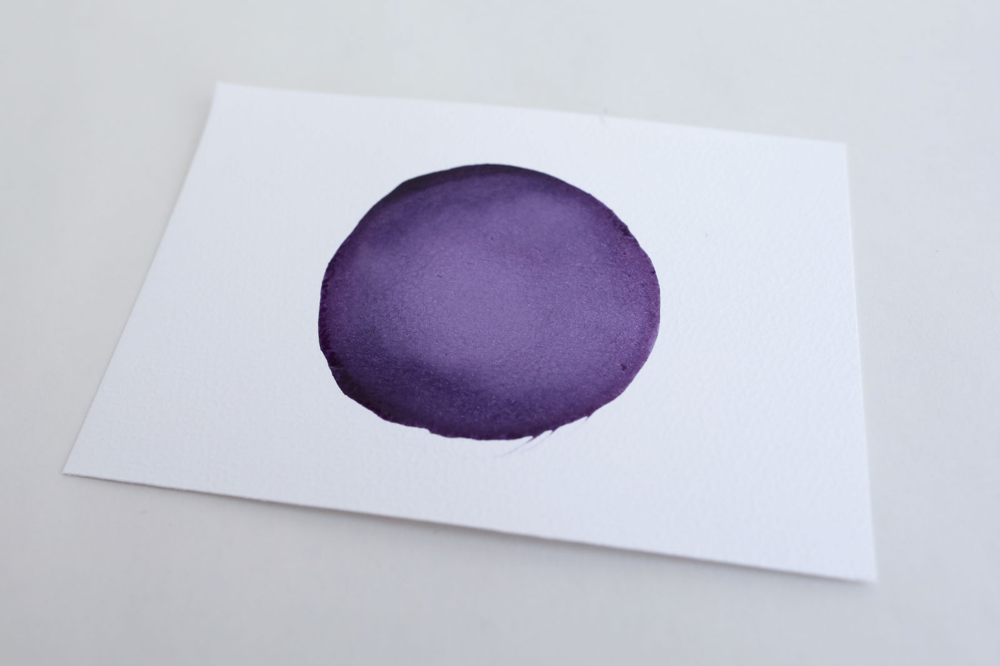*Red cabbage dye on paper, not modified, Loes Bogers, 2020*

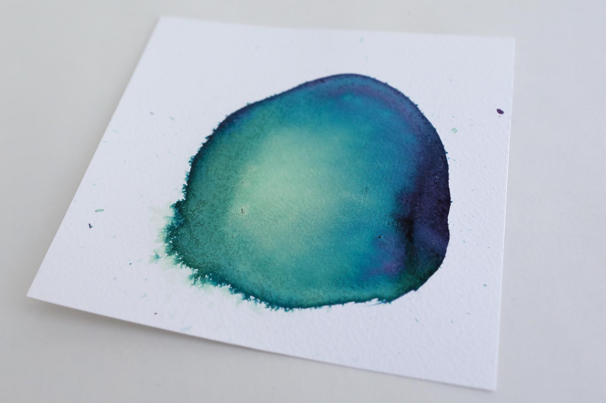*Red cabbage dye on paper, modified with soda (PH 9) solution, Loes Bogers, 2020*

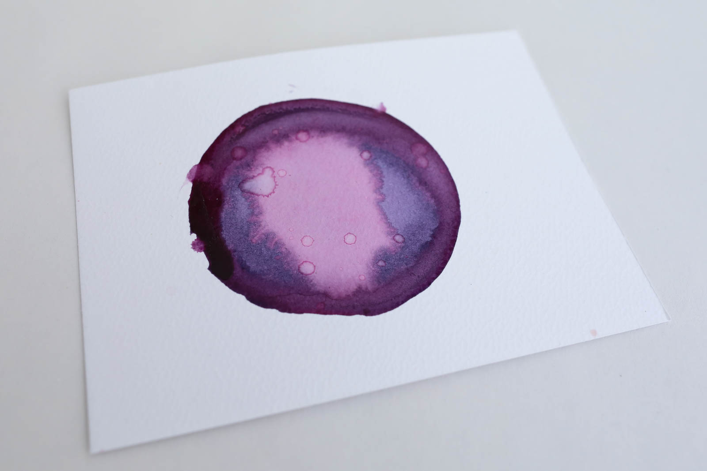*Red cabbage dye on paper, modified with vinegar (PH 2) solution, Loes Bogers, 2020*

##References

- **Make Red Cabbage PH Paper** by Anne Marie Helmenstine for ThoughtCo, 2 February 2020: [link](https://www.thoughtco.com/make-red-cabbage-ph-paper-605993)
- **Biochromes** by Cecilia Raspanti for Fabricademy, 15 October 2019: [link](https://class.textile-academy.org/classes/week04/)
- **Purple** in: The Secret Lives of Color by Kassia St. Clair, 2016: pp. 159-161.
- **Make Ink** by: Jason Logan, 2018.
- **Dyeing** on Wikipedia, n.d. [link](https://en.wikipedia.org/wiki/Dyeing)
- **Vegetable Dyeing: 151 Color Recipes for Dyeing Yarns and Fabrics with Natural Matters** by Alma Lesch, Watson Guptill: 1970.
- **Natuurlijk verven: textielverven op ecologische wijze**, by Roos Soetekauw, Thesis about natural dyes and dying of wool and silk, 2 May 2011:
 [link](https://issuu.com/roossoetekouw/docs/scriptie_-_natuurlijk_verven_klein)

