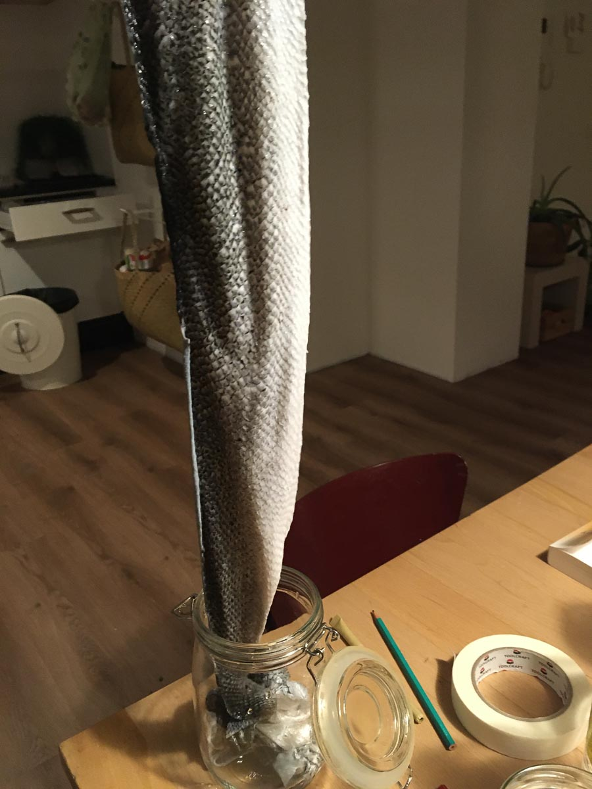
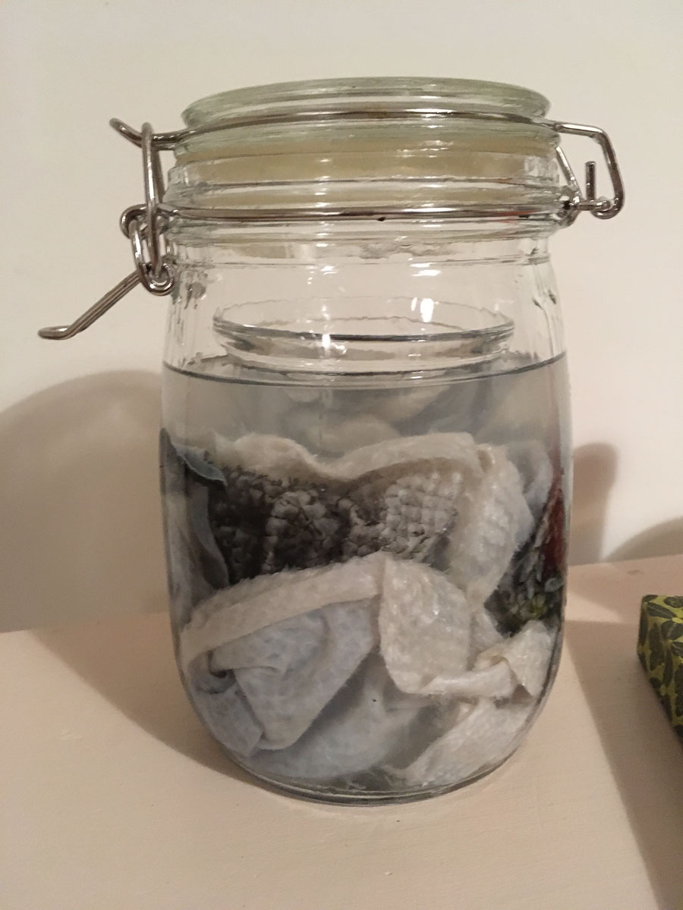
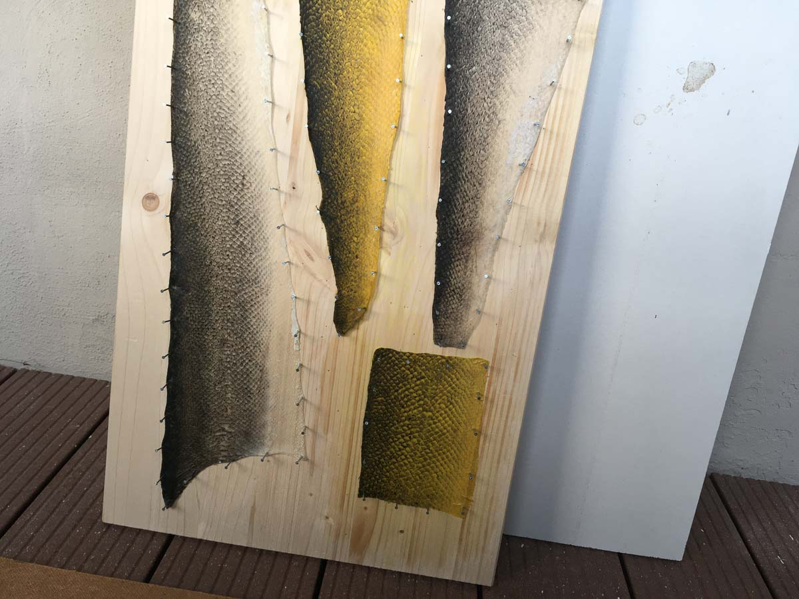
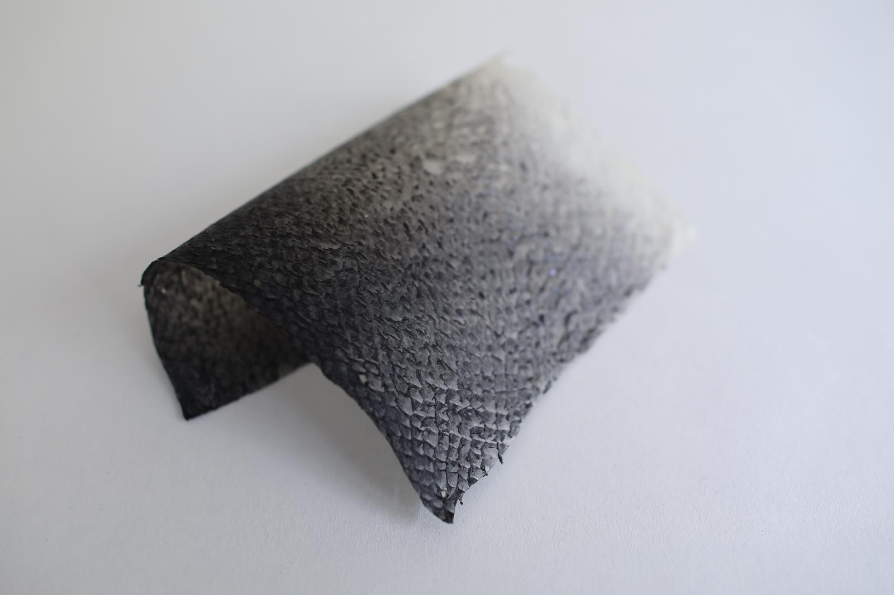
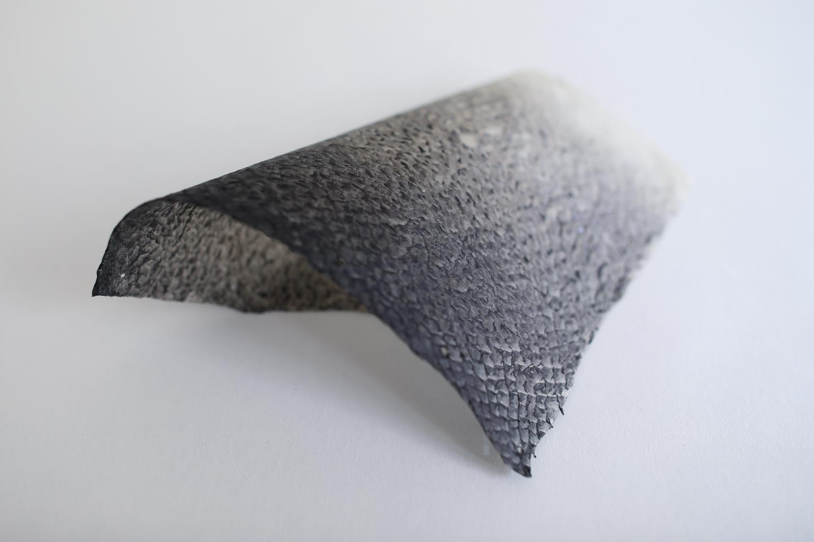
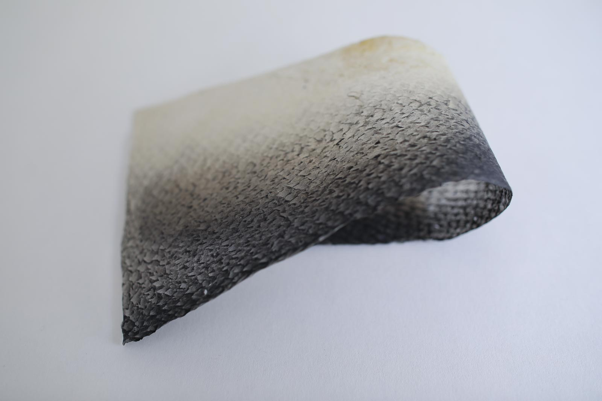
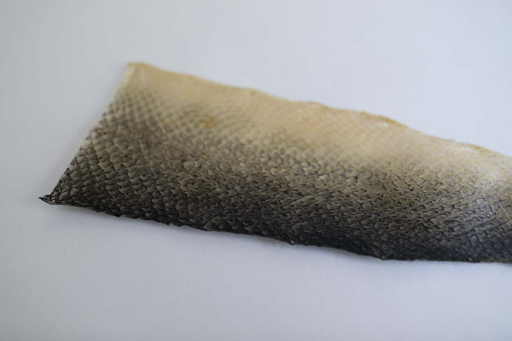
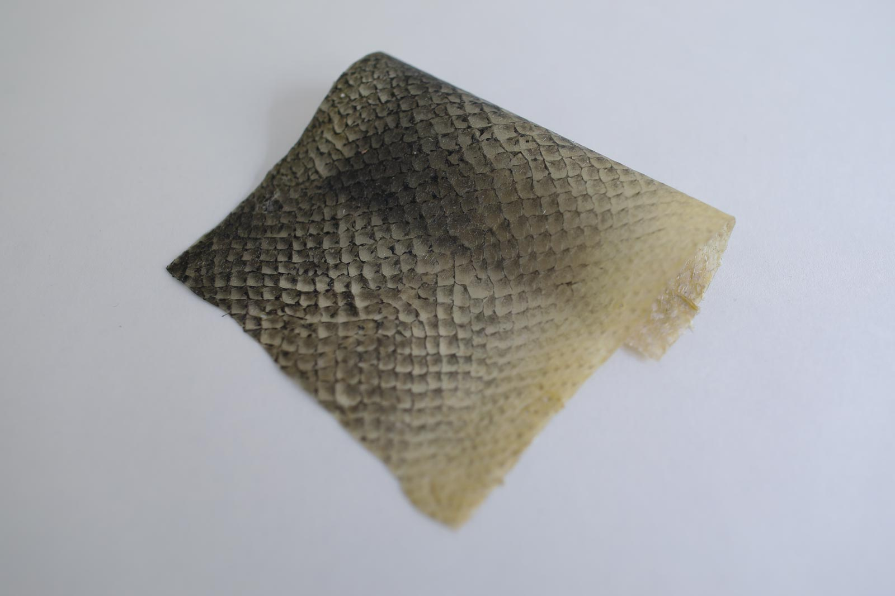

# TANNED FISH SKIN

<iframe width="560" height="315" src="https://www.youtube.com/embed/M7Jz0gQ61vw" frameborder="0" allow="accelerometer; autoplay; encrypted-media; gyroscope; picture-in-picture" allowfullscreen></iframe>

*Tanned salmon skin without using glycerine as softener (post-treatment)*, Loes Bogers, 2020

<iframe width="560" height="315" src="https://www.youtube.com/embed/rlLxRi4YW_A" frameborder="0" allow="accelerometer; autoplay; encrypted-media; gyroscope; picture-in-picture" allowfullscreen></iframe>

*Tanned salmon skin with glycerine applied as softener (post-treatment)*, Loes Bogers, 2020

##GENERAL INFORMATION

Very strong, translucent tanned fish skin that varies from stiff and a little rigid to flexible/soft and malleable when treated with a softener. The feeling of this tanned and dried fish skin is more like thick paper than leather of cow hide. It has a similar braking surface friction. It is thinner than leather of mammal hide, but equally strong if not stronger. 

**Physical form**

Surfaces 

Color without additives: color of the fish skin

**Fabrication time**

Preparation time: 1 Hours

Processing time: 1 week

Need attention: every 2 hours, to shake the jar (the first 3 days)

Final form achieved after: 1 week

**Estimated cost (consumables)**

1,10 Euros, for a yield of approx. 400 ml tanning liquid that is used once (cost of the liquid is about 3,30 euros but can be used at least 3 times, if not more). Fish skins can be obtained for free as waste from friendly local fish mongers. 

##RECIPE

###Ingredients

* **Fresh uncooked fish skins**, e.g. salmon skins
	* the amounts below are enough for 1 large fish skin
* **Denatured alcohol 96%** - 200 ml
	* stabilizer: denatures ("kills") and removes the collagen from the cells to prevent the tissue from rotting and disintegrating after drying
	* optional: substitute part of the alcohol with a mix of alcohol and a natural alcohol-based ink)
* **Glycerine** - 200 ml
	* lubricant: softens the leather and adds flexibility
* **Dish washing soap (eco)** - 5 ml

###Tools

1. **Big glass jar**, with tight fitting lid
	* to fit all the fish skins
1. **Blunt scraping tool**
	* to remove any fish and fat from the skins
1. **Large wooden board**
	* to dry and stretch the fish skins on
1. **Hammer and nails**
	* to nail the fish skins to the board for drying

###Yield 

3 skins 

###Method

1. **Preparing the fish skins**

	- Scrape all the meat, fat and membrane off the fish skins with a blunt scraping tool. Really clean it all off, the skin can take some handling. 
	- Wash the fish skins thoroughly with cold soapy water (some say to leave it for a day to remove slime)
	- Rinse the fish skins with cold tap water

1. **Prepare the tanning liquid**

	- Put the glycerine and the alcohol in a glass jar 
	- Sumberge the fish skin in it and shake vigourously for 1 min
	- Put a little weight on top if the skin is not submerged (take out before shaking!)

1. **Tanning process**

	- Keep the fish skins in the jar for 3 days 
	- Shake the jar vigourously for 1 min every few hours, (or at least once a day)

1. **Drying process**
	- After three days, take out the skins (keep the tanning liquid for next time)
	- Optional: rinse the fish in cold soapy water, and rub some additional glycerine onto the fish (both sides), for a soft, flexible fish leather.
	- Nail the skins to the wooden board. This prevents them from curling and shrinking. Don't make it too tight (it can tear at the nails). 
	- Leave the board to dry outside, on a balcony or near an open window.
	- When completely dry, take them off the board. 
	
###Drying/curing/growth process

Drying the skins with the scales facing down (towards the wood), results in a smoother surface. 

- Mold depth:  N/A
- Shrinkage thickness       0-5%
- Shrinkage width/length     0-5%

**Shrinkage and deformation control**

Nailing them to a wooden board stretches them and prevents shrinkage and curling.

**Curing agents and release agents**

N/A

**Minimum wait time before releasing from mold**
A week to dry and reduce the fishy smell. 

**Post-processing**
N/A

**Further research needed on drying/curing/growth?**

Not sure

###Process pictures

*Putting the skins inside a jar, Loes Bogers, 2020*

*Tanning the skins, Loes Bogers, 2020*

*The skins nailed to a board for drying (some plain and some with turmeric alcohol-based ink), Loes Bogers, 2020*

###Variations

- Add natural *alcohol-based* colorants to dye the fish skins (e.g. turmeric, hibiscus, or grated beetroot/red cabbage: submerge in alcohol and shake every hour for a day).
- Other softeners to try: leather balm, coconut oil, other oils
- Putting a fish skin in the oven for 5-10 minutes at low heat (70 degrees Celcius), it turns highly flexible.
-  Make a suede-like soft leather by tanning the fish skins in boiled linseed oil. Add a rock or something heavy to create a lot of friction when shaking the container. Take the fish out to dry, repeat if it is not soft enough. There are several linseed oils out there. Raw is often used for outdoors use and contains less chemicals and petrol-based drying agents but dries a lot slower and can stay sticky. The technique used with raw linseed oil is similar to they way fishing nets are impregnated to stand the harsh conditions at sea. 

##ORIGINS & REFERENCES

**Cultural origins of this recipe**

Traditional tanning techniques are centuries old and have been practiced by peoples in most of the Nordic countries (Denmark, Finland, Iceland, Norway), the Joepik in Alaska, the Nanai in Siberia, the Inuit in Canada and Greenland. It is practiced all around the world (e.g. along the Nile in Kenya, in Mexico and in Australia). Originally, the involved tanning acids from e.g. oak and chestnut bark, urine, or alternatively with egg yolk and vegetable oil and then cold-smoked over fire to make it water-proof (also prevents mold and bacteria growth). Alutiiq artist June Simeonoff Pardue has been credited for this non-traditional tanning process with alcohol and glycerine. Fish skin can also be cleaned and dried without tanning. 

**Needs further research?**   Not sure

###Key Sources

- **Fish Skin Tanning** from the 6-8th grade Heritage Kit Curriculum, by Chugachmiut Heritage Preservation, Anchorage, Alaska USA: [link](https://chugachheritageak.org/pdf/CLO_6-12%20_FISH_SKIN_TANNING_Final.pdf)
- **Biofabricating Materials** by Cecilia Raspanti for Fabricademy 2019-2020: [link](https://class.textile-academy.org/classes/week05A/)

###Copyright information 

This recipe was originally published as **Fish Skin Tanning** in the 6-8th grade Heritage Kit Curriculum, by Chugachmiut Heritage Preservation, Anchorage, Alaska USA: [link](https://chugachheritageak.org/pdf/CLO_6-12%20_FISH_SKIN_TANNING_Final.pdf)

It is unclear if copyright rests on this publication. Further research is required. 

##ETHICS & SUSTAINABILITY

- This technique is strongly associated with indigenous cultures. Using them - especially without crediting it as cultural heritage - is controversial.
- The process is smelly, but the finished product is nearly odorless if done well
- This material is animal-based (but the production & tanning process is significantly eco-friendlier process than those of e.g. cow hide.
- Denatured alcohol is harsh on skin but not dangerous, don’t use on open skin however.
- Choosing fish that are not locally abundant or known to be overfished is considered problematic. Try to find fish from sustainable fishing industries, and fish that is in-season, or the bycatch from local fishing industry. 

**Sustainability tags**

- Renewable ingredients: yes
- Vegan: no
- Made of by-products or waste:  yes
- Biocompostable final product:  yes, but only professionally (home composting of animal-based materials is not allowed in the EU)
- Re-use: the tanning liquid can be reused

Needs further research?:  Not sure

Fish skins are considered a waste product of the fishing industry and are often trashed as many people tend to favour fish fillets without skin.

##PROPERTIES

- **Strength**: strong
- **Hardness**: variable
- **Transparency**: translucent
- **Glossiness**: matt
- **Weight**: light
- **Structure**: closed
- **Texture**: rough/medium
- **Temperature**: warm
- **Shape memory**: high
- **Odor**: moderate (after thorough drying)
- **Stickiness**: low
- **Weather resistance:** needs further research
- **Acoustic properties:** needs further research
- **Anti-bacterial:** needs further research
- **Non-allergenic:** needs further research
- **Electrical properties:** needs further research
- **Heat resistance:** low
- **Water resistance:** waterproof/needs further research on stitching methods
- **Chemical resistance:** needs further research
- **Scratch resistance:** high
- **Surface friction:** medium/variable
- **Color modifiers:** none 

##ABOUT

**Maker(s) of this sample**

- Name: Loes Bogers
- Affiliation: Fabricademy student at Waag Textile Lab Amsterdam
- Location:  Rotterdam, the Netherlands
- Date: 24-02-2020 – 02-03-2020

**Environmental conditions**

- Humidity:  40-50%
- Outside temp:  5-11 degrees Celcius
- Room temp:  18 – 22 degrees Celcius
- PH tap water:  7-8

**Recipe validation**

Has recipe been validated? Yes, by Cecilia Raspanti, TextileLab, Waag Amsterdam, 9 March 2020

**Images of the final sample**

*Tanned salmon skin (no colorant, glycerine softener), Loes Bogers, 2020*

*Tanned salmon skin (no colorant, glycerine softener), Loes Bogers, 2020*

*Tanned salmon skin (no colorant, no softener), Loes Bogers, 2020*

*Tanned salmon skin (dyed with turmeric, no softener), Loes Bogers, 2020*

*Tanned salmon skin (dyed with turmeric, glycerine softener, Loes Bogers, 2020*

##REFERENCES

- **Fish Skin Tanning** from the 6-8th grade Heritage Kit Curriculum, by Chugachmiut Heritage Preservation, Anchorage, Alaska USA: [link](https://chugachheritageak.org/pdf/CLO_6-12%20_FISH_SKIN_TANNING_Final.pdf)
- **Interview with skin sewer June Pardue** by Anchorage Museum & Smithsonian Arctic Studies Center on Youtube, 16 January 2015: [link](https://www.youtube.com/watch?v=3GUf8Ao5vNY)
- **Making Leather from Fish Skins** by Eva Hopman, for Hunebed Café, n.d.: [link](https://www.hunebednieuwscafe.nl/2017/10/making-leather-from-fish-skin/)
- **Biofabricating Materials** by Cecilia Raspanti for Fabricademy 2019-2020: [link](https://class.textile-academy.org/classes/week05A/)
- **Bio Materials** by Laura Luchtman for Textile Academy, 14 November 2016: [link](https://textileacademy.eu/laura-luchtman/)
- **Preservation of Fish Nets** by Harden Franklin Taylor, U.S. Bureau of Fisheries, 1920: pp. 22-26: [link](https://play.google.com/books/reader?id=ZSwlAQAAMAAJ&hl=en&pg=GBS.PA5)

