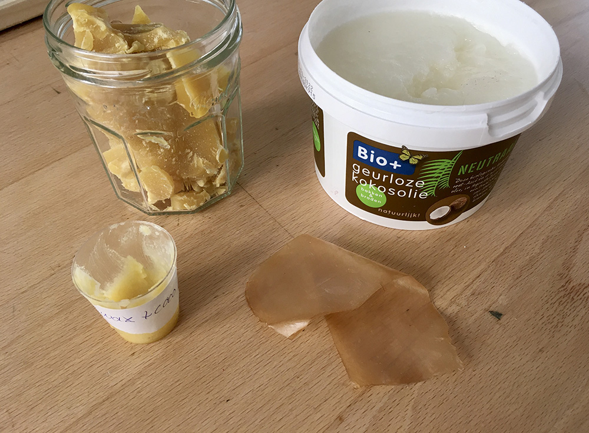
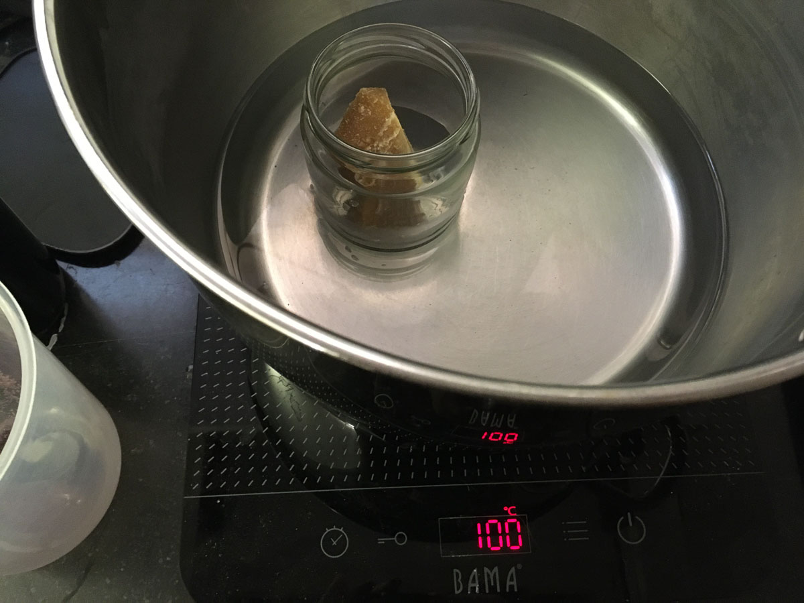
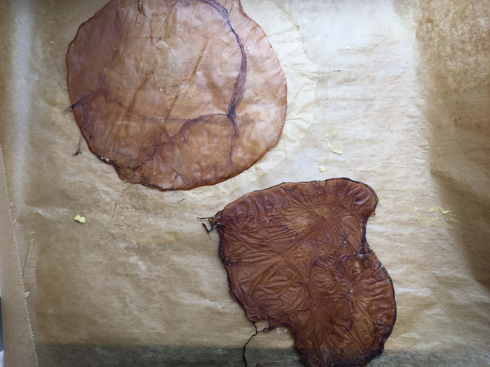
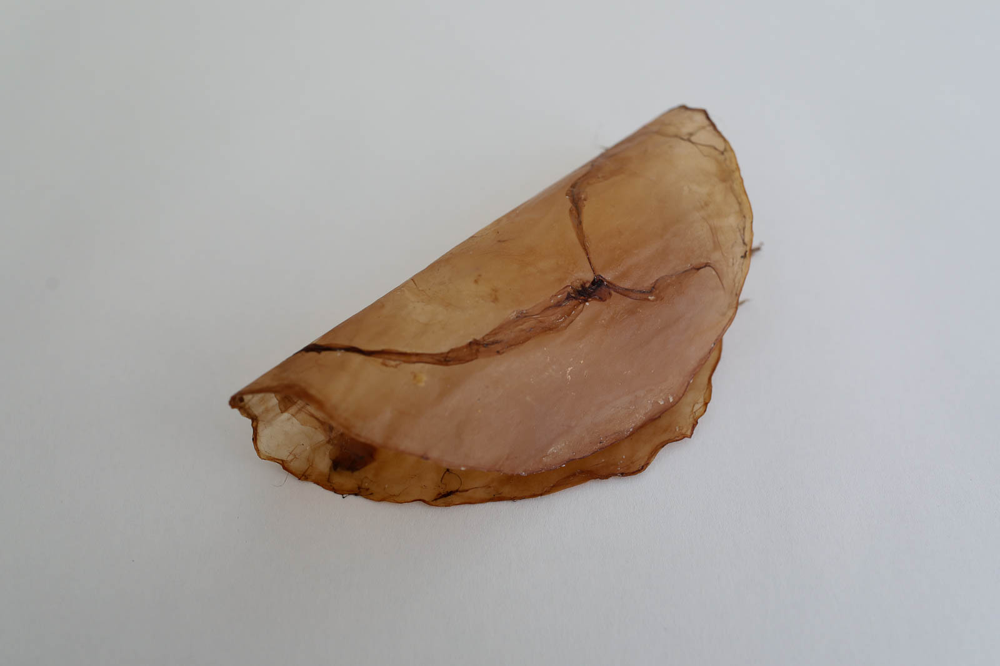
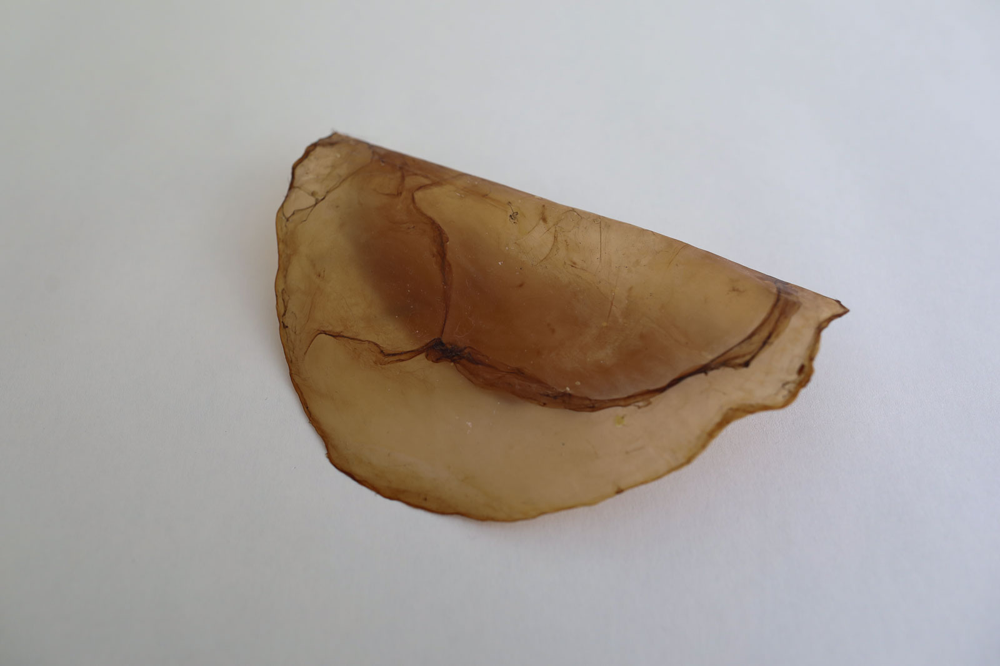
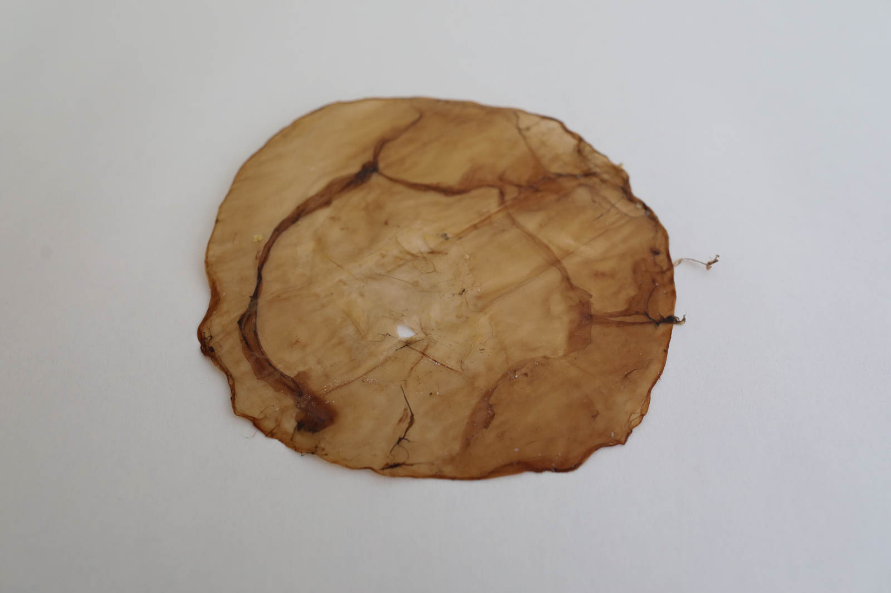

# KOMBUCHA PAPER/LEATHER

<iframe width="560" height="315" src="https://www.youtube.com/embed/XaFScq8vYMQ" frameborder="0" allow="accelerometer; autoplay; encrypted-media; gyroscope; picture-in-picture" allowfullscreen></iframe>

##GENERAL INFORMATION

This is a thin translucent bacterial cellulose material resembling paper, made of a dried 3-5mm kombucha SCOBY cellulose pellicle. The kombucha paper is translucent, sometimes with visible traces of the yeast and bacteria strings. The color varies with the liquid the SCOBY was grown in. It is comparable to parchment paper or tracing paper in terms of sound and translucence, but has less uniform shape, thickness and color. Yeast strains that may be browner etc, give the finished product a type of "grain" like wood or leather might have. 

**Physical form**

Surfaces

Color without additives: varies, often yellow/brown-ish

**Fabrication time**

Preparation time: 1 Hour

Processing time: 5 days

Need attention: every day

Final form achieved after: 5 days

**Estimated cost (consumables)**
0,64 Euros, for a yield of one piece of paper

##RECIPE

###Ingredients

* **Kombucha SCOBY pellicle** - 1 piece of 5-7 mm thickness for paper-like materials, or 8-15 mm for leather-like material. Grow one with [this recipe](https://class.textile-academy.org/2020/loes.bogers/files/recipes/kombuchascoby)
* **Coconut oil** - 1 tbsp (15 ml)
* **Beeswax, melted** - 1 tbsp (15 ml)

###Tools

1. **Gloves**
1. **A glass jar**, to mix the treatment
1. **A pot**, big enough to put the glass jar in (bain marie)
1. **A spoon**, for stirring
1. **A cooker**
1. **A silicone mat**, to dry the paper on, baking paper also works.
1. Optional: a brush

###Yield 

One sheet of kombucha paper.

###Method

1. **Preparing the after-treatment for a kombucha sheet**

	- Take the kombucha sheet out of its bath, wash in soapy cold water and dry it off with some kitchen paper. Put it on the silicone mat. Some kombucha SCOBY's will be a bit uneven and might have a hole or a tear. You can rearrange it a bit and put these bits back together, in the drying process these parts will reattach if they're overlapping. 
	- Melt the beeswax so you can take one tablespoon of it. (Put a chunk of wax in a glass jar that I melt au bain marie. You can then let it cool inside the jar where I store it for later).
	- Warm up a bit of coconutoil so it becomes liquid (you can use the bain marie)
	-  Mix the liquid bees wax and coconut oil and store in a container.

	
1. **Applying the water-proofing treatment**
	
	- Place the kombucha pellicle on a smooth surface for drying 
	-  Apply the coconut oil/beeswax mixture to one side of the kombucha sheet with a brush or with your fingers. Massage it in. 
	- Let the kombucha sheet dry for a few days
	- Peel the sheet off, turn over, and apply the treatment to the other side.  

1. **Drying and pressing**

	- Leave to dry again. When the sheet is fully dehydrated, any excess treatment can be wiped off with a paper towel.
	- Once dry, press it between baking paper under a stack of heavy books so it becomes totally flat and even.

###Drying/curing/growth process

- Thickness before drying:		5 mm for thin paper-like sheets, 8-12 mm for leather-like material
- Shrinkage thickness       70-80%
- Shrinkage width/length     0-10 %

**Shrinkage and deformation control**

Do not peel it the kombucha scoby off the silicone mat in between stages. Just let it be to get a very flat sheet. It will start to curl if you take it off the mat and manipulate it a lot. 

**Curing agents and release agents**

None, any flexible surface to dry the sheet on will work fine as long as you can peel it off (don't use acrylic or glass sheets, it will get stuck). Use vaseline as release agents for other types of moulds. 

**Minimum wait time before releasing from mold**
3-7 days or when dry

**Post-processing**
Keep pressed for a few more days. Store dry and flat, add some rice as desiccant.

**Further research needed on drying/curing/growth?**

Not sure

###Process pictures

*Ingredients for the pellicle treatment, Loes Bogers, 2020*
*Melting the beeswax au bain marie, Loes Bogers, 2020*
*Two kombucha papers: one that was left alone during the drying process (top), one that was moved and lifted during the drying process (bottom), Loes Bogers, 2020*

###Variations

- The same process can be used to create more leather-like sheets. Follow the exact same recipe but use a SCOBY that grew into 8-15 mm thickness instead of 3-5mm. 
- The kombucha paper takes on the shape it dries in, try drying the paper on top of a mold to let it dry and contract into a 3D shape. Use vaseline as a release agent. 
- Dye the pellicle before oiling and drying, by dipping it into a concentrated natural dye. It takes on dye quite well.  
- Other treatments have been suggested to make the leatherlike pellicles more water resistant. Without a sealant, the kombucha could become sticky if worn in the rain. Full water resistance can be achieved if using acrylic or oil based sealers, but then the material is no longer safely biodegradable. One such variation consists of one part turpentine, one part boiled linseed oil and one part bees wax (see also th34d5 in the references).
- Other alternatives can be found in treatments for wooden chopping boards (food safe!). [Uulki wood oil & wax](https://www.uulki.com/en/shop/uulki-natural-wood-wax-cutting-boards/) is one that creates nice smooth results when applied to the wet pellicle. It's a Belgian product and is 100% vegan (if you don't want to use bees wax), and contains no mineral oils or solvents. Apply this treatment **after** drying. 
-  If your SCOBY pellicles are very uneven, you can also puree them with a blender, and spread the puree out to dry. Apply after-treatment when dry in this case.

##ORIGINS & REFERENCES

**Cultural origins of this recipe**

See also the entry for [Kombucha SCOBY](https://class.textile-academy.org/2020/loes.bogers/files/recipes/kombuchascoby/) Using Kombucha SCOBY's as a design material took off most notably after Suzanne Lee's Ted talk "Grow Your Own Clothes" in 2011. And the use of kombucha cellulose as vegan leather has been further developed and shared by many other initiatives like thr34d5, the fashion department of Queensland University of Technology and scientists from The Edge, State Library of Queensland, Australia. 

Besides for leather alternatives, thinner Kombucha SCOBY pellicles like the one described here, has also be used in the production of food packaging, such as Emma Sicher's from Peel to Peel project where she also documents the process and experiments beautifully. 

**Needs further research?**   Not sure

###Key Sources

- **Open Source Kombucha**, by thr34d5. n.d., [link](https://thr34d5.org/2019/08/28/open-source-kombucha/)
- **Biofabricating Materials** by Cecilia Raspanti for Fabricademy 2019-2020: [link](https://class.textile-academy.org/classes/week05A/)

###Copyright information 

thr34d5's recipe is published under a Creative Commons Attribution Share Alike 4.0 Licence. Raspanti's recipe is shared under a CC Attribution, non-commercial licence. 

##ETHICS & SUSTAINABILITY

Because the SCOBY scan regrow itself infinitely with a bit of water, tea and sugar, and can be composted, it's a relatively uncontroversial material but still requires resources and more importantly, a lot of time. Especially in colder climates it is tempting to use heating to speed up the growth. As a material, it is still very much in development.

Other suggested post-treatments may contain boiled linseed oil and turpentine, or mineral oil (e.g. vaseline). These are not eco-friendly products: turpentine and mineral oil are petrol-based (by-products), and boiled linseed oil contains all sort of chemicals for faster drying. There is room for improvement in the area of techniques and compounds to make the pellicles stronger, water resistant and more durable. That said, beeswax might be a no-go as it's an animal product, and coconut oil has been linked to child labour and monkey labour. So always research the sources and production ethics of companies where you are buying. 

**Sustainability tags**

- Renewable ingredients: yes
- Vegan: yes
- Made of by-products or waste:  yes
- Biocompostable final product:  yes
- Re-use: you can continue to use SCOBYs to grow more SCOBY, more kombucha, more is more. 

Needs further research?:  Not sure

##PROPERTIES

- **Strength**: variable; paper is more fragile, thicker pellicles are very strong.
- **Hardness**: resilient
- **Transparency**: translucent
- **Glossiness**: matt
- **Weight**: light
- **Structure**: closed
- **Texture**: medium
- **Temperature**: medium
- **Shape memory**: high
- **Odor**: moderate (the smell of fermentation and the treatment linger but largely disappear eventually)
- **Stickiness**: low
- **Weather resistance:** needs further research
- **Acoustic properties:** needs further research
- **Anti-bacterial:** needs further research (anti-microbial properties have been suggested)
- **Non-allergenic:** needs further research (bio-compatibility has been suggested)
- **Electrical properties:** needs further research
- **Heat resistance:** low
- **Water resistance:** water resistant after treatment
- **Chemical resistance:** needs further research
- **Scratch resistance:** moderate
- **Surface friction:** medium
- **Color modifiers:** none 

##ABOUT

**Maker(s) of this sample**

- Name: Loes Bogers
- Affiliation: Fabricademy student at Waag Textile Lab Amsterdam
- Location:  Rotterdam, the Netherlands
- Date: 13-03-2020 – 20-03-2020

**Environmental conditions**

- Humidity:  40-50%
- Outside temp:  5-11 degrees Celcius
- Room temp:  18 – 22 degrees Celcius
- PH tap water:  7-8

**Recipe validation**

Has recipe been validated? Yes, By Cecilia Raspanti, TextileLab, Waag Amsterdam, 9 March 2020

**Images of the final sample**
*Kombucha paper, Loes Bogers, 2020*

*Kombucha paper, Loes Bogers, 2020*

*Kombucha paper, Loes Bogers, 2020*

##References

- **Open Source Kombucha**, by thr34d5. n.d., [link](https://thr34d5.org/2019/08/28/open-source-kombucha/)
- **Biofabricating Materials** by Cecilia Raspanti for Fabricademy 2019-2020: [link](https://class.textile-academy.org/classes/week05A/)
- **Grow your own clothes** TED talk by Suzanne Lee, 2011: [link](https://www.ted.com/talks/suzanne_lee_grow_your_own_clothes?language=en)
- **Kombucha Fashion** by Cameron Wilson, Peter Musk and Jimmy Eng for the The Edge, State Library of Queensland, n.d. [link](https://wiki.edgeqld.org.au/doku.php?id=workshops:public:kombucha_fashion:start)
- **QUT reveals how you can make your own leather at home** by The Conversation, republished by SmartCompany, 24 November, 2016: [link](https://www.smartcompany.com.au/startupsmart/advice/startupsmart-growth/startupsmart-innovation/qut-reveals-how-you-can-make-your-own-leather-at-home/)
- **From Peel to Peel** by Emma Sicher, n.d. [link](https://frompeeltopeel.tumblr.com/)
- **Palm vs. Coconut Oil: What's the more Sustainable Choice?** by Nithin Coca for *Pulitzer Center*, 8 April 2020, [link](https://pulitzercenter.org/reporting/palm-vs-coconut-oil-whats-more-sustainable-choice)

