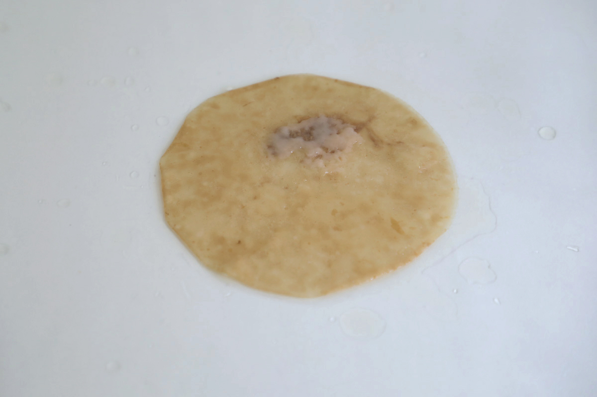
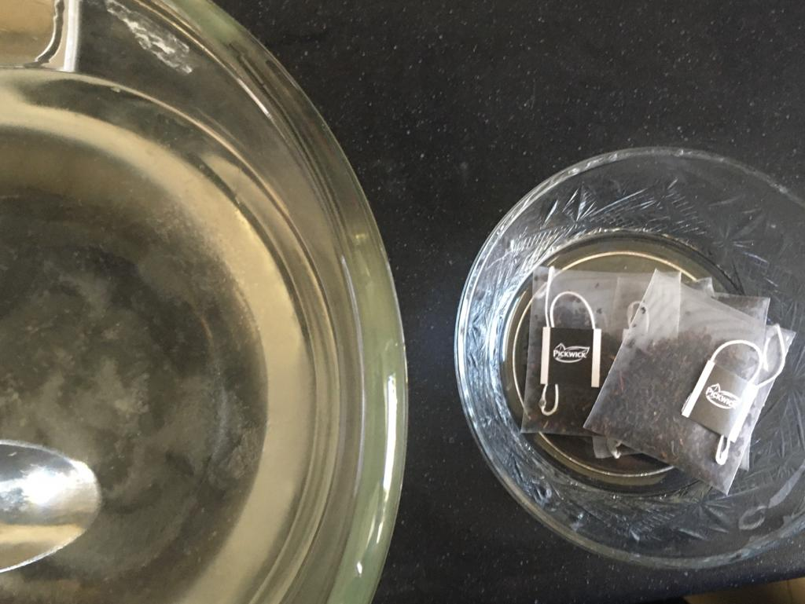
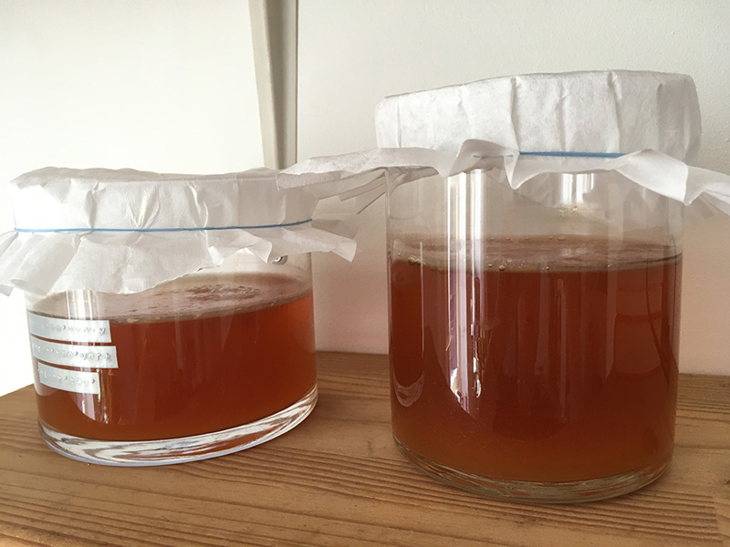
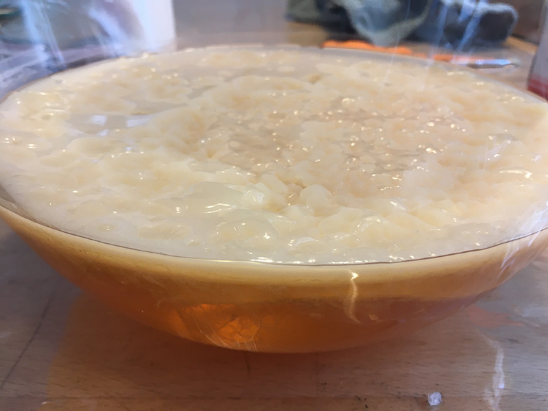
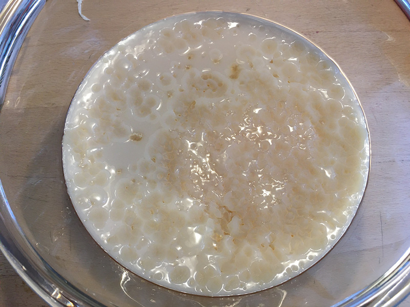

# KOMBUCHA SCOBY

*A young kombucha SCOBY pellicle, Loes Bogers, 2020*

##GENERAL INFORMATION

This is a recipe to grow a cellulose pellicle from a living microbial culture. The bacteria cultivated here is called *acetobacter* and can be found in a fermented tea drink called kombucha. This recipe describes how to cultivate a kombucha SCOBY (Symbiotic Culture Of Bacteria and Yeast), which is often used to ferment sugary tea, because it can transform sugars into acids. Acetobacter is one of the important bacteria in the bacteria/yeast culture, and requires oxygen to live and grow; it is *aerobic*. As a result it slowly forms a cellulose pellicle where the liquid is in contact with air (i.e. at the surface). 

When dried, the cellulose pellicle can be used as leather alternatives and paper-like thin materials. Following this procedure will grow a thin pellicle to start with, it will get thicker as you start to use it more. See also this [recipe for Kombucha Paper](https://class.textile-academy.org/2020/loes.bogers/files/recipes/kombuchapaper/). 

*Note: this recipe is meant to provide tips on how to make a microbial _material_. Whereas the process is safe to do, it does not cover a process for human consumption per se, and cannot guarantee food safe practices. Don't consume your SCOBY or kombucha tea until you have thoroughly informed yourself on safe fermentation processes. When in doubt, throw it out.*

**Physical form**

Surfaces

Color without additives: varies, may be white transparent with darker areas, or get yellow brownish yeast strands. 

**Fabrication time**

Preparation time: 2 hours (incl cooling)

Processing time: 21 days or more

Need attention: check for mold growth and irregularities every few days.

Final form achieved after: 3-5 weeks if all goes well. 

**Estimated cost (consumables)**

Approx. 6,15 Euros for a yield of initially two, but eventually infinite cellulose pellicles if kept alive with more sugar and tea or other nutrient. 

##RECIPE

###Ingredients

There are various ways to do this and different methods work for different people, also depending on the temperature in your home. Here we use the living culture from store-bought kombucha and add some extra nutrients by preparing some sugary black tea for it to grow a little faster. This recipe helps you start, but growing a healthy culture can take multiple cycles, so don't give up!

Try to work as sterile as possible throughout. 

* **Kombucha drink with live culture (raw), without flavouring** 
	* used here: Yaya Kombucha Original (Ekoplaza supermarket)
	* 660 ml (2x 330 ml) or just make sure to make a 2:1 ratio of raw kombucha and sugary tea).
	* we will cultivate the live bacteria in the drink and grow them into a solid cellulose pellicle
	* some say it's best to find a bottle that already has some blobs of culture (baby scoby's) sitting at the bottom. 
* **Denatured alcohol 96%, or white vinegar** to desinfect all your tools and pots
* **Two large round coffee filters**, or clean cloth like a tea towel, to prevent contamination by fruit flies
* **Two rubber bands** to prevent contamination by fruit flies
* **Water - 330 ml**,  to make black tea
* **1 tea bag of black tea**, organic simple black tea such as ceylon, darjeeling or English breakfast are good options. 
* **(organic) sugar - 30 g**, white sugar or cane sugar.
* Optional: a splash of vinegar if your water is alkaline

###Tools

1. **Two glass jars** try to get a wider ones, min 10 cm diameter
1. **A pot** 
1. **Kitchen paper**
1. **Anti-bacterial soap** to wash your hands
1. **A scale**
1. **A spoon**
1. **A thermometer**
1. **PH paper**

###Yield 

2 cellulose pellicles if all goes well. They will grow the same size and shape as the diameter of the jars you grown them in. 

###Method

1. **Create a sterile environment**

	- Wash your hands with soap for at least 20 seconds
	- Sterilize all your tools with 95% denatured alcohol or white vinegar.
	- If you don't have alcohol: sterilize with hot water. Don't put cold glass inside hot water! It will break. Heat up slowly.  

1. **Prepare the sugary tea**

	- Boil the water
	- Add the teabag and turn off the heat. Let the tea brew for 5 minutes (for black tea, or 3 minutes for green tea)
	- Take out the teabags with a sterile tool
	- Let it cool all the way down to 30 degrees Celcius (so you don't kill the bacteria of the kombucha). 

1. **Mix in the kombucha and seal**
	- Make sure all is sterile - maybe wash your hands again? 
	- Mix in the store-bought kombucha and stir
	- Measure the PH of the mixture. It should be between PH 4 - PH4.5 if it is more acidic than that (lower values) make more tea to bring the values up. The fermentation process will produce acids that bring the PH down eventually. 
	- Distribute your kombucha/tea mix into the sterilized jars
	- Seal them with a coffee filter and a rubber band to prevent fruit flies from going in. You don't want their larvae in your SCOBY. You want to ensure air flow without letting any bugs in. You can also do this with a clean cloth, but make sure the mesh is small enough. 

1. **Let it grow**
	- Put it in a warm place but away from direct sunlight (preferably in the dark, like a cupboard), and leave it for 2-3 weeks, or until it has grown 5-8 mm thick (to create paper-like cellulose) or closer to 10-15 mm thick, to grow for leather-like pellicles. 
	- Do NOT move the jars, the pellicle will sink and you will have to start over
	- Check regularly for unusual growth. Ideally your SCOBY becomes a thick white-ish film floating on top of the liquid. But it takes many forms and can definitely look funny. Learn how to discriminate between a heathy SCOBY and fungal or yeast growth. The resources from [Kombucha Camp](https://www.kombuchakamp.com/kombucha-mold-information-and-pictures) are a good starting point. 

1. **Use your SCOBY**

	- If it has grown to a thickness of minimum 5 mm you can use your SCOBY pellicle to make paper or leather (or kombucha tea) see [this recipe for Kombucha paper](https://class.textile-academy.org/2020/loes.bogers/files/recipes/kombuchapaper/). Take it out with clean hands!
	- and/or: re-use the liquid to grow more pellicles, it now has more living culture in it.	
		- wash your hands and sterilize your tools again?
		- make some more sugary tea as described above and add it to the liquid from the previous brew. Use at least 25-75% sour liquid from a previous brew (it smells like vinegar).  More mature culture = faster pellicle growth.
		- instead of adding tea, you can also continue brewing by adding sugar and beer. You don't need to dissolve the sugar. 

###Drying/curing/growth process

It is important not to disturb the SCOBY, just leave it in peace. Use glass jars so you can peek inside without touching it. Check for irregular growth. Start over if unsure. 

- Mold depth and diameter: liquid should reach 5-10 cm deep
- Shrinkage thickness       N/A
- Shrinkage width/length    N/A

**Minimum wait time before releasing from mold**
2 weeks, or until it is 5 mm thick (to make paper) or 10-15 mm thick (or more) for leather. 

**Post-processing**

Make a **SCOBY hotel** to store your SCOBY for later use: 

- Never put it in the fridge
- Instead: learn to make a SCOBY hotel, and perform maintenance every 2-6 months, to keep growing for ever and ever and ever. Kombucha Camp has very good resources to learn this (see references). 
- Also learn how to trim and thin big SCOBY's to learn how to achieve optimal growth. 

**Further research needed on drying/curing/growth?**

Yes, there's a huge kombucha community out there. Get connected and learn all the ins and outs. [This article](http://users.bestweb.net/~om/kombucha_balance/) by Len Porzio is helpful for troubleshooting. You are basically growing bacteria and yeast here, but in the end you want the bacteria (the pancake) to become big and thick and smooth and the kombucha tea is secondary. Len describes ways to balance that out and influence the growth. Know that most of hese recipes have the objective to brew the *tea*, whereas we're looking to grow the pellicle.

Note: there's some confusion about what is the SCOBY. It is interpreted here as the culture of bacteria and yeast as a whole that resides in the liquid *and* the pellicle. When we refer to SCOBY it is the whole whereas other might use the word to refer only to the pellicle. To grow pellicles, you don't need a pellicle per se, but you do need a starter culture (that can be liquid or in the form of the pellicle, or both).

###Process pictures

*Preparing for a few jars, Loes Bogers, 2020*

*Without cover for the picture: some experiments brewing, slowly growing a thin pellicle after two weeks, Loes Bogers, 2020*

*Cover to keep some light out, Loes Bogers, 2020*

###Variations

- Kombucha SCOBY can grow in many different liquids (wine, beer, green/black tea) that each give a different color to the pellicle as well. Natural colorants can be added to the tea (such as hibiscus, beetroot etc). 
- Green tea is said to produce thicker SCOBY pellicles (see also Len Porzio's article listed below), brew green tea for only 3 mins. Or use a mix of black and green tea.
- Try out different treatments for the kombucha, such as coconut oil or other natural and essential oils.
- Research the use of growing mats and temperature controlled boxes to keep your SCOBY at 24 to 30 degrees Celcius for optimal growth and the smallest chance at mold formation. Ideal temperature is 27 degrees celcius. If you use a plant mat, don't put it underneath the jar but rather wrap it around it (otherwise you're more likely to increase yeast growth instead of SCOBY growth). 
- Or try growing a piece of SCOBY (5x5cm) further on 250 ml of dyed water (consider autoclaving it first to sterilize), some of the kombucha starter liquid (up to 250 ml), 50g sugar and 50 ml vinegar. 
- **The NOMA guide to fermentation** is a great resource on microbial growth for safe human consumption that describes how you can make a fermentation chamber form a styrofoam cooler. 
- Try growing a mature piece of SCOBY in other liquids such as **Lorena Trebbi's recipes** using 200 ml (organic) red wine, 200ml water and 40g sugar. Or start a new one with 200 ml raw kombucha tea, 200 ml of organic red wine and 20 g sugar.  
- Or Lorena's **beer version** that grows very fast, using 300 ml (organic) beer, 300 ml water, 60 g sugar and 60 g white vinegar with a SCOBY pellicle (of at least 5x5 cm), see images below. 
- A **simpler variation** on the beer brew is: use starter liquid from a previous brew, add the same amount of beer (just lager is fine), and 120 g of sugar for each added liter of liquid (by Loes Bogers). 

*the SCOBY pellicle from this recipe after continuing to grow it on beer for 2.5 weeks, following Lorena's recipe. The bottom side is totally smooth*

*the SCOBY pellicle from this recipe after continuing to grow it on beer for 2.5 weeks, following Lorena's recipe. The bottom is totally smooth*

##ORIGINS & REFERENCES

**Cultural origins of this recipe**

Kombucha is an ancient Chinese fermented drink made of sweetened green or black tea and yeast and bacteria cultures. It is said to have originated in Manchuria (now Northeast China) and was hailed for its curing qualities. It spread across Asia and later also Russia. It was brought to Europe with the expansion of trade routes in the 1900s where it gained popularity (most notably in Germany and Switzerland, as "Kombuchaschwamm" due to alleged health benefits comparable to those of yoghurt. Initially it was brewed by enthousiasts sharing the mother SCOBY or mushroom with a grassroots community of fermentation lovers, both in Europe and the U.S. Commercial enterprises started to pop up from the mid-90s onwards and recently one of the big kombucha brewers KeVita was purchased by PepsiCo for $200 million. 

Using Kombucha SCOBY pellicles as a design material took off most notably after Suzanne Lee's Ted talk "Grow Your Own Clothes" in 2011. And the use of kombucha cellulose as vegan leather has also been developed and shared by many other initiatives like thr34d5, the fashion department of Queensland University of Technology and scientists from The Edge, State Library of Queensland, Australia. 

**Needs further research?**   Not sure

###Key Sources

- **How to Start Brewing Kombucha Without a SCOBY** by Kathleen Quiring, for Becoming Peculiar, 6 November 2013: [link](http://becomingpeculiar.com/how-to-start-brewing-kombucha-without-a-scoby/)
- **How to Grow a Kombucha SCOBY from Bottled Komucha** by Carol Lovett, for Ditch the Wheat, n.d. [link](https://ditchthewheat.com/how-to-grow-a-kombucha-scoby-from-bottled-kombucha/)
- **How to Grow a Kombucha SCOBY** Kristen Michaelis, 2 February 2018:[link](https://www.foodrenegade.com/how-to-grow-a-kombucha-scoby/)
- **How to Grow a Kombucha SCOBY in just 10-12 days** by Brod and Taylor, n.d. [link](https://brodandtaylor.com/kombucha-scoby/)

###Copyright information 

Techniques for growing kombucha SCOBY are documented widely and considered something of an oral culture that may be 200 to 2000 years old.  Although none can really claim the intellectual rights to such an old recipe, references used are listed under key sources and in the references. 

##ETHICS & SUSTAINABILITY

Needs further research

Because the pellicle can regrow itself infinitely with a bit of water, tea and sugar, and can be composted, it's a relatively uncontroversial material but still requires resources and more importantly, a lot of time. Especially in colder climates it is tempting to use heating to speed up the growth. As a material, it is still very much in development.

Additives and post-treatments to dry and tan the pellicle, like boiled linseed oil and turpentine are not necessarily eco-friendly products. Chemicals are added to boiled linseed oil to make it dry quicker than raw linseed oil for example. There is room for improvement in the area of techniques and compounds to make the pellicles stronger and more durable. 

**Sustainability tags**

- Renewable ingredients: yes
- Vegan: yes
- Made of by-products or waste:  yes
- Biocompostable final product:  yes
- Re-use: you can continue to use the liquid SCOBY to grow more SCOBY pellicles, and more kombucha, more is more. 

Needs further research?:  Not sure

##PROPERTIES

- **Strength**: fragile
- **Hardness**: resilient
- **Transparency**: translucent
- **Glossiness**: glossy 
- **Weight**: medium
- **Structure**: closed
- **Texture**: smooth
- **Temperature**: cool
- **Shape memory**: low
- **Odor**: strong (while growing, can be acidic or other flavours depending on the growth of bacteria and yeast)
- **Stickiness**: low
- **Weather resistance:** N/A
- **Acoustic properties:** N/A
- **Anti-bacterial:** antimicrobial effect on some types of microbes, (see Jayabalan et.al. below) 
- **Non-allergenic:** needs further research
- **Electrical properties:** needs further research
- **Heat resistance:** needs further research
- **Water resistance:** N/A (while alive)
- **Chemical resistance:** low (while alive, will likely kill bacteria)
- **Scratch resistance:** N/A (while alive)
- **Surface friction:** N/A
- **Color modifiers:** none 

##ABOUT

**Maker(s) of this sample**

- Name: Loes Bogers
- Affiliation: Fabricademy student at Waag Textile Lab Amsterdam
- Location:  Amsterdam, the Netherlands
- Date: 20-03-2020-20-03-2020

**Environmental conditions**

- Humidity:  40-50%
- Outside temp:  5-11 degrees Celcius
- Room temp:  18 – 22 degrees Celcius
- PH tap water:  7-8

**Recipe validation**

Has recipe been validated? Yes, by Cecilia Raspanti, TextileLab, Waag Amsterdam, 9 March 2020

**Images of the final sample**

*A young, thin kombucha SCOBY pellicle, Loes Bogers, 2020*

##REFERENCES

- **How to Make Your Own Kombucha SCOBY** by Emma Christensen for Cooking Lessons From the Kitchn, 5 june 2019: [link](https://www.thekitchn.com/how-to-make-your-own-kombucha-scoby-cooking-lessons-from-the-kitchn-202596)
- **How to Start Brewing Kombucha Without a SCOBY** by Kathleen Quiring, for Becoming Peculiar, 6 November 2013: [link](http://becomingpeculiar.com/how-to-start-brewing-kombucha-without-a-scoby/)
- **How to Grow a Kombucha SCOBY from Bottled Komucha** by Carol Lovett, for Ditch the Wheat, n.d. [link](https://ditchthewheat.com/how-to-grow-a-kombucha-scoby-from-bottled-kombucha/)
- **How to Grow a Kombucha SCOBY** Kristen Michaelis, 2 February 2018: [link](https://www.foodrenegade.com/how-to-grow-a-kombucha-scoby/)
- **Kombucha Mold Information and Pictures** by Kombucha CAmp, n.d. [link](https://www.kombuchakamp.com/kombucha-mold-information-and-pictures)
- **SCOBY hotel video quick tip** by Kombucha Camp, n.d. [link](https://www.kombuchakamp.com/scoby-hotel-video-quick-tip)
- **SCOBY hotel maintenance** by Kombucha Camp, n.d. [link](https://www.kombuchakamp.com/scoby-hotel-maintenance)
- **How to Trim SCOBYS: Kombucha Care** by Kombucha Camp, n.d. [link](https://www.kombuchakamp.com/trim-scobys-kombucha-care)
- **The NOMA guide to Fermentation** by René Redzepi and David Zilber, Foundations of Flavour 2018. 
- **Kombucha** by Cecilia Raspanti (Textile Lab, Waag), Fabricademy Class "Biofabricating", 2019, [link](https://class.textile-academy.org/classes/week05A/).
- **How to Grow a Kombucha SCOBY in just 10-12 days** by Brod and Taylor, n.d. [link](https://brodandtaylor.com/kombucha-scoby/)
- **A Review on Kombucha Tea—Microbiology, Composition, Fermentation, Beneficial Effects, Toxicity, and Tea Fungus** by Rasu Jayabalan, Radomir V. Malbaša, Eva S. Lončar, Jasmina S. Vitas, Muthuswamy Sathishkumar, in *Comprehensive Reviews in Food Science and Food Safety*, 21 June 2014: [link](https://onlinelibrary.wiley.com/doi/full/10.1111/1541-4337.12073)
- - **Open Source Kombucha**, by thr34d5. n.d., [link](https://thr34d5.org/2019/08/28/open-source-kombucha/)
- **Biofabricating Materials** by Cecilia Raspanti for Fabricademy 2019-2020: [link](https://class.textile-academy.org/classes/week05A/)
- **Grow your own clothes** TED talk by Suzanne Lee, 2011: [link](https://www.ted.com/talks/suzanne_lee_grow_your_own_clothes?language=en)
- **Kombucha Fashion** by Cameron Wilson, Peter Musk and Jimmy Eng for the The Edge, State Library of Queensland, n.d. [link](https://wiki.edgeqld.org.au/doku.php?id=workshops:public:kombucha_fashion:start)
- **QUT reveals how you can make your own leather at home** by The Conversation, republished by SmartCompany, 24 November, 2016: [link](https://www.smartcompany.com.au/startupsmart/advice/startupsmart-growth/startupsmart-innovation/qut-reveals-how-you-can-make-your-own-leather-at-home/)
- **Kombucha 101: Demystifying the Past Present and Future of the Fermented Tea Drink** by Christina Troitino for Forbes, 1 Feb 2017:[link](https://www.forbes.com/sites/christinatroitino/2017/02/01/kombucha-101-demystifying-the-past-present-and-future-of-the-fermented-tea-drink/)
- **Why is PH important for brewing kombucha?** by Fermentaholics, n.d.: [link](https://fermentaholics.com/why-is-ph-important-for-kombucha/)
- **Kombucha: the balancing act** by Len Porzio, n.d. [link](http://users.bestweb.net/~om/kombucha_balance/)
- **What's in my kombucha?** by Cultures for Health, n.d. [link](https://www.culturesforhealth.com/learn/kombucha/kombucha-bacteria-yeast/)

