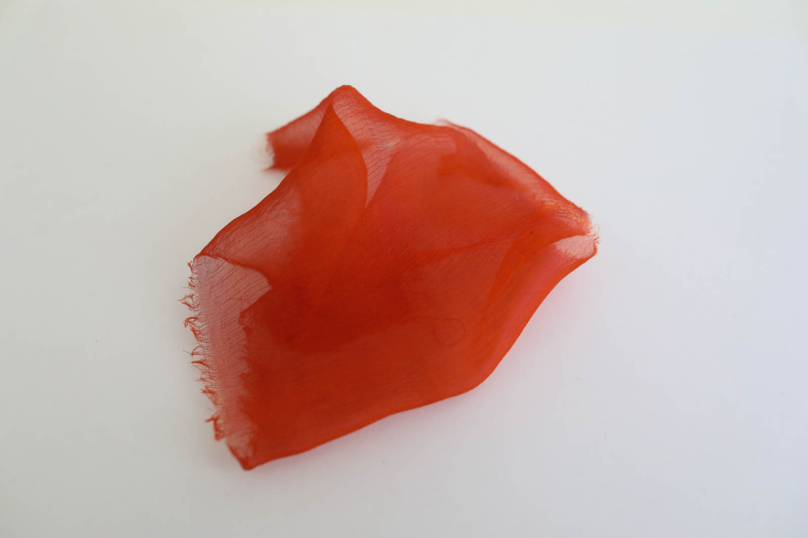
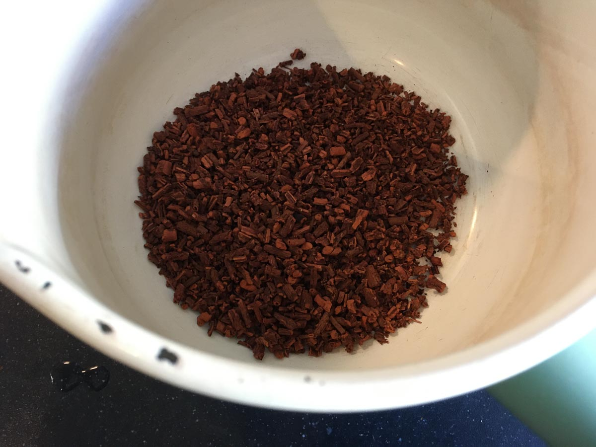
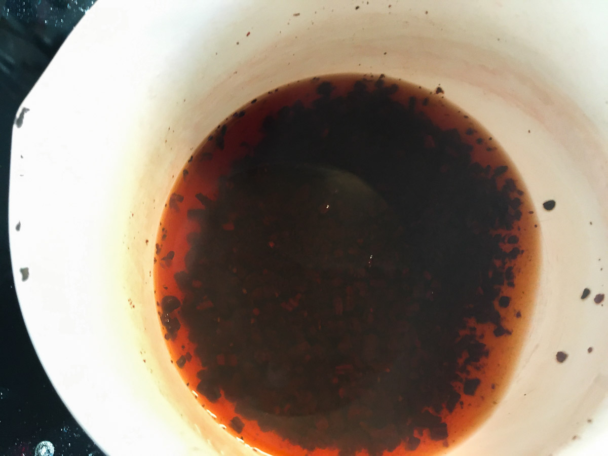
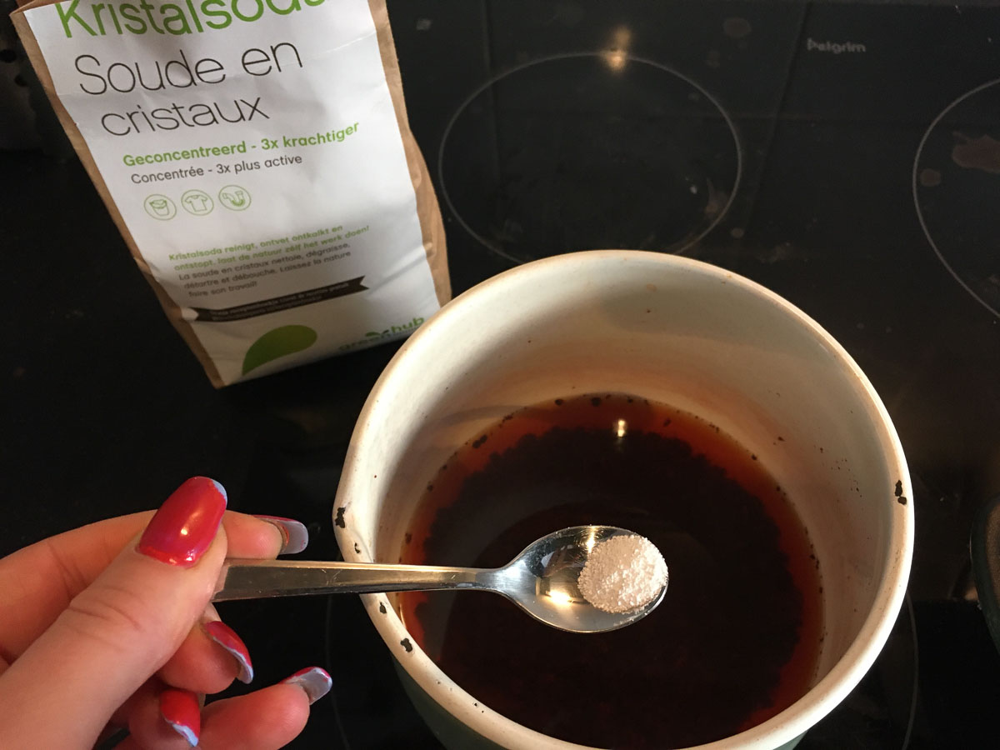
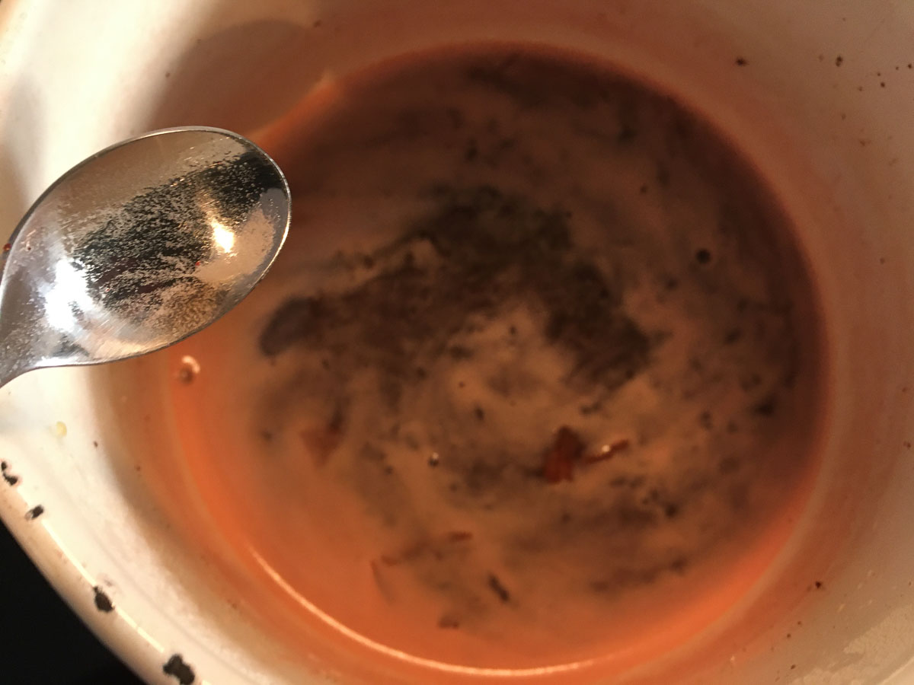
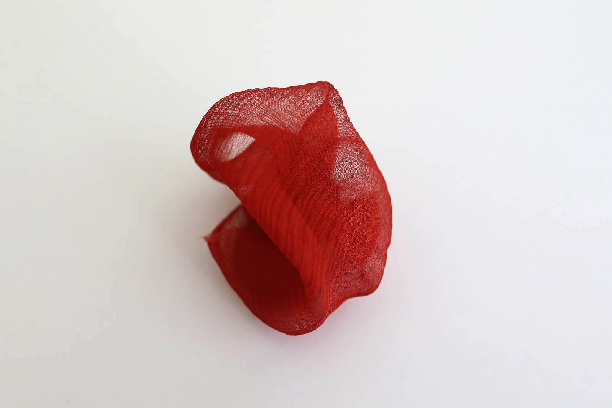
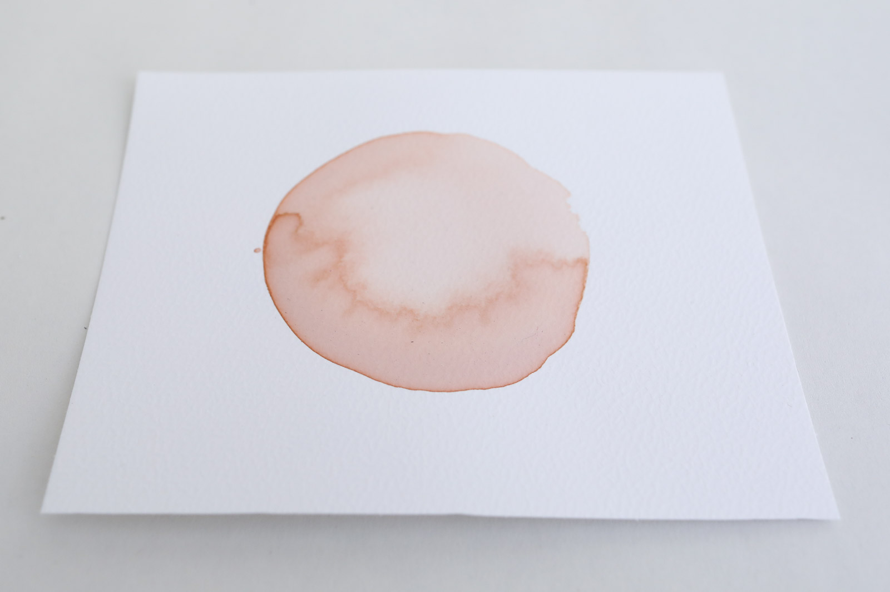

# MADDER DYE

*Madder dye on silk, Loes Bogers, 2020*

##GENERAL INFORMATION

Madder dye (can also be used as a water based ink) produces bright red to orange brownish colors on silk. One of the few natural dyes that can provide such bright red hues. It gives pink/salmon tones on paper. 

**Physical form**

Pastes, gels & liquids

Color without additives: bright reds to orange/brown. 

**Fabrication time**

Preparation time: 2 Hours

Processing time: for dying is variable (overnight for intense red on silk)

Need attention: the entire processing time (temperature and stirring)

Final form achieved after: 2 hours

**Estimated cost (consumables)**

2,01 Euros, for a yield of approx. 500 ml

##RECIPE

###Ingredients

* **madder roots (dried) -  50 g** also: Rubia Tinctorum, this is the dye stuff. Is enough for 50-100g WoF (weight of fibre).
* **water -  500 ml/g** solvent
* **soda ash - 5 g** (sodium carbonate Na2CO3), changes PH (more alkaline) to create bright reds
* **a coffee filter** to filter the fine particles from the dye
* optional: 100% pure silk, or aquarel/water colors paper and a paint brush to test the dye/ink

###Tools

1. **Cooker**, ideally with temperature control
1. **Pot**
1. **A spoon**
1. **A cheese cloth or coffee filter**
1. **A thermometer** (if your cooker doesn't have temperature control)
1. **A strainer**
1. **A glass jar** to store the dye
1. Optional: a blender or mortar and pestle

###Yield

Approx. 500 ml

###Method

1. **Preparation**

	- Weigh the ingredients
	- Put the madder roots in water and let them soak for 24 hours before processing (also when using madder powder)
	- optional: grind the madder root into a powder using a blender. By making the dye stuff smaller, you create more surface, which makes it easier to pull the pigments out of the madder root. 

1. **Extract the pigment**

	- Heat 600 ml of water up to 70 degrees celcius. Use a thermometer and make sure it doesn't exceed 70 degrees throughout the entire cooking process (the madder pigment will turn dull and brown).
	- Add the ground madder roots and simmer at 70 degrees for 60 minutes.
	- Strain the liquid into a bowl (keep the madder roots)
	- Put the dye back into the pot, and add the soda ash (it will froth a little), stir and continue to simmer for 10-15 minutes. This is the dye for bright reds. 
	- Filter the liquid through a cheesecloth or coffee filter to filter out the solid bits. This may take a while.   

	- Optional: you can keep the madder roots for a second filtration. It won't be as intense but you will continue to get color from it albeit a bit lighter. If it holds no more color, add vinegar or another acid to modify the color of the dye from the second filtration to orange and yellow colors. 

1. **Using the ink as a dye or on paper**

	- Use a funnel to transfer your dye into a glass jar.
	- Use the warm dye immediately by adding a piece of wet silk or other (mordanted) fibre to it and leave overnight. Don't put silk in hot water, it damages the fibre. Then rinse and dry the silk. 
	- You can also use it as an ink (hot or cold). Use fine chinese brushes and aquarel/water colors paper.
	- To store: add a clove and store in the fridge or freeze. If it smells weird or grows fungus, throw it away and make new ink. 
	- Using the dye at a later stage: warm up the dye by putting the glass jar au bain marie (put it in a larger pot with boiling water). Slowly heat it up until warm, not hot. Add (mordanted) fibres such as silk, leave overnight for deep hues. 
	- Rinse and dry

###Process Pictures

*Madder roots, Loes Bogers, 2020*

*After the first extraction, Loes Bogers, 2020*

*Add a pinch of soda ash, Loes Bogers, 2020*

*Froth after adding soda ash, Loes Bogers, 2020*

###Variations

- You can extract pigment (insoluble particles) for paints by adding a 10% carbonate soda solution (25g of soda ash on 250g hot water). Add only little bits because it froths a lot. Let it precipitate and filter it through a fine cloth. Dry the solids and add a binder to create paints. See also: https://www.youtube.com/watch?v=_YVO2Dr8gD8.
- Add a binder such as arabic gum to create a nicer flow if you wish to use this ink for painting and arts, not dyeing textiles. 
- madder can also used cold: liquidize the soaked roots, add 6% WoF calcium carbonate, add water and let it stand - covered - for 4-7 days. Stir occasionally. Then add mordanted fibre. See also: http://www.wildcolours.co.uk/html/madder_dye_nest_rubio.html
- add 6% WoF calcium carbonate (chalk) dissolved in a bit of hot water to draw out the pigment.
- make a post-mordant bath with 6% WoF calcium carbonate (chalk) dissolved in a bit of hot water to help attach the fibre. 
 

##ORIGINS & REFERENCES

**Cultural origins of this recipe**

Before synthetic dyes were discovered in 1856, you would have had to use natural dyes which were made from animals and plants. The most common - and intense -  being madder for red, and indigo for blue. Madder came from the roots of 35 species of plants (Rubia Tinctorum) found in Southern Europe and West-Asia. It has been found in the cloth of mummies and was the first dye to be used as camouflage. It was a popular dye madder in the Middle Ages and is mentioned in the Plichto van Gianventura Rosetti from 1548. Madder was brought to the south of the Netherlands and Flanders around 1300 where the clay soil was optimal for madder cultivation. This led to a thriving local industry - and for a while a monopoly - for madder production (NL: "meekrap") deemed the best quality in Europe .This was the case until *garancine* the synthetic counterpart for alizerine was discovered and gained in popularity around 1870. 

The agricultural industry of madder plants has started growing again recently in Belgium and the Netherlands since experiments in Groningen from 1989 onwards. In 1999 a technique was discovered to create powdered pigment from the roots that is viable for the industry. The textile and fashion industry started rediscovering its potential as a natural pigment for textile dyeing. Its yellow and blue counterparts have also been developed from "wouw" (Reseda lutolea L.) in other parts of Europe and the cultivation of "wede" (Isatis tinctoria L.) in France.

**Needs further research?**   Not sure

###Key Sources

- **Genuine Madder Lake Pigment Extraction** by Jeremy Francis, The Alchemical Arts, Youtube, 13 August 2019, [link](https://www.youtube.com/watch?v=_YVO2Dr8gD8).
- **Madder - Biochromes** by Cecilia Raspanti for Fabricademy 2019-2020, Class slides [link](https://drive.google.com/file/d/1Ar8j0cJntsFiBxdnrhqTA_9lgDDzB1Wg/view?usp=sharing)

###Copyright information 

This is an adaptation of the recipes listed in the references but there are many very similar recipes out there. One might consider this to be in the public domain. Further research needed. 

##ETHICS & SUSTAINABILITY

Compared to red pigments coming from the synthetic garancine, madder is less ecologically taxing. It doesn't require the sulphuric acid was used in the synthetic product. The plant can easily be multiplied and can be harvested for dyeing only after 2-3 years. The process is deemed rather labour intensive (require a fair amount of weeding and fertilizing). The roots need to be dried, which happens naturallly in sun light in warme climates. Heat needs to be generated in cold areas such as northern Europe. In comparison to commercial synthetic dyes, it is surely an improvement. 

Intense colors can be considered a thing of great luxury. To create very concentrated inks and dyes, one needs a lot of dye stuff and additional compounds like alum and soda for intensification. Although sulphuric acids are left out of this recipe, could and should we not consider deep, concentrated dyes as a thing of luxury, not necessity? How might beauty be found in more subtle hues? Could we consider limiting ourselves to pigments extracted from e.g. food waste like avocado stones, onion skins or leftover red cabbage?

As far as natural dyes go, madder is one that has been developed to a little that is applicable in the dyeing industry, not just crafts dyeing. Rubia Pigmenta Naturalia is a powdered form of meekrap pigment that is suitable for most industrial settings. 

Needs further research: Madder traveling from other parts of Europe and Asia to Northern Europe is possibly tied to practices of colonization and/or warfare. 

**Sustainability tags**

- Renewable ingredients: yes
- Vegan: yes
- Made of by-products or waste:  no
- Biocompostable final product:  needs further research
- Re-use: the madder roots can be filtered more times than once (results in oranges and yellows)

Needs further research?:  Yes

How often can this dye be reused? Overview of colors from second, third, fourth(?) extraction would be useful. 

##PROPERTIES

- **Color fastness:** high, it is traditionally called a "grande teint" for this reason
- **Light fastness:** high
- **Washability:** high
- **Color modifiers:** acidic/alkaline
- **Odor**: moderate
- **Suitable fibres**: animal fibre like wool or silk will take better than cellulose fibres. Use of alum as mordant is recommended for intense reds.  Synthetic fibres won't take on this dye. 

##ABOUT

**Maker(s) of this sample**

- Name: Loes Bogers
- Affiliation: Fabricademy student at Waag Textile Lab Amsterdam
- Location:  Amsterdam, the Netherlands
- Date: 20-02-2020 - 22-02-2020

**Environmental conditions**

- Humidity:  40-50%
- Outside temp:  5-11 degrees Celcius
- Room temp:  18 – 22 degrees Celcius
- PH tap water:  7-8

**Recipe validation**

Has recipe been validated? Yes, by Cecilia Raspanti, TextileLab, Waag Amsterdam, 9 March 2020

**Images of the final sample**

*Madder dye on silk, Loes Bogers, 2020*

*Madder dye on silk, modified with soda solution (PH 13), Loes Bogers, 2020*

*Madder dye on paper, Loes Bogers, 2020*

##REFERENCES

- **Genuine Madder Lake Pigment Extraction** by Jeremy Francis, The Alchemical Arts, Youtube, 13 August 2019, [link](https://www.youtube.com/watch?v=_YVO2Dr8gD8).
- **Madder - Biochromes** by Cecilia Raspanti for Fabricademy 2019-2020, Class slides [link](https://drive.google.com/file/d/1Ar8j0cJntsFiBxdnrhqTA_9lgDDzB1Wg/view?usp=sharing)
- **Meekrap**, Dutch page for "madder" on Wikipedia, n.d. [link](https://nl.wikipedia.org/wiki/Meekrap)
- **Meekrap**, by Jan Zwemer for Zeeuwse Ankers, n.d. [link] (https://www.zeeuwseankers.nl//app/uploads/2018/07/Meekrapteelt-en-bewerking.pdf)
- **A brief history of natural dyes**, by James P. Bernard for First Source Worldwide, 14 November 2017, [link](http://www.fsw.cc/NATURAL-DYES-HISTORY/)
- **Natuurlijk Verven, Grand Teints**, by Jantine Koobs for Textiel Museum, Tilburg, 2017: [link](https://textielmuseum.nl/uploads/content/BTME001.pdf).
- **Natuurlijk verven: textielverven op ecologische wijze**, by Roos Soetekauw, Thesis about natural dyes and dying of wool and silk, 2 May 2011:
 [link](https://issuu.com/roossoetekouw/docs/scriptie_-_natuurlijk_verven_klein)

