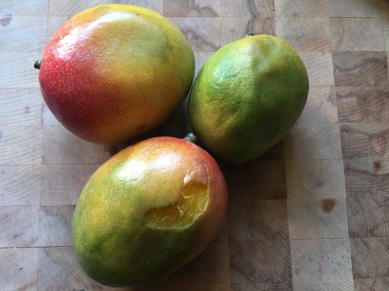
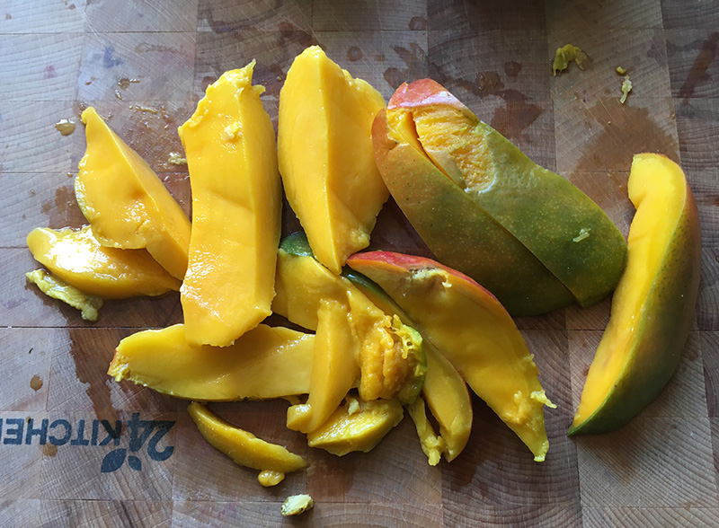
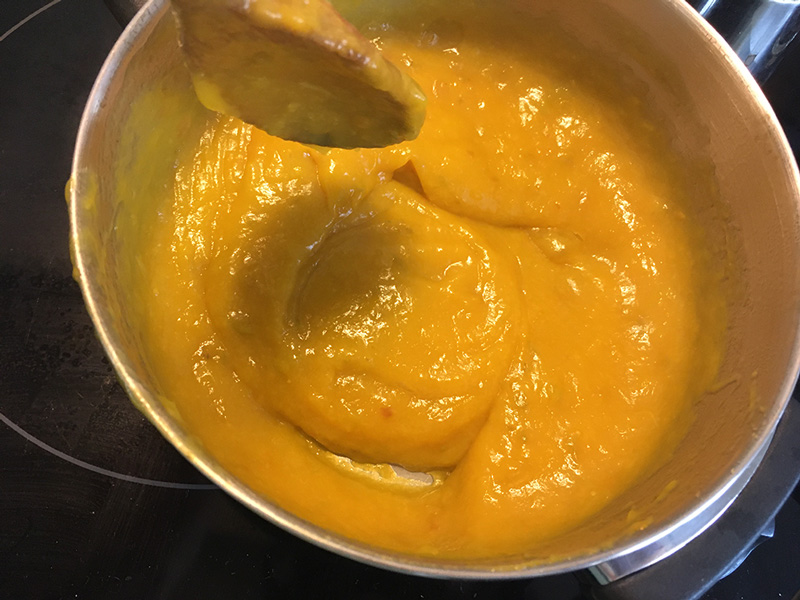
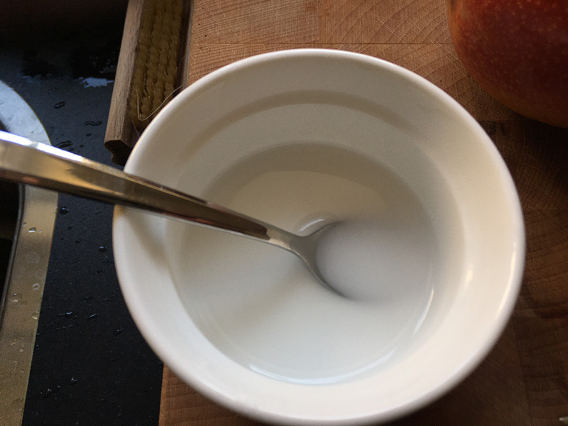
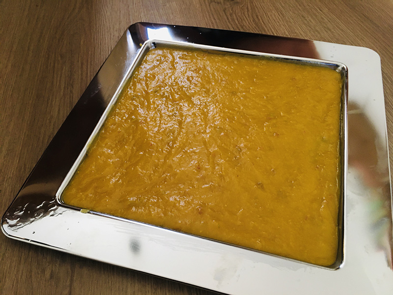
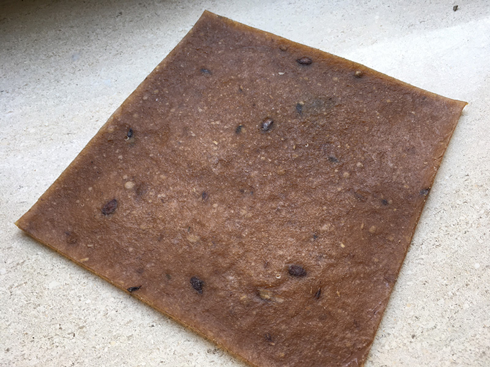
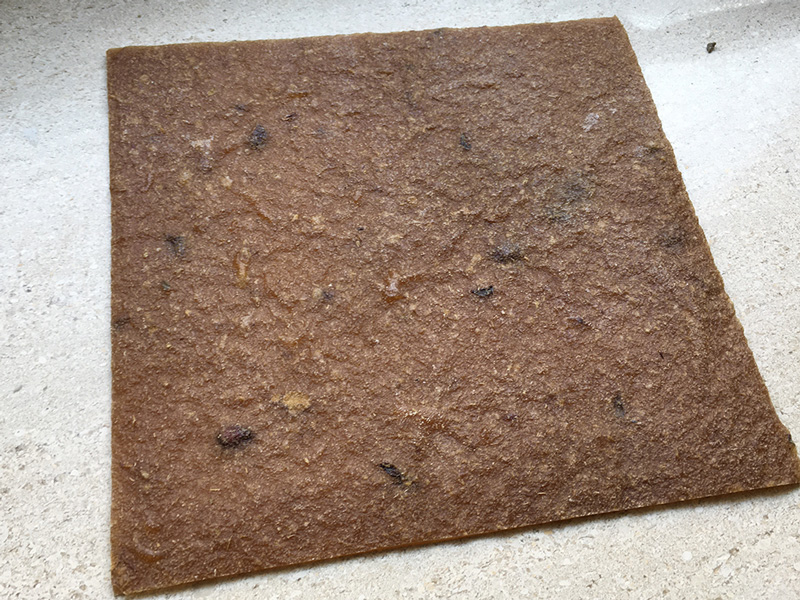
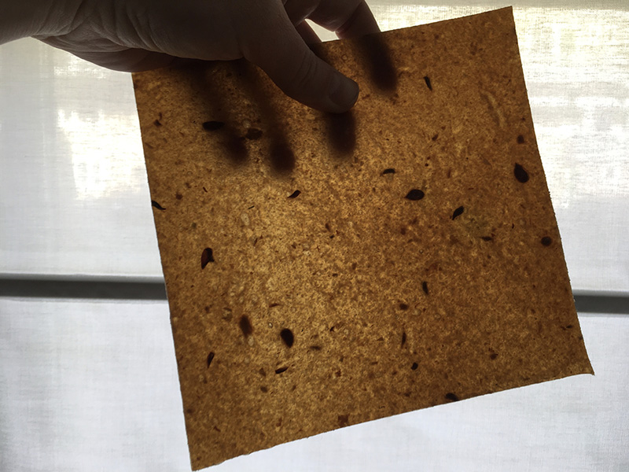
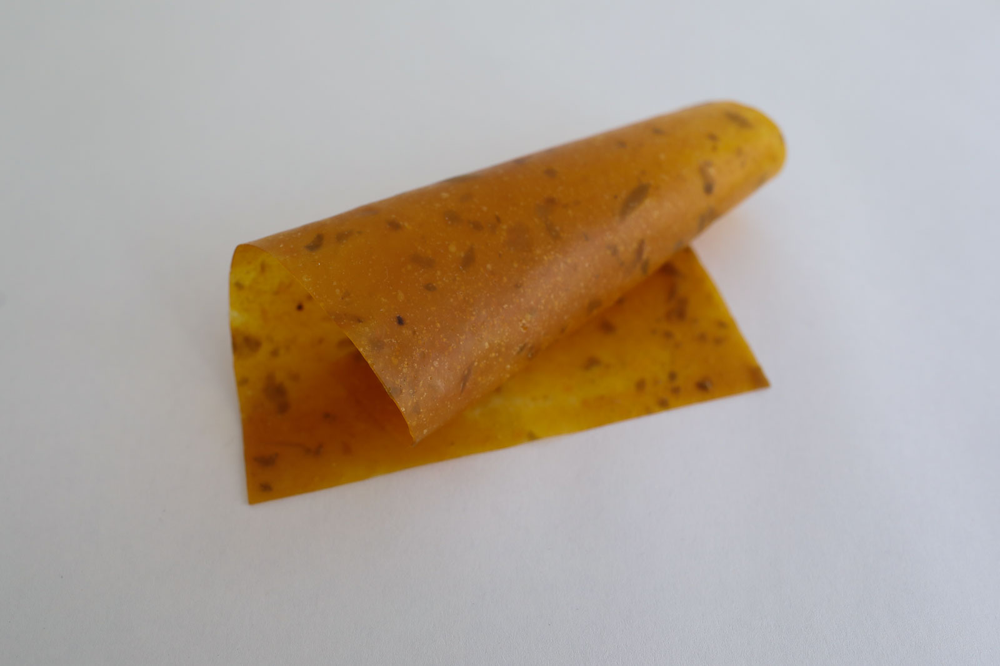
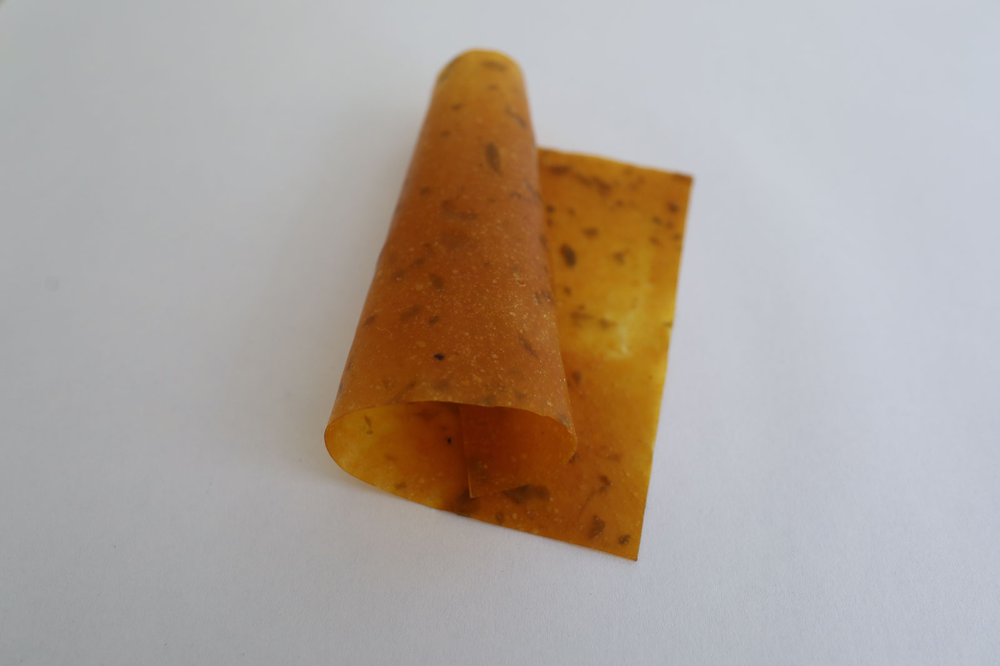

# OVERRIPE MANGO LEATHER

<iframe width="560" height="315" src="https://www.youtube.com/embed/iDgNwzSzTF4" frameborder="0" allow="accelerometer; autoplay; encrypted-media; gyroscope; picture-in-picture" allowfullscreen></iframe>

##GENERAL INFORMATION

Flexible leather-like sheet made from overripe mangos. The material is thin but emulates the feeling of leather quite well but feels a little dryer to the touch than leathers used in most clothing items and accessories. It is translucent unlike leather however. Its natural color is amber/orange (but can be dyed), and it keeps a lovely mango smell. 

**Physical form**

Surfaces

Color without additives: translucent, yellow/orange.

**Fabrication time**

Preparation time: 1 Hour

Processing time: 1 week

Need attention: Ideally needs about 16 hours (over 2 days) of drying at low temperature in the oven 40-50 degrees fan setting). Then 5 more days alternating air drying with pressing (every 8 hours). 

Final form achieved after: 7 days

**Estimated cost (consumables)**

0,21 Euros for a yield of approx one 25x25 cm sheet

##RECIPE

###Ingredients

* **1 Overripe mango - with skin** get these as waste from the market, they can have dents and bruises it doesn't matter. We will dehydrate the mango until it becomes leather-like.
* **Potato starch - 1 tbsp (10 g)** functions as the polymeer (makes the mango puree harder)
* **White vinegar - 1 tbsp (8 gr)** vinegar is almost always added to starch-based biopolymers to change the molecular structure of the starch, making it stronger and more workable
* **Salt - 5 gr** as a preservative and stabilizer. 
* **Vegetable oil - 1 tbsp** as a release agent for the mould.

###Tools

1. **Cooker or stove** (optional: temperature controlled)
1. **Pot**
1. **Blender or stick mixer**
1. **Scale**
1. **Oven** that can go as low as 50 degrees (or ideally 40)
1. **Mould or flat surface** you can cast the fruit leather into a shallow mould with wals (need not be higher than 5 mm) or cast directly onto a smooth sheet. Applying some oil helps to release it. Make sure it fits into your oven
1. **Spoon** 

###Yield 

Approx. 25 x 25 cm sheet of 1-2 mm thick

###Method

1. **Preparation**

	- Cut the mango into smaller pieces and puree it in a blender or with a mixer. 
	- Optional: Prepare the mold by applying some oil
	- Dissolve the starch in a dash of water until liquid

1. **Mixing the ingredients and activating the starch**
	- put the mango puree in the pot with the salt and vinegar
	- heat it at a low heat while stirring, you don't want it to boil and stick to the pot, but you want to kill any bacteria in there and dissipate some water. 
	- dissipate some of the excess water if it is very liquid but keep a low heat and stir.
	- add the starch mixture and continue to stir for at least a minute until it transforms into a thick paste. If the paste is too liquid it will shrink a lot during the dehydration process and your leather sheet will tear. 

1. **Casting and dehydrating in the oven**

	-  Pour the paste onto the surface or mould and spread it out evenly, knock it on a hard surface gently to even it out more. 
	-  Heat the oven to 50 degrees Celcius on the fan setting and put the paste into the oven for at least 16 hours (you can spread it out over a few days with airdrying in between). If your oven allows it without turning itself off: keep the door slightly open with a cloth to let the moisture escape). 
	-  Carefully peel thea leather off the tray, flip it, and check if the bottom has fully dried. If not, put back in the oven with the moist side up for another few hours. 
	-  Optional: you can airdry the leather as well, but there is some more risk of molding. Don't dry it in direct sunlight. 

1. **Air drying**

	- when the leather is dry to the touch (it will be a bit darker of color now), let it airdry in a well-ventilated space for another 5-7 days. 
	- alternate drying and pressing under a stack of heavy books or dry on a roster with weight on top for further drying while keeping it flat. 

###Drying/curing/growth process

- Mold depth:  				 5 mm (filled 3mm high)
- Shrinkage thickness:      50 %
- Shrinkage width/length:   0-5% %

**Shrinkage and deformation control**

Letting it dry up to 7 days to get to the final form. Mango leather tends to dry at a different pace every time, depending on the amount of juice and amount of dissipating. This is a slow process. Trying to demould too quickly will damage the leather. 

**Curing agents and release agents**

Some oil helps to release from the mould. 

**Minimum wait time before releasing from mold**

2 days

**Post-processing**

Trim frayed edges and cut or slice into desired shape before the slab is completely dry and hardened to obtain the best results. 

Store in a dry space. Baking paper between sheets prevents sticking. Some suggests using desiccants to keep the sheets dry (e.g. sprinkling starch onto the sheet). 

**Further research needed on drying/curing/growth?**

Some more experimentation could be done on the effect of dissipating more or less water before drying, and adding more starch. Some post-treatments could be experimented with to make the leather more water proof (see also "variations on this recipe"). 

###Process pictures

*Find some overripe mangos that would otherwise be trashed, Loes Bogers, 2020*

*Cut up one mango with skin, Loes Bogers, 2020*

*Heating the puree, Loes Bogers, 2020*

*Dissolving the starch in some water, Loes Bogers, 2020*

*Casted onto a previously oiled tray, Loes Bogers, 2020*

###Variations

- Add a **natural colorant** such as a vegetable dye or water-based ink (e.g. hibiscus, beetroot, madder). The puree is acidic (PH6-7), consider this in your choice of colorant. Dissipate some more water or to compensate for the added liquid. Adding spices may also work to create color (and smell variations).
- Add 1 tablespoon of **melted bees wax** for a more rigid, more water proof mango leather. 
- **Stiffeners** such as fibres, yarn or natural debris may be added for more structure and reinforcement.
- **Other starches** will work, pick whatever is (organically) produced locally.  Different starches may have different levels of binding power. If it gets too brittle and cracks, you used too much. 
- For recipe made of local produce, rather than local waste, try other **fibrous fruit waste** like, apples, peaches, plums or even rhubarb. 
- Using the fruit leftovers from juicing 10 pears gave good results with this recipe but require longer drying time. Use 2 tbsp of starch and 1/2 a tbsp of glycerine for this amount. 

*Variation using pear waste, Loes Bogers, 2020*
*Variation using pear waste, Loes Bogers, 2020*
*Variation using pear waste, Loes Bogers, 2020*

##ORIGINS & REFERENCES

**Cultural origins of this recipe**

Fruit leather was originally conceived of as a way to preserve fruit and is eaten as a snack! It's a way to preserve fruits, which is especially handy in hot climates where fruit is abundant but ripens and spoils ever so quickly. To make fruit leather, overripe fruit is best, used with skin and all. 

"T'tu Lavash" for example, is "sour lavash" (lavash is flatbread). An Armenian specialty often made from apricots, which is the national pride. It's pureed and the pulp is dried on sheets of cardboard. It is also called called pastegh or bastegh. Similar fruit leathers are called "tklapi" in Georgia, "lavashak" in Iran, "pestil" in Turkey, and "amerdeen" or "qamar el deen" in Lebanon, Syria, and other Arabic-speaking countries. It has become very popular recently as it preserves a lot of the nutrients of fruit, without needing any additives: it has become a healthy snack for conscious eaters. 

As a design material it has gained a lot of recognition from the development of fruit leather as alternative for mammal hides and leather tanning practices, which is considered heavily polluting and cruel to animals. Rotterdam Leather is a start-up based in the Netherlands that recognized the local waste stream of market fruits: 3500 kgs are thrown away after an average market day, vendors have to pay to dispose of this waste. Rotterdam Leather now sells technically tested fruit leather as design material commercially, and can produce up to 50-70 square metres a month. 

**Needs further research?**   Not sure

###Key Sources

this is a variation on experiments documented by Beatriz Sandini: 

**Ephemeral fashion lab** by Beatriz Sandini for Fabricademy 2019-2020 at Textile Lab Amsterdam, Waag: [link](https://class.textile-academy.org/2020/beatriz.sandini/projects/final-project/)

###Copyright information

Sandini's recipes are published under an Creative Commons Attribution Non-Commercial licence.

##ETHICS & SUSTAINABILITY

Fruit leather as design material can only exist with the grace of excessive food waste. We should consider if we should make it easier to dispose of food waste at all or try to eliminate it. Others might argue it is better to use the fruit than to let it go to waste. 

Moreover, if you live in northern Europe, you should consider mango's to be exotic fruit. So first they are shipped long distances, only to be thrown away. This is an issue that needs to be addressed not celebrated. 

Some climates might be too cold for a natural drying process, so it will involve more time to produce, and/or more energy to use ovens and dehydrators, like described in this recipe. 

**Sustainability tags**

- Renewable ingredients: yes
- Vegan: yes
- Made of by-products or waste:  yes
- Biocompostable final product:  yes
- Reuse: needs further research

Needs further research? yes, possibilities of re-using the leather

##PROPERTIES

- **Strength**: medium
- **Hardness**: flexible
- **Transparency**: translucent
- **Glossiness**:matt
- **Weight**: medium
- **Structure**: closed
- **Texture**: variable (if dried on acrylic one side will be smooth)
- **Temperature**: medium
- **Shape memory**: medium
- **Odor**: moderate (but a nice mango smell)
- **Stickiness**: medium (can get sticky easily with moisture)
- **Weather resistance:** needs further research
- **Acoustic properties:** needs further research
- **Anti-bacterial:** needs further research
- **Non-allergenic:** needs further research
- **Electrical properties:** no
- **Heat resistance:** low
- **Water resistance:** low
- **Chemical resistance:** needs further research
- **Scratch resistance:** medium
- **Surface friction:** medium
- **Color modifiers:** none 

##ABOUT

**Maker(s) of this sample**

- Name: Loes Bogers
- Affiliation: Fabricademy student at Waag Textile Lab Amsterdam
- Location:  Rotterdam, the Netherlands
- Date: 29-03-2020 – 05-04-2020

**Environmental conditions**

- Humidity:  40-50%
- Outside temp:  5-11 degrees Celcius
- Room temp:  18 – 22 degrees Celcius
- PH tap water:  7-8

**Recipe validation**

Has recipe been validated? Yes, By Beatriz Sandini, Fabricademy student at TextileLab, Waag Amsterdam, 2 April 2020

**Images of the final sample**

*Mango leather, Loes Bogers, 2020*

*Mango leather, Loes Bogers, 2020*

##References

- **Ephemeral fashion lab** by Beatriz Sandini for Fabricademy 2019-2020 at Textile Lab Amsterdam, Waag: [link](https://class.textile-academy.org/2020/beatriz.sandini/projects/final-project/)
- **T'tu Lavas** by Susie Armitage for Gastro Obscura: [link](https://www.atlasobscura.com/foods/ttu-lavash)
- **Rotterdam Leather** [link](https://fruitleather.nl/)
- **Fruit leathers (Practical Action Brief)** on Appropedia, [link](https://www.appropedia.org/Fruit_leathers_(Practical_Action_Brief))

