# YELLOW ONION SKIN DYE

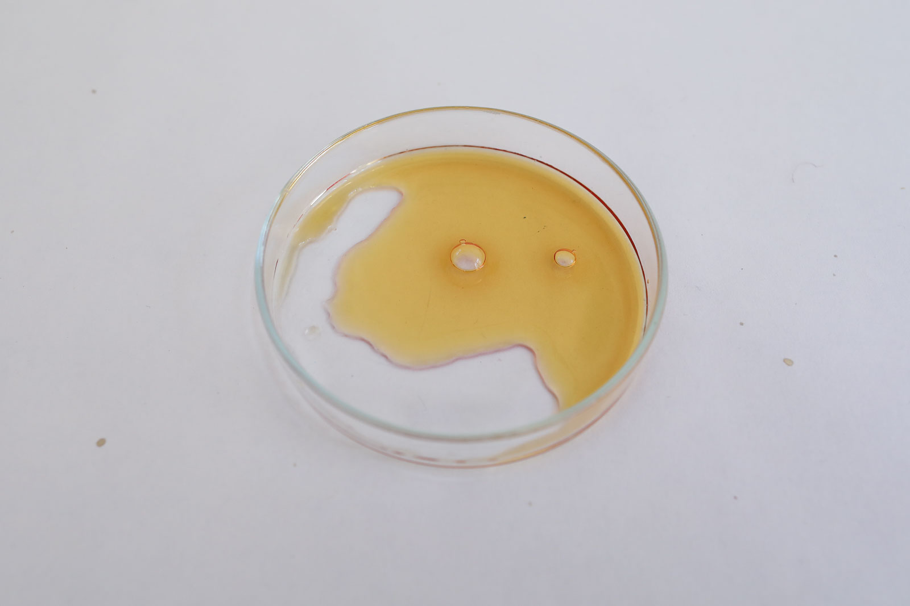*Dye of yellow onion skins, Loes Bogers, 2020*

##GENERAL INFORMATION

Dye made of yellow onion skins, gives golden/yellow and orange to brown tones. Onion skin dye is relatively colorfast compared to other natural dyes. It dyes animal-based fibres like silk and wool quite well, less intense on linen and cotton (plant-based fibres). 

**Physical form**

Pastes, gels & liquids

Color without additives: Golden yellow

**Fabrication time**

Preparation time: 2 Hours

Processing time: for dying is variable (overnight for intense color on silk)

Need attention: the entire processing time (temperature and stirring)

Final form achieved after: 2 hours

**Estimated cost (consumables)**

0,02 Euros, for a yield of approx. 200 ml

##RECIPE

###Ingredients

* **Yellow onion skins - 10 g** this is the dye stuff
* **water - 500 ml/g** solvent to extract the pigment from the onion
* **vinegar - 30 ml** to make the bath acidic (alkaline water reduced the reds from the onion skins, adding vinegar makes it warmer, more orange). 
* **salt - 5 g**  as a stabilizer
* **a coffee filter** to filter the fine particles from the dye
* **a clove** for preservation
* optional: PH modifiers (see [this recipe](https://class.textile-academy.org/2020/loes.bogers/files/recipes/phmodifiers/))
* optional: a piece of silk, or aquarel paper and a brush for testing.

###Tools

1. **Cooker**
1. **Pot**
1. **A spoon**
1. **A cheese cloth or coffee filter**
1. **A strainer**
1. **A glass jar** to store the dye

###Yield 

Approx. 200 ml

###Method

1. **Preparation**

	- Weigh the onion skins.

1. **Extract the pigment**

	- Put the onion skins in a large pot and cover with water, add the vinegar. 
	- Bring it to the boil and let it simmer for 2 hours (make sure not all the water evaporates), the skins should get very mushy. 
	- Strain and filter the liquid and put it back in the pot
	- Reduce the liquid to 25% of the original volume for a very concentrated dye or ink. Add salt to stabilize. 

1. **Testing and storing the ink/dye**

	- To dye silk: let the dye cool until it's no more than 70 degrees and put in a piece or wet (mordanted) silk. Leave overnight for an intense color. 
	- Test the ink on paper using a brush and aquarel paper. 
	- To store: add a clove to the ink, label it, and store in the fridge or freeze. If it starts to grow mold or smells weird/different than cabbage smell, through it away. 

1. **Dyeing with onion dye**

	- Optional (not necessary) mordant the fibres with alum for color fastness
	- Put the wet fibres in the dyebath and simmer for an hour, then leave overnight
	- Rinse and dry
	- Optional: modify with PH modifiers 

###Process pictures

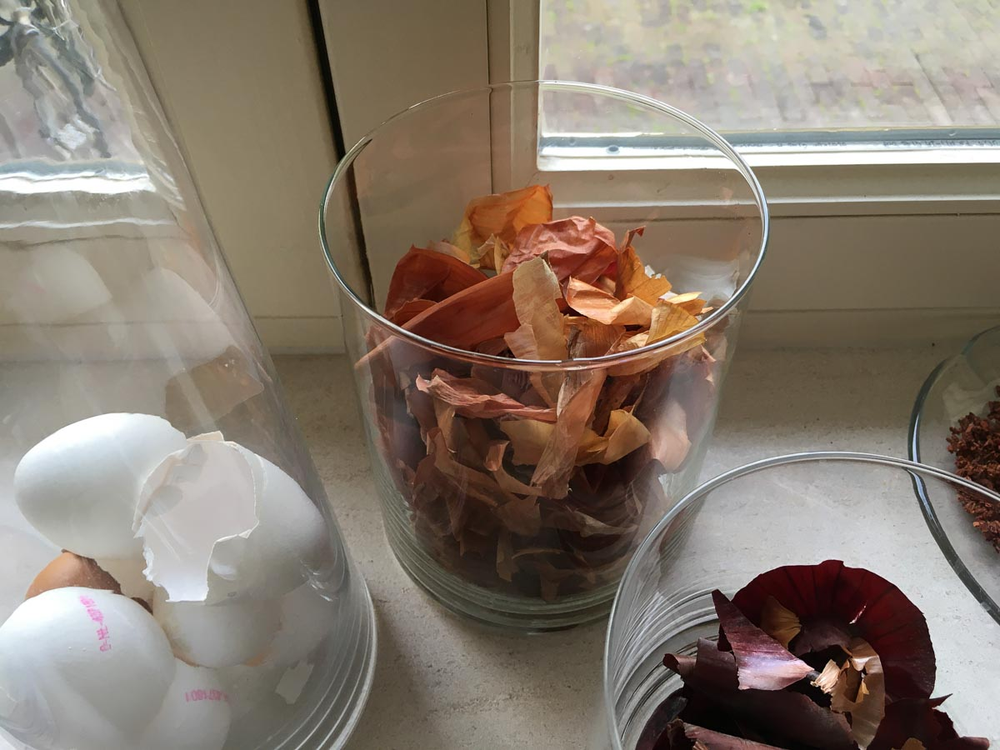*Saving up onion skins in a glass jar, Loes Bogers, 2020*

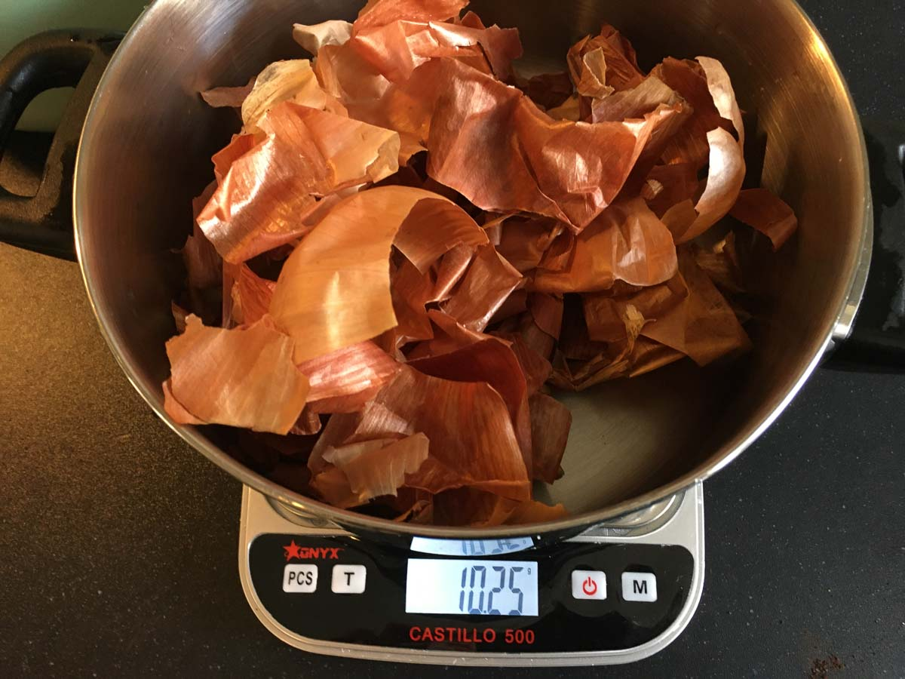*10 g is enough to make a dye, Loes Bogers, 2020*

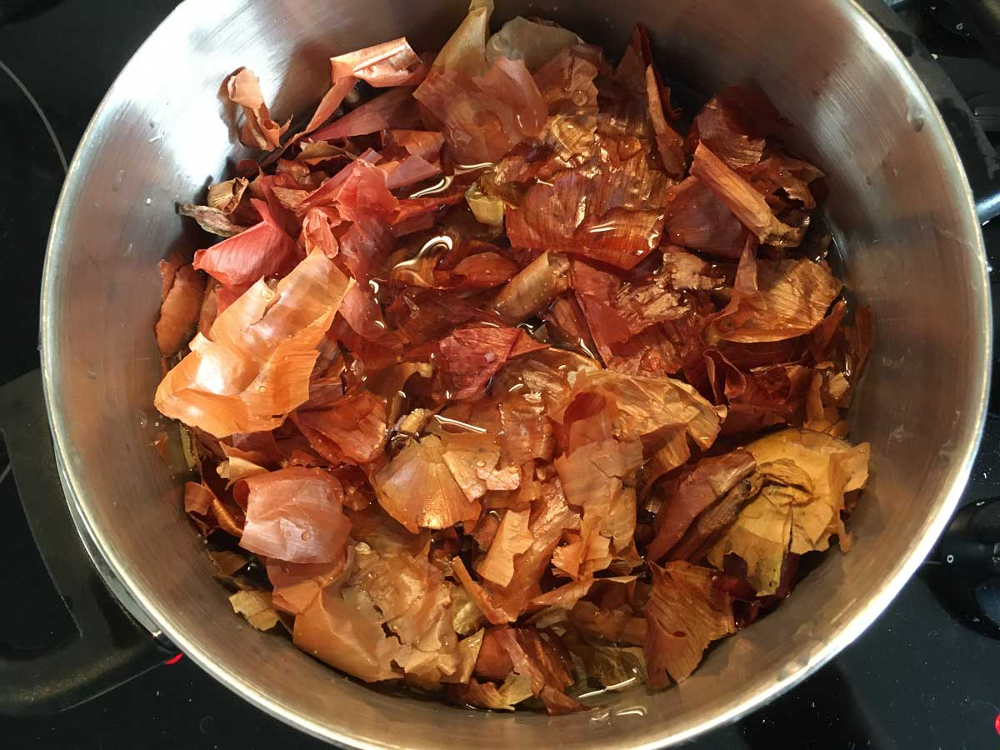*Cover the skins with water, Loes Bogers, 2020*

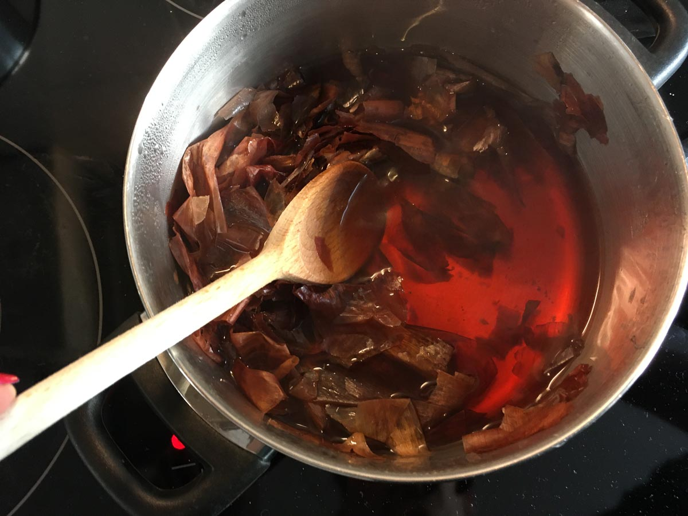*Bring to the boil and let it simmer to extract the color, Loes Bogers, 2020*

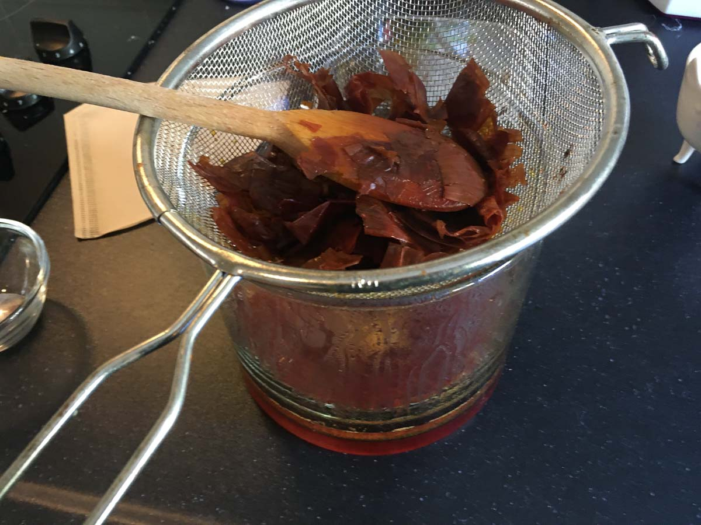*Strain the liquid, Loes Bogers, 2020*

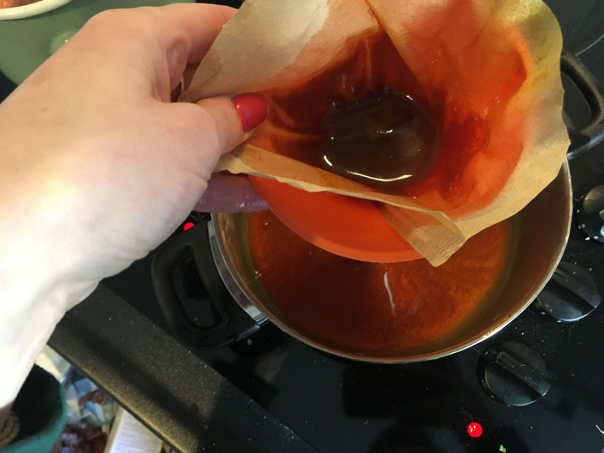*Filter the liquid, Loes Bogers, 2020*

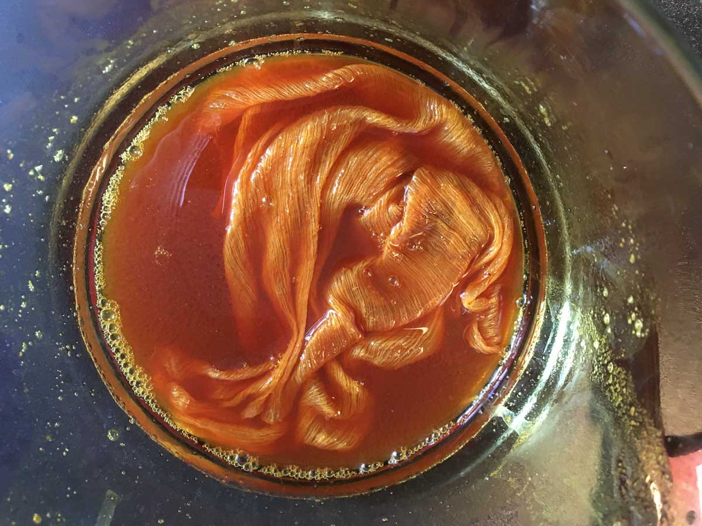*Adding some silk for dyeing (and a clove for preservation), Loes Bogers, 2020*

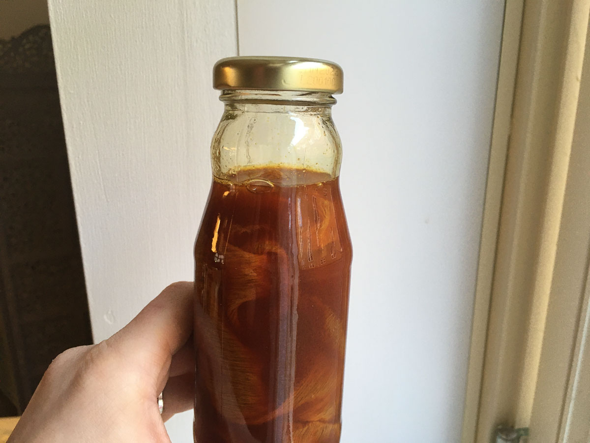*Onion skin dye in a jar, Loes Bogers, 2020*

###Variations

- Add a binder such as arabic gum to create a nicer flow if you wish to use this ink for painting and arts, not dyeing textiles.
- Make dyes for other kinds of food waste, like used coffee grounds (light browns), old coffee (deep browns), PH sensitive beetroot dye (vintage pinks and salmon tones) etc. Or research and consider dyes from dried goods like turmeric powder (bright yellow), PH sensitive hibiscus tea (purple, blues, greens and gray). 
- Try making this dye with the skin of red onions
- Add some onion skins - or onion skin liquor - to another natural dye to give it some more warm yellow undertones. 
- Make dyes from other food waste: such as the stones of avocados (put 2-3 of them in a bag and crush with a hammer) and boil in water with a teaspoon of soda for 2 hours. It creates fine red/brown inks and pink textile dyes. 

##ORIGINS & REFERENCES

**Cultural origins of this recipe**

Onion dye is commonly used all over the world to dye yarns, fibres, eggs and even hair in golden yellow tones.  

**Needs further research?**   Yes

Where were such dyes first used? Have yellow onions always been around locally or did they travel? 

###Key Sources

Boiling in water is a common way of extracting pigments from a dye stuff. The resources listed under references informed this recipe. 

###Copyright information 

This is considered to be in the public domain.

##ETHICS & SUSTAINABILITY

Yellow onions can be found in abundance in many countries (including the Netherlands). Their skins are not eaten and as such are a great resource for creating dyestuffs. The collection of onion skins is not straightforward, there is no infrastructure for it yet. 

**Sustainability tags**

- Renewable ingredients: yes
- Vegan: yes
- Made of by-products or waste: yes (partially
- Biocompostable final product: yes, (rip silk to shreds for home composting).
- Re-use: yes, silk can be redyed. 

Needs further research?:  Would be useful to have an overview of how often this can be used as a dye bath and how it fades. 

##PROPERTIES

- **Color fastness:** medium
- **Light fastness:** medium
- **Washability:** medium
- **Color modifiers:** acidic/alkaline (only moderately)
- **Odor**: moderate (disappears after drying)

##ABOUT

**Maker(s) of this sample**

- Name: Loes Bogers
- Affiliation: Fabricademy student at Waag Textile Lab Amsterdam
- Location:  Amsterdam, the Netherlands
- Date: 06-03-2020 - 07-03-2020

**Environmental conditions**

- Humidity:  40-50%
- Outside temp:  5-11 degrees Celcius
- Room temp:  18 – 22 degrees Celcius
- PH tap water:  7-8

**Recipe validation**

Has recipe been validated? Yes, by Cecilia Raspanti, TextileLab, Waag Amsterdam, 9 March 2020

**Images of the final sample**

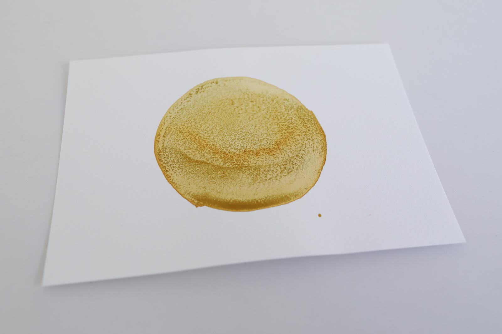*Yellow onion skin dye on paper, Loes Bogers, 2020*

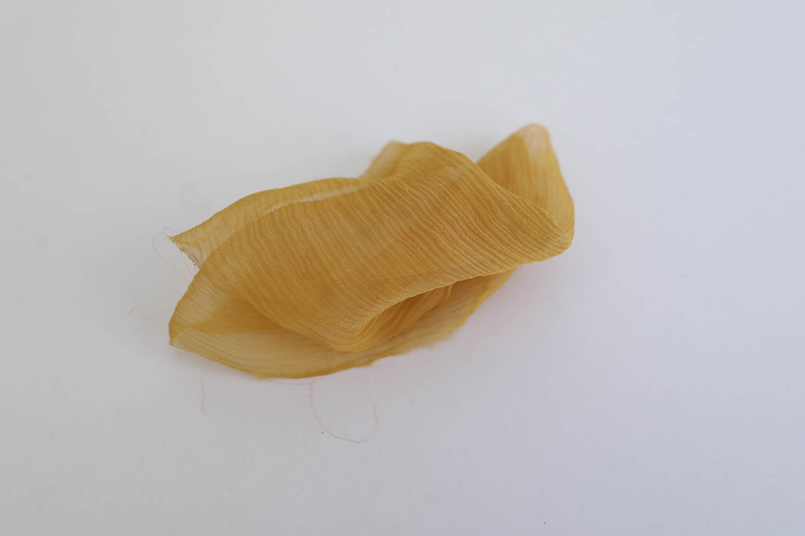*Dye of yellow onion skins, Loes Bogers, 2020*

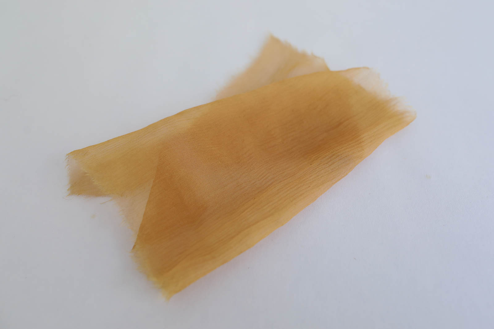*Dye of yellow onion skins with vinegar (PH 2) modifier, Loes Bogers, 2020*

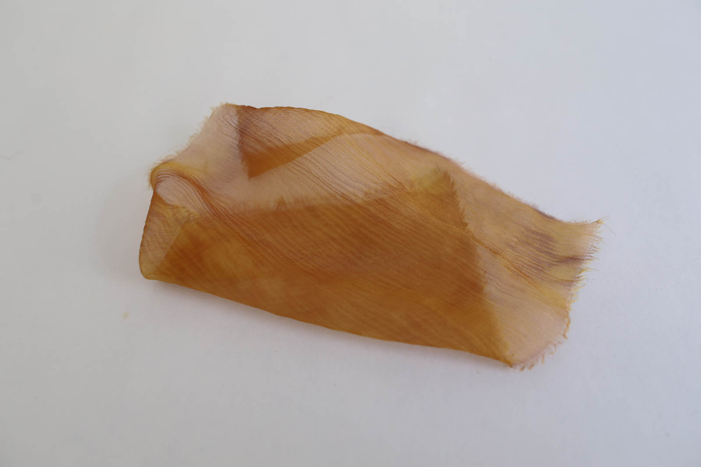*Dye of yellow onion skins with soda (PH 9) modifier, Loes Bogers, 2020*

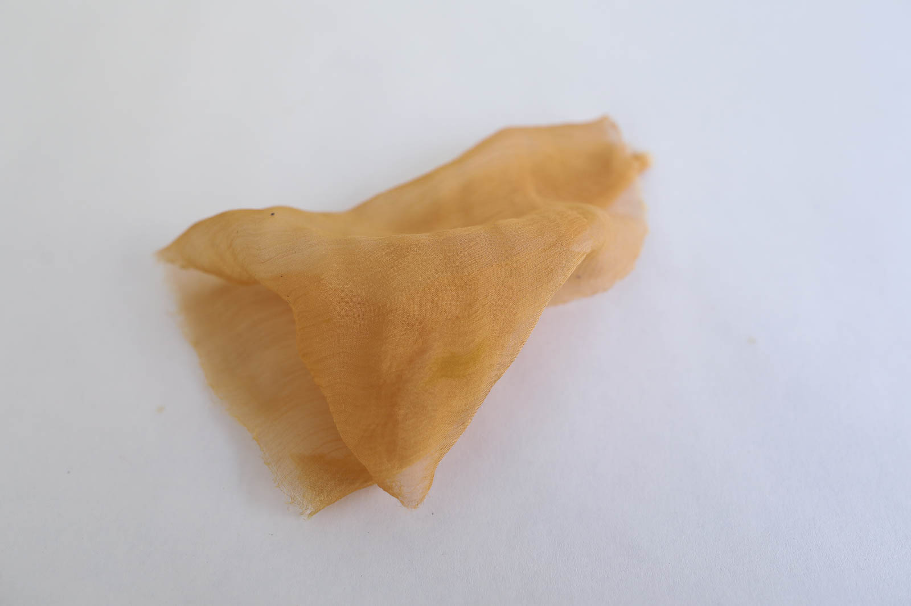*Dye of yellow onion skins with soda (PH 13) modifier, Loes Bogers, 2020*

##References

- **Biochromes** by Cecilia Raspanti for Fabricademy, 15 October 2019: [link](https://class.textile-academy.org/classes/week04/)
- **Yellow onion skins in alum mordant**, in: *Vegetable Dyeing* by Alma Lesch, 1970: pp. 54-55.
- **Natural dyeing yellows and browns with onion skins** by Andie Luijk for Renaissance Dyeing, 27 August 2009: [link](https://www.renaissancedyeing.com/en/blog/2009/08/27/natural-dyeing-yellows-and-browns-onion-skins/)

