# PH MODIFIERS & PH PAPER

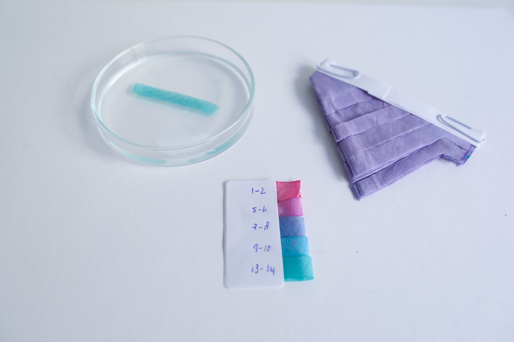*PH paper and an alkaline modifier, Loes Bogers, 2020*

##GENERAL INFORMATION

Recipe for alkaline and acidic PH modifiers to be used with natural dyes and inks (water and alcohol-based), and PH test strips made with red cabbage dye or ink. 

PH modifiers can change the original color to become brighter, duller, or even go all the way from purples to greens and blues. Alkaline tends to make colors PH sensitive natural dyes "colder", while acidic dyes create warmer shades. Acidic and alkaline modifiers have an especially strong effect on dyes made of vegetables that contain *anthocyanin* such as red cabbage, hibiscus, blueberry. 

Less precise than litmus paper but precise enough to indicate acidity, neutral or alkaline PH. Might lose its properties as PH indicator over time (needs further research).

**Physical form**

Pastes, gels & liquids

Color without additives: Transparent colorless. Can take on some pigments if dyed textile is dipped in.

**Fabrication time**

Preparation time: 30 minutes

Processing time: N/A

Need attention: N/A

Final form achieved after: N/A

**Estimated cost (consumables)**

0,02 Euros for a yield of approx. 4x 170 ml (ex. cabbage dye)

##RECIPE

###Ingredients

* **Water - 1000 L**, the solvent, ideally has a PH of 7.
* **Soda ash - 5g** (sodium carbonate Na2CO3), to make an alkaline solution (PH 8-PH 13)
* **Citric acid - g** OR: 150 ml of vinegar or lemon juice, to make an acidic solution (PH 1 -PH 6). Citric acid is sold in asian supermarkets and has very high acidity (more than vinegar and lemon juice)
* **Red cabage dye - 50 ml** see [this recipe](https://class.textile-academy.org/2020/loes.bogers/files/recipes/cabbagedye/). Alcohol-based cabage ink is also fine. 
* **A large round coffee filter**, ideally white ones. To make PH strips. If you can't find these, get 4 smaller filters and cut them open so you have only one layer. 

###Tools

1. **Four glass jars** size depending on how much PH modifying solution you wish to prepare, 200 ml and up is convenient for dipping dyed textile swatches. 
1. **Four spoons** don't mix the spoons, one per jar
1. **A precision sclae** so you can measure tenths of a gram
1. **A spray bottle - approx 100 ml** 
1. **A small funnel** that fits the spray bottles
1. **A baking tray or acrylic sheet** to dry the PH paper
1. **A kettle**
1. Optional: commercial PH measuring strips or a PH measuring device
1. Optional: stapler, or some paperclips, or sticky tape and labels

###Yield 

Four PH modifying solutions of approx. 170 ml each (PH 1-2, PH 5-6 acidic, and PH 9-10 and PH 13-14 alkaline), and 50-75 PH strips with reference.

###Method

1. **Preparing the PH paper**

	- Put the cabbage dye in one of the spray bottles
	- Clean and thoroughly dry the drying surface (e.g. baking tray) to prevent staining.
	- Put the coffee filter on the baking tray/sheet
	- Spray the coffee filter with the cabbage dye until it is totally covered (one side only). 
	- Lay it flat and let it dry completely

1. **Cut a PH paper booklet**
	- When the coffee filters are totally dry, take them off the tray and fold them 3 times. 
	- Fold the sharp tip inward and secure with a paperclip, or staple, or sticky tape. 
	- Cut the closed fold open to separate the sheets
	- Cut parallel lines into the stack of sheets (not all the way), to create strips you can tear off easily

1. **Making the alkaline PH modifiers**
	- Boil the water and divide it over the glass jars (170 ml each)
		- Add 0.1 g of citric acid to one, and stir to dissolve. 
		- Add 2.0 g of citric acid to another and stir to dissolve.
		- Add 0.1 g of soda ash to the third and stir to dissolve.
		- Add 2.0 g of soda ash to the last jar and stir to dissolve.
	- **Optional**: Dip a piece of commercial PH paper in each of them to test the PH, they should be PH 1-2 and PH 5-6 (the acidic ones with citric acid) and PH 9-10 and PH 13-14 (the alkaline ones with soda). If you are getting different values, adjust the solution by adding more water or more citric acid/soda to make it more or less alkaline until you get the right PH values. 
	- If you don't have PH paper, use your dyed coffee filter instead: 
		- PH 1-2 = fuchsia pink
		- PH 5-6 = pink/purple
		- PH 7-8 = blue/purple
		- PH 9-10 = turquoise (blue/green)
		- PH 13-14 = green
	- Label the solutions, mentioning the PH value and store in the glass jar or in a spray bottle.
	- **NOTE**: if you don't have citric acid, you can work with lemon juice or vinegar but these are weaker acids. So work in the opposite order: put some vinegar/lemon juice in the jar, measure the PH and add a bit of water to bring the PH value up. 

1. **Make a legend for your PH paper**
	- Tear 5 pieces off of your PH paper
	- Dip them in each of your PH modifiers, and dip one in tap water
	- Make sure they don't touch each other or lie in each others liquids. 
	- Let them dry and write on them the PH value of the modifier they were dipped into. 
	- Stick, glue or staple them on a piece of paper you can keep with your PH paper as reference. 

1. **Using PH modifiers**
	- Add the modifier directly to the dye to modify the entire batch (just add tiny little bits at a time and give it time to react, see what happens, then decide if you want to add more). Dyes can fade to very dull colors doing this. 
	- Modify the dyed/stained material afterwards by dipping it into the modifier, spraying it on, or in some cases for textiles: let it simmer for 10 minutes on low heat. 
	- You can use both modifiers at the same time to create colorful patterns and stains. 
	- Some dyes allow you to go back and forth with the modifiers, but they will likely change if you modify them with PH 2 first and then bring it up to PH13, this could create hues than cannot be created using only one modifier. 
	- Dyes that already have an alkaline additive (like soda) or an acidic additive (like vinegar) are unlikely to respond strongly to the same modifier. 

1. **Using the PH paper**
	- Use the PH paper to test the PH value of dyes, solutions and even bioplastics mixtures. 
	- It is useful to know and record this information. For example, if a bioplastics mixture is very acidic (e.g. the starch-based plastics that contain vinegar), it will modify the color of a PH sensitive dye when you add it. Knowing this before hand will help you pick your dyes accordingly. 
	- Also testing the PH values of water can be useful. In some recipes you might need to know if your tap water is alkaline or not so you can assess whether you need to offset it by adding some vinegar or other acid to your recipe (e.g. for growing kombucha SCOBY).  

###Process pictures

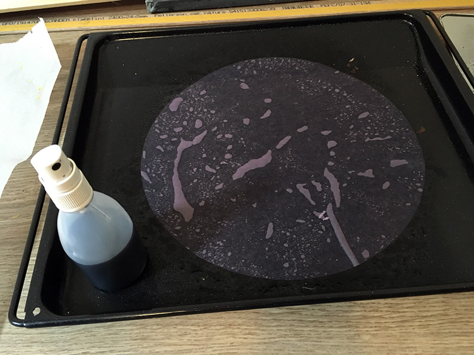*The cabbage dye on a coffee filter, drying, Loes Bogers, 2020*

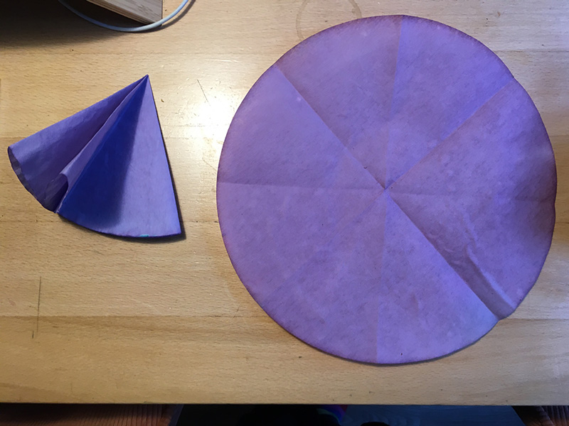*Folding the paper, Loes Bogers, 2020*

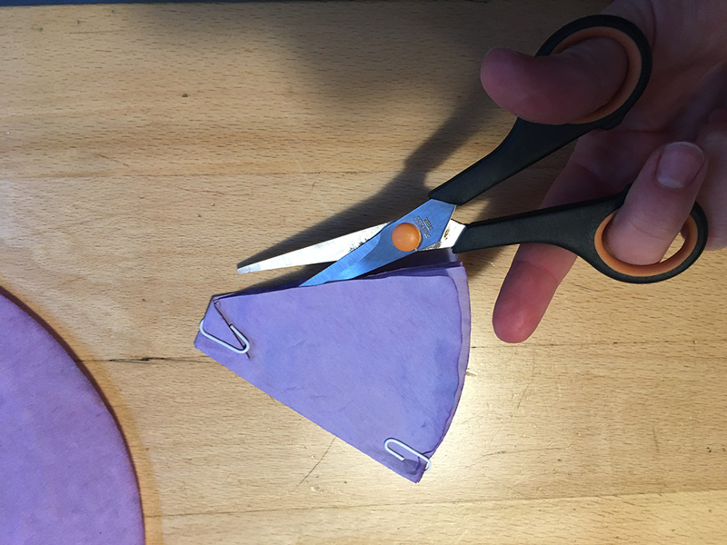*Securing and cutting the paper, Loes Bogers, 2020*

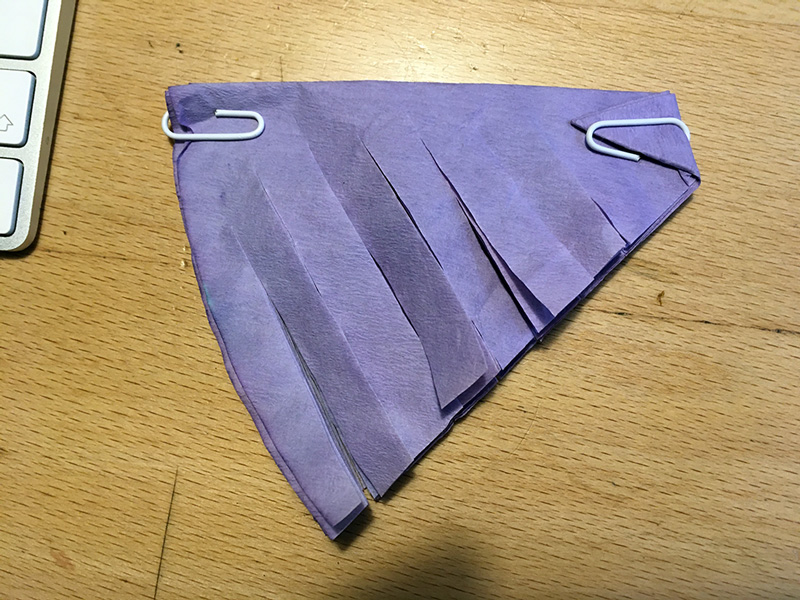*Cutting tear-off strips, Loes Bogers, 2020*

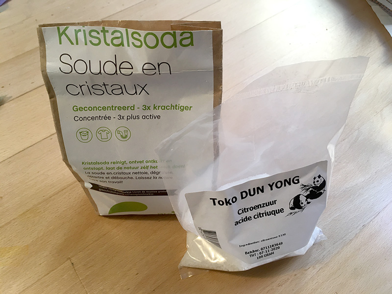*Soda ash and citric acid, Loes Bogers, 2020*

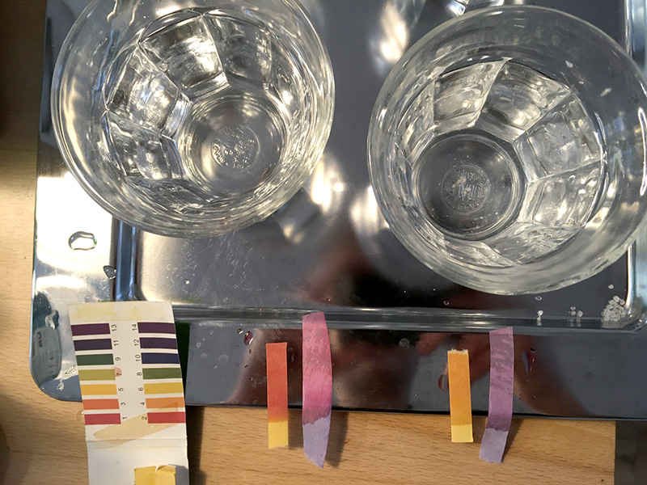*Preparing the acidic modifiers with citric acid, Loes Bogers, 2020*

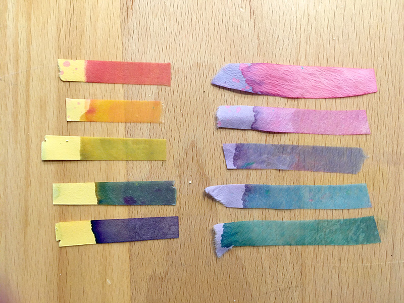*Modifying until you get the right PH values, top to bottom: citric acid 2g, citric acid 0.1g, tap water, soda 0.1g, soda 2.0g, Loes Bogers, 2020*

###Variations

- Make a better design for the booklet, without wasting material.
- Experiment by combining PH modifiers with traditional tie-dyeing and printmaking techniques.
- Experiment by using the water-based dyes to stain paper and modify then while wet for organic water colors-like effects, or dry for clear, sharp contrasting colors. 
- Research other foods that contain anthocyanin and make paper with juice and dyes from other fruits and vegetable waste.

##ORIGINS & REFERENCES

**Cultural origins of this recipe**
Red cabbage juice has been known to be a PH indicator (origins unknown) and is a favourite for science experiments in education. 

A historically more well-known PH indicator however, is the *litmus test*, a procedure ascribed to Spanish alchemist, astrologer and phycisian Arnaldus de Villa Nova, around 1300. The term litmus comes from an Old Norse word meaning "to dye or color." As such it is strongly associated with practices of alchemy, a precursor to contemporary science that has long been ridiculed for its esoteric philosophy, magic and quest to turn lead into gold. Eventually historians of science acknowledged alchemy for laying groundwork for science with many of its practical and experimental applications and techniques, such as litmus.

Litmus paper and universal PH scale is said to have been invented by J.L. Gay-Lussac in the early 1800s. The blue dye used for litmus paper was extracted from lichens (various types could be used for this and they grow in nearly every climate). The Netherlands was and is to this day a primary producer of litmus paper, using the local lichens variety called *lecanora tartarea*. Interestingly, lichens are commonly used as gauge for environmental quality because they are sensitive to various pollutants.

**Needs further research?**   Not sure

###Key Sources

- **How to make Red Cabbage PH Paper** by Anne Marie Helmenstine for ThoughtCo, 2 February 2020: (https://www.thoughtco.com/make-red-cabbage-ph-paper-605993)

###Copyright information 

The use of PH modifiers is information that is in the public domain. How to create PH paper from red cabbage is also widely documented and could be considered common knowledge, but further research recommended. The resource listed has been informative during the writing of this recipe however. 

##ETHICS & SUSTAINABILITY

The dye might lose its ability to indicate PH because it is not very lightfast. It's also not very precies and maybe less over time, but that's not always so important. PH of the modifiers might change over time as well, unclear how often they can be reused (further research needed). Your PH paper may look different from mine and behave differently from mine, but also that might be ok.

**Sustainability tags**

- Renewable ingredients: yes
- Vegan: yes
- Made of by-products or waste:  partially 
- Biocompostable final product:  yes
- Reuse: partially, the PH modifiers are re-usable. PH paper is single use only

Needs further research?:  not sure

##ABOUT

**Maker(s) of this sample**

- Name: Loes Bogers
- Affiliation: Fabricademy student at Waag Textile Lab Amsterdam
- Location:  Rotterdam, the Netherlands
- Date: 06-03-2020 – 16-03-2020

**Environmental conditions**

- Humidity:  40-50%
- Outside temp:  5-11 degrees Celcius
- Room temp:  18 – 22 degrees Celcius
- PH tap water:  7-8

**Recipe validation**

Has recipe been validated? Yes, by Cecilia Raspanti, TextileLab, Waag Amsterdam, 9 March 2020

**Images of the final sample**

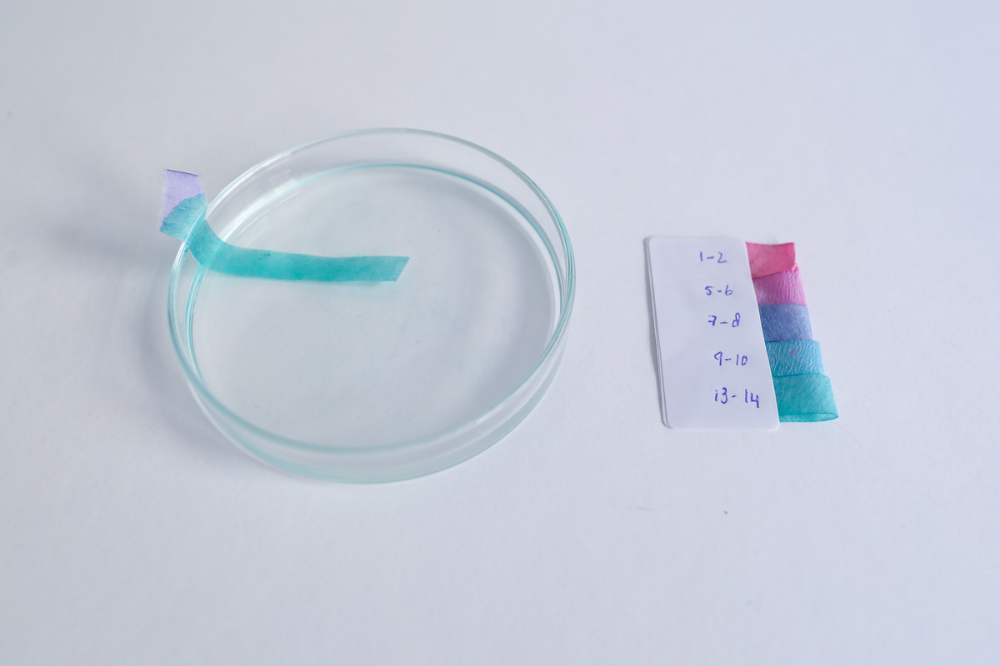*PH paper and an alkaline modifier, Loes Bogers, 2020*

*PH paper and an alkaline modifier, Loes Bogers, 2020*

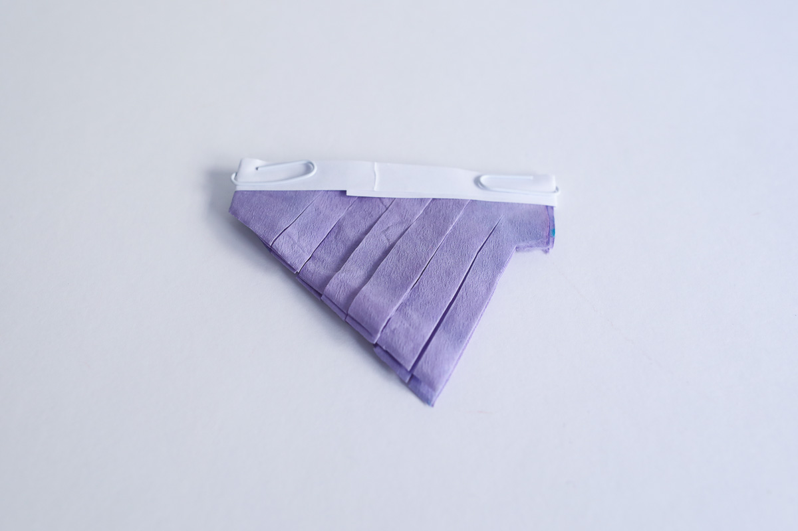*PH paper made with red cabbage ink, Loes Bogers, 2020*

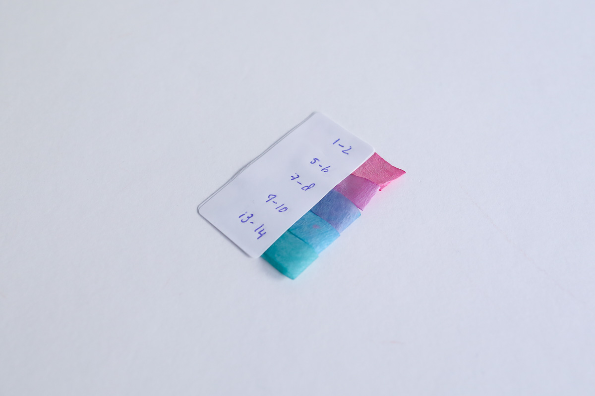*PH paper reference, Loes Bogers, 2020*

##REFERENCES

- **Biochromes** by Cecilia Raspanti for Fabricademy, Lecture slides, 15 October 2019: [link](https://drive.google.com/file/d/1Ar8j0cJntsFiBxdnrhqTA_9lgDDzB1Wg/view?usp=sharing)
- **How to make Red Cabbage PH Paper** by Anne Marie Helmenstine for ThoughtCo, 2 February 2020: (https://www.thoughtco.com/make-red-cabbage-ph-paper-605993)
- **Litmus**, on Wikipedia, n.d.: [link](https://en.wikipedia.org/wiki/Litmus)
- **Litmus Paper**, on How Product are Made, n.d.:[link](http://www.madehow.com/Volume-6/Litmus-Paper.html)
- **From alchemy to chemistry**, by Khan Academy's Big History Project, [link](https://www.khanacademy.org/partner-content/big-history-project/stars-and-elements/other-material3/a/from-alchemy-to-chemistry)

