# RE-USED PLA SCRAPS

<iframe width="560" height="315" src="https://www.youtube.com/embed/5LEAyJeNhrM" frameborder="0" allow="accelerometer; autoplay; encrypted-media; gyroscope; picture-in-picture" allowfullscreen></iframe>

<iframe width="560" height="315" src="https://www.youtube.com/embed/jmmE_9pNVwA" frameborder="0" allow="accelerometer; autoplay; encrypted-media; gyroscope; picture-in-picture" allowfullscreen></iframe>

<iframe width="560" height="315" src="https://www.youtube.com/embed/xlE57wnyWHw" frameborder="0" allow="accelerometer; autoplay; encrypted-media; gyroscope; picture-in-picture" allowfullscreen></iframe>

##GENERAL INFORMATION

Melted PLA (poly lactic acid based on cornstarch that is often used as 3D print filament) has a beautiful glossy shine (if not pressed), it is strong, waterproof and very heat resistant: it maintains the same properties as before. 

These sheets and rosters are strong and light and more dense than most PLA prints (because usually a partial honeycomb in-fill is used to create 3D shapes with a printer, it is usually not solid PLA). It's very glossy, like polycarbonate, acrylic sheets, or shiny PVC clothing. 

**Physical form**

Surfaces 

Color without additives: very glossy, color of filament scraps used

**Fabrication time**

Preparation time: 1 Hour

Processing time: none

Need attention: N/A

Final form achieved after: 15 minutes

**Estimated cost (consumables)**

0,00 euros (try to get scraps for free from local fablabs/printshops)

##RECIPE

###Ingredients

* **PLA scraps - at least 20 grams** from the 3D printer (rafts, brims, skirts). 

This is the material, you will use it to thermoform it in the oven. PLA is quite tough so unless you have a strong shredder it is best to use the small scraps from early failed prints (just the brims and skirts of the print) that you can easily break and cut with scissors. 

You can sort them by color, or mix them up. Just make sure it's only PLA, not a mix of ABS or other types of filament.

###Tools

1. **Scissors**
1. **A big transparent plastic bag**
1. **An oven**
1. **A baking tray**
1. **Baking paper**
1. **Oven mitts** or heat resistant gloves
1. Optional: a small sheet of glass for pressing (e.g. from a picture frame)
1. Optional: a bottom-less mold or flexible silicon mold
1. Optional: plyers to cut thicker PLA filament
1. Optional: a hammer to crush thicker parts into smaller bits

###Yield 

The same weight as the amount of scraps used. It will shrink in volume significantly! 20 grams will give you about a thin solid 10x10 sheet.

###Method

1. **Preparation**

	- Break and cut the PLA scraps into small pieces with scissors. 
	- If you have bigger pieces of filament that has not been extruded (this is quite thick, see pictures below), you can cut it with plyers, or just leave them as is and melt them into lines onto textile for example. You can also try hitting big parts with a hammer to make them smaller (put them inside a bag again for safety)
	- You can do that in a big plastic bag to prevent the pieces from flying away when you are cutting.

1. **Reshaping the PLA**

	- Pre-heat the oven to 220 degrees Celius
	- Cover your baking tray with baking paper and place the bottom less mold (if you are using one)
	- Distribute the scraps evenly and put the piece of glass on the tray as well so it can be heated up in the oven. Not heating the glass will cause it to break when you then use it to press the hot PLA.
	- Place the tray in the oven and let them melt for about 20 minutes

1. **Pressing or forming the PLA**

	- Take the melted PLA out of the oven and immediately press it down with the hot glass, or leave it as is. It's probably wise to put baking paper between the glass and the PLA to prevent sticking. It's hot so wear oven mitts!
	- There's some chance involved in this process but the results are look nice and organic.
	- If you don't like it re-melt the PLA and try again.

###Drying/curing/growth process

Just melting, no drying or curing involved. It does not shrink so much, but the volume is reduced significantly by melting. 

**Shrinkage and deformation control**

N/A

**Curing agents and release agents**

Baking paper to help release the PLA. Using a bottom-less mold or flexible (e.g. silicon) mold is essential. 

**Minimum wait time before releasing from mold**

15 mins

**Post-processing**

N/A

**Further research needed on drying/curing/growth?**

Yes

More experimentation could be done in terms of forming the melted PLA. The challenge here is that this has to happen while it's hot. 

###Process pictures

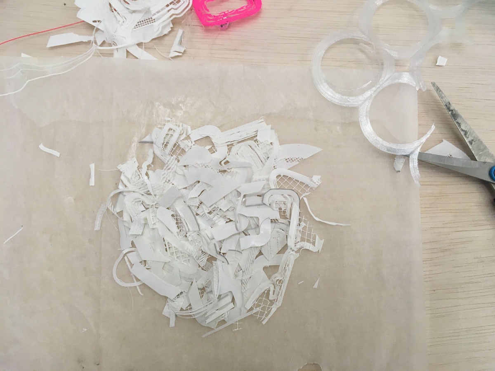*Cutting up PLA scraps (rafts, brims and skirts from (failed) prints, Loes Bogers, 2020*

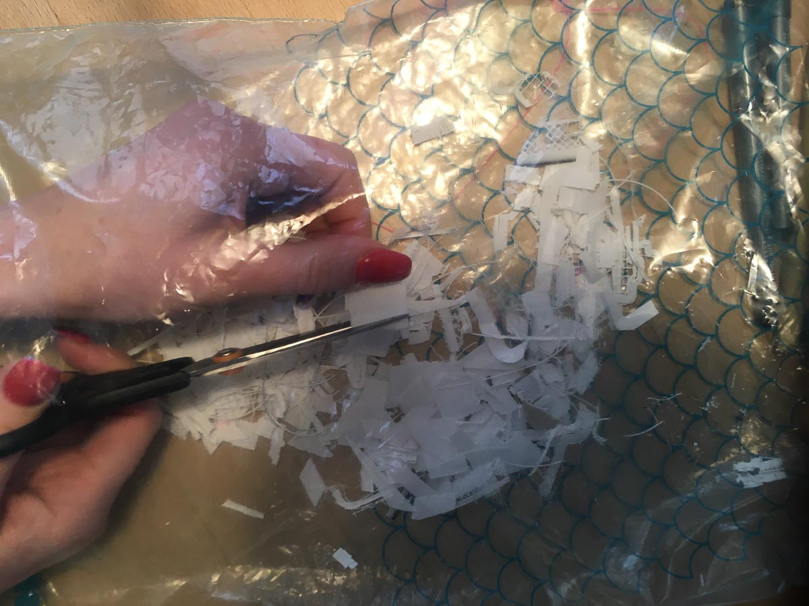*Cutting them inside a transparent bag to prevent pieces flying everywhere, Loes Bogers, 2020*

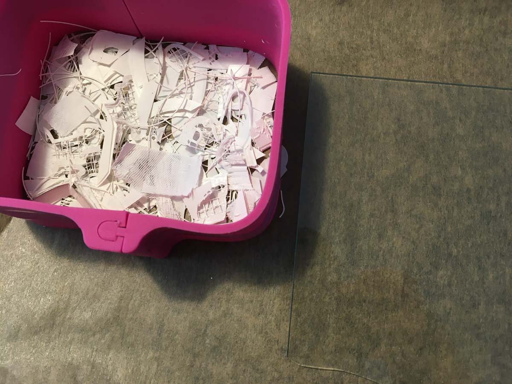*Placing some scraps inside a bottom-less mold, glass sheet goes in the oven with it, Loes Bogers, 2020*

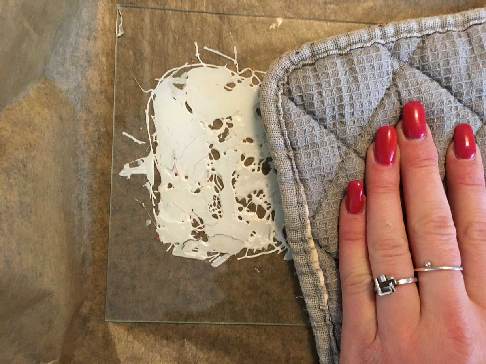*Pressing the melted PLA with the hot glass, Loes Bogers, 2020*

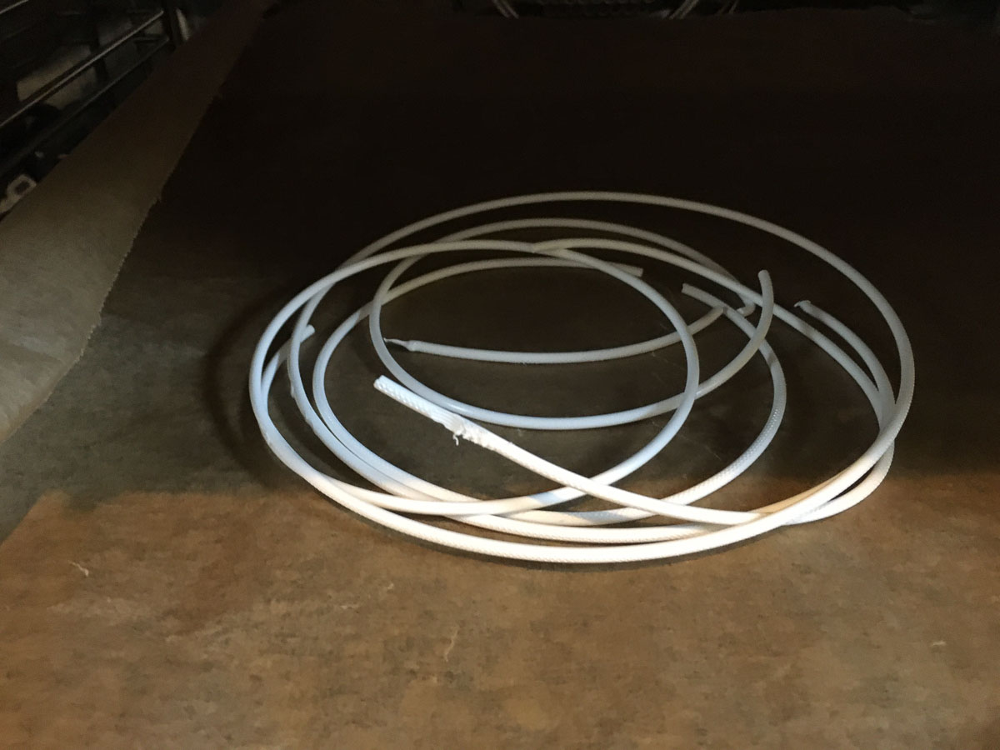*Melting filament in one piece, Loes Bogers, 2020*

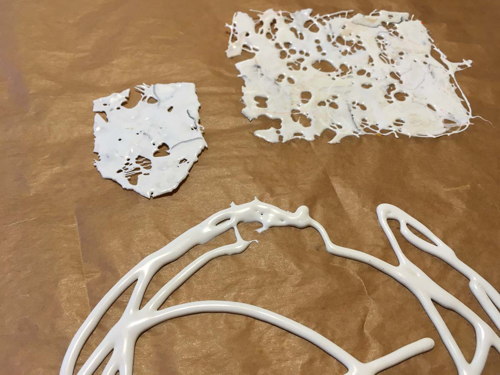*Some results, Loes Bogers, 2020*

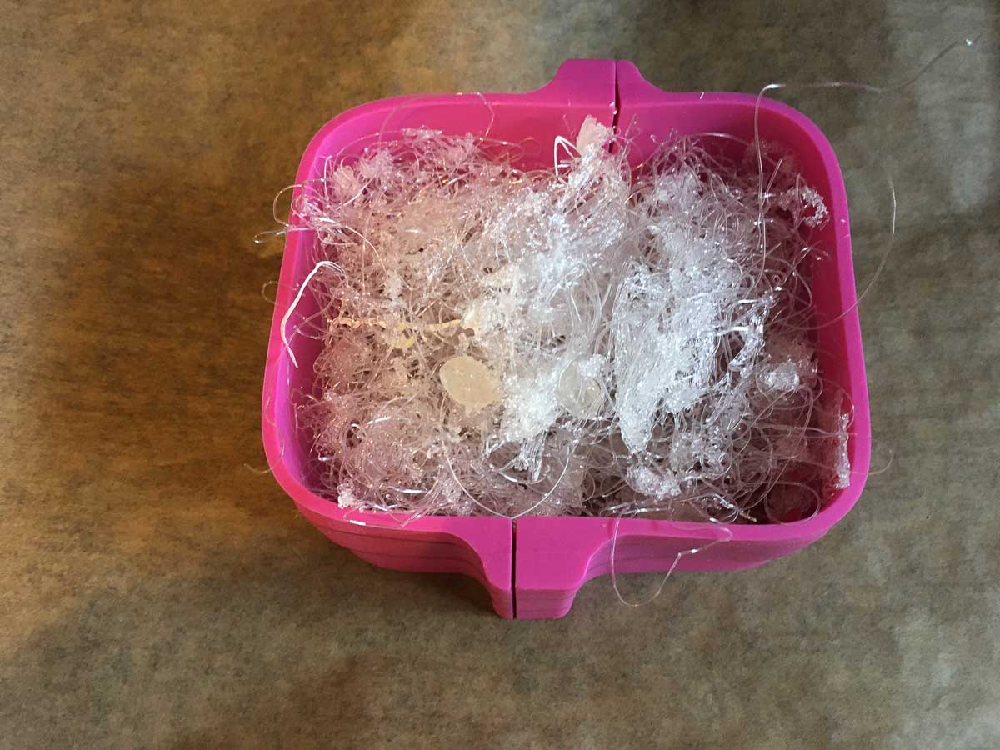*Filling another mold with cut-up - mostly- transparent scraps, Loes Bogers, 2020*

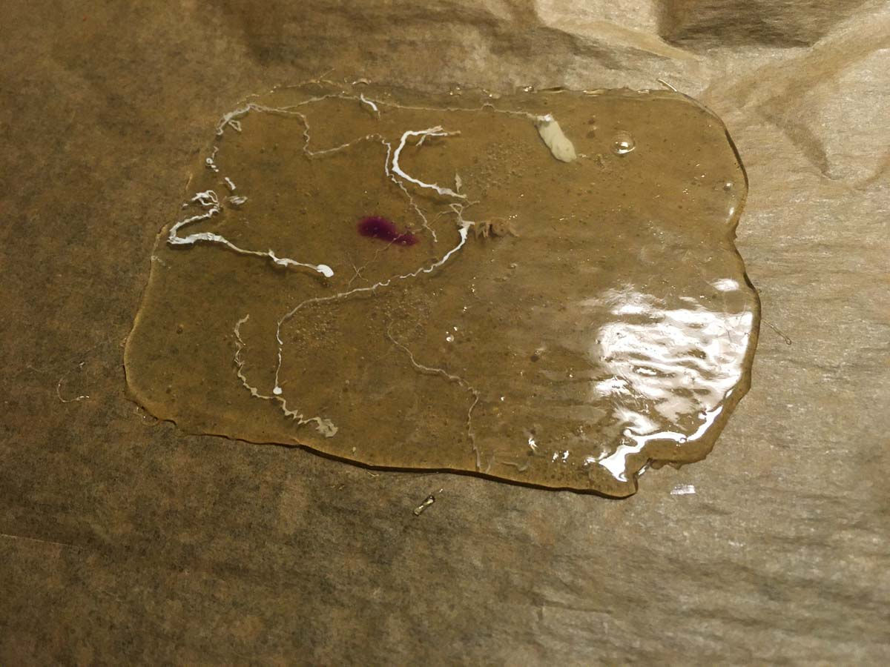*The melted transparent scraps, Loes Bogers, 2020*

###Variations

- Try creating an improvised heatpress to make even flat sheets
- Layer up the scraps and make a design in stages
- Alternate PLA and pieces of textile to create textile structures

The process of recycling PLA filament waste is well researched and can be upscaled to DIY semi-industral processes. The Dutch design agency Precious Plastic provides open-source designs for shredding, extrusion, and sheetmaking machines for recycled plastics such as PLA. 

##ORIGINS & REFERENCES

**Cultural origins of this recipe**

**About the material**: Polyactic Acid (PLA) was invented as early as the 1920s by the Wallace brothers, the same people who invented nylon. They searched for a more environmentally friendly pastic but its uptake grinded to a halt because it was too expensive for commercial use. Many bio-based plastics continue to be more expensive than their petroleum based alternatives. Patrick and Sally Gruber discovered how to create PLA from corn in their kitchen stove in 1989. Their technique reduced the cost of PLA production greatly. 

In recent times, it is strongly associated with 3D printers (CNC machines that extrude thermoplastics into a 3D shape defined in a digital design (using stereolithography). It was hailed as the biodegradable alternative for ABS (Acrylonitrile Butadiene Styrene) filament, which is a derivative of natural gas and petroleum. 

**PLA and bioplastics**: PLA is made of renewable materials, or biomass (like corn starch), which makes it a bioplastic. The difference with normal plastics is that it is not based on finite resources such as petroleum. The bioplastic PLA is also compostable, which means it an be turned into compost by microbes so it can be reabsorbed by nature, but only under "certain conditions": PLA degrades if it is in 55-60 degrees Celcius for at least 10 days. Not all bioplastics as biodegradable/compostable. Some, like bio-PET or bio-PP are chemically the same as their petrol-based counterparts even though they are made of renewable resources.  

**Needs further research?**  Not sure

###Key Sources

This is a variation on some of the techniques shown in: **Failed Print Recycling Revisited: Guitar Picks, Earrings, and More**, by Devin Montes on his MakeAnything Youtube channel, 28 April 2017: https://www.youtube.com/watch?v=42c8go9A7HQ

###Copyright information 

This is an adaptation of many similar techniques that have been shared openly, such as (for example) the one by Devin Montes listed above. It could be considered to be in the public domain but further research is recommended.

##ETHICS & SUSTAINABILITY

Strictly speaking, PLA is a **compostable** bioplastic. Something is compostable when it can break down into carbon dioxide, water, inorganic compounds and biomass in small pieces in about 90 days (in an industrial composting facility). It efffectively means it can be converted into good quality *compost* and when composted, acts as a beneficial fertilizer. However, it is important to note that composting does not always happen under the same conditions: for some plastics this requires special processes and facilities to do so, which may involves the use of more energy. 

PLA for example needs to be composted at 55-60 degrees Celcius for 10 days: not the temperature of your average compost heap in the garden. This is done in industrial composting plants where the right air, microbes and temperature is monitored in **controlled environment** so the composting process can take place. 

Most of the other bioplastics recipes here, like the gelatin-, agar- and starch-based bioplastics will compost under almost any conditions (also in your backyard): they don't require a lot of heat and almost any microbes will do the job in composting these. As such they are suitable for *home composting* under loosely controlled conditions.

Generally speaking, although highly compostable materials can return to the earth, it has been argued that this is still a waste of energy: the energy used to create the complex polymer. It is useful to consider if re-use is not better than composting for materials that allow it (e.g. PLA, but also the gelatin-based bioplastics described here). There are no simple "silver bullet" solutions to the plastic problem, but we keep searching.

It has been suggested that *recycling* Poly Lactic Acid plastics (PLA) is a better end-of-cycle alternative than combusting/composting.

Biocompostable is not the same as biodegradable. A *biodegradable* product *may* be broken down by microorganisms (eventually, but this can take much longer than 90 days and still be called biodegradable) but this does not necessarily imply that the product can be converted into good quality compost that is good for the soil and plants. It just means it will not harm the environment once degraded. TÜV Austria in Belgium provides several certifications for different kinds of compostable plastics: they describe the distinction between industrial and home composting on their website, but also have separate certificates form materials that are compostable in the soil and in water. Their website is a good resource for disambiguation. 

Lastly, even though some plastics can be composted, it doesn't mean it happens. At the moment it is not cost-effective enough for most recycling plants to offer this service, so the compostable plastics end up getting mixed up with the PET, PE and PP's and can contaminate the waste stream, weakening the properties of recycled plastics. 
Conversely, there's an unwillingness amongst professional composting plants to accept bioplastics, because they believe comsumers might recycle bioplastics that are not compostable, which contaminates the quality of the compost that is to be reused as a fertilizer. 

NOTE: this information is based on European standards and might be different for other countries. 

**Sustainability tags**

- Renewable ingredients: yes (plant starch from corn, beets, sugar cane)
- Vegan: yes
- Made of by-products or waste:  yes
- Biocompostable final product:  yes, but only in *special* composting facilities (requires 55-60 degrees Celcius for at least 10 days). Hence the recycling recipe.
- Re-use: yes, it can be re-melted endlessly as long as the PLA is not combined with other materials in a composite.

Needs further research?:  Not sure

Recycling PLA with PET plastics contaminates the waste stream. 

##PROPERTIES

- **Strength**: strong
- **Hardness**: rigid
- **Transparency**: variable
- **Glossiness**: glossy
- **Weight**: medium
- **Structure**: variable
- **Texture**: smooth
- **Temperature**: cold
- **Shape memory**: high
- **Odor**: none
- **Stickiness**: low
- **Weather resistance:** needs further research
- **Acoustic properties:** needs further research
- **Anti-bacterial:** needs further research
- **Non-allergenic:** needs further research
- **Electrical properties:** no
- **Heat resistance:** high
- **Water resistance:** waterproof
- **Chemical resistance:** needs further research
- **Scratch resistance:** high
- **Surface friction:** sliding
- **PH modifiers:** none 

##ABOUT

**Maker(s) of this sample**

- Name: Loes Bogers
- Affiliation: Fabricademy student at Waag Textile Lab Amsterdam
- Location:  Rotterdam, the Netherlands
- Date: 15-03-2020

**Environmental conditions**

- Humidity:  40-50%
- Outside temp:  5-11 degrees Celcius
- Room temp:  18 – 22 degrees Celcius
- PH tap water:  7-8

**Recipe validation**

Has recipe been validated? 

Not yet. 

**Images of the final sample**

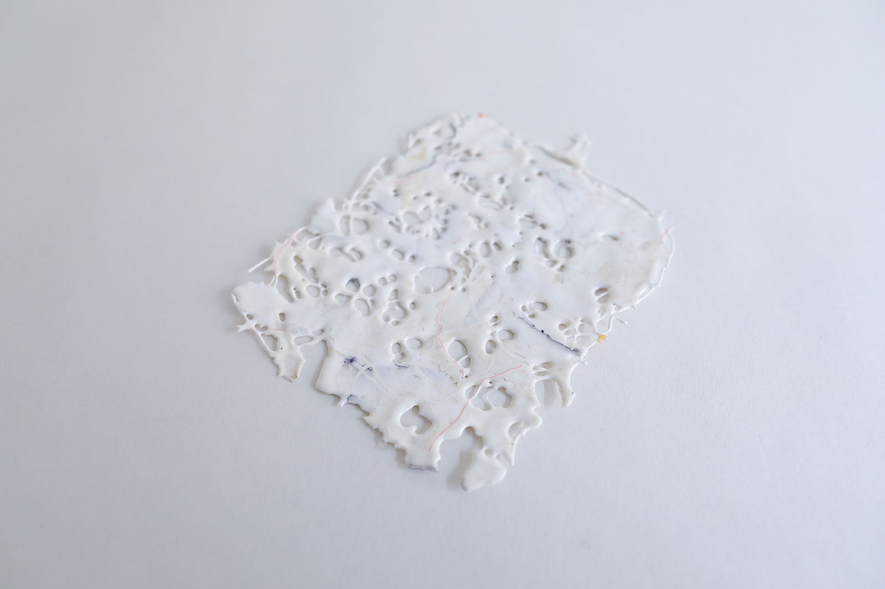*Transparent remelted PLA scraps, Loes Bogers, 2019*

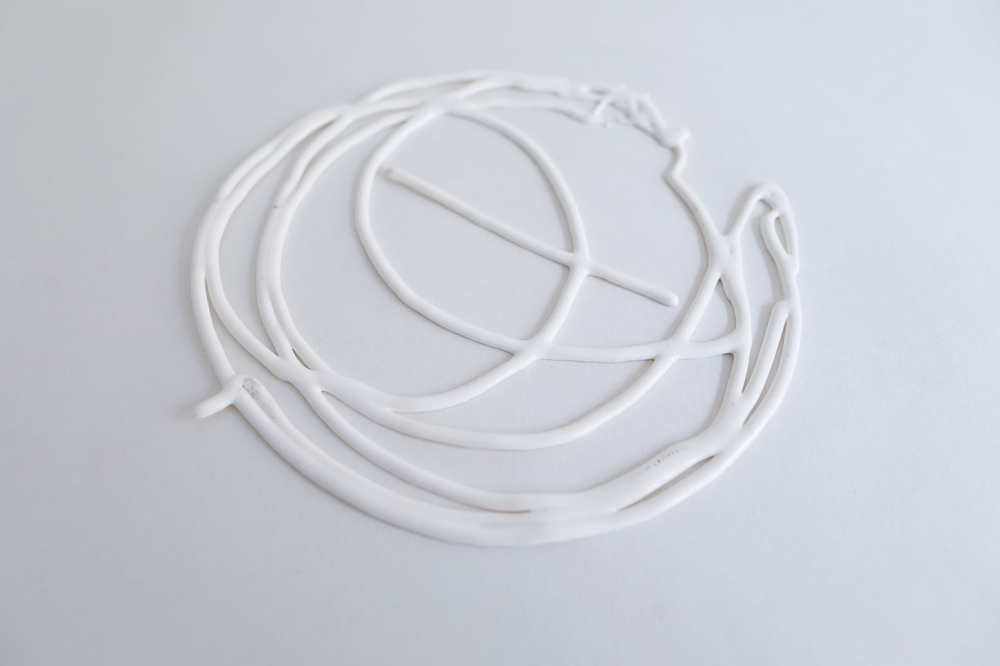*Transparent remelted PLA scraps, Loes Bogers, 2019*

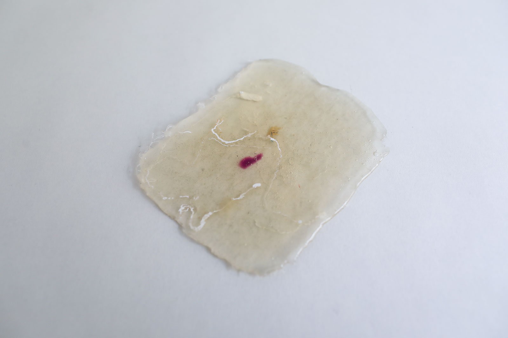*Transparent remelted PLA scraps, Loes Bogers, 2019*

##REFERENCES

- **Failed Print Recycling Revisited: Guitar Picks, Earrings, and More**, by Devin Montes on his *MakeAnything* Youtube channel, 28 April 2017, [link](https://www.youtube.com/watch?v=42c8go9A7HQ)
- **Poly (Lactic Acid) Generated for Advanced Materials** by Pranut Potiyaraj, in: Kobayashi, Takaomi, ed. *Applied environmental materials science for sustainability*. IgI Global, 2016: pp. 106-126.
- **Precious Plastic Universe**, originally started by Dave Hakkens, then soon joined by many others, 2012 onwards, [link](https://preciousplastic.com/solutions/machines/overview.html) 
- **The Myth of Biodegradability**, by Tom Szaky for The New York Times, 9 February 2012: [link](https://boss.blogs.nytimes.com/2012/02/09/the-myth-of-biodegradability/)
- **Compostability**, TÜV Austria, n.d. [link](https://www.tuv-at.be/green-marks/certifications/ok-compost-seedling/)
- **Milieu Impact van Verpakkingen**, by Milieucentraal (Dutch), n.d.: [link](https://www.milieucentraal.nl/minder-afval/verpakkingen/milieu-impact-van-verpakkingen/)
- **Polyactic Acid**, Wikipedia, n.d.: [link](https://en.wikipedia.org/wiki/Polylactic_acid)
- **Polyactic Acid (PLA) Plastic** by White Clouds, n.d. [link](https://www.whiteclouds.com/3DPedia/pla.html)
