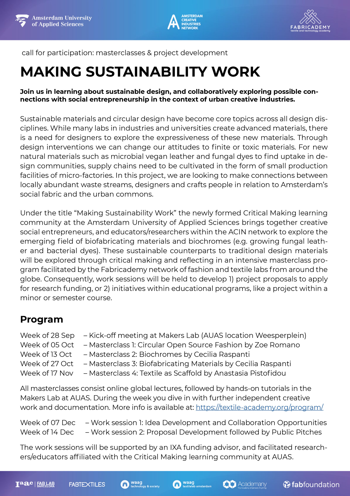
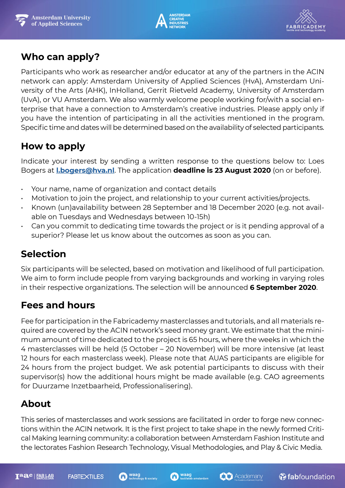

**Under construction**

The learning community Critical Making and Research Through Design is an initiative of the Amsterdam University of Applied Sciences. The learning community is a collaborative effort, supported by Amsterdam Fashion Institute and the lectorates Fashion Research Technology (Troy Nachtigall), Visual Methodologies (Sabine Niederer), and Play and Civic Media (Martijn de Waal) to connect research and education around this topic and these methodologies, together with local makers and creatives. 

*Want to know more?* Send and email to Loes Bogers (senior lecturer and head of the learning community) at l.bogers [at] hva [dot] nl.

## News

### Call for Participation: Making Sustainability Work

As we work on getting the website up: take a sneak peak at our first project to take place from sept-dec 2020. Call for participation now open! Read more below. 

